# P190：5-决策回归树原理根节点裂分mse计算 - 程序大本营 - BV1KL411z7WA

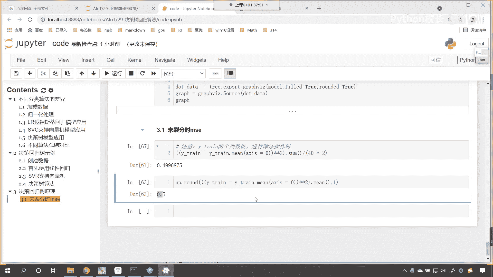

好嘞各位小伙伴，咱们接下来呢我们就继续往下看啊。

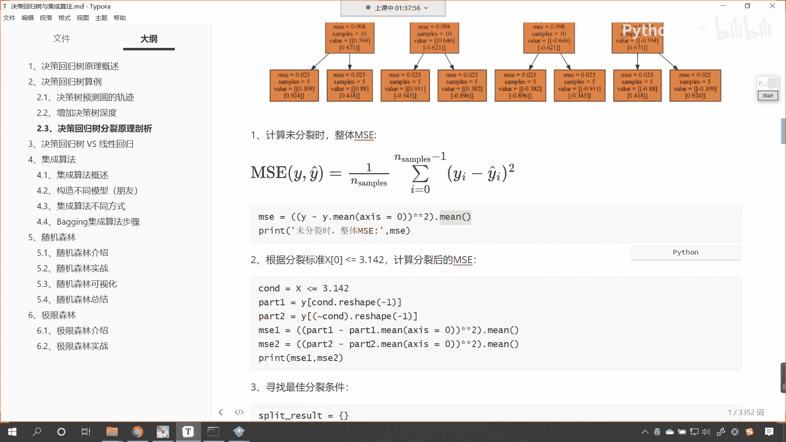

好那么各位小伙伴，你能够看到我们根节点，这是不是有一个裂分呀，我们选的列分条件是不是，x0 小于等于3。14，对不对，你看小于等于3。14，咱们是不是分成了两边呀，看到了吧，左边是一个叶节点是吧。

右边你看左边是一个子节点，右边是一个子节点，各位小伙伴，你能够发现左边这个节点和右边这个节点，它的m s e是不是都是0。307，对不对呀，那这个0。307是如何算的呀。

是不是根据上边这个划分而出来的呀，现在咱们在代码当中对它进行一个演示啊。

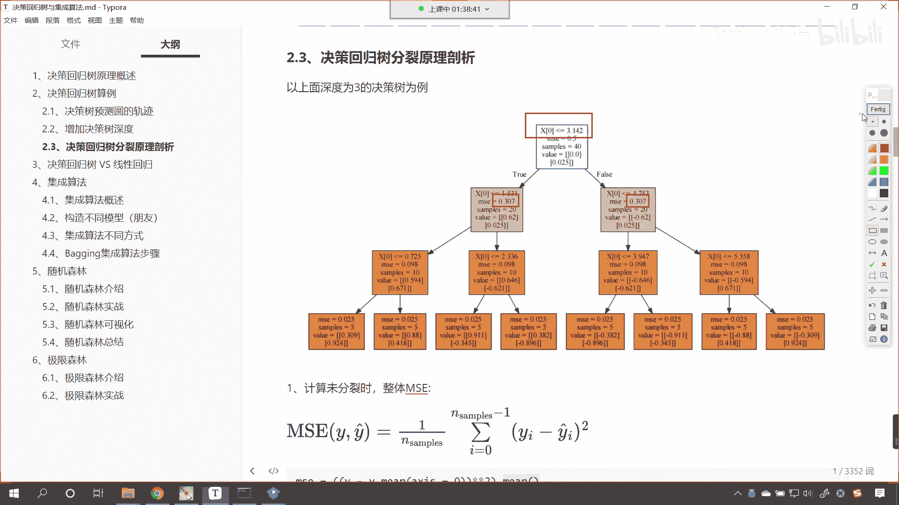

那这个地方就有一个条件来。

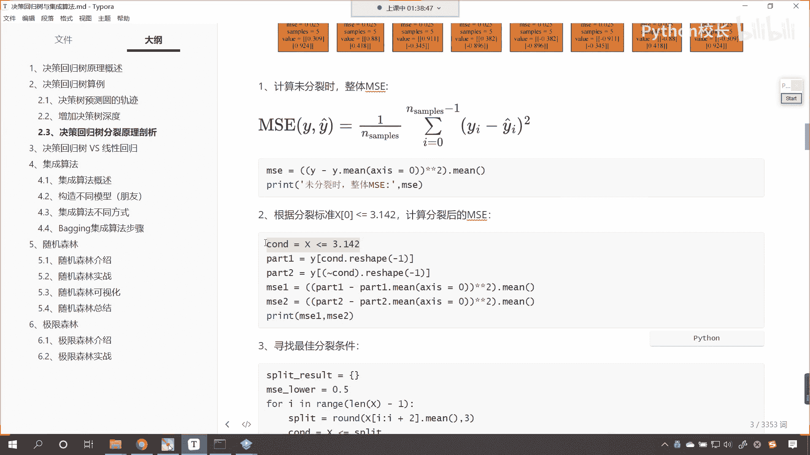

现在呢咱们就回到代码当中，咱们在这儿来一个这个四级标题好，那么我们看一下这个根节点是吧，这个根节点它的列分计算好。

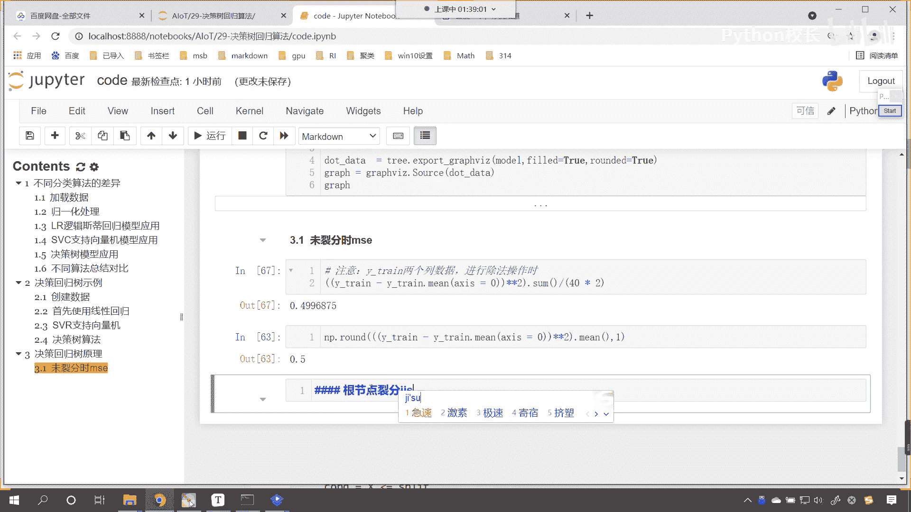

那么因为现在我们已经知道是吧，咱们的这个例分条件呢是3。142。

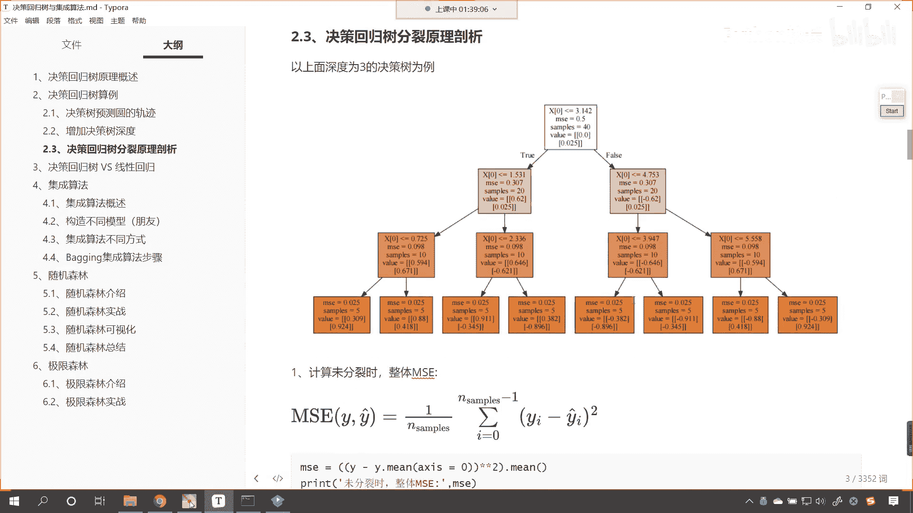

我们的代码当中看，咱们画出来这个图形列分条件，是不是也是3。142呀，那咱们现在呢就把这个条件给它找到，那就是c n d是吧，就等于x下划线tra，然后中国二零，咱们获取一下它的属性是吧，获取它的特征。

我们所创建的这个数据x train它是比较简单的，是不是只有一个特征，就是咱们0~2派是吧，这个角度值，然后呢我们让它小于等于3。142是吧，这你看是不是就有一个特征了，好那么有了这个特征之后呢。

我们首先计算一下左边的，那咱们就x下划线train，是不是就可以来一个中国c n d，这个是不是就是左边的呀对吧，咱们起个名啊，就叫x下划线left，然后我们再计算一下x下划线right吧。

那就等于x下划线train来一个中括号，前面来一个波浪线cn，这前面来一个波浪线就表示取反操作啊，在这咱们来一个注注释，这个呢就是取反操作，就是你原来是true，那么现在就变成false。

原来是false，那么现在就变成true，那么就变成true了，唉这是咱们的取反操作好，那么现在你看有了左边和右边了，咱们现在呢就计算一下啊，print是吧，咱们左侧分支咱们的ms是多少呢啊。

m s e是多少，冒号来，咱们现在呢就计算一下吧，逗号，那我们就根据咱们这个公式计算，是不是就可以了，好那这个时候呢就来一个小括号，那就是x下划线left，这个时候是不是得减去x下划线left。me呀。

给min的时候，大家注意我们指定一个轴是吧，好那么然后呢星号星号是不是得来一个平方，然后小括号括起来，大家注意啊，这个时候小括号比较多，你要分清它的层次结构是吧，为什么要括小括号呀，我们要求一下它的密。

看来此时这个左侧分支有了，复制一下打印输出这个代码在这儿来一个粘贴，把这个左侧呢咱们就改成右侧，那么x left咱们就改成rr i g h t是吧，left咱们就改成r i g h t来执行这个代码。

看一下咱们某一个地方给错了，x trc n d这个地方给错了，是不是布尔型，index，did did not match啊，因为我们的这个数据x嗯它是一维的，对不对呀，那如何才能把这个数据取出来呢。

咱们这个地方呢我们给它进行一个reshape啊，给它来进行一个reshape，那就是-1，这个时候这个数据就可以取出来了，因为x这个数据呢大家看啊，x这个数据它是这个它是二维的。

你要么进行reshape可以取出来，要么怎么样呀，中括号零是吧，也可以取出来，这个时候你看我一执行呃，我看一下啊，布尔行，did not match，but嗯is一嗯，来我们看一下啊，打印输出一下。

咱们c n d看一下这个数据长什么样是吧，执行一下啊，我明白了，你看上面这个数据是不是只有一个呀，那看一下咱们x下划线train这个数据是吧，如果说我要直接取一个零的话，你看咱们会怎么样。

是不是就只会取一个值呀，对不对，那这个肯定是不对的，是不是怎么才能取多个呢，零呢就表来一个冒号零，这个时候你看是不是就取出多个了，因为这个前面这个冒号表示所有的行都取，后面这个零表示取咱们的第一列。

因为这个x轴是二维的，对不对，所以说咱们来一个这样的操作，那我们在进行这个花式索引的时候，同样这个x train resh，可以下面这个x乘冒号逗号零，这也是可以的，这个时候你看我一直行。

咱们现在得到的这个结果，看是不是就有了呀，咱们左侧分支是我看一下啊，是0。863，右侧分支是0。863，这个时候呃和咱们画出来这个图形，0。307是不是有点不一样呀，那我们看一下到底是哪里不一样啊，0。

3142，x left减去x left me，星号星号平方嗯，然后呢求平均。

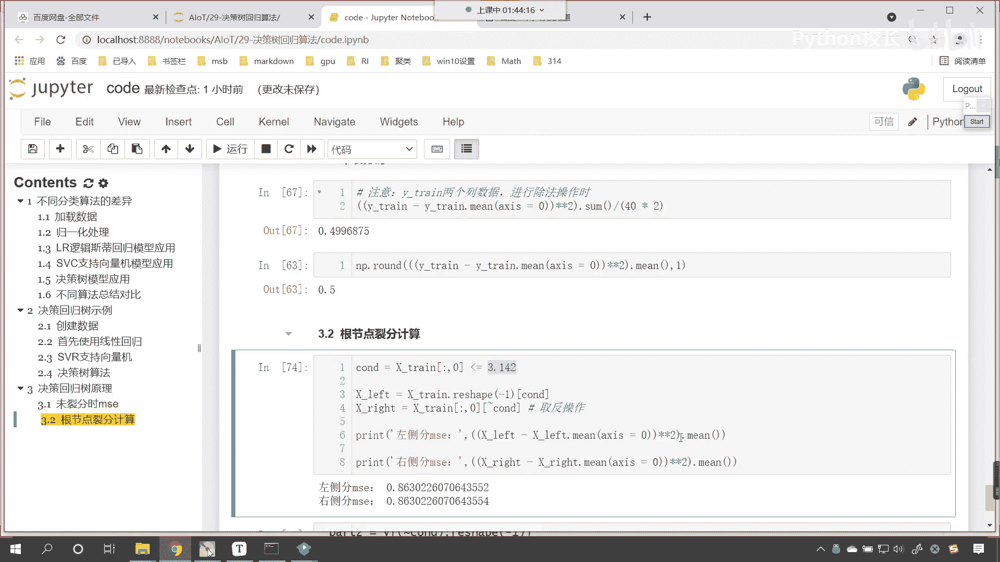

咱们计算出来的和绘制出来的图形，是不是稍微有点不一样呀，我们这个地方用的是part 1 part 2是吧，这个意思都是一样的啊，求了平均，然后最后呢再来一个求平均呃，我看一下啊。

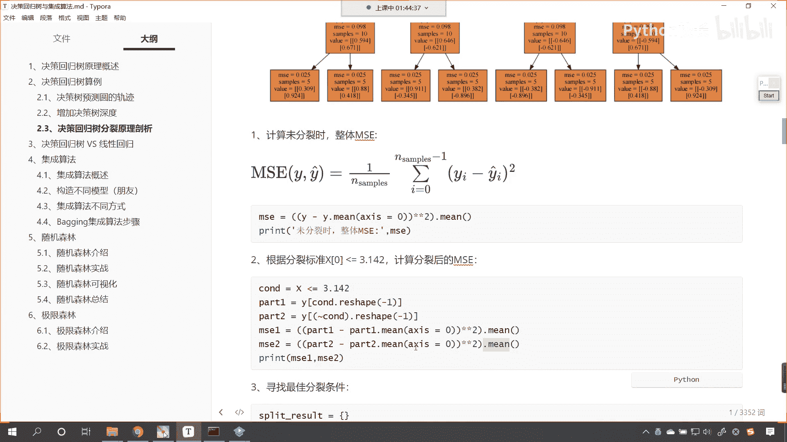

看一下这个地方啊，为什么给不一样了，最后一个是二和四啊，等会儿啊啊我看一下啊，xx等于零二和四，看一下咱们计算的时候哪个地方给出错了啊，小于等于来，我看一下啊graph。

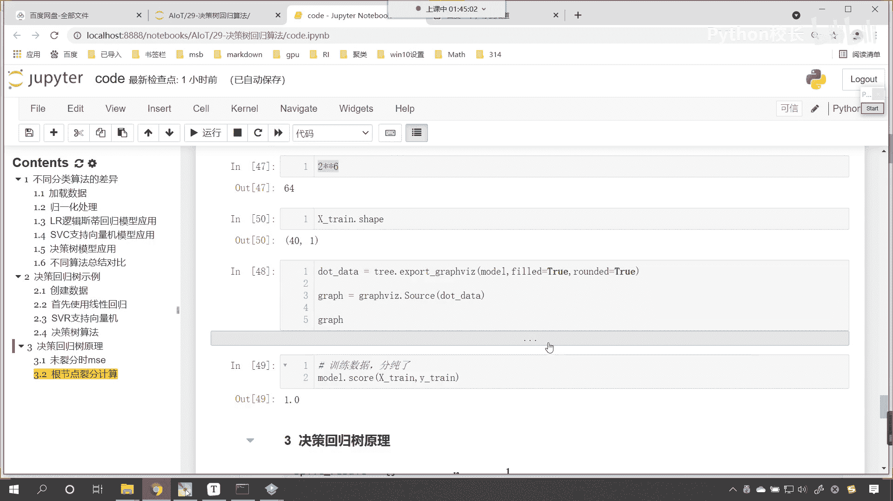

再看一下这个graph。

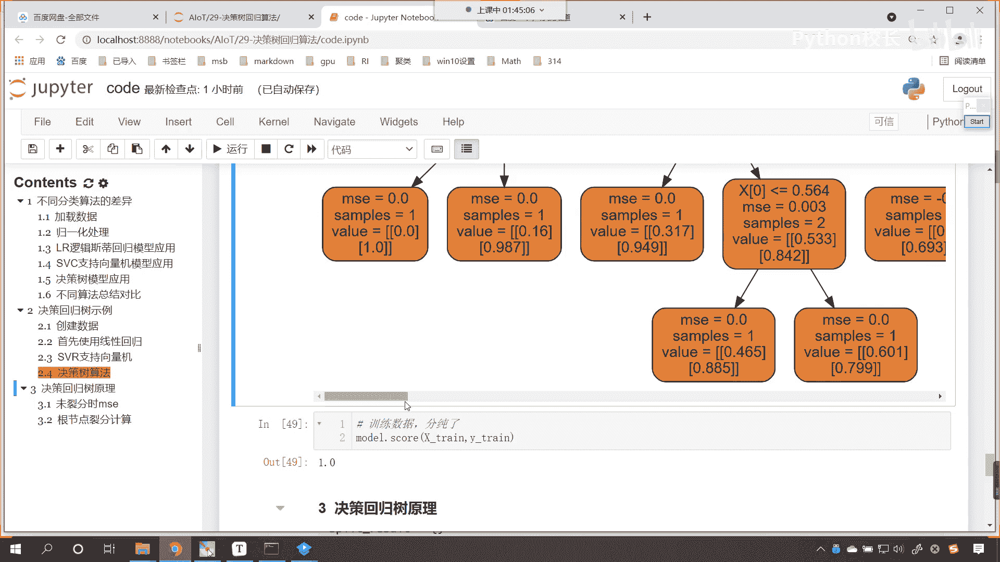

我们往上划一下，这个双击合起来看一下，咱们分列数，3。142是吧，3。142，这个肯定没问题，对不对，3。142，那呃我们现在呢再来检查一下x left。ship，看一下它的形状。

大家看它的形状是20个是吧，那最后呢左边是20个，右边是20个，x减去left减去，我看一下啊，该有的括号应该都有了，x等于零，嗯这个时候咱们计算出来的情况，和咱们画出来的图。

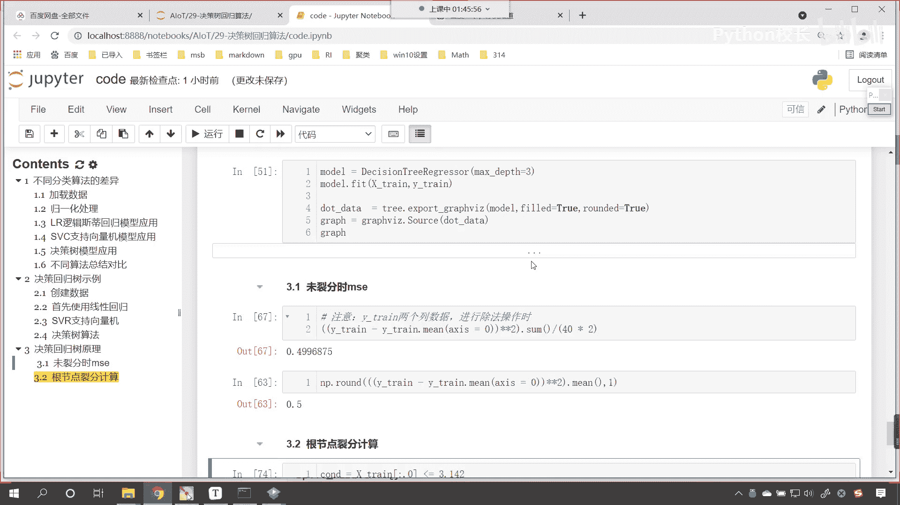

哦我看一下啊，x小于03。142。

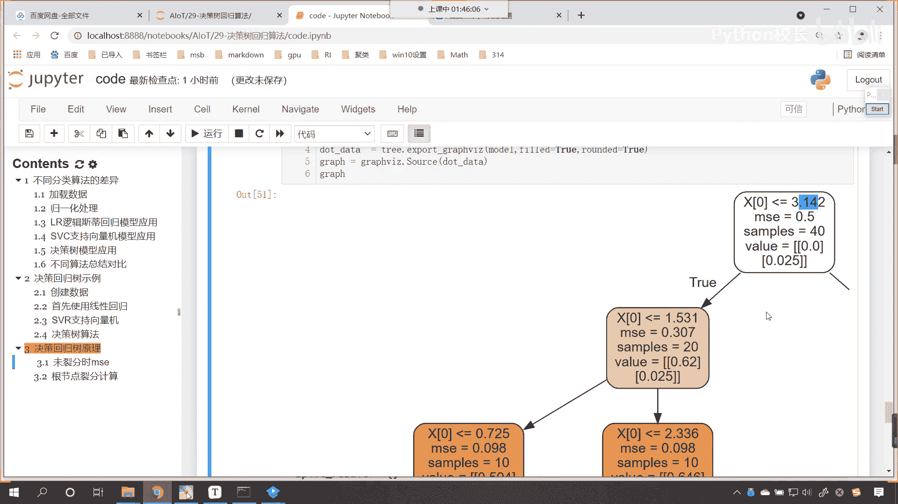

x小于04。753，这个是又进行了划分，如果说我们要按照3。142进行划分，它呢会划分成左边和右边，第一次咱们按照公式进行计算的时候，得到0。5，这个是没问题的，然后第二次进行了划分之后。

咱们得到的这个结果就有点不对了是吧，那我们看一下到底是哪个地方不太对啊，啊你要注意啊，这个3。142是吧，他应该差距不会那么大，知道吗，应该不会那么大，所以说他这个地方给的这个3。142是吧。

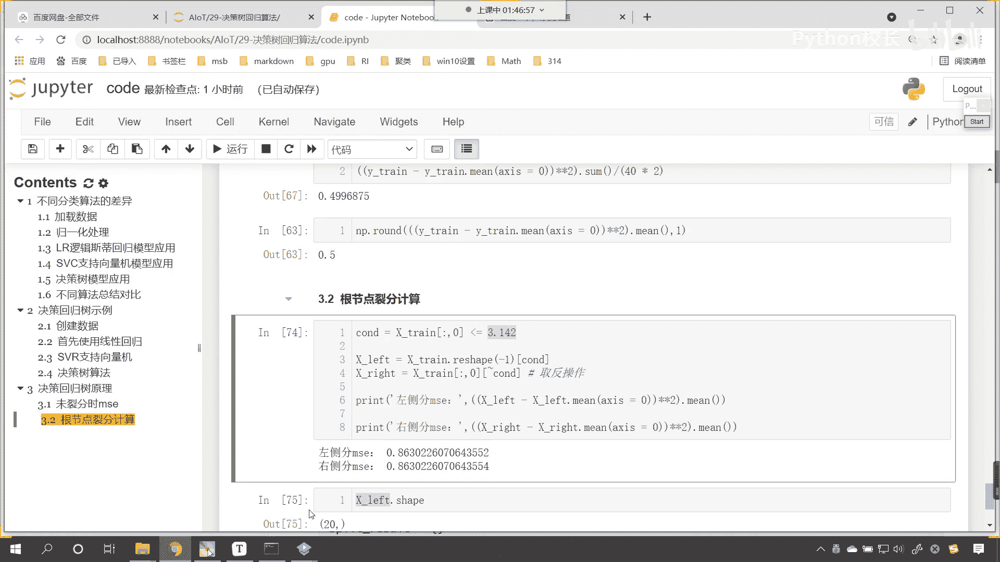

咱们是呃可以取的啊，你看啊咱们课件当中啊，咱们课件当中所给的这个值呢，我们也是没有问题的啊。

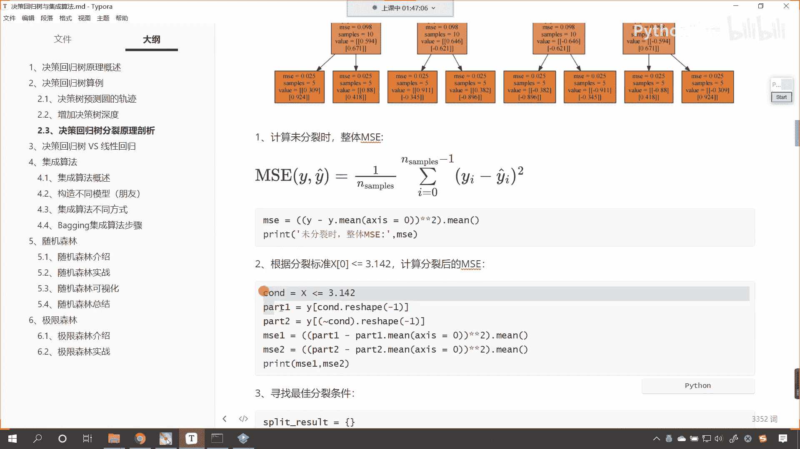

哎你看咱们现在知道咱们计算错，给错到哪里了哈，你看咱们去计算左侧左侧这个m s e，右侧m s一的时候，我们又使用了什么去计算，咱们是不是又使用了x乘积x乘去计算呀，对吧。

这个和咱们刚才犯的错是不是一样了，看c n d就等于x下划线串，咱们可以让它直接小于等于3。142，是不是啊，这个就是咱们的条件，有了条件，咱们就从y当中是不是取数据呀，那y是不是就是外传。

咱们来一个中括号c n d是吧，看这个时候你看我执行一下，这个时候依然告诉我咱们这个形状不太对，是不是啊，形状不太对，那这个简单咱们就display一下，看一下咱们的c n d它的形状长什么样，看到了。

我们这个c n d形状是不是一个二维的呀，那既然是二维，咱们将这个二维的进行一个reshape，来一个-1，这个时候你看过一执行数据，是不是就可以得到了，看到了吧，此时这个数据就可以得到了啊。

好那么有了外串了，这个是不是就是咱们的y下划线left，然后呢咱们再计算一下它的y下划线，rr i g h t，那就是y下划线好，那就是y下划线春中国号，咱们来一个c n d，前面是不是得来一个波浪线。

来了一个波浪线小括号给它记着括起来啊，小括号括起来这个就表示一个整体，同样呢咱们也对它进行一个reshape，reshape，还有一个方法就就叫ral，知道吗，哎值这个时候你看左边右边都得到了。

然后呢咱们就根据m s一的公式，我们去进行计算啊，ravel呢就是平铺和上面的reshape，意思是一样好，那这个时候呢就是左侧咱们的m s1 ，它的分值是多少呢，来咱们来一个小括号。

那就是y下划线left，咱们减去y下划线left，点me指定一下它的轴，我们让轴等于零，然后星号星号平方再来一个小括号括起来啊，求一下它的m，这个时候我们在最前面也得需要加一个小括号。

括号都是成对出现的，然后再来一个打印是吧，那这个就是右侧ms是多少，看m s一冒号，那逗号小括号是吧，星号星号咱们来一个me啊，星号星号平方是吧，来一个括起来，那里边最里边咱们给它填上啊。

那就是y rap减去y right。me，让它等于零，此时你看我执行这个代码好，这个时候报了一个语法错是吧，咱们看一下哪个地方报了个语法错啊，我看一下啊，we write axis me。

是不是报了一个这个地方呀，啊我看一下啊，哎这个是成对出现的吗，看y。me axis哦，我看一下咱们哪个地方给出错了啊，啊烂第七行是吧，烂第七行啊，我看一下啊，ral这个来来来，我看一下来。

咱们先把这个注调啊，执行看左侧的307是不是出来了啊，对不对，左侧307哦，明白了，看这个地方少一个什么，是不是少一个点呀，咱把这个点放到这啊，这个时候你看我一直行，左侧是307，右侧是多少。

是不是也是307呀，这个时候就说明什么，你看307咱们是不是就计算出来了。

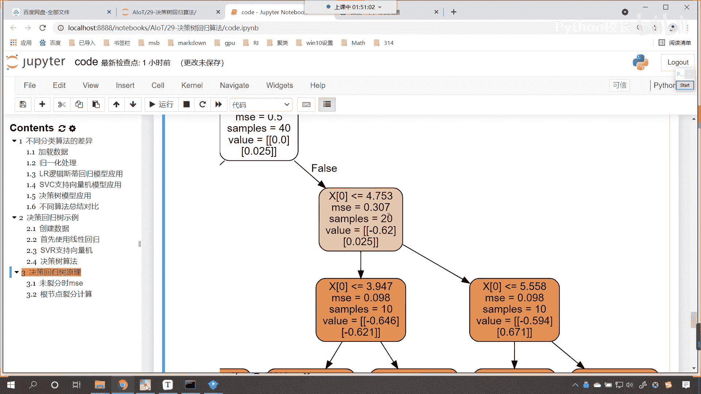

看到了吧，307为什么划分之后。

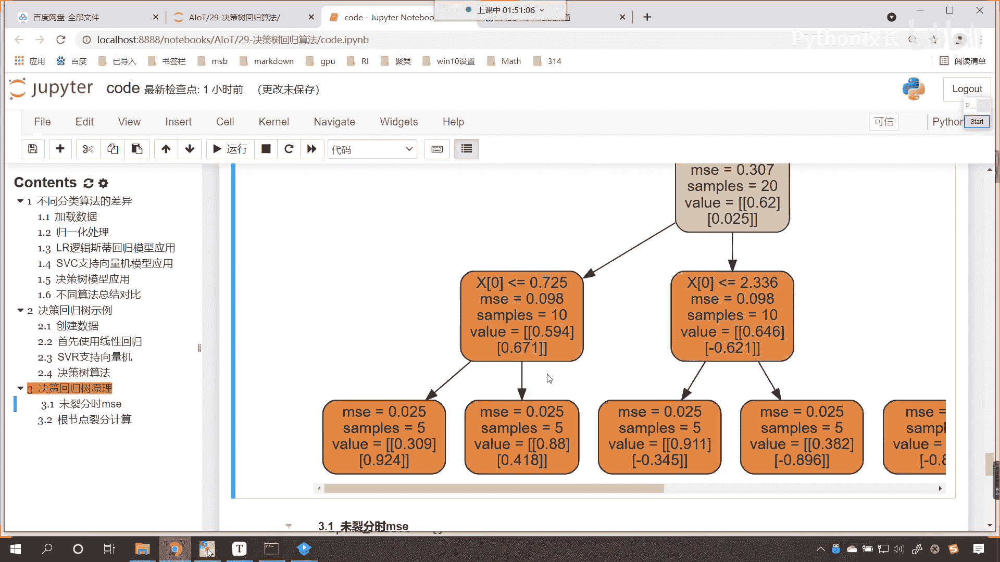

这个m s e是307，现在你知道是怎么回事了吧，是不是你看刚才咱们写的时候，是不是这个地方少一个点呀，少一个点它就报错了啊，好好，那么现在的话是吧，根结底是如何列分，如何计算的。

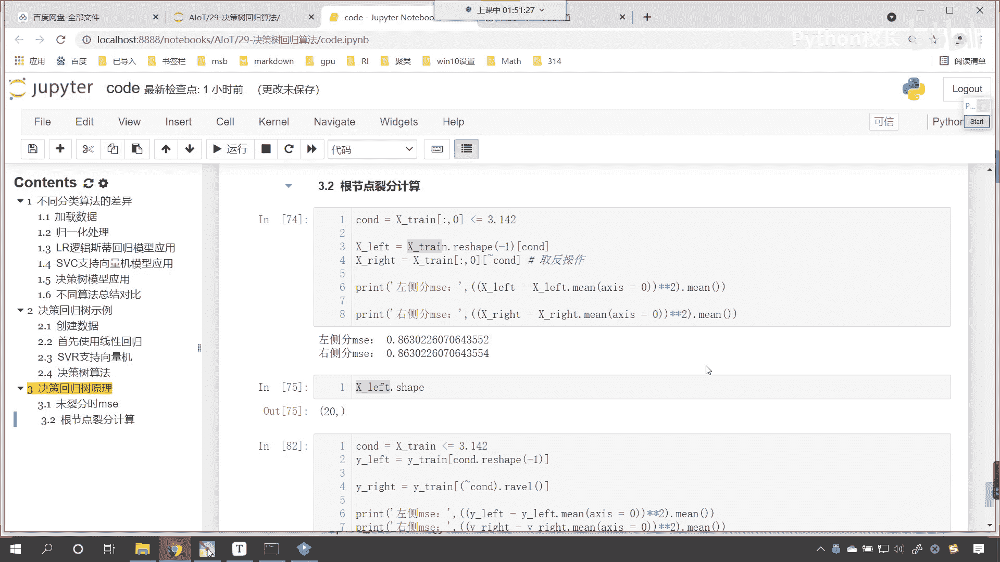