# P191：6-决策回归树最佳裂分条件计算 - 程序大本营 - BV1KL411z7WA

好那么咱们接下来呢我们继续往下看啊。

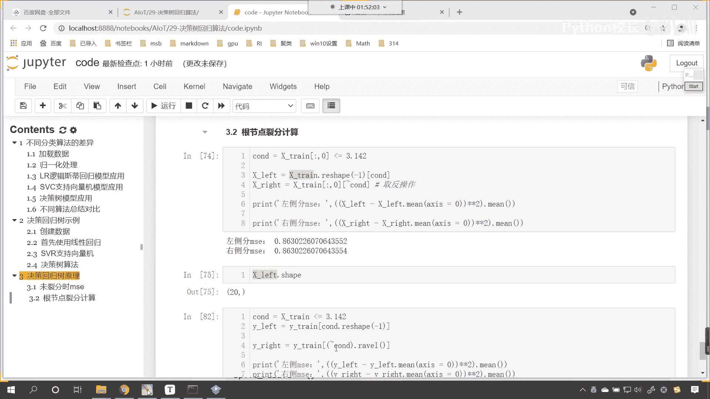

那现在有一个问题，你看现在有一个问题。

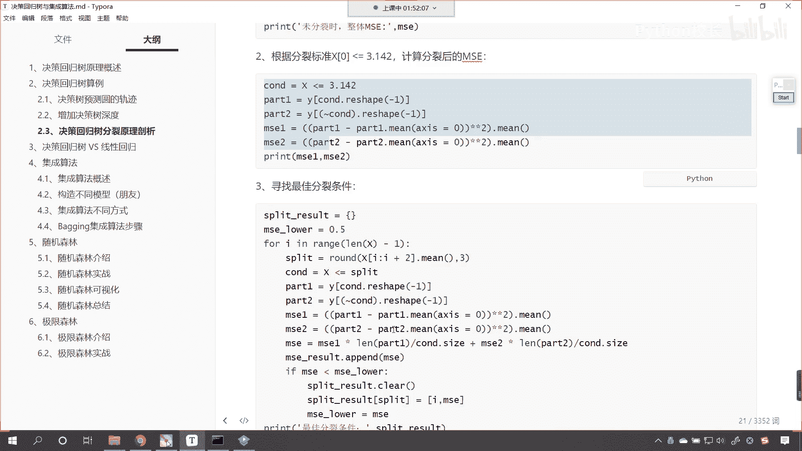

就是咱们这个最佳列分条件，到底是怎么找到的呀，看到这个最佳列分条件它是怎么找到的。

就是看我们图形当中，你看这个x0 ，他为什么就选择了3。142，你看这个地方为什么他怎么知道选，他怎么知道选3。142啊，对不对，看他怎么知道选3。142，我们刚才的代码演示，咱们找到了，为什么是4。

99，为什么是0。5，对不对啊，就是没有列分的时候，咱们根据m一的公式计算出来了，他是0。5，咱们根据根结底它的列分，咱们也计算出来了，左侧m s一是0。307，右侧也是0。307，这个时候都吻合上了。

对不对，现在的问题是什么呀。

它是怎么算的呀，对不对，那这个最佳的列分条件是怎么找的，现在呢看现在咱们就这个，咱们就计算一下好不好，咱们就算一下。

看一下这个最佳列分条件如何来找，来回到咱们的代码当中，咱们呢来一个四级标题，就是说这个最佳列分条件，看如何计算，好那么在我们上面这个图形当中，看咱们的最佳列分条件是多少呀。

是x中括号零是不是小于咱们的3。142啊，对不对，那这个如何找到的呀，来现在呢咱们就嗯这个写一个代码，叫做lower m s1 ，我们让这个m s11 开始我们给他设一个初值。

让它是一看lower m s e给它一个初值是一，你看为什么我可以给一个初值是一呀，因为我知道啊，因为我知道就是最开始的时候是吧，咱们的m s它是不是0。5呀对吧，m s一他是0。5，所以我给个一是吧。

你这个地方给个一也行，给个二也行，但是你不能给0。5小，知道吗，因为lower m s1 ，它呢嗯这个地方呢只是给了一个初始值，它呢用于它的作用是什么，它是用于记录，看它用于记录。

所以说咱们给一个lower m lower m s1 ，让它是一是二也行，是三也行，是100也行，是1万也行，是多少，其实都无所谓，但是呢要比0。5大就行，然后呢咱们再给一个叫best啊。

b e s t叫best superl，这个是不是就是咱们的列分条件呀，咱们给一个字典，然后呢我们就来一个for循环啊，for循环，那就是for i in range，那我们for循环。

咱们给它分成多少份呢，那就是length x下划线串它的长度，让它减去一，然后来一个冒号，这个时候咱们就开始找列分条件吧，split就等于x下划线，看就等于x下划线，x下划线乘中括号，咱们来一个切片哎。

冒号英文的冒号，我们让他到i加二，然后呢点我们求一个me，你看这个列分条件是怎么来的，和咱们上一节课所讲到的分类算法的例分条件，是不是一样呀，有了这个列分条件，咱们就可以怎么样了。

是不是就可以x train，我们让它小于等于咱们这个列分条件呀，那小于等于这个列分条件，这个时候你看我们是不是就得到一个条件，根据这个条件看啊，咱们根据根据条件，咱们是不是就可以得到左侧和右侧的这个。

数据的划分呀，对不对，你看就可以得到左侧和右侧的这个数据划分，有了左侧和右侧的数据划分，咱们的外传是吧，来一个中括号，我们得到这个数据，那就是c n d点，这个时候是不是得需要调用reshape了是吧。

给他来个-1好，那么我们得到的是什么，y left，有了y left，然后咱们再得到y right，就等于y下划线tra，中括号小括号来一个波浪线c n d，这个时候呢我们给他来一个平铺是吧。

这个时候咱们来一个注释啊，这个叫平铺，平铺呢就是把它变成一维的数据，你看你有了左边和右边了，咱们现在是不是就可以计算一下左侧和右侧，它的这个m s了，然后咱们就m s下划线left。

是不是就可以计算一下怎么算，那就是y下划线left减去咱们的y下划线left。me，咱们给一个轴，让这个轴等于零是吧，然后呢去求一下它的密，对不对啊啊，这个时候还不行。

是不是少一个平方星号星号平方小括号括起来，前面呢也来一个小括号是吧，这个时候小括号就成对出现了，看到了吧，mean left就有了，对不对，然后呢mx下划线right是不是相同的计算。

咱们就来一个y下划线，right减去y下划线right点也求一下它的密，也给一个轴，让它等于零，然后呢星号星号平方小括号把这个平方括起来，求一下它的密是吧，前面再加一个小括号。

这个时候你看左侧的是不是计算出来了，右侧的是不是计算出来了，这个时候还不行，你左侧右侧是不是我们得算一下，整体的，看你刚才只是左侧分支的这个数据，那接下来呢咱们计算是吧。

整体的就是计算划分整体的这个m s，那ms就等于左侧的这个啊，就等于左侧的m s e加上右侧的m s，这个时候还不行，你左侧是不是有一个比例，右侧是不是有一个比例啊，这个时候呢。

我们得让右侧的乘以右侧的比例是吧，左侧的乘以左侧的比例，那就是m s e杠，咱们来一个p是吧，那m s g乘以p m s一杠p等于多少，这个m s e杠p left，后面这个ms一杠p right。

你左边这一部分它占的比例是多少呀，是不是根据咱们的条件来确定的，这个时候咱们计算一下啊，m s e p是吧，它的概率是多少呀，left它就等于c n d。sum，因为这个cd呢它是条件。

那它是一个这个逻辑运算，如果他要是，那么它就是true sum的话，就是它的个数，然后除以谁除以c o n d。size，这个就是它的总数，然后呢mp right，它就等于c n d点。

看它就等于c n d，看这个时候是不是得给他来一个波浪线点，sum呀，看到了吗，然后除以c n d。size啊，这个时候呢左右的就都有了，其实还可以来一个简单的，是不是就是一减去m s e嗯。

p left呀，因为你因为我们就将数据分成了左右两边，那左右两边它的它的这个概率之和，是不是就是一呀，对不对，好这个时候你看就有了m s e了，有了m s了，现在呢咱们就来一个判断。

就是if咱们的m s它如果要小于，看看咱们的lower m s1 ，你看如果它要小，咱们就怎么样是吧，那这个lower m s e是吧，就让它等于咱们的m s1 ，这个时候你看我们是不是就记录了一下呀。

看我们说m s e它用于用于干嘛，是不是用于记录，这个时候你既然算出来的m s一比lower小，那我们就记录一下，记录之后呢，咱们把最合适的条件给他存进去，存到哪呢，咱们就存到这个best split。

那最合适的条件只有一个，咱们先清空clear一下，然后呢这个best split来一个中括号是吧，咱们把最合适的条件我们给它放进去，那这个最合适的条件呢，嗯就是咱们的split是吧，让它等于多少。

哎我们就让它等于咱们的m s e吧，哎就是我们算出来的，这个就是咱们算出来这个m s e啊，好那么这个for循环结束之后，我们print输出一下，哎，在这儿呢就最佳的分裂条件是，那最佳的分裂条件是逗号。

咱们将这个best split输出一下，这个时候你看我一执行来，各位小伙伴，看看看出来了吗，我们的最佳列分条件是不是3。14159啊，3。14159啊，对不对，那我们这个时候呢给他来一个np。

rain的啊，我们我们让它保留三位小数好不好，来一个三位小数，你看执行一下是多少，3。142唉，各位小伙伴看咱们是不是自己写代码算出来了，0。307和咱们上面画图，看上面咱们使用决策树，看到了吧。

上面咱们使用决策树嗯，它的裂分条件3。142是不是他如何找到的，3。142，你现在知道他如何找到3。142了吧对吧，就是也就是说这个3。142是吧。

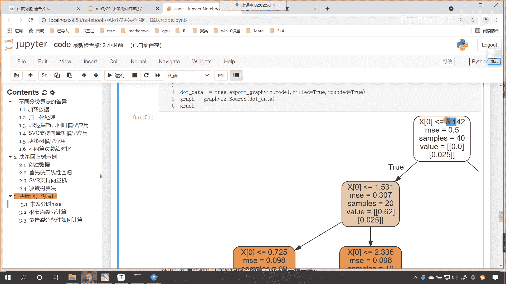

他是怎么找到的，我刚才是不是用这这一部分代码给你演示了，他如何找的呀，对不对，你看3。142就是这样找的啊是吧，for循环这个里边你要注意是吧，左侧右侧咱们计算整体的这个mc，以及你要注意它的概率。

明白吗，要注意它的概率的这个计算好，那么到此为止你就知道了，原来我们使用的这个决策回归树，它的最佳列分条件如何计算，就是通过这个列分计算的，那么同样的道理我们延展一下啊。

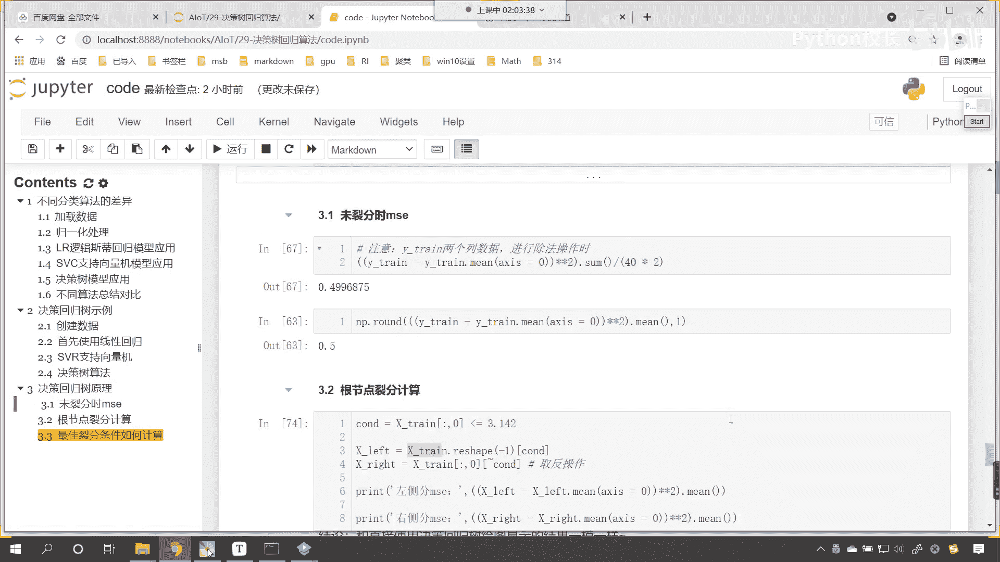

同样的道理咱们延展一下，比如说这个分支，你看啊这个分支，这个分支是不是这个1。531呀，那请问这个1。531是如何算的呀，看到了吧，这个1。531是如何算的。

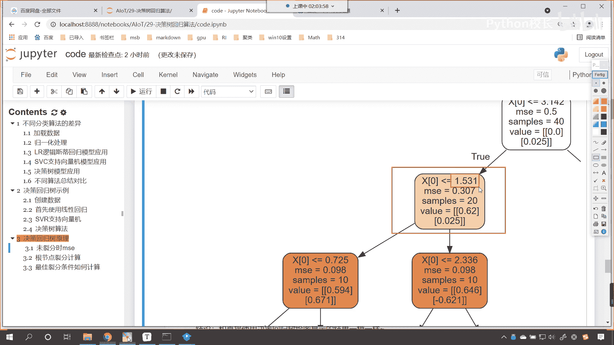

你知道这个是怎么算的吗，来我也给你演示一下哈。

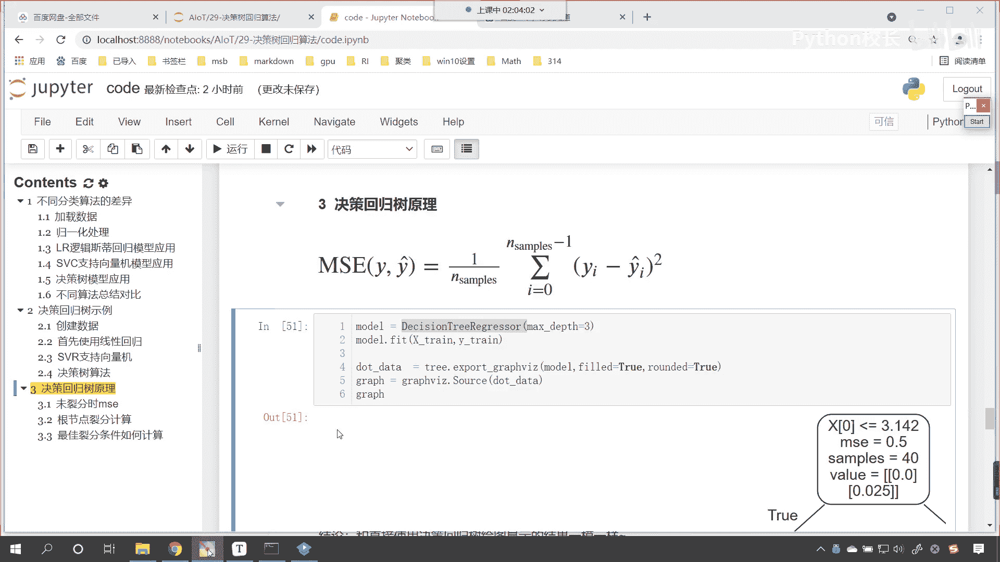

看咱们就将我们的代码看复制一下，ctrl c。

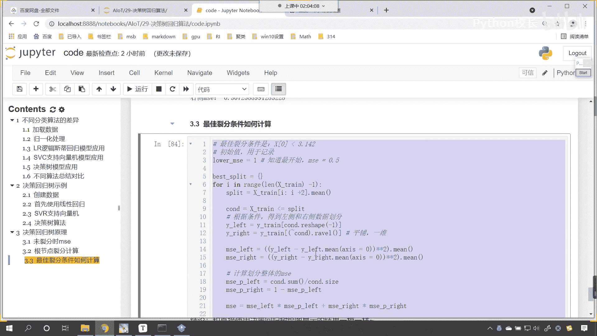

咱们在这儿粘贴一下，我们在上面插入一行，咱们来一个四级标题，这个呢就叫做好继续是吧，继续进行列分条件计算好，那么这个时候呢咱们的这个x train，看，这个时候。

咱们这个x train就得就得发生一点变化了，大家明白吗，这个x顺，因为我们此时的数据，咱们此时的数据是不是就是左侧呀对吧，就是你第一次列分之后，是不是得左侧的那部分数据呀对吧。

那这个时候咱们调整一下啊，那就是x下划线train，下划线left看就等于上边我们先给一个条件，c n d就等于x下划线train，我们让它小于等于3。142是吧，这是不是一个条件。

然后咱们把这个数据取出来啊，那就是x train，咱们来一个这个中括号，我们将cd放进去，这个时候这个cvd呢它是一个二维的，咱们得调用ral r a v e l小括号，看用这个数据复制一下。

把下面的x train都替换一下，是吧，x train ctrl v粘贴一下，替换一下是吧，我们看一下下面还有没有啊，好下面没有了，来咱们执行一下啊，你看我一运行啊，啊，这个时候你看这个外传。

是不是也得需要变换一下呀，因为这个外传它它就不是整体了，对不对，那咱们来在这个地方，我们来一个y下划线，下划线left就等于y下划线train，然后中国c n d。ral是吧，你看啊。

然后呢这个外圈left复制一下，把下面的外传都得需要替换，看都得需要替换，这个时候咱们再来执行，你看我一运行诶，各位小伙伴，你看是多少，1。531来惊讶不惊讶。

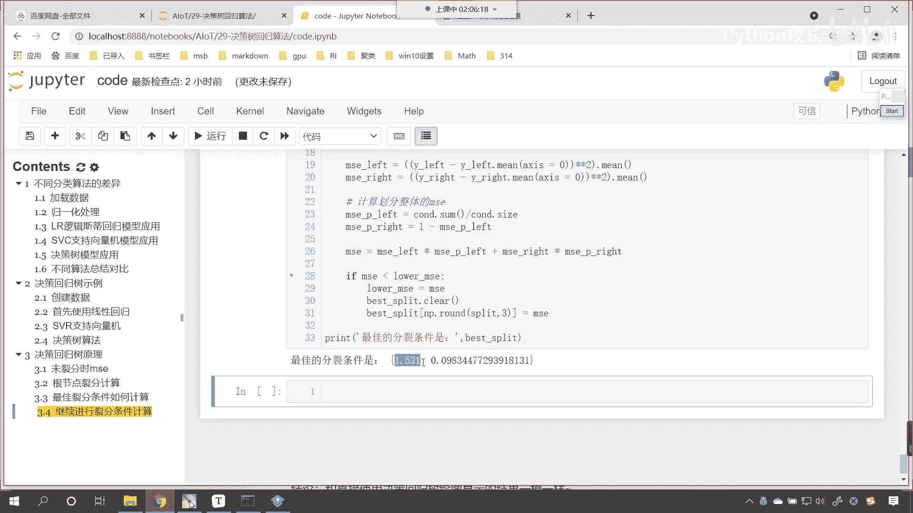

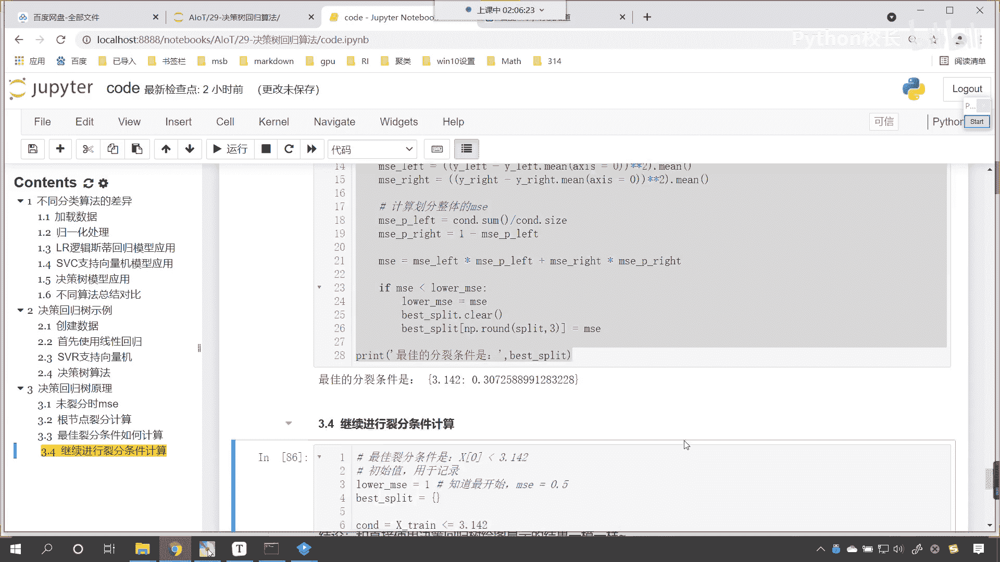

因为这个1。531，你看我算出来的和上面的看到了吧，你看是是多少。

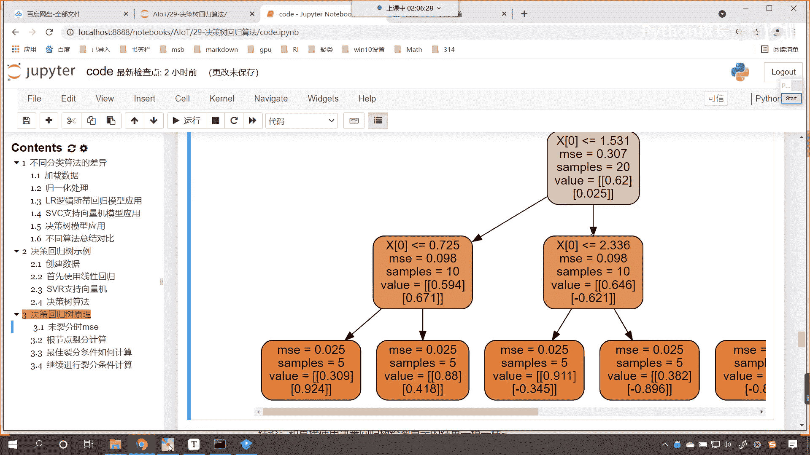

是不是1。531呀，来我们再往后滑啊，看看右侧这个分支是多少啊。

右侧这个分支是多少啊，看到了吧，4。753它是怎么算的呀对吧。

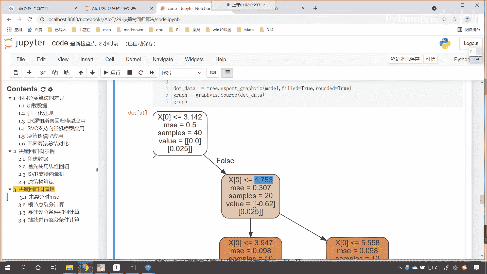

来代码复制是吧，我们只需要简单修改一下啊，ctrl c在这呢来一个ctrl v，你刚才是left，现在是不是变成right就行了，r i g h t是不是来r i g h t。

那这后面这个这个数据呢得来一个波浪线了，对不对，嗯看咱们给他来一个波浪线啊，这个时候得需要来一个波浪线，波浪线就表示取反好，那么同样的这个left是吧，咱们都得给它改成right，我们耐心改一下是吧。

r i g h t下面这个也改一下r i g h t，那数据这呢也改一下r i g h t是吧，看r i g h t来咱们执行这个代码，来各位小伙伴，你看4。753，还记得刚才图形里边是多少吗。

来各位你看啊，各位你看啊。

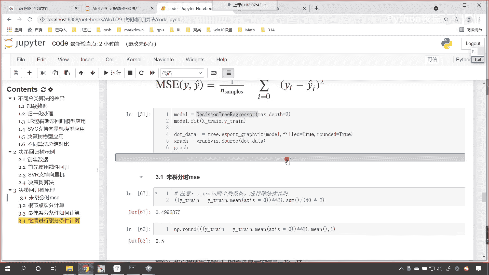

看4。753好，那么到了这儿之后，这个地方为什么是5。558，这个地方为什么是3。947，你现在会会算了吗，你看这个就相当于递归一样，是不是就像在for循环一样。

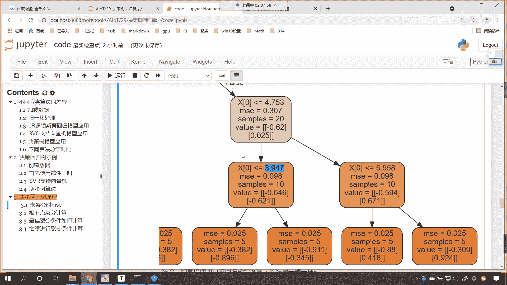

算完一个再算一个，再算一个再算一个，是不是代码基本上是不是都是我们给刚呃给呃。

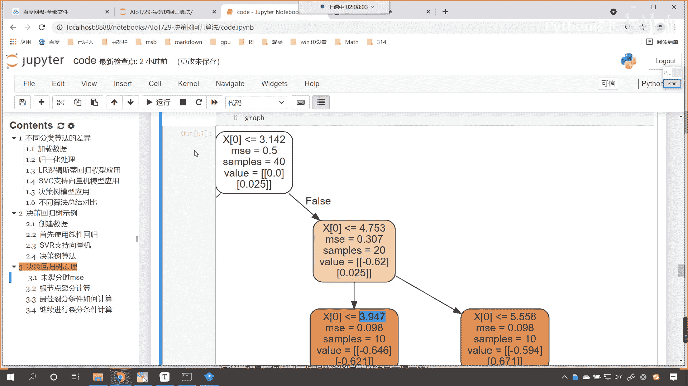

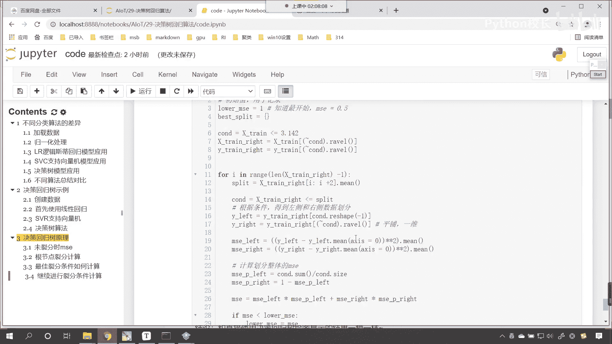

给各位显示的这部分代码呀，对不对，所以你看算出来了，现在你知道这个决策回归数。

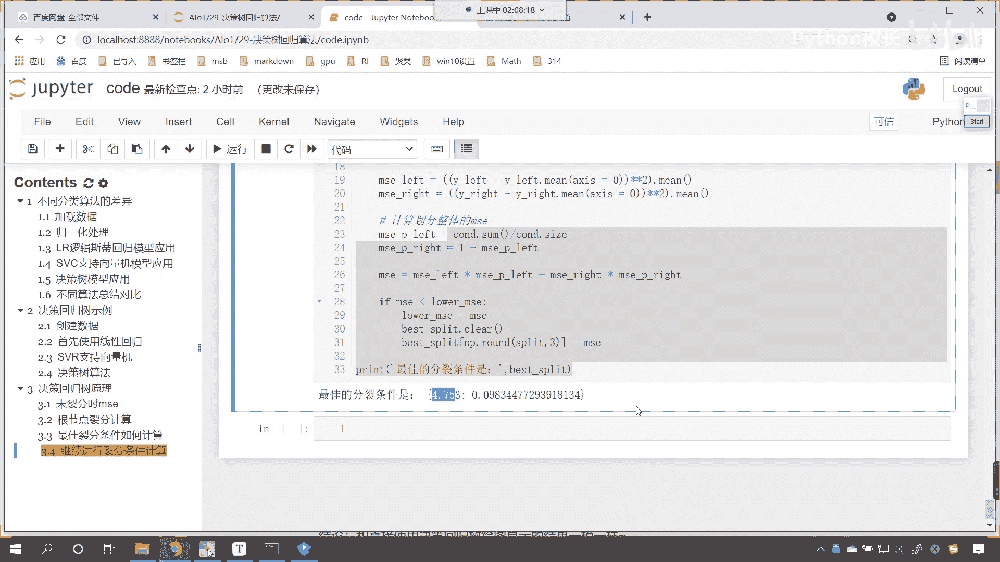