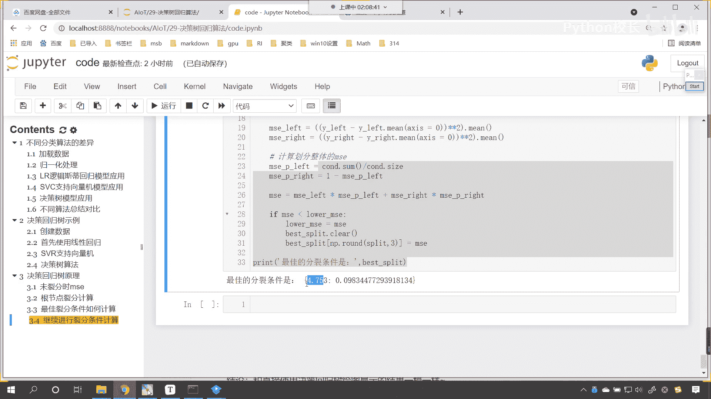
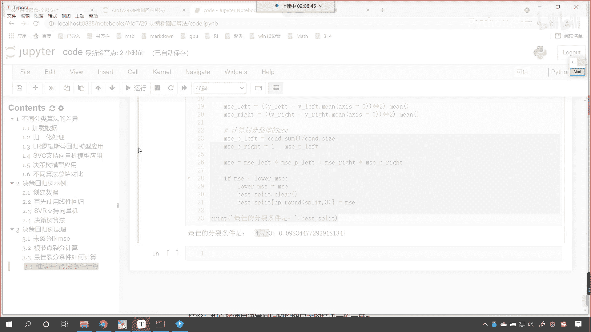
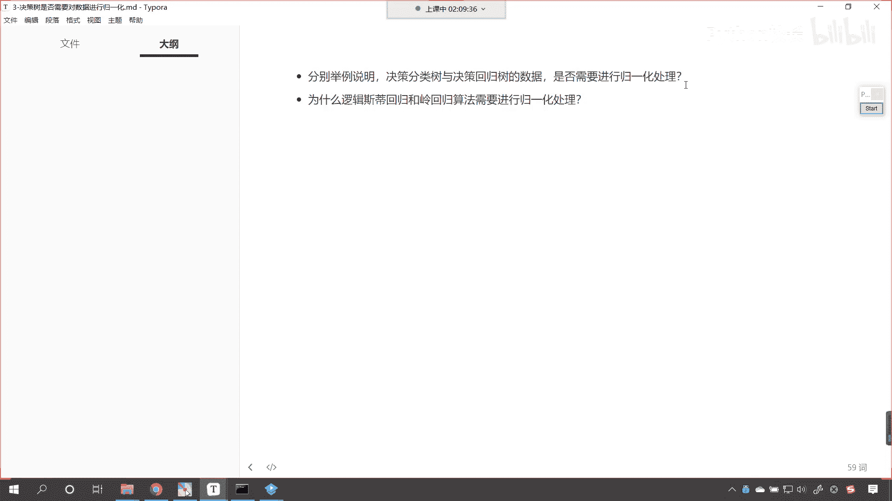

# P192：7-作业 - 程序大本营 - BV1KL411z7WA

好，那么我们今天晚上，咱们决策树原理的这个知识点，我们就介绍到这儿。

咱们呢看一下咱们的作业啊，来看一下咱们的作业好不好。

好，那么我们的作业呢，咱们就是分别举例说明，咱们的决策分类数与决策回归数的数据，是否需要进行归一化处理，看为什么逻辑斯蒂回归和岭回归算法，需要进行归一化处理呢，对吧，你看就有一个对比。

咱们在课堂上是不是都有提示呀，对不对，那你在做这个作业的时候呢，你可以使用圆规画的数据，或者说使用我们的手写数字是吧，来进行来进行这个验证一下啊对吧，举例说明决策分类数与决策回归数的这个数据。

是否需要进行归一化处理是吧。

