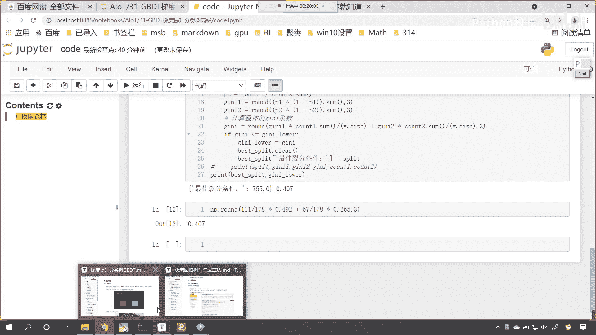
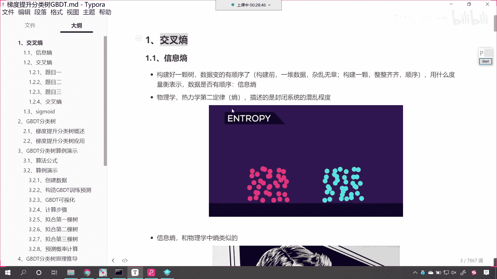
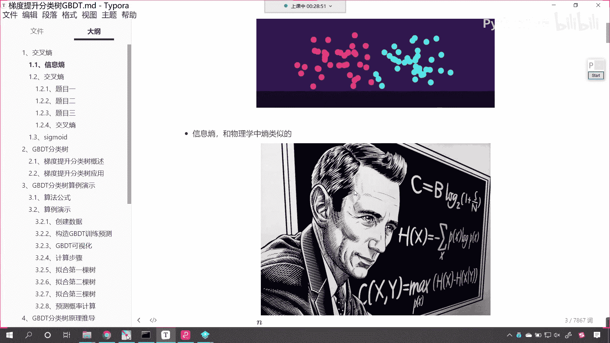
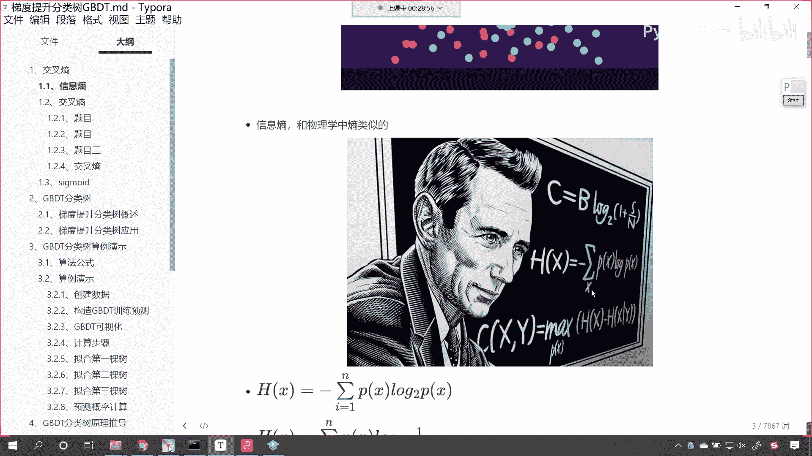
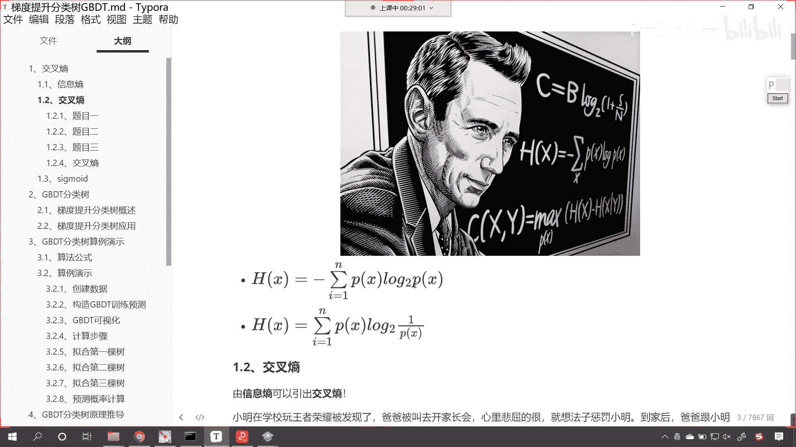
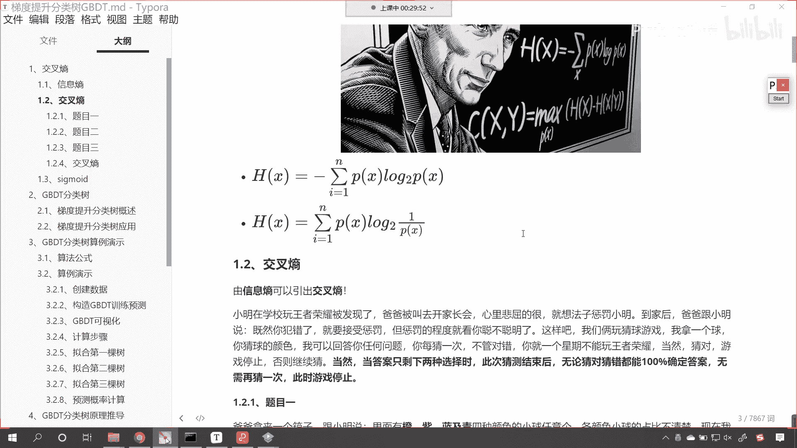
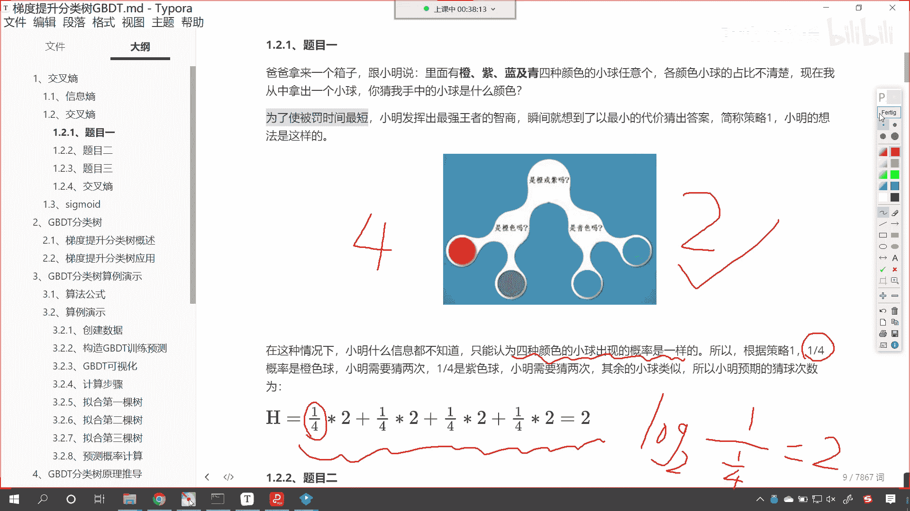
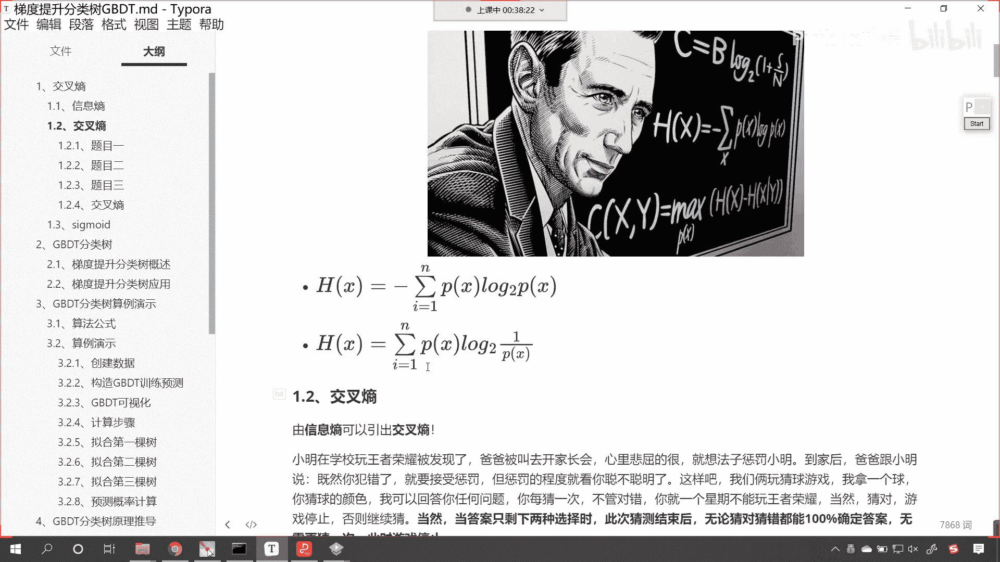
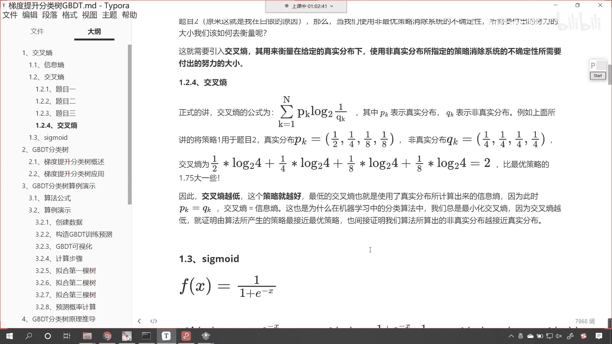

# P198：2-交叉熵原理概述 - 程序大本营 - BV1KL411z7WA

(音量注意)，(音量注意)，(音量注意)。

(音量注意)，(音量注意)，(音量注意)，(音量注意)，(音量注意)，(音量注意)，(音量注意)，(音量注意)，(音量注意)，(音量注意)，(音量注意)，(音量注意)，(音量注意)，(音量注意)。

(音量注意)，(音量注意)，(音量注意)，(音量注意)，(音量注意)，(音量注意)。

(音量注意)，(音量注意)，(音量注意)。

(音量注意)，(音量注意)。

(音量注意)，(音量注意)，(音量注意)。

(音量注意)，(音量注意)，(音量注意)，(音量注意)，(音量注意)，(音量注意)，(音量注意)，(音量注意)，(音量注意)，(音量注意)，(音量注意)，(音量注意)，(音量注意)，(音量注意)。

(音量注意)，(音量注意)，(音量注意)，(音量注意)，(音量注意)，(音量注意)，(音量注意)，(音量注意)，(音量注意)，(音量注意)，(音量注意)。

(音量注意)，(音量注意)，(音量注意)，(音量注意)，(音量注意)，(音量注意)，(音量注意)，(音量注意)，(重複)。

(重複)，(重複)，(重複)，(重複)，(重複)，(重複)，(重複)，(重複)，(重複)，(重複)，(重複)，(重複)，(重複)，(重複)，(重複)，(重複)，(重複)，(重複)，(重複)。

(重複)。

(重複)，(重複)，(重複)，(重複)，(重複)，(重複)，(重複)，(重複)，(重複)，(重複)，(重複)，(重複)，(重複)，(重複)，(重複)，(重複)，(重複)，(重複)，(重複)，(重複)。

(重複)，(重複)，(重複)，(重複)，(重複)，(重複)，(重複)，(重複)，(重複)，(重複)，(重複)，(重複)，(重複)，(重複)，(重複)，(重複)，(重複)，(重複)，(重複)，(重複)。

(重複)，(重複)，(重複)，(重複)，(重複)，(重複)，(重複)，(重複)，(重複)，(重複)，也许它可以为您带来轻松的安静。

