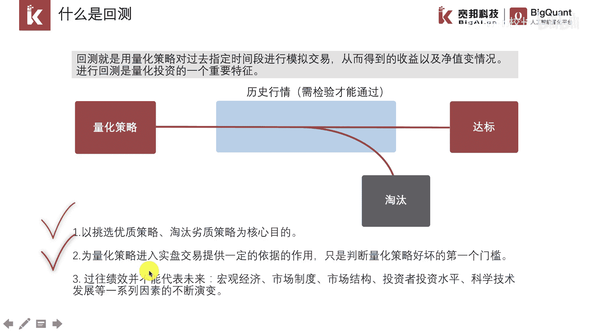
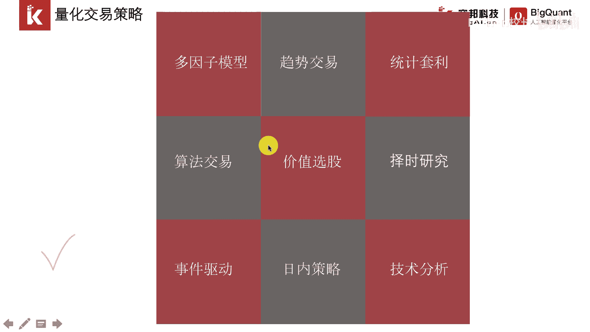
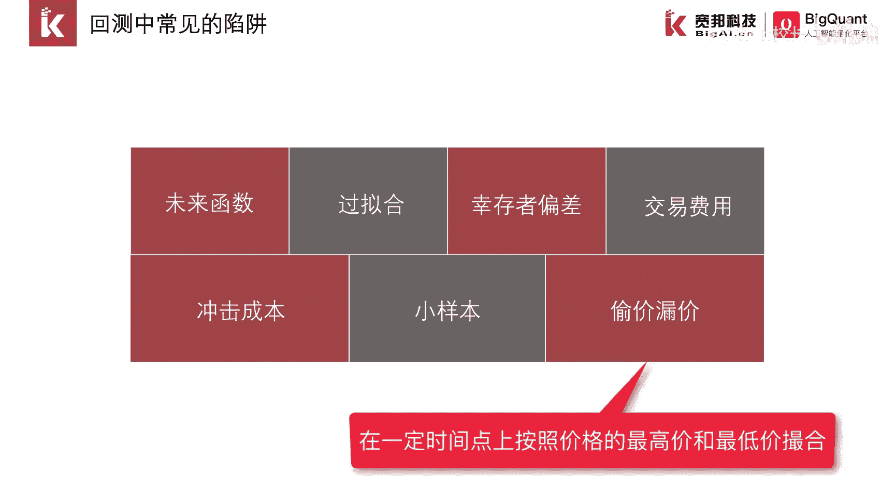
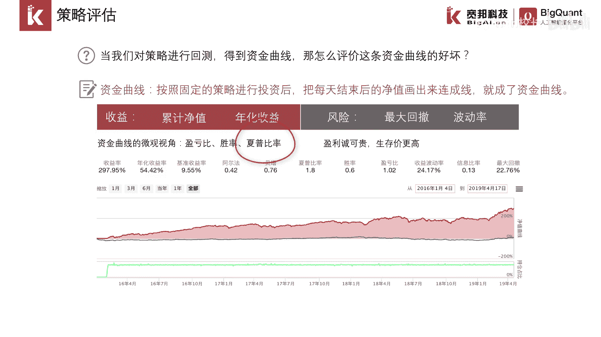

# P2：1.1.2 量化交易策略 - 程序大本营 - BV1KL411z7WA

大家好，这一节我们介绍量化交易策略，量化投资作为一种科学的投资方式，其优势主要体现在以下几个方面，主要是有纪律性，及时性，系统性，准确性和分散化，接下来我们依次介绍它下面的几个特点。

纪律性指的是严格按照策略信号进行，这样的话可以克服人性贪婪恐惧等弱点，即时性则是可以利用计算机高性能的运算，及时跟踪市场变化，第一时间发现投资机会，高频交易就是一个很好的一个体现，然后是系统性。

系统性呢指的是通过多层次的量化模型，多角度得去观察及海量数据的处理，捕捉大量的投资机会，主要体现在多层次多角度和多数据，此外量化投资所采用的交易策略，一般拥有完整的交易系统，因此具备系统性的特点。

准确性，这个比较好理解，指量化策略所采用的数量化模型刻画，全部交易信号，都是由模型准确预测得出，不带主观情绪偏差，最后我们来看分散化，有这么一句名言，金融市场没有免费的午餐，如果有，那就是分散化。

对于量化投资而言，可以选择多市场，多标的多种交易事项，因此天然就具备分散化的特点，量化投资一般是这样的一个流程，首先我们要获取策略所需要的数据，数据是量化研究的原料和基础。

数据质量高低直接影响到研究成果的高低，当我们将数据准备好以后，需要在历史数据中进行回测，比如有这样一个交易思想，每年年初买入行业龙头股票，并一直持有这样的策略，想法会有很多很多。

但是并不是每一个想法都可以最终成为好的策，略，能够赚钱的策略，因此我们需要通过回撤这一步骤，判断哪些交易思想颗粒成为策略，哪些不可以回撤，得到的好的策略，只证明了在历史上是可以盈利的。

回撤很容易犯的一个问题就是过离合，因此并不代表未来可以一直盈利，所以我们需要进行一段时间的模拟交易观察，观察策略表现适合和预期的一致，如果通过了模拟交易，那么就可以进行实盘交易，需要明白的一点是。

回测和模拟交易都很不错的策略，实盘也有可能会失效，我们详细介绍一下回车，回撤是量化投资非常重要的一环，甚至很多人认为没有经过回撤的策略，不能算作量化投资策略，大部分的策略回撤是无法通过检验的。

只有极少数的车点回车能够达标，对于回撤需要强调一下，回撤的目的是挖掘优秀的策略，回撤可以在历史数据上，对策略的好坏提供一个判断，但是随着市场的变化，而且市场变化速度很快。

过往绩效并不代表未来策略存在失效的可能。

量化交易策略有哪些呢，如果只考虑股票市场的话，不同的划分方式，也可以定义出很多量化交易策略，广义上来讲，图上这些都可以被称为量化交易策略。

在交易策略研发的过程中，回撤会遇到很多很多的陷阱，主要有未来函数过滤和幸存者偏差，交易费用的低估，从基成本的忽略小样本的视角以及度假度假，接下来我们详细介绍各个陷阱，未来函数指当前时间点。

获取到了该时间点之后的信息，比如一些抗战神剧的台词，8年抗战拉开序幕，这就换了未来函数这个问题，因为抗战初期大家并不知道抗战会持续8年过，拟合食指离合过，渡过拟合会学习和记忆一些噪音数据。

因此在未来很可能思想幸存者偏差，也是数据分析领域常见的一个经典错误，比如在交易策略确定的股票池是3000，是3000只股票，这就会把历史上曾经退市的股票排除在外，一定程度上粉饰了回车技巧。

但是我们在历史的时间点上，并不知道哪些股票会退市，交易费用的低估市值，在回撤中对交易费用的计算低于实际情形，虚高的策略收益冲击成本，忽略市子交易行为本身会改变，市场交易会带来额外的冲击成本。

尤其是当资金规模较大时，冲击成本考虑需要更加严谨，小样本视角指的是数据太少，分析结论普适性不强，头像漏价是指在一个时间点上，按照价格最高价，最低价进行撮合，这在实盘中是不切实际的。

策略评估指的是，我们需要采用客观统一的一套衡量标准，来评价哪些策略好，哪些策略不好，下图是回测以后得到的一个结果，红色的曲线表示资金曲线，可以看出这是一个很不错的一个策略，除了这样直观的曲线。

我们还得到了收益率，年化收益率，基准收益率，阿尔法贝塔，夏普比率，收益波动率，信息比率，最大回撤等指标，这些指标呢主要分为两类，一类度量的是一类能力，一类度量的是抗风险的能力。

评价策略最通用的一个指标是夏普比率，它不仅仅考虑了收益，也考虑了风险，代表的是经风险调整后的收益。

