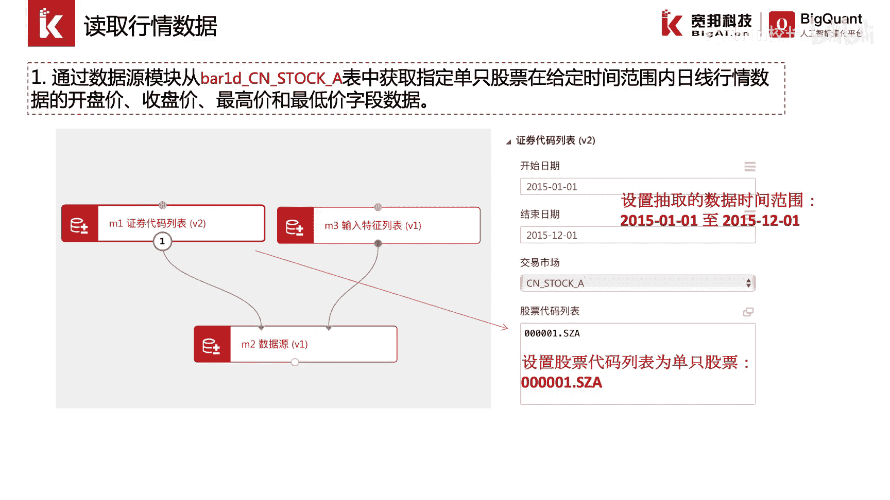
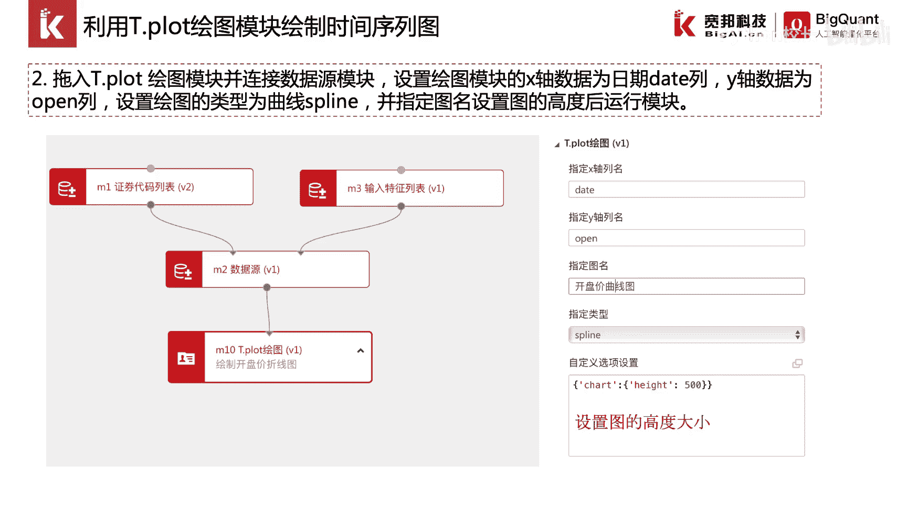
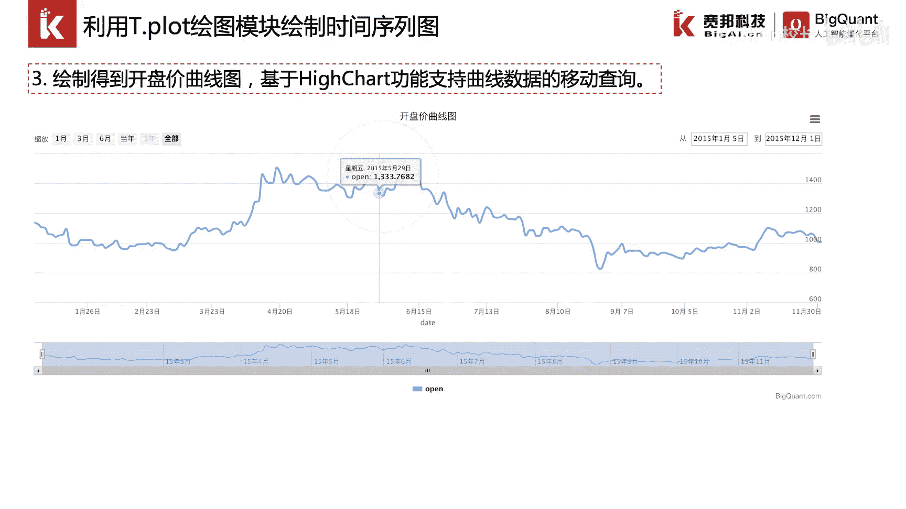
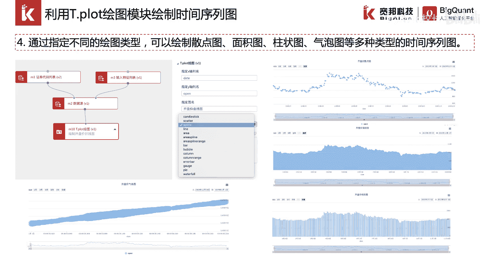
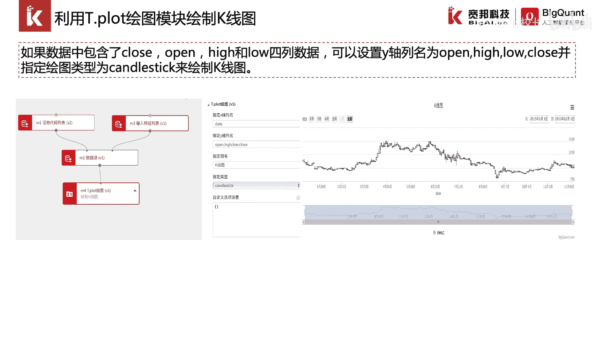

# P20：4.1.4-时间序列可视化 - 程序大本营 - BV1KL411z7WA

这一节我们来讲解一下时间序列数据的可视化。

金融市场中的数据通常为时间序列数据，我们可以通过相关的模块来实现，时间数据的序列号查看，通过可视化的方式来展示时间序列，首先我们读取行情数据，我们通过拖入证券代码列表模块，输入特征列表模块和数据源模块。

从81d cn stock a表中获取指定的单只股票，在给定时间范围内的日线行情数据，开盘价，收盘价最高和最低价格的字段数据，这里我们获取的是000001，这只股票，在2015年1月一日。

到2015年12月一日，的时间范围内的对应字段，紧接着我们可以拖入t。plot模块，并连接数据源模块，在t。plot绘图模块中，设置绘图模块的x轴以及y轴，并设置绘图的类型为曲线，spline。

我们在指定图名参数表中，填入我们所需要绘制图表的名称，例如开盘价曲线图，最后我们在自定义选项设置中，指定图的高度。

设置之后我们可以运行模块，运行模块号，我们可以得到开盘价的曲线图，基于high差的功能所绘制的曲线图，支持我们移动鼠标，来查看每一天对应的开盘价格。

通过t。plot绘图模块的更多参数设置，我们还可以绘制散点图，面积图，柱状图，气泡图等多种类型的序列图。

如果我们想绘制金融数据中常见的k线图，我们需要在输入数据时完整的包含close open，high和low 4列数据，同时我们可以设置y轴的列名为open high，low clothes。

并指定我们的绘图类型为candlestick。

