# P200：4-GBDT梯度提升分类树使用 - 程序大本营 - BV1KL411z7WA

(音量注意)，(音量注意)，(音量注意)，(音量注意)，(音量注意)，(音量注意)，(音量注意)，(音量注意)，(音量注意)，(音量注意)，(音量注意)。

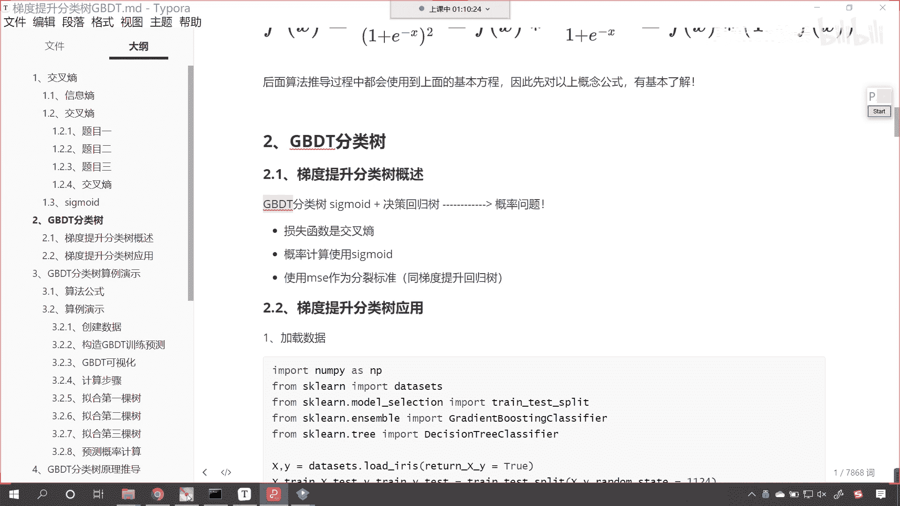

(音量注意)，(音量注意)，(音量注意)，(音量注意)，(音量注意)，(音量注意)，(音量注意)，(音量注意)，(音量注意)，(音量注意)，(音量注意)，(音量注意)，(音量注意)，(音量注意)。

(音量注意)，(音量注意)，(音量注意)，(音量注意)，(音量注意)，(音量注意)，(音量注意)，(音量注意)，(音量注意)，(音量注意)，(音量注意)，(音量注意)，(音量注意)，(音量注意)。

(音量注意)，(音量注意)，(音量注意)，(音量注意)，(音量注意)，(音量注意)，(音量注意)，(音量注意)，(音量注意)，(音量注意)，(音量注意)，(音量注意)，(音量注意)，(音量注意)。

(音量注意)，(音量注意)，(音量注意)，(音量注意)，(音量注意)，(音量注意)，(音量注意)，(音量注意)，(音量注意)，(音量注意)，(音量注意)，(音量注意)，(音量注意)，(音量注意)。

(音量注意)，(音量注意)，(音量注意)，(音量注意)，(音量注意)，(音量注意)，(音量注意)，(音量注意)，(音量注意)，(音量注意)，(音量注意)，(音量注意)，(音量注意)，(音量注意)。

(音量注意)，(音量注意)，(音量注意)，(音量注意)，(音量注意)，(音量注意)，(音量注意)，(音量注意)，(音量注意)，(音量注意)，(音量注意)，(音量注意)，(音量注意)，(音量注意)。

(音量注意)，(音量注意)，(音量注意)，(音量注意)，(音量注意)，(音量注意)，(音量注意)，(音量注意)，(音量注意)，(音量注意)，(。可惜音量不足夠多。

 提示大家用耳機聽到的聲音再試聽下去 但是開啟音量設定不足夠， 重點在訪問中)，(。音量設定不足夠， 提示大家用耳機聽到的聲音再試聽下去 但是開啟音量設定不足夠， 重點在訪問中)，(。音量設定不足夠。

 提示大家用耳機聽到的聲音再試聽下去 但是開啟音量設定不足夠， 重點在訪問中)，(。音量設定不足夠， 提示大家用耳機聽到的聲音再試聽下去 但是開啟音量設定不足夠， 重點在訪問中)，(。音量設定不足夠。

 提示大家用耳機聽到的聲音再試聽下去 但是開啟音量設定不足夠， 重點在訪問中)，(。音量設定不足夠， 提示大家用耳機聽到的聲音再試聽下去 但是開啟音量設定不足夠， 重點在訪問中)，(。音量設定不足夠。

 提示大家用耳機聽到的聲音再試聽下去 但是開啟音量設定不足夠， 重點在訪問中)，(。音量設定不足夠， 提示大家用耳機聽到的聲音再試聽下去 但是開啟音量設定不足夠， 重點在訪問中)，(。音量設定不足夠。

 提示大家用耳機聽到的聲音再試聽下去 但是開啟音量設定不足夠， 重點在訪問中)，(。音量設定不足夠， 提示大家用耳機聽到的聲音再試聽下去 但是開啟音量設定不足夠， 重點在訪問中)，(。音量設定不足夠。

 提示大家用耳機聽到的聲音再試聽下去 但是開啟音量設定不足夠， 重點在訪問中)，(。音量設定不足夠， 提示大家用耳機聽到的聲音再試聽下去 但是開啟音量設定不足夠， 重點在訪問中)，(。音量設定不足夠。

 提示大家用耳機聽到的聲音再試聽下去 但是開啟音量設定不足夠， 重點在訪問中)，(。音量設定不足夠， 提示大家用耳機聽到的聲音再試聽下去 但是開啟音量設定不足夠， 重點在訪問中)，(。音量設定不足夠。

 提示大家用耳機聽到的聲音再試聽下去 但是開啟音量設定不足夠， 重點在訪問中)，(。音量設定不足夠， 提示大家用耳機聽到的聲音再試聽下去 但是開啟音量設定不足夠， 重點在訪問中)，(。音量設定不足夠。

 提示大家用耳機聽到的聲音再試聽下去 但是開啟音量設定不足夠， 重點在訪問中)，(。音量設定不足夠， 提示大家用耳機聽到的聲音再試聽下去 但是開啟音量設定不足夠， 重點在訪問中)，(。音量設定不足夠。

 提示大家用耳機聽到的聲音再試聽下去 但是開啟音量設定不足夠， 重點在訪問中)，(。音量設定不足夠， 提示大家用耳機聽到的聲音再試聽下去 但是開啟音量設定不足夠， 重點在訪問中)，(。音量設定不足夠。

 提示大家用耳機聽到的聲音再試聽下去 但是開啟音量設定不足夠， 重點在訪問中)，(。音量設定不足夠， 提示大家用耳機聽到的聲音再試聽下去 但是開啟音量設定不足夠， 重點在訪問中)，(。音量設定不足夠。

 提示大家用耳機聽到的聲音再試聽下去 但是開啟音量設定不足夠， 重點在訪問中)，(。音量設定不足夠， 提示大家用耳機聽到的聲音再試聽下去 但是開啟音量設定不足夠， 重點在訪問中)，(。音量設定不足夠。

 提示大家用耳機聽到的聲音再試聽下去 但是開啟音量設定不足夠， 重點在訪問中)，(。音量設定不足夠， 提示大家用耳機聽到的聲音再試聽下去 但是開啟音量設定不足夠， 重點在訪問中)，(。音量設定不足夠。

 提示大家用耳機聽到的聲音再試聽下去 但是開啟音量設定不足夠， 重點在訪問中)，(。音量設定不足夠， 提示大家用耳機聽到的聲音再試聽下去 但是開啟音量設定不足夠， 重點在訪問中)，(。音量設定不足夠。

 提示大家用耳機聽到的聲音再試聽下去 但是開啟音量設定不足夠， 重點在訪問中)，(。音量設定不足夠， 提示大家用耳機聽到的聲音再試聽下去 但是開啟音量設定不足夠， 重點在訪問中)，(。音量設定不足夠。

 提示大家用耳機聽到的聲音再試聽下去 但是開啟音量設定不足夠， 重點在訪問中)，(。音量設定不足夠， 提示大家用耳機聽到的聲音再試聽下去 但是開啟音量設定不足夠， 重點在訪問中)，(。音量設定不足夠。

 提示大家用耳機聽到的聲音再試聽下去 但是開啟音量設定不足夠， 重點在訪問中)，(。音量設定不足夠， 提示大家用耳機聽到的聲音再試聽下去 但是開啟音量設定不足夠， 重點在訪問中)，(。音量設定不足夠。

 提示大家用耳機聽到的聲音再試聽下去 但是開啟音量設定不足夠， 重點在訪問中)。

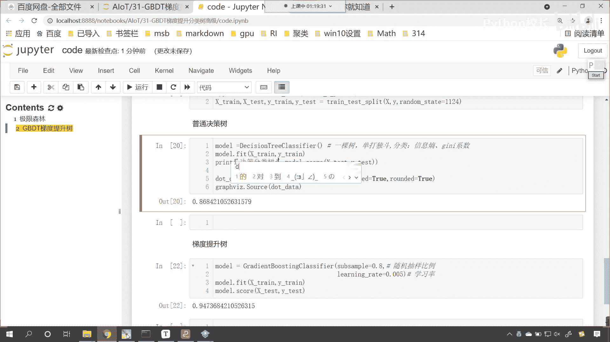

(。音量設定不足夠， 提示大家用耳機聽到的聲音再試聽下去 但是開啟音量設定不足夠， 重點在訪問中)。

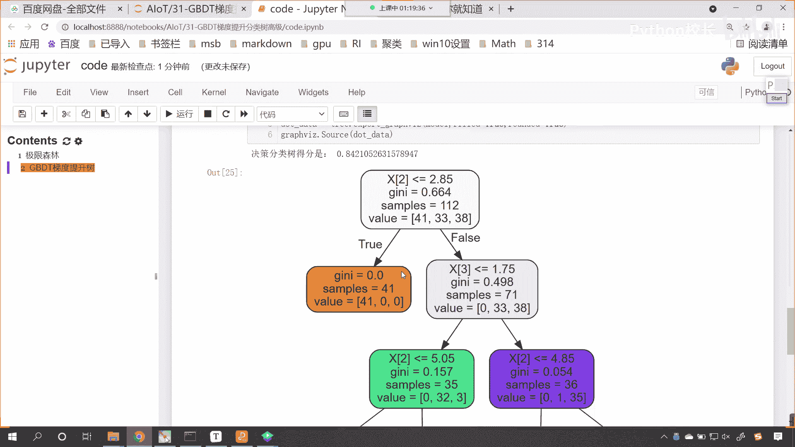

(。音量設定不足夠， 提示大家用耳機聽到的聲音再試聽下去 但是開啟音量設定不足夠， 重點在訪問中)。

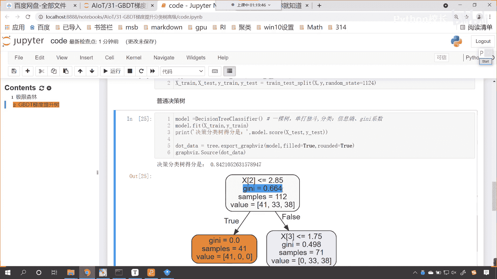

(。音量設定不足夠， 提示大家用耳機聽到的聲音再試聽下去 但是開啟音量設定不足夠， 重點在訪問中)，(。音量設定不足夠， 提示大家用耳機聽到的聲音再試聽下去 但是開啟音量設定不足夠， 重點在訪問中)。

(。音量設定不足夠， 提示大家用耳機聽到的聲音再試聽下去 但是開啟音量設定不足夠， 重點在訪問中)，(。音量設定不足夠， 提示大家用耳機聽到的聲音再試聽下去 但是開啟音量設定不足夠， 重點在訪問中)。

(。音量設定不足夠， 提示大家用耳機聽到的聲音再試聽下去 但是開啟音量設定不足夠， 重點在訪問中)，(。音量設定不足夠， 提示大家用耳機聽到的聲音再試聽下去 但是開啟音量設定不足夠， 重點在訪問中)。

(。音量設定不足夠， 提示大家用耳機聽到的聲音再試聽下去 但是開啟音量設定不足夠， 重點在訪問中)，(。音量設定不足夠， 提示大家用耳機聽到的聲音再試聽下去 但是開啟音量設定不足夠， 重點在訪問中)。

(。音量設定不足夠， 提示大家用耳機聽到的聲音再試聽下去 但是開啟音量設定不足夠， 重點在訪問中)，(。音量設定不足夠， 提示大家用耳機聽到的聲音再試聽下去 但是開啟音量設定不足夠， 重點在訪問中)。

(。音量設定不足夠， 提示大家用耳機聽到的聲音再試聽下去 但是開啟音量設定不足夠， 重點在訪問中)，(。音量設定不足夠， 提示大家用耳機聽到的聲音再試聽下去 但是開啟音量設定不足夠， 重點在訪問中)。

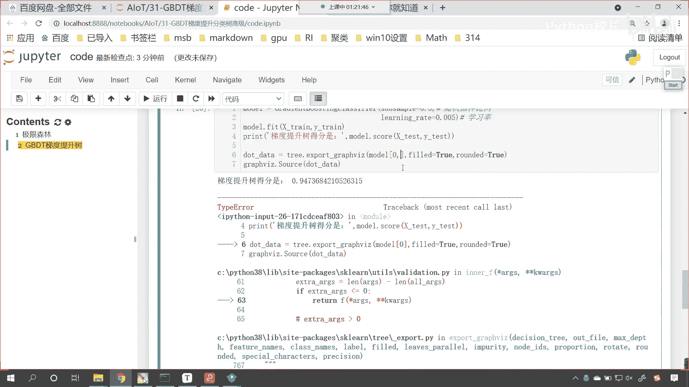

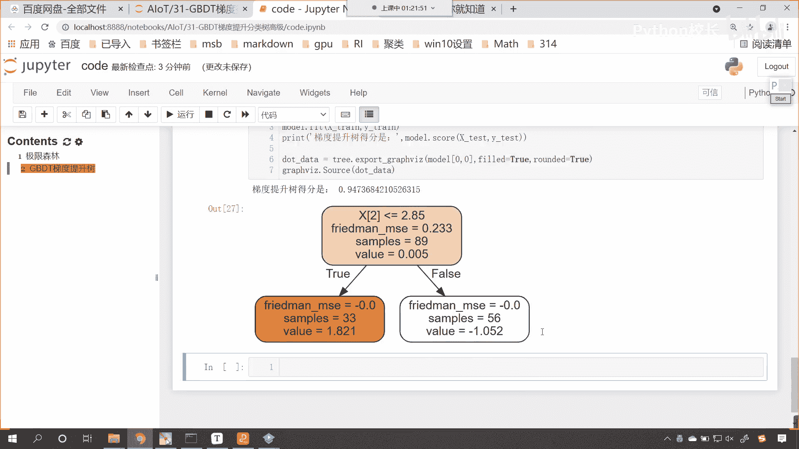

(。音量設定不足夠， 提示大家用耳機聽到的聲音再試聽下去 但是開啟音量設定不足夠， 重點在訪問中)。

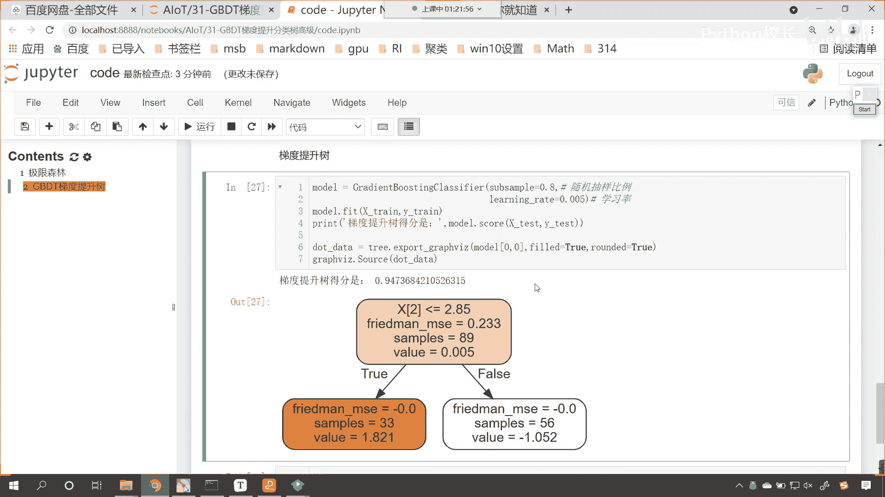

(。音量設定不足夠， 提示大家用耳機聽到的聲音再試聽下去 但是開啟音量設定不足夠， 重點在訪問中)，(。音量設定不足夠， 提示大家用耳機聽到的聲音再試聽下去 但是開啟音量設定不足夠， 重點在訪問中)。

(。音量設定不足夠， 提示大家用耳機聽到的聲音再試聽下去 但是開啟音量設定不足夠， 重點在訪問中)，(。音量設定不足夠， 提示大家用耳機聽到的聲音再試聽下去 但是開啟音量設定不足夠， 重點在訪問中)。

(。音量設定不足夠， 提示大家用耳機聽到的聲音再試聽下去 但是開啟音量設定不足夠， 重點在訪問中)，(。音量設定不足夠， 提示大家用耳機聽到的聲音再試聽下去 但是開啟音量設定不足夠， 重點在訪問中)。

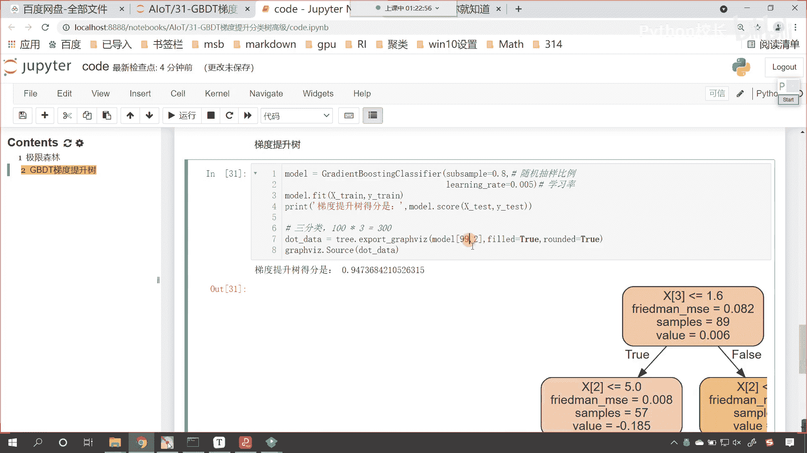

(。音量設定不足夠， 提示大家用耳機聽到的聲音再試聽下去 但是開啟音量設定不足夠， 重點在訪問中)，(。音量設定不足夠， 提示大家用耳機聽到的聲音再試聽下去 但是開啟音量設定不足夠， 重點在訪問中)。

(。音量設定不足夠， 提示大家用耳機聽到的聲音再試聽下去 但是開啟音量設定不足夠， 重點在訪問中)。

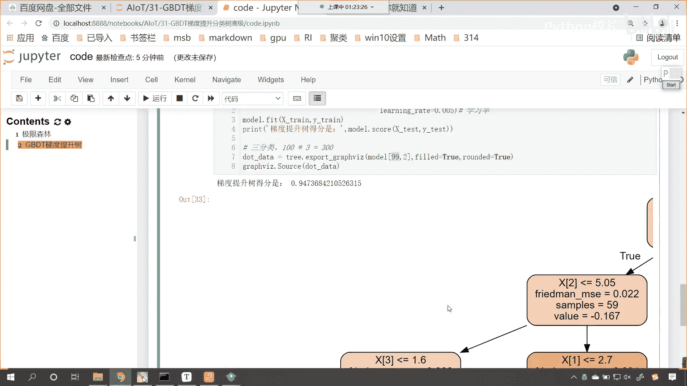

(。音量設定不足夠， 提示大家用耳機聽到的聲音再試聽下去 但是開啟音量設定不足夠， 重點在訪問中)，(。音量設定不足夠， 提示大家用耳機聽到的聲音再試聽下去 但是開啟音量設定不足夠， 重點在訪問中)。

(。音量設定不足夠， 提示大家用耳機聽到的聲音再試聽下去 但是開啟音量設定不足夠， 重點在訪問中)。

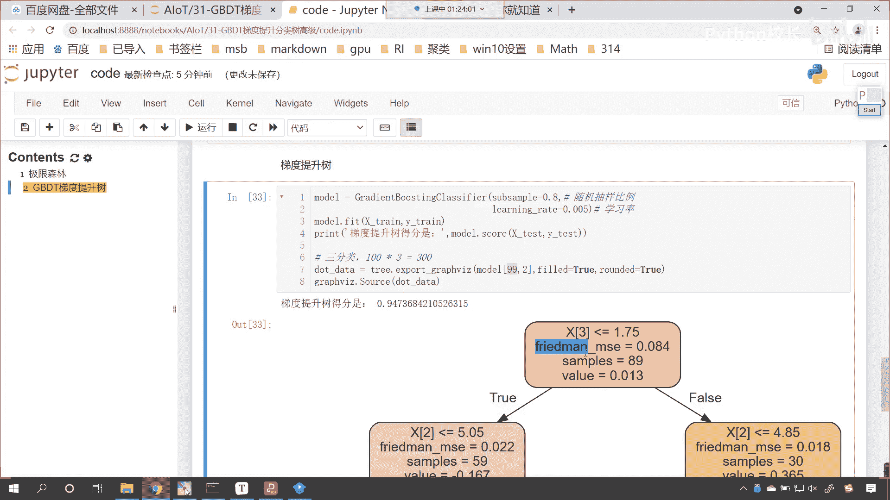

(。音量設定不足夠， 提示大家用耳機聽到的聲音再試聽下去 但是開啟音量設定不足夠， 重點在訪問中)。

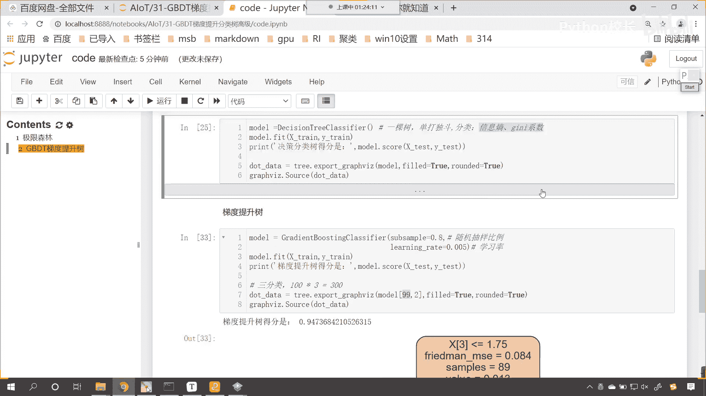

(。音量設定不足夠， 提示大家用耳機聽到的聲音再試聽下去 但是開啟音量設定不足夠， 重點在訪問中)。

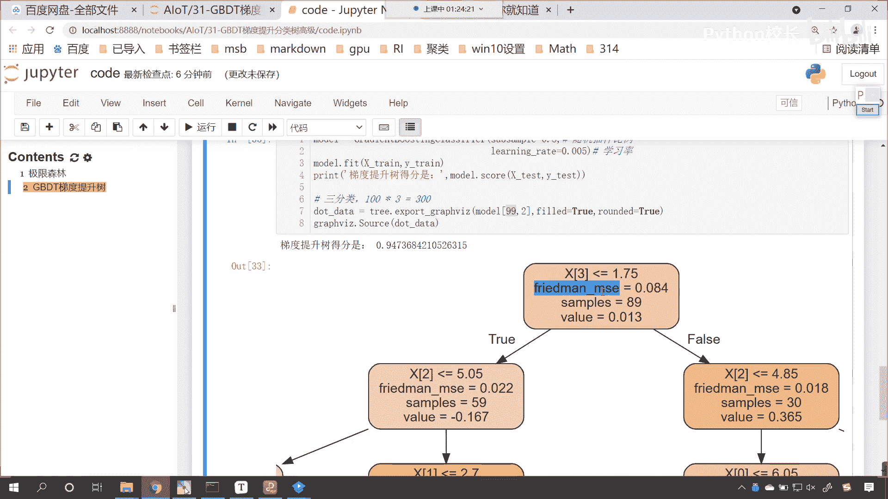

(。音量設定不足夠， 提示大家用耳機聽到的聲音再試聽下去 但是開啟音量設定不足夠， 重點在訪問中)。

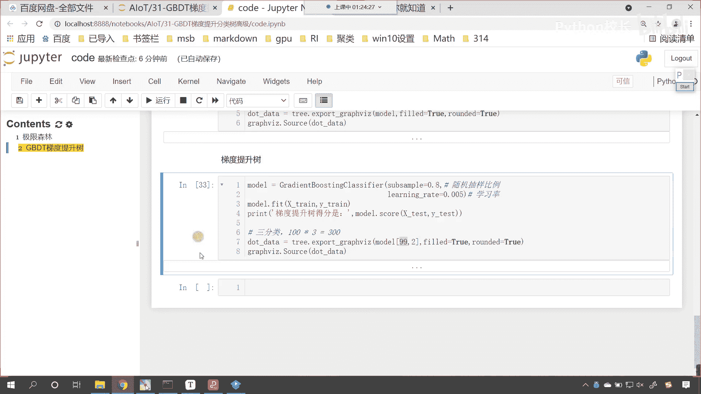

(。音量設定不足夠， 提示大家用耳機聽到的聲音再試聽下去 但是開啟音量設定不足夠， 重點在訪問中)，(。音量設定不足夠， 提示大家用耳機聽到的聲音再試聽下去 但是開啟音量設定不足夠， 重點在訪問中)。

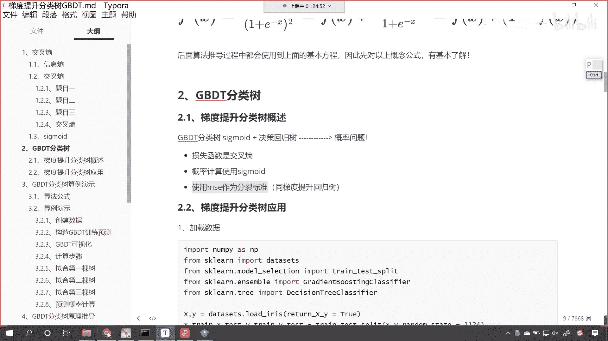

(。音量設定不足夠， 提示大家用耳機聽到的聲音再試聽下去 但是開啟音量設定不足夠， 重點在訪問中)。

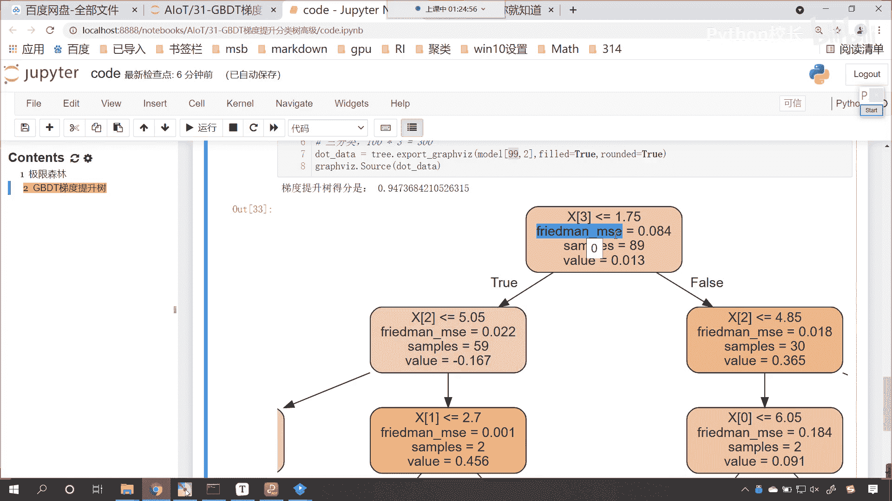

(。音量設定不足夠， 提示大家用耳機聽到的聲音再試聽下去 但是開啟音量設定不足夠， 重點在訪問中)，(。音量設定不足夠， 提示大家用耳機聽到的聲音再試聽下去 但是開啟音量設定不足夠， 重點在訪問中)。

(。音量設定不足夠， 提示大家用耳機聽到的聲音再試聽下去 但是開啟音量設定不足夠， 重點在訪問中)，(。音量設定不足夠， 提示大家用耳機聽到的聲音再試聽下去 但是開啟音量設定不足夠， 重點在訪問中)。

(。音量設定不足夠， 提示大家用耳機聽到的聲音再試聽下去 但是開啟音量設定不足夠， 重點在訪問中)，(字幕製作：貝爾)，(((o(*゚▽゚*)ノ)))。

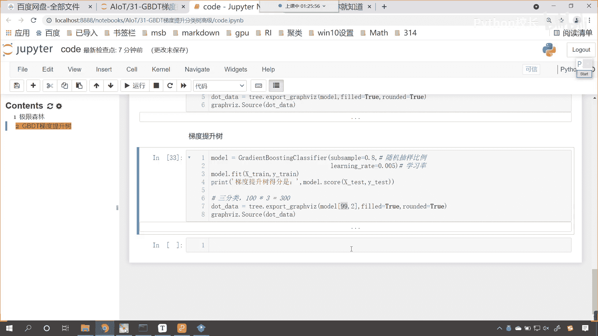