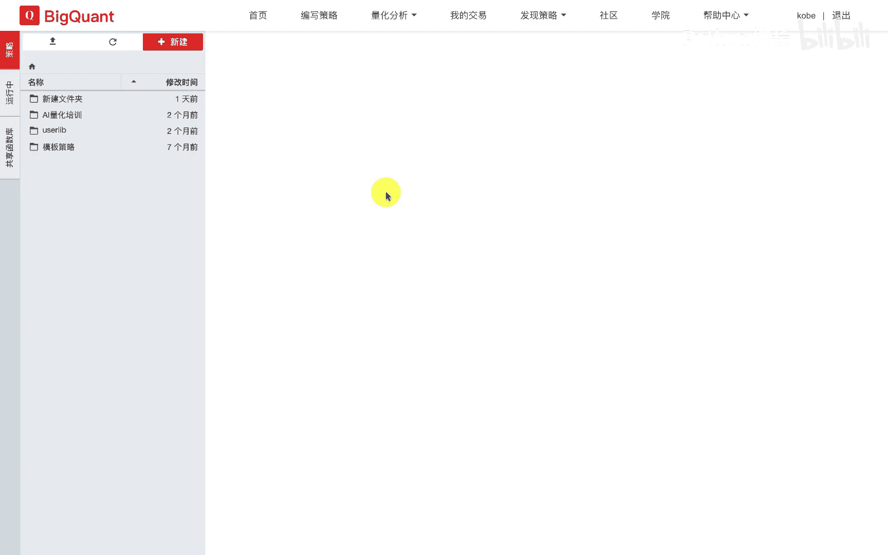
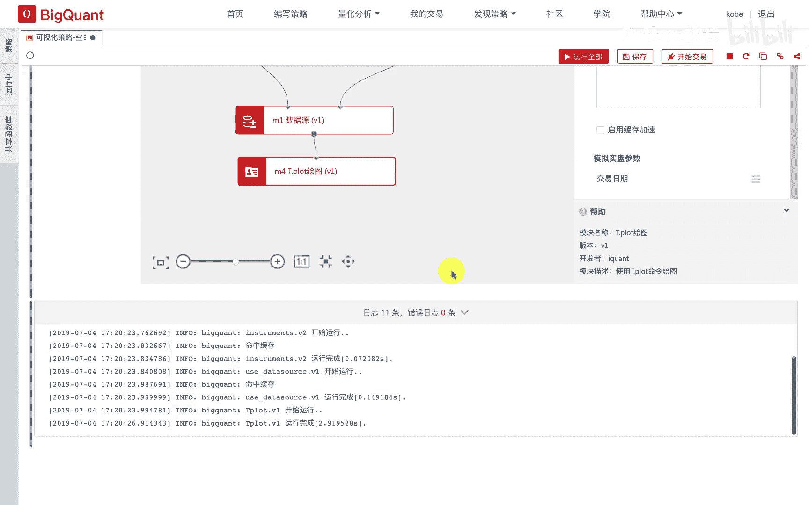

# P22：4.1.6-可视化数据分析入门实操 - 程序大本营 - BV1KL411z7WA

我们进入编写策略界面，点击新建可视化空白策略。

我们点击新建，打开一个可视化的空白策略，我们在左侧的数据输入输出模块列表中，依次拖入数据源模块，输入特征列表模块以及正确代码列表模块，我们调整模块位置，并连连接模块，然后我们进行模块的参数配置。

这里我们填入000001，这是股票的开盘价数据抽取数据源模块中，我们填入所要抽取的数据，表明，在输入特征列表中，我们填入需要抽取的字段名称，这里我们添入开盘价，这样我们就完成了一个数据抽取流程。

紧接着我们在左侧的模块导航栏中，搜索栏中输入提点loop，进行模块搜索，我们选择并拖拽t。plot绘图模块，我们连接数据源模块和t。plot绘图模块，在右侧的参数表中指定x轴列名为date。

y轴列名为open，指定我们的绘图的图名为开盘价折线图，我们指定绘图的类型为l，在自定义选项设置中，我们设置图片的高度为500，我们点击运行按钮，运行这个工作流，可以看到模块运行结束后。

下方绘制出000001，这支股票在2015年1月一日至，2015年12月一日期间的开盘价的折线图，我们可以在输入特征列表中输入open close，high以及no这四列，来绘制k线图。

我们点击tea lot绘图模块，修改图名，并指定绘图类型为candlestick，在指定y轴列名为open hello clothes，我们点击运行按钮，可以看到下方绘制出该支股票。

在给定历史时间范围内的k线图，我们点击输入特征列表并修改我们需要绘制的，字段例如指挥指开盘价，我们修改对应的tea plot绘图函数，绘图模块的参数，我们可以重新指定我们所绘制的开盘价格。

时间序列的绘图类型，例如scatter散点图，我们点击运行，可以看到运行出来的结果为开盘价格的，随事件的一个散点分布图，同样的道理，我们还可以绘制气泡图。

