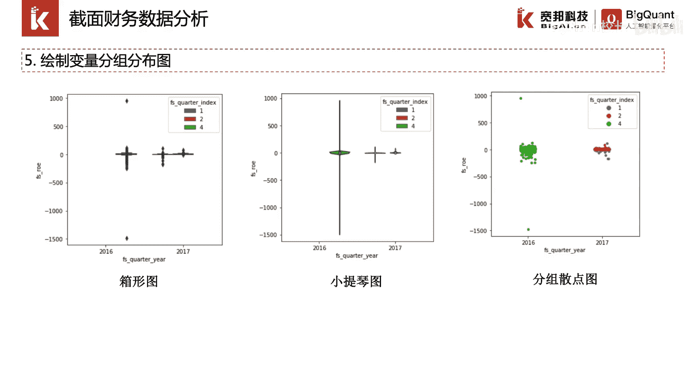

# P23：4.1.7-可视化数据分析入门mp4 - 程序大本营 - BV1KL411z7WA

这一节我们介绍一下，可视化数据分析的入门知识。

金融数据通常以时间序列的方式进行存储，为了观察某一个时间截面上的数据，我们可以对其截面数据进行抽取，并分析截面数据的分布，这里我们以截面财务数据分析为例，简要介绍截面数据分布经常使用的模块功能。

首先我们通过证券代码列表和输入特征列表，以及数据源模块，从财务数据表中抽取某一日的截面数据，然后我们会对某一个字段进行直方图的分布，绘制和观察，以及概率密度曲线的绘制观察。

然后我们针对双变量进行联合分布绘制和观察，对于多变量，我们可以进行两两双变量的一个联合，分布组图绘制，最后我们可以对数据进行分组分布图绘制，我们可以指定所需分组的字段，对数据进行分组展示。

并分组绘制箱型图，小提琴图。

