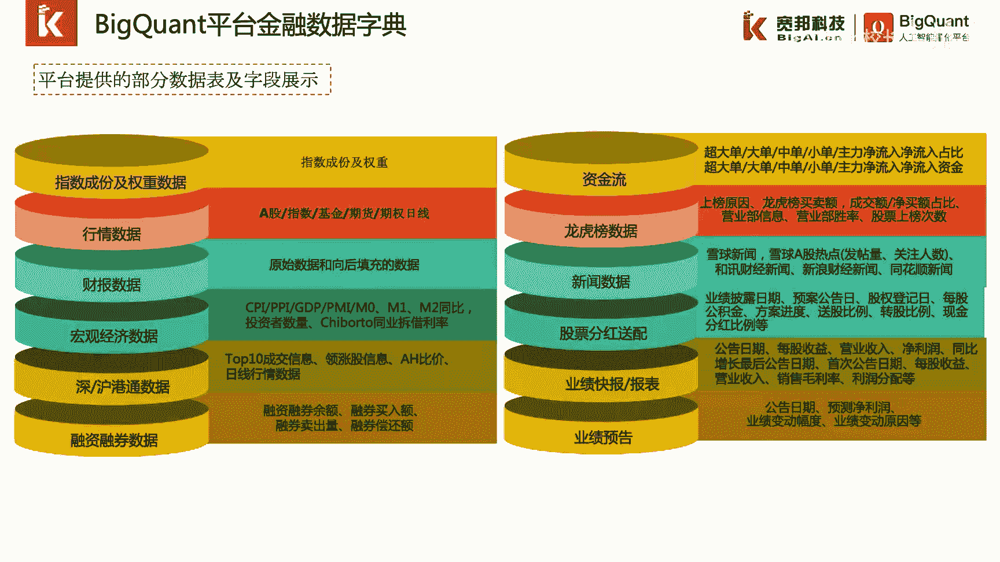
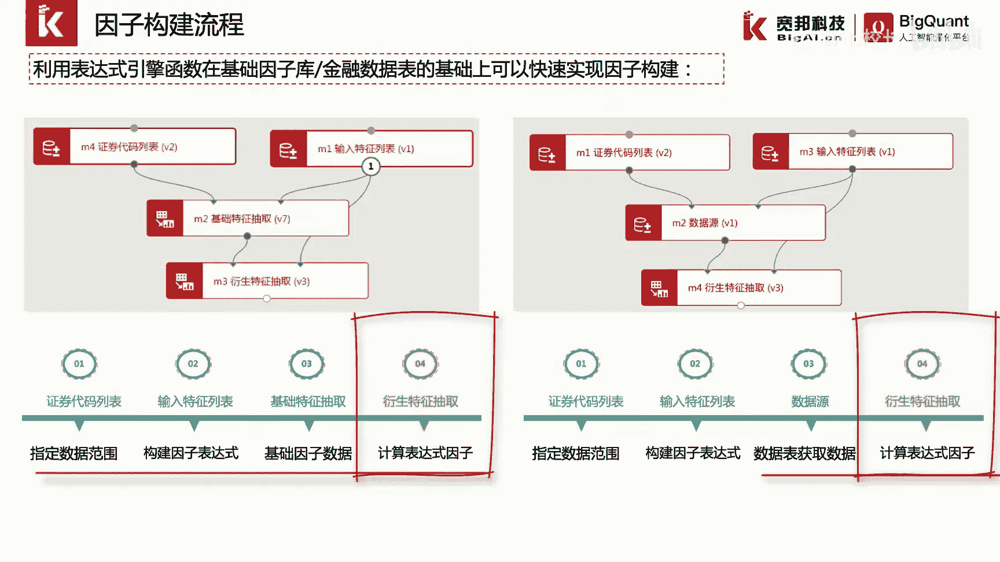

# P24：4.2.1.1-利用表达式引擎构建因子（总体介绍） - 程序大本营 - BV1KL411z7WA

这一章我们来介绍一下因子的构建与处理，本章分为三个小节，第一节利用表达式引擎构建，因此第二小节我们介绍一下，利用表达式引擎构建自定义标注，最后我们介绍一下因子预处理的常用功能模块，这一小节我们介绍一下。

背个框的平台上的表达式引擎功能，以及如何利用表达式引擎构建因子。

我们已经介绍过了黑框的平台上的金融数据，以数据字典的方式进行原始数据存储，其中包括了大部分的基础金融数据，以及特色金融数据。

此外呢bacon的平台的数据经过清洗合并，统一的填充之后，形成了因子库，我们可以利用地点features接口，通过因子库统一对数据进行读取，因子库中包含了常见的波动率，贝塔因子，财报因子，资金流因子。

量价因子，估值因子以及财务因子等，因此或者说特征是机器学习中，很重要的一个概念，开发ai算法的关键在于因子或特征的选择，如果说是构建简单的因子，比如近五日收益率，我们可以用当日的收盘价格。

除以五日前的收盘价格减一，这种简单的表达式因子，我们可以通过代码进行构建，流程也相对简单，首先我们通过地点features，从数据库中抽取到我们所用的基础数据，当日收盘价。

然后我们通过data frame的相关操作进行列计算，以计算我们所需要的五日收益率因子数据，但如果如果我们想构建近五日，每日收益率和成交量的相关性，这个因子就比较棘手。

需要我们编写大量的代码来计算这种因子，被框的平台开发了表达式计算引擎big expo，通过编写简单的表达式，无需编写代码，就可以快速的利用基础因子来构建，我们所需要的复杂因子。

例如近五日每日收益率和成交量的相关性，这个因子可以直接构建表达式，correlation，close 0除以shift close，01-1，volume 05。

通过表达式引擎提供的correlation这样一个函数，我们可以计算五日收益率和成交量之间的，相关系数，表达式引擎提供了截面函数以及时间序列函数，两类函数横截面相关的函数。

例如abs表示取某一个因子的绝对值，log x表示取，因此x的自然对数类似的函数还包括了rank x，group me以及group s，其中group in和group some。

可以按照时间和指定的key进行分组计算，表达申擎所提供的时间序列函数包括delay，delta，以及计算技术指标常用的ta系列时间序列函数，例如t a s m a。

用来计算指定时间周期内的简单移动平均值，t s mean表示来计算过去地日内的最小，因子的构建流程，可以通过可视化模块拖拽连接的方式快速搭建，我们可以通过原始金融数据，进行因子的快速构建。

也可以通过因子库和表达式引擎功能，在因子库的基础数据基础上进行构建，这两种方式构建的流程大致相同，首先我们通过证券代码列表，指定我们所获取的数据范围，包括股票代码列表范围和起止时间。

然后我们通过输入特征列表来构建，我们所需要的因子表达式，紧接着我们通过基础特征数据抽取模块，来从数据库中获取，我们表达式中的基础因子数据，或者通过数据源模块获取，我们表达式中的基础因子数据。

最后我们通过衍生特征抽取模块。

