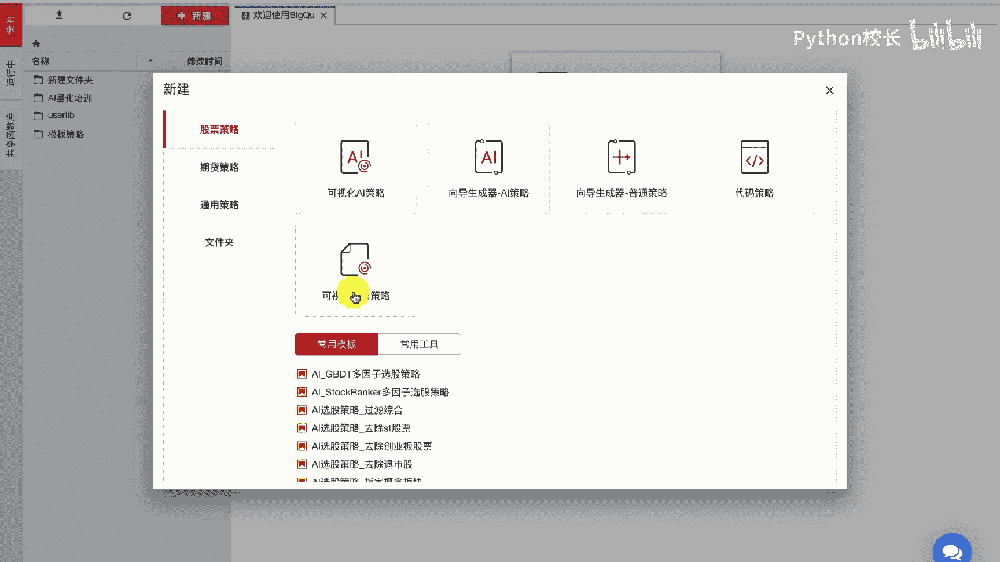
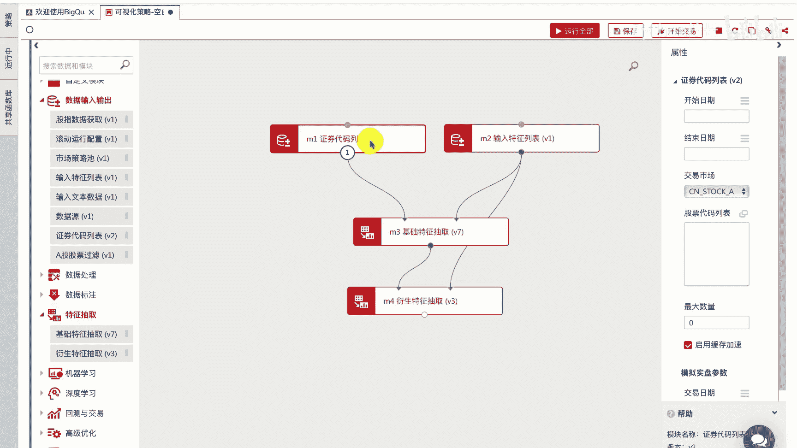

# P25：4.2.1.2-利用表达式引擎构建因子举例1 - 程序大本营 - BV1KL411z7WA

我们分别举例，首先我们介绍一下，通过因子库基础因子来构建因子，这里我们构建一个group me industry，申万一级行业的pe平均值，这样一个因子，可以看到这个因子的基础因子为，申万一级行业类别。

industry s w level one，零以及每只股票的市盈率因子p e t t m0 ，我们利用申万一级行业类别作为组别，来计算每个组别内的市盈率的平均值，搭建的因子构建流程如下。

首先我们指定抽取的股票数据范围，从2019年1月一日，到2019年5月一日的全市场股票，紧接着我们在输入特征列表中，构建对应的因子表达式，我们通过基础特征抽取模块来获取基础的因子。

市盈率和申万一级行业这两个因子的数据，最后我们通过衍生特征抽取模块来计算表达式，group me industry，and one level one，p e t t m0 这样一个复杂表达式的值。

并将因子的计算值返回给我们最终的data frame，我们来实际操作这样一个例子。

我们进入编写策略界面，点击新建可视化空白策略。

点击新建，我们从左侧的模块列表中点击，数据输入输出模块列表，拖入证券代码列表，模块输入特征列表模块，并点击特征抽取模块列表中的，基础特征抽取模块和衍生特征抽取模块，将四个模块拖拽至画布中之后。

我们进行模块连接，我们连接基础特征抽取模块的输出节点，至衍生特征抽取模块的输入节点，表示我们将抽取的基础因子特征数据，the data frame，传递给衍生特征抽取模块作为输入数据。

然后我们连接输入特征列表，到衍生特征抽取模块的另一个输入节点，此时我们将完整的表达式，传入给衍生特征抽取模块，简称特征抽取模块，根据我们传递来的基础因子，数据列和所要计算的因子表达式。

进行复杂因子的计算，并将结果保存在data frame中，形成新的因子列。

