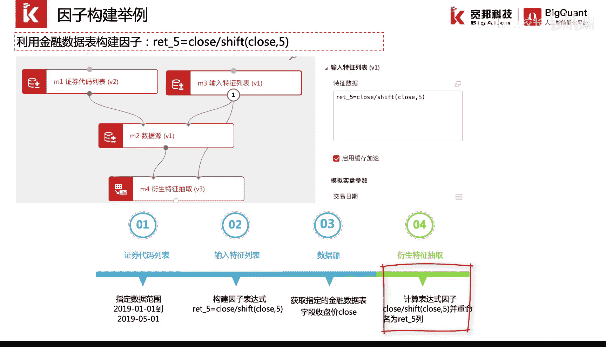
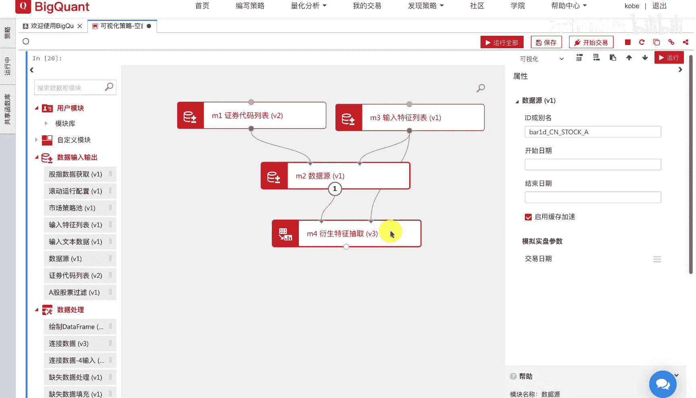
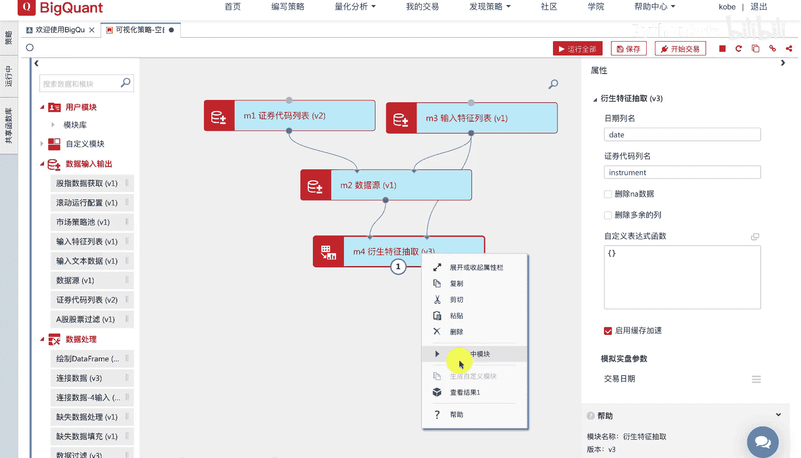
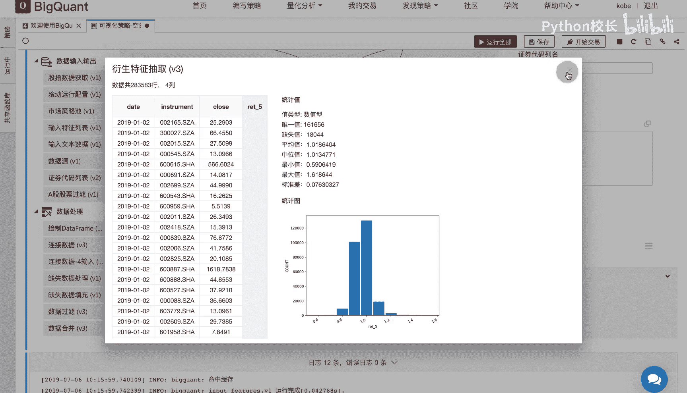

# P26：4.2.1.3-利用表达式引擎构建因子举例2 - 程序大本营 - BV1KL411z7WA

下面我们介绍一下，如何通过微矿的平台的金融数据表来构建因子，首先我们通过中心代码列表指定数据范围，以及我们所需要抽取的股票代码范围，然后我们通过输入特征列表，输入我们所需要抽取的因子表达式。

这里我们输入close除以shift，close表示我们抽取的因子为过去五日收益率因子，我们通过等号连接，并在等号左侧填写right 5，表示我们将右侧的五日收益率因子，重命名为right 5。

通过等号进行重命名，有助于我们将较长因子的表达式进行简写，以便于我们后面的因子调用，然后我们通过数据源模块设置，我们所需要抽取的数据源，表明通过数据模块将收盘价，close从数据表中进行提取。

最后通过衍生特征抽取模块，利用抽取的close列数据进行因子表达式的计算，返回right 5因子的结果。

我们看一下实际的操作案例，首先我们在画布中拖入四个模块并进行连接，紧接着我们设置正确代码列表模块的相应参数，这里我们在股票代码列表中不填入任何信息，表示我们默认获取指定时间范围内的所有股票。

然后我们在输入特征列表中，输入我们所需要的因子表达式，我们通过等号进行因子表达式的别名缩写，然后我们通过数据源模块设置，我们所需要抽取的因子表，表明股票日线行情数据表，bd cn stock a。

我们右键数据源模块，点击运行，选中模块。

然后我们进行结果的查看，可以看到该模块运行后，从数据库中返回，每日我们所选的股票范围的收盘价close列。

然后我们通过衍生特征抽取模块，计算因子表达式。

我们运行该模块，并查看该模块的运行结果，可以看到此时计算的结果以right 5名称返回，我们点击rt 5，可以看到该列的相关统计信息，包括缺失值的数量，唯一值的数量，平均值，最大值。

