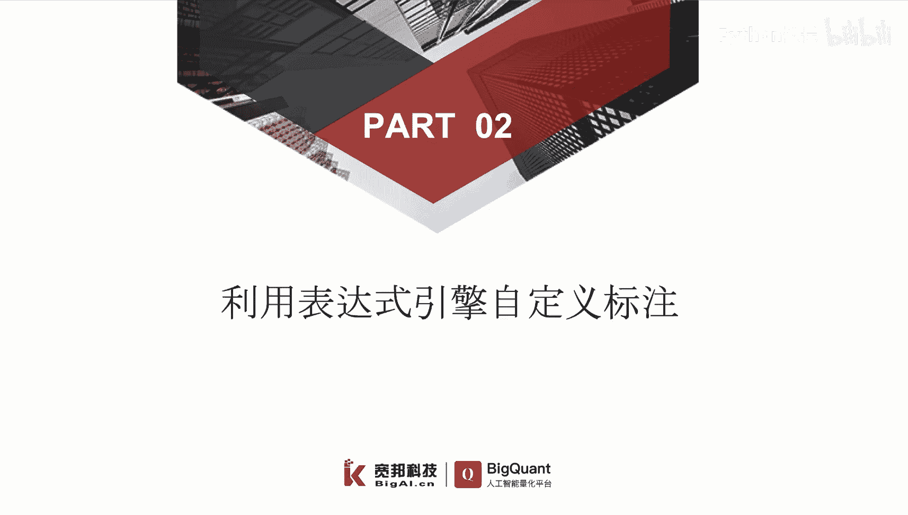
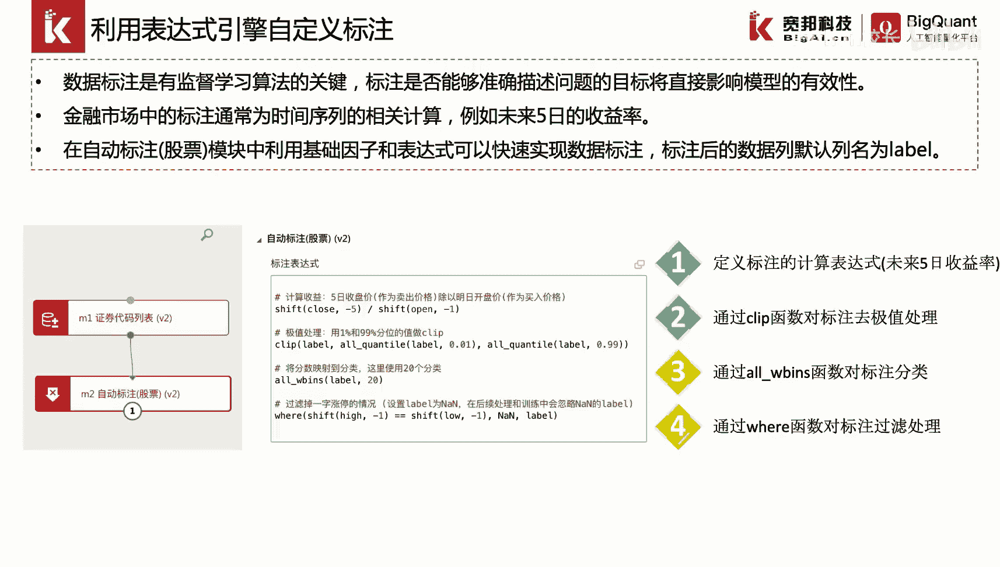
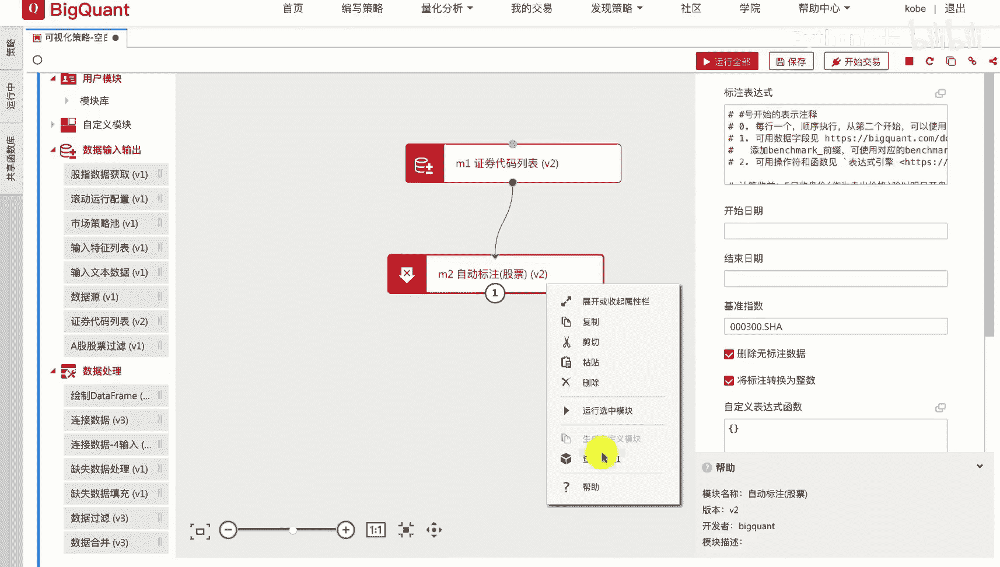
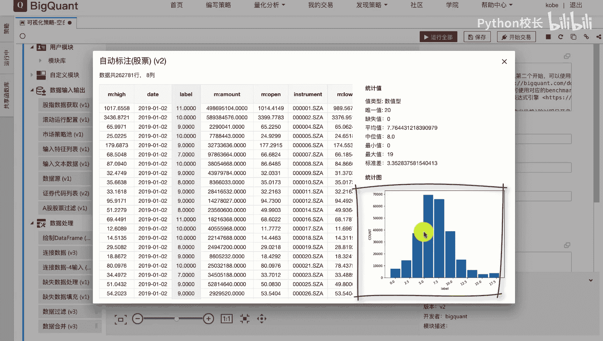
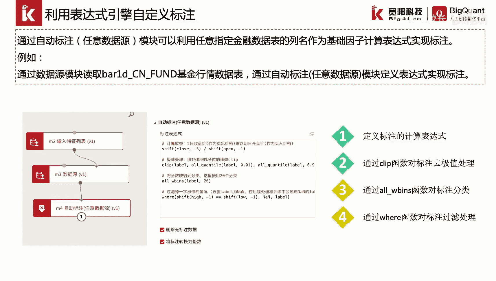
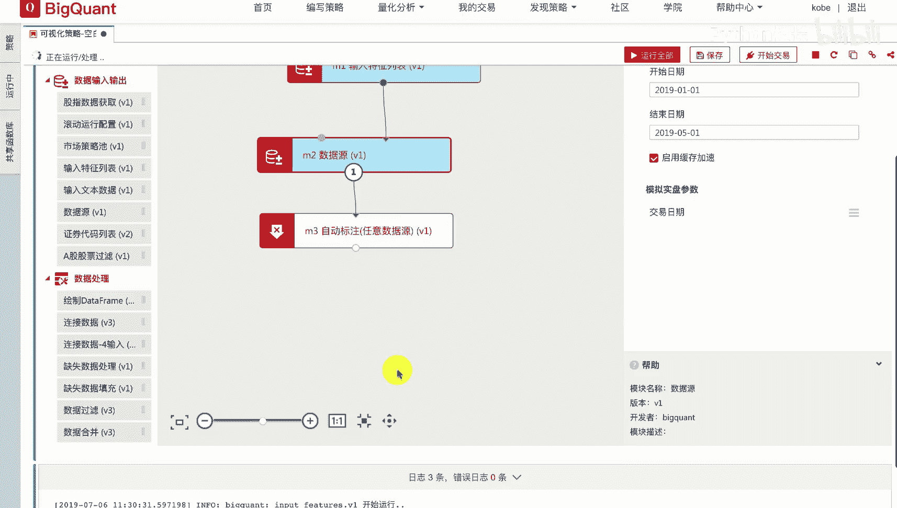
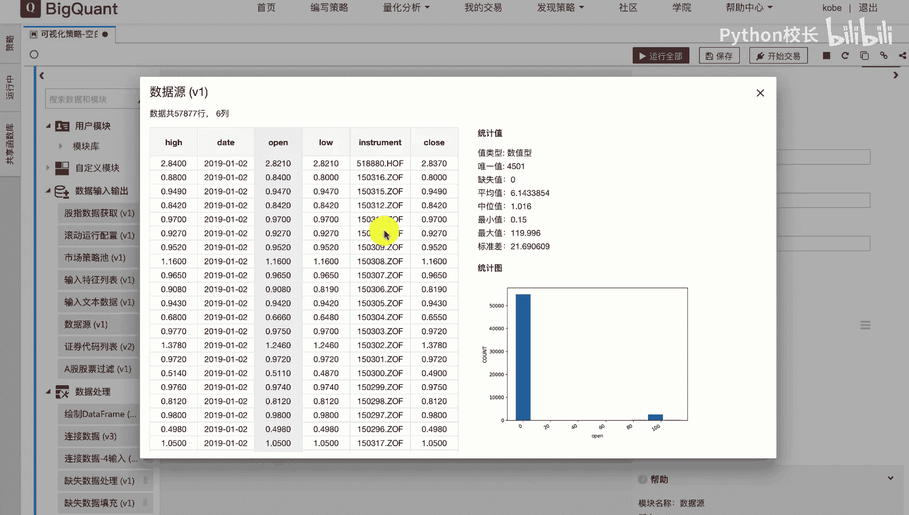
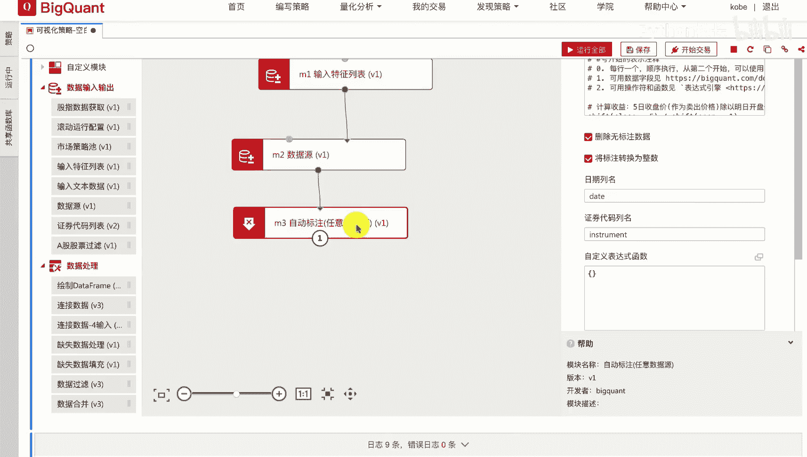
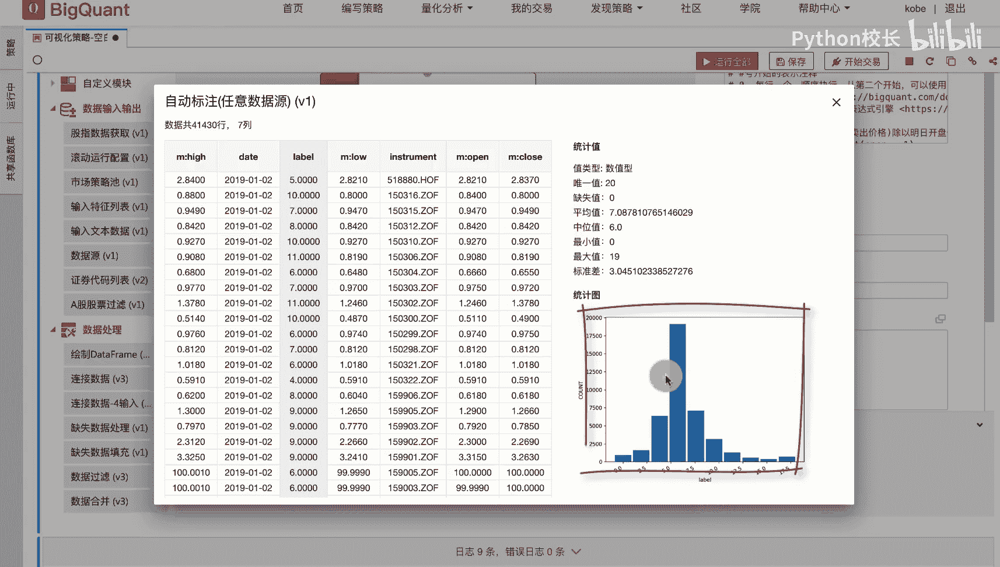

# P27：4.2.2.1-利用表达式引擎自定义标注 - 程序大本营 - BV1KL411z7WA

这一节我们介绍一下，利用表达摄影擎功能进行自定义标注，首先我们介绍一下，平台提供的自动标注股票模块，我们通过连接证券代码列表模块，和自动标注股票模块，可以实现股票数据的快速标注，在自动标注股票模块中。

我们提供了close open等基础的字段进行表达式构建，例如我们构建股票的未来五日收益率，这样一个标注，我们可以通过利用表达式shift close。

服务除以shift open-1来实现计算后的结果，将作为label返回，我们可以对label列进行去极值映射，分类以及过滤处理等相关操作，例如我们通过clip函数对label列进行及时处理。

我们首先通过all countel label，0。01和akl label 0。99，计算label数据列的1%分位数，和99%分位数，然后利用clip函数去除小于1%分位数和。

大于99%分位数的label对应的数据，紧接着我们通过ow beans，将及时处理后的label数据进行映射分类，这里我们分成20个类别，最后我们通过vr函数指定过滤条件。

这里我们通过shift high-1等于shift low-1，这样一个条件，来，将一字涨停或一字跌停的股票的label，改写为难值，其他的股票数据将保持label不变。

我们来看一下具体的操作，首先我们拖入证券代码列表模块和，自动标注股票模块，并进行模块连接，我们在证券代表列表模块中，指定我们要标注的起止时间，2019年1月一日到2019年5月一日，以及股票范围。

这里默认为全市场股票，然后我们在自动标注股票模块中，定义我们所需要标注的标注表达式，这里为未来五日时收益率，我们通过运行自动标注模块，并点击查看结果。

可以看到标注后的未来50收益率，经过离散化处理后记录在label列中，由于我们进行离散化，可以从右侧的统计值中看出，label列的最小值为零，最大值为19，并可以从下面的统计图中看到。

label列的数据统计分布。

除了自动标注股票模块外，平台还提供了自动标注任意数据源模块，可以利用任意指定的金融数据表的列名，作为基数因子来构建标注表达式，例如我们通过数据源模块，读取bd cn放的基金行情数据表。

我们通过输入特征列表模块指定，从该表中获取基础数据字段，close open high和low，然后我们通过自动标注任意数据源模块，进行标注表达式的构建以及标注的处理函数，编写。

这里的表达式构建以及label列的函数处理，与自动标注股票模块用法相类似。

我们看一下具体的案例，首先我们拖入输入特征列表模块，数据源模块和自动标注任意数据源模块，我们点击输入特征列表模块，在输入特征列表模块中，我们指定从数据表中抽取的数据表字段。

这里我们选择抽取close open low和high 4个字段，然后在数据源模块中，我们指定索要抽取的数据表，表明bd cn放的以及所要抽取的数据时间范围，2019年1月一日到2019年05月一日。

我们运行数据源模块。

并查看结果，可以看到数据模块返回的结果中，包含了每日每只基金的高开低收，四个价格。

紧接着我们运行自动标注模块，可以看到在该模块中，我们定义标注为未来五日的收益率，并进行了极值映射分类和过滤等条件处理，我们运行该模块。

我们点击查看结果，可以看到我们计算的标注值以label列进行返回，同样从右侧的统计值中，我们可以看出label列经过了离散化处理，最小值为零，最大值为19。

