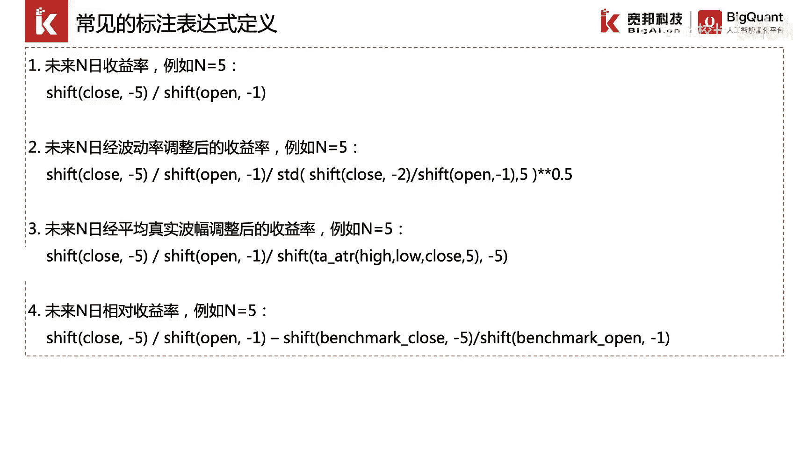
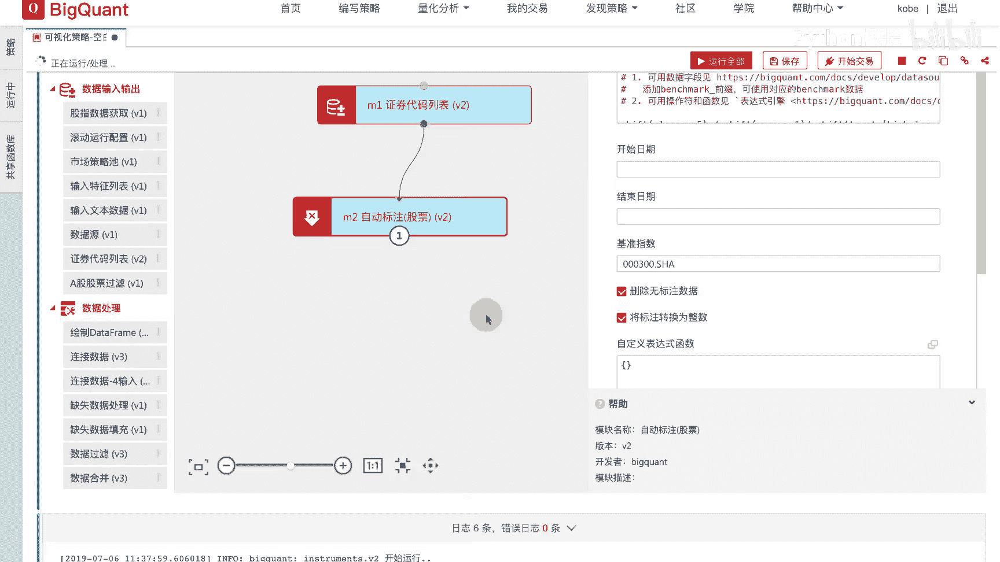
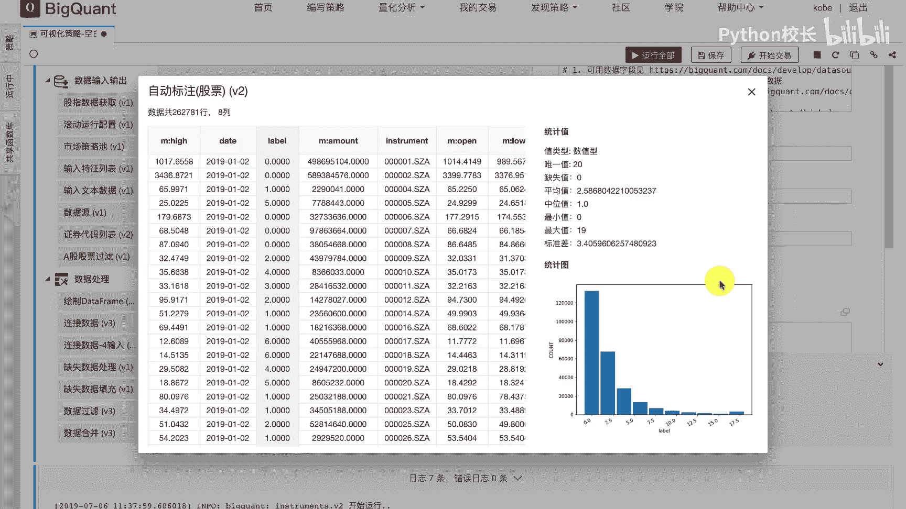
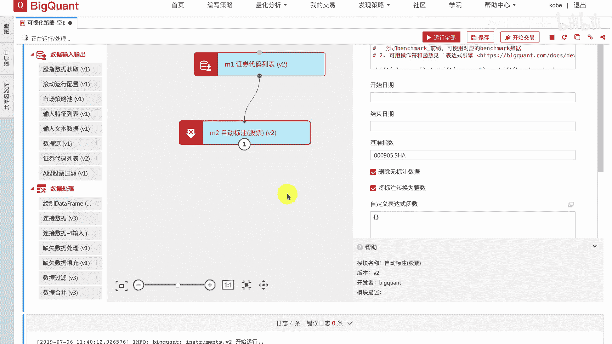
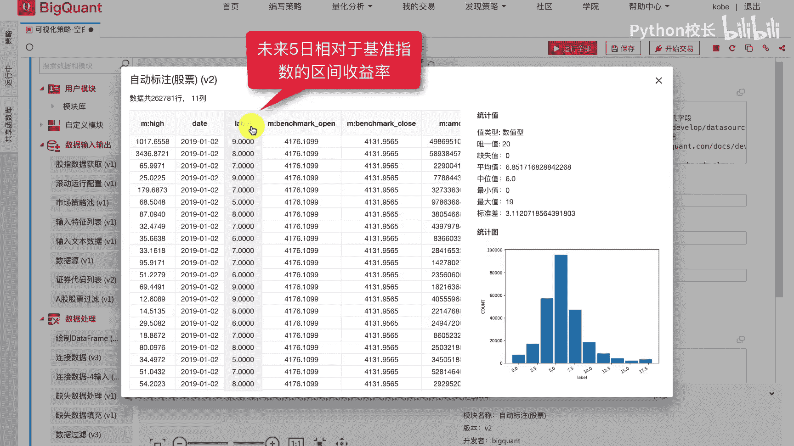

# P28：4.2.2.2-常见的标注表达式定义 - 程序大本营 - BV1KL411z7WA

最后我们来看一下常见的标注表达式定义方法，我们已经介绍了，如果标注未来n日收益率，我们可以用shift clothes fn除以shift open，-1来实现，如果我们想标注未来n日。

经波动率调整后的收益率，我们可以通过sdd，计算对应的标准差函数来实现，即我们可以首先计算未来n日的收益率，再除以未来五日每日收益率的标准差，如果我们想计算未来n日经平均真实波幅，调整后的收益率。

我们可以利用平台提供的t a a t r函数，计算真实波幅，此外如果我们想计算未来n日的相对收益率，我们可以在自定义标注模块中指定benchmark，benchmark代表我们所指定的标注基准。

我们可以通过benchmark clothes和benchmark open，来获取基准指数的收盘价和开盘价，同样可以利用benchmark clothes和benchmark open。

这两个基础字段进行因子表达式的构建，这里我们来演示一下自定义标注的其他用法，我们将自动标注模块中的未来五日收益率，这样一个因子表达式，修改为经真实波幅调整后的未来50收益率，我们点击运行模块。

我们可以查看结果，此时label返回的是经真实波幅调整后的，未来50收益率，离散化的结果，可以看到右侧的统计图分布有所变化。

我们可以在自动标注股票模块的属性栏中看到，基准指数，我们可以通过设置更换基准指数来获取benchmark，clothes以及benchmark open字段，这里我们计算的基准指数定为000905点。

s h a及中证500指数，然后我们将标注改写为未来五日的相对收益率，我们运行自动标注模块。

我们查看运行后的计算结果，此时label返回的是未来五日。

