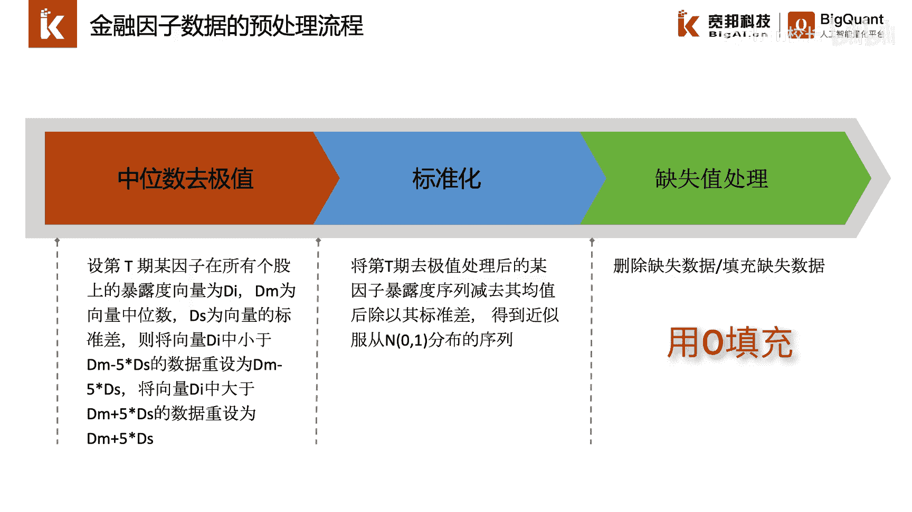

# P29：4.2.3.1-金融因子预处理的常用流程 - 程序大本营 - BV1KL411z7WA

这一节我们介绍一下因子预处理过程中，常用的功能模块，首先我们介绍一下金融因子数据的预处理流程，金融因子数据通常为时间序列数据，我们在处理时间序列数据时，通常会对每个时间截面上的数据进行中位数。

取极值处理，标准化处理和缺失值处理，处理的流程呢大致如下，首先我们获取某个时间截面上的横截面数据，我们计算该截面数据上的中位数，并计算该截面所有数据与中位数之间的偏离，我们计算偏离数据的标准差。

我们将异常极值定义为距离中位数，偏离值超过标准差一定范围的数据，例如如果横截面上的某个数据，距离中位数的偏差大于了偏离值的五倍标准差，我们则将其定义为异常数据或者极值，我们对于这些横截面上的异常数据。

可以进行删除处理，或用五倍标准差的极大或极小值进行填充，我们将截面的数据减去截面数据的平均值，并除以截面数据的标准差，来得到一个近似服从均值为零，标准差为一的正态分布。

横截面数据经过标准化处理后的截面数据，各因子均近似服从均值为零，标准差为一的正态分布，这样使得不同因子之间具有可比性，同时经过标准化处理后的截面数据，更有利于后续的机器学习模型构建，与机器模型的训练。

最后我们将标准化后的数据进行缺失值填充，或缺失值删除，由于标准化后的数据均值近似为零。

