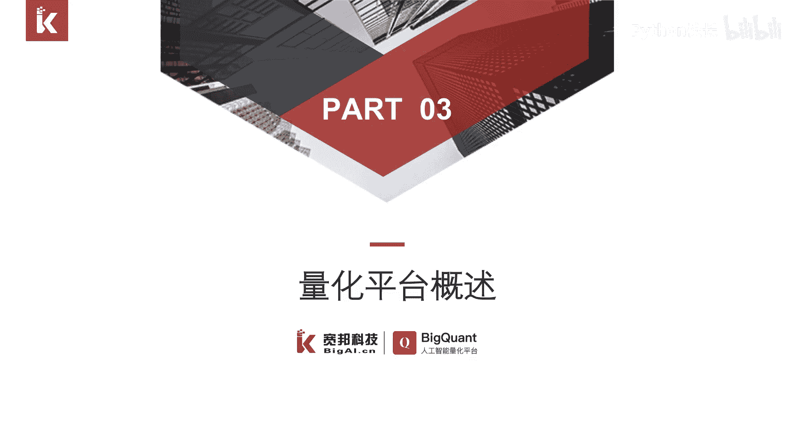
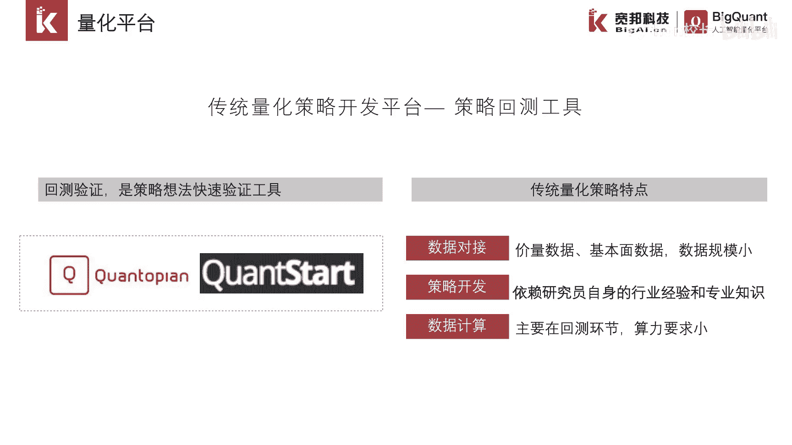
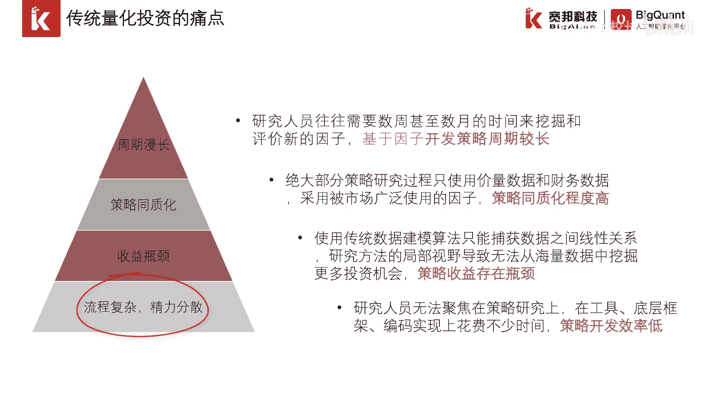
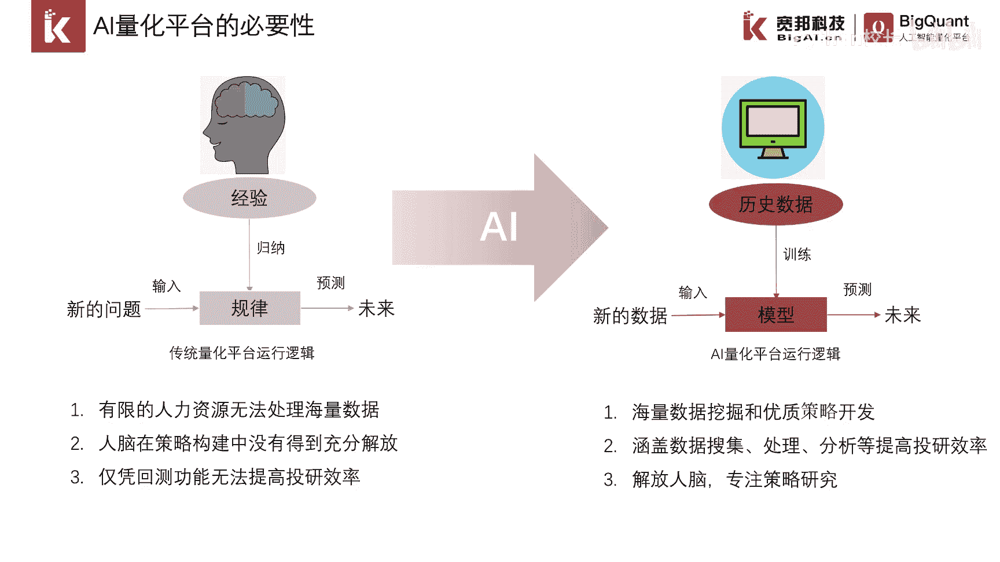

# P3：1.1.3 量化平台概述 - 程序大本营 - BV1KL411z7WA

大家好，这一小节我们介绍量化平台，量化平台指的是传统量化策略进行开发的平台，是策略回撤的工具，量化策略一般分为传统量化策略和ai量化策略，量化平台的主要目的是进行回车验证，是彻底的想法。

快速原则的一个工具，目前国内的量化平台千篇一律，count start，这两个国外的鼻祖的量化平台，我们来看一看传统量化策略的特点，从使用数据上来看，传统量化策略一般是使用行情数据。

财务数据基本面是数据，数据使用的规模并不大，然后从策略开发的模式来看，传统量化策略呢一般是研究员，交易员以及依赖于它本身的行业经验，专业背景开发出来的策略，对人依赖很高，在数据计算上来看。

传统量化策略它的计算主要体现在回测环节。

对计算资源要求不高，传统量化投资面临如下几个痛点，第一个痛点是周期漫长，他指的是策略从生产回测验证到最终上线，需要较长的一个验证时间，第二个痛点是策略同质化，因为量化策略它使用相同的数据，相同的因子。

同质化的程度比较高，第三个痛点收益面临瓶颈，因为传统量化策略，它捕捉的是因子和收益之间的线性关系，是一种非常简单的一个模型，所以说存在收益的一个瓶颈，第四个痛点是流程复杂，精力分散。

因为研究人员开发一个策略，需要编辑大量的代码，精力呢主要耗费在工具编码上，开发效率较低。

我们把量化平台分为，传统量化平台和ai量化平台，传统量化平台和ai量化平台，它们的运行逻辑本质上是一致的，传统量化平台呢是研究员需要归纳经验，得到规律再加以应用，ai量化平台是从历史数据中进行训练。

得到模型再加以应用，两者最大的差异是前者以人为主导，依赖于交易员，研究员他们的背景知识和行业经验，后者是以机器为主的，通过算法自动进行数据挖掘，因此两者在效率和效果上有质的差异。

a a a量化平台是未来进行量化投资。

