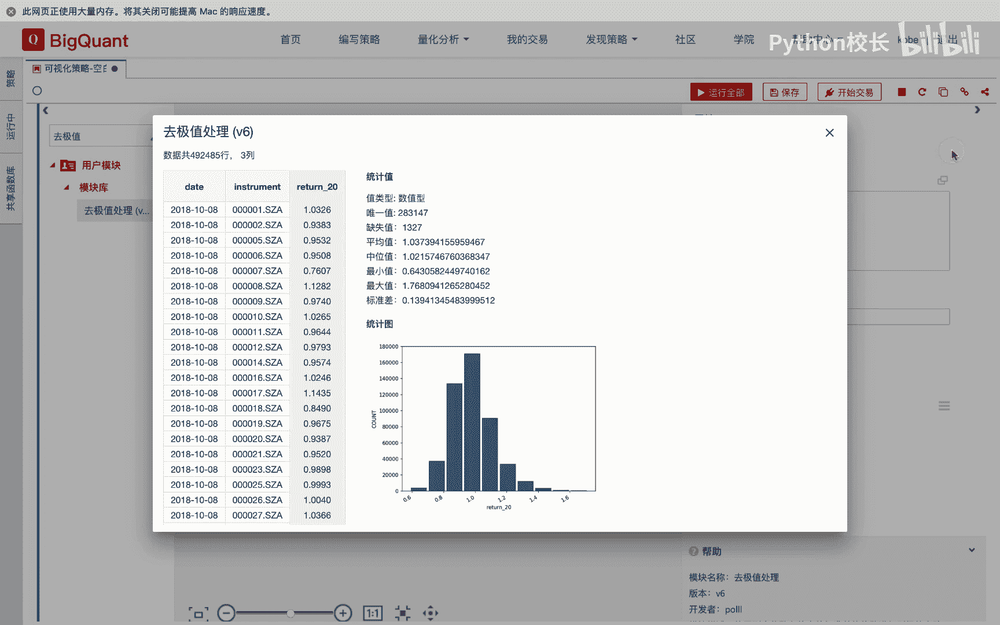

# P30：4.2.3.2-中位数去极值 - 程序大本营 - BV1KL411z7WA

对于矿的平台提供了大量的数据处理模块，来辅助我们进行截面数据的数据处理，例如我们可以通过去及时处理模块，来实现中位数极值处理，我们将抽取的因子数据，连接到去极值处理模块中，通过输入特征列表模块。

或通过输入指定的去及时处理的列，来指定我们需要进行及时处理的因子，我们通过指定标准差的倍数可以定义极值，然后去及时处理模块，就可以按照日期进行分组，并进行截面数据的中位数极值处理。

我们来看一下实际的操作，我们在策略画布中拖入证券代码列表模块，输入特征列表模块和基础特征抽取模块，我们在左侧的模块导航栏中输入去极值，查找到去极值处理模块，并拖拽到画布中。

我们设置证券代码列表模块的相关参数，我们获取2019年1月一日，到2019年5月一日的金融数据，指定的股票范围为全市场，然后我们在输入特征列表中输入return 20，表示我们要抽取过去20天收益率。

这个因子我们通过基础特征抽取模块，抽取到该因子的数据，我们连接基础特征抽取模块到去极值处理模块，作为及时处理模块的输入数据，然后通过连接输入特征列表模块，到去及时处理模块的另一个输入端。

来指定我们需要进行及时处理的列，此处也可以再去极值处理的指定列参数，手动填入我们需要及时处理的列名，例如我们删除输入特征列表的输入，然后在指定列中添入与turn 20，这个因子列名。

然后我们指定极值的定义，即指定标准差的倍数，我们运行去及时处理模块，运行后我们查看基础的抽取数据，可以看到我们从因子库中抽取的，过去20日收益率，该因子的中位数为1。02，最大值为5。81。

我们再查看一下，经过截肢处理后，该因子return 20对应的最大值为1。76，可以看到，经过机制处理后的因子数据统计分布图，长尾效应有所减弱。

