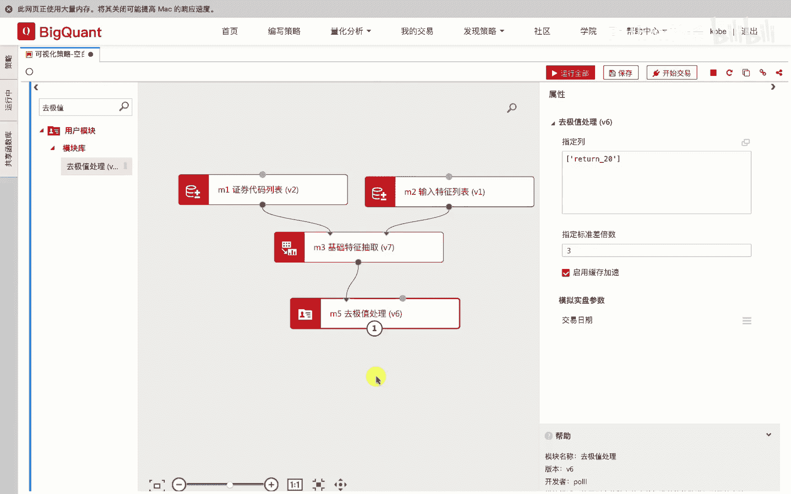
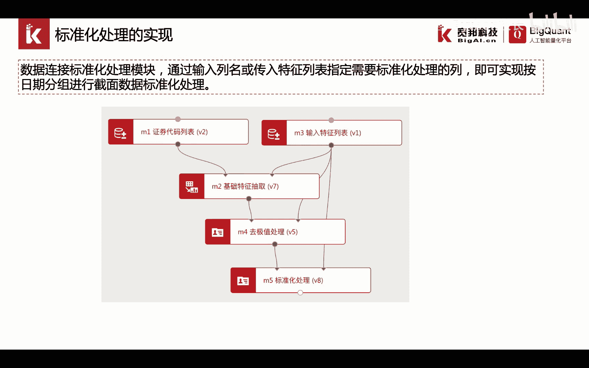
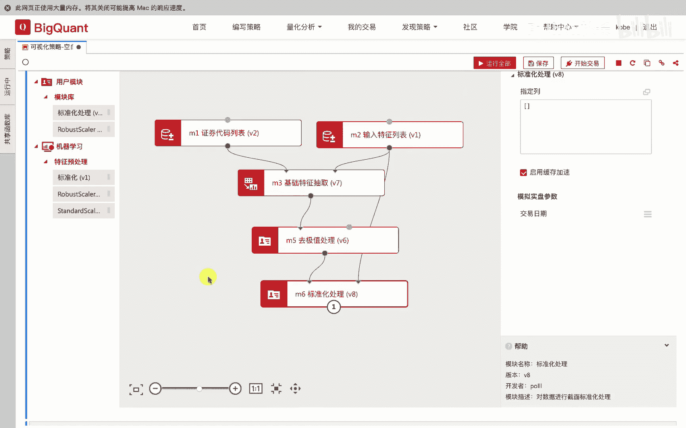
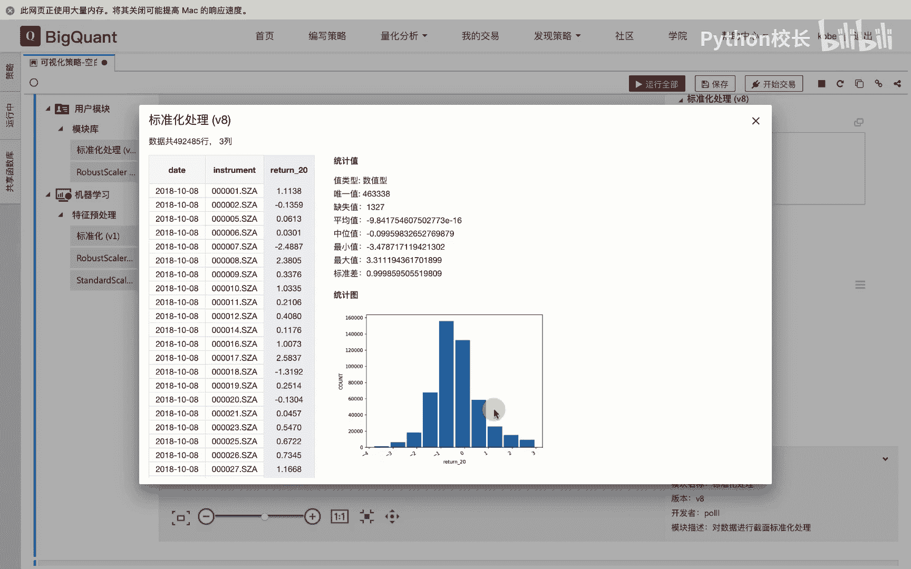

# P31：4.2.3.3-标准化处理 - 程序大本营 - BV1KL411z7WA

我们将去及时处理后的数据，连接到标准化处理模块，通过输入列名或传入特征列表，来指定需要进行截面标准化处理的列，既可以实现按照日期分组，进行截面数据的标准化处理。

在实际操作中，我们通过左侧的模块搜索列表输入标准化，我们拖入标准化处理模块，我们将去及时处理模块的输出数据，连接给标准化处理模块的输入节点，我们在标准化处理模块中，可以通过指定列的方式。

或连接输入特征列表的方式，来指定我们所需要进行标准化处理的因子，我们运行标准化处理模块。

模块运行后，我们点击查看结果，我们点击return 20，该列数据，可以看到，该列数据对应的统计值平均值接近为零，标准差接近为一，可以看到。

