# P32：4.2.3.4-缺失值处理 - 程序大本营 - BV1KL411z7WA

我们对截面数据进行标准化处理后，可以进行缺失数据的相关处理，被矿同平台提供了多多种缺失数据处理模块，首先我们介绍缺失数据的前后向填充模块，我们将标准化后的数据连接到缺失值填充模块。

通过输入列名或传入特征列表，指定所需要进行缺失值填充的列，然后我们可以指定分组的列名，在金融数据中，我们经常按照股票代码进行数据分组，然后再按照时间轴对数据进行填充处理。

最后我们可以指定我们填充数据的方式，包括向下填充，即用上方的数据来填充后面的缺失值，或者向上填充，即用下方的数据填充上方的缺失值，或者选择向下向上填充，表示先向下填充缺失值，然后再向上填充缺失值。

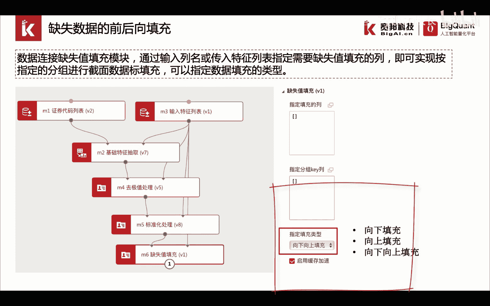

我们看一下实际的操作，首先从左侧的模型模块导航栏中，拖出缺失值填充模块，我们将标准化处理的输出，连接到缺失值填充模块的输入，然后我们通过连接输入特征列表，到缺失值填充的另一个输入节点。

来指定我们所要进行缺失值填充的列名，然后我们指定我们数据分组的列名为instrument，表示我们首先对数据进行按照股票代码分组，然后再对各组的时间序列数据进行数据填充。

我们指定我们的数据填充类型为向下向上填充，我们运行该模块，我们首先查看标准化处理后的数据。

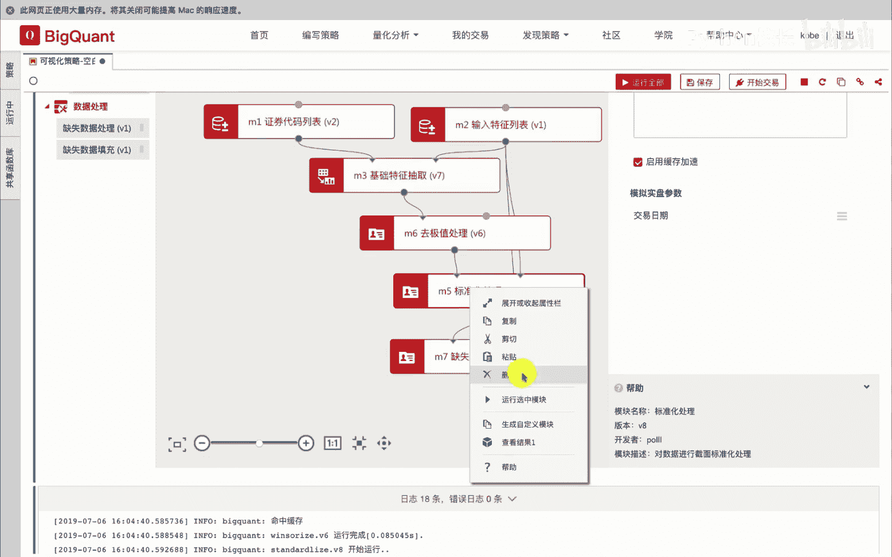

我们可以看到数据的总行数，以及缺失值的总行数。

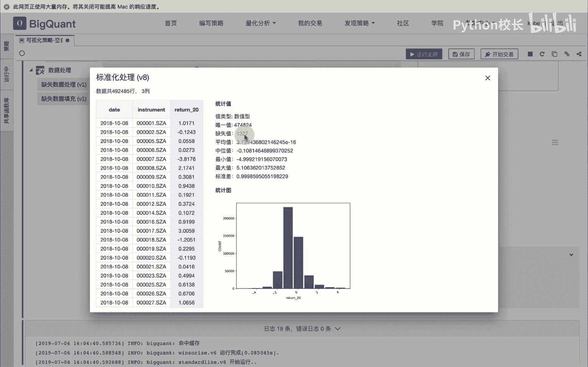

我们在查看缺失值填充后的数据结果。

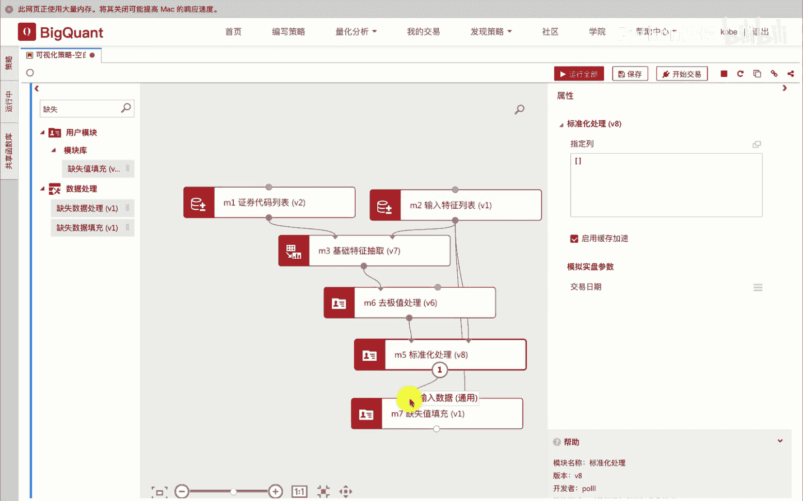

我们可以看到数据的总行数并没有发生变化，而缺失值的函数变成了零，也就是说我们使用上方，也就是说我们使用上方或下方的数据，对缺失值进行了填充。

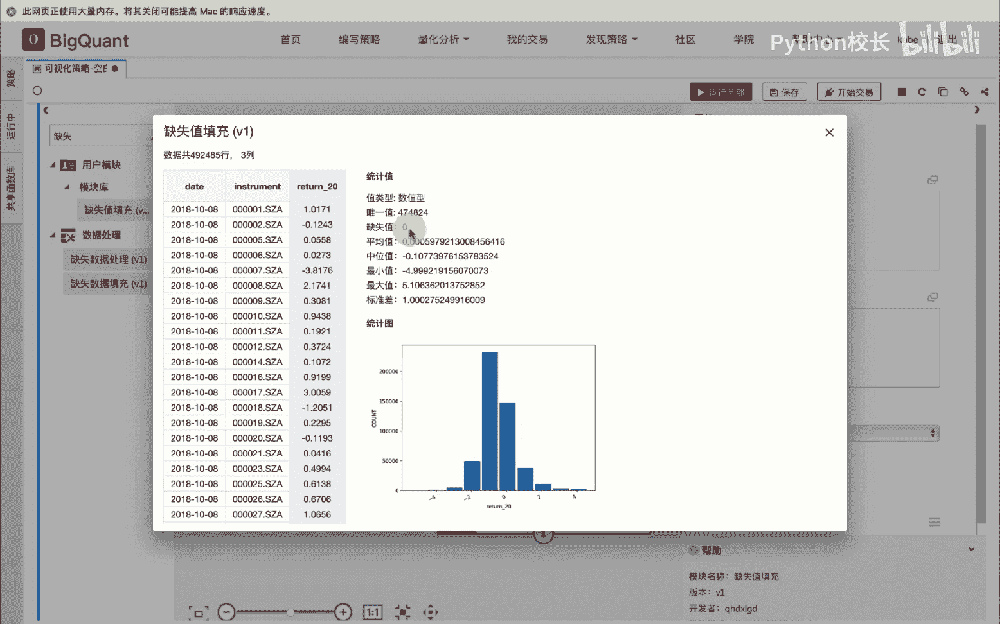

我们还可以通过缺失数据处理模块，对含有缺失值的行进行删除，也可以通过缺失数据填充模块，对含有难值的位置进行指定的数据填充。

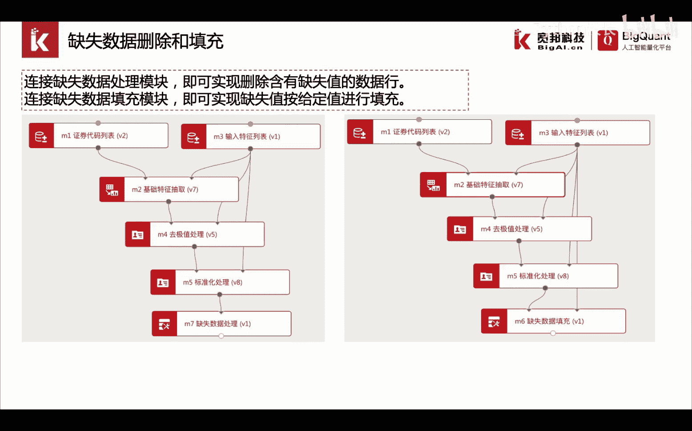

我们来看一下实际的操作，首先从左侧的模块导航栏中，我们找到缺失数据处理模块，并拖入到画布中，我们连接到标准化处理模块，我们运行缺失数据处理模块，我们查看缺失数据处理前，标准化处理的数据的总行数。

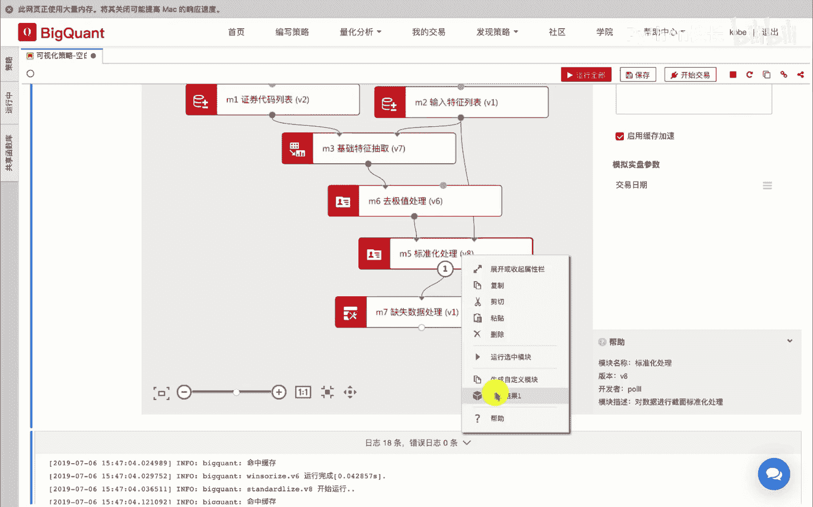

我们可以看到数据一共是49万，2485号，其中包含缺失值1327个。

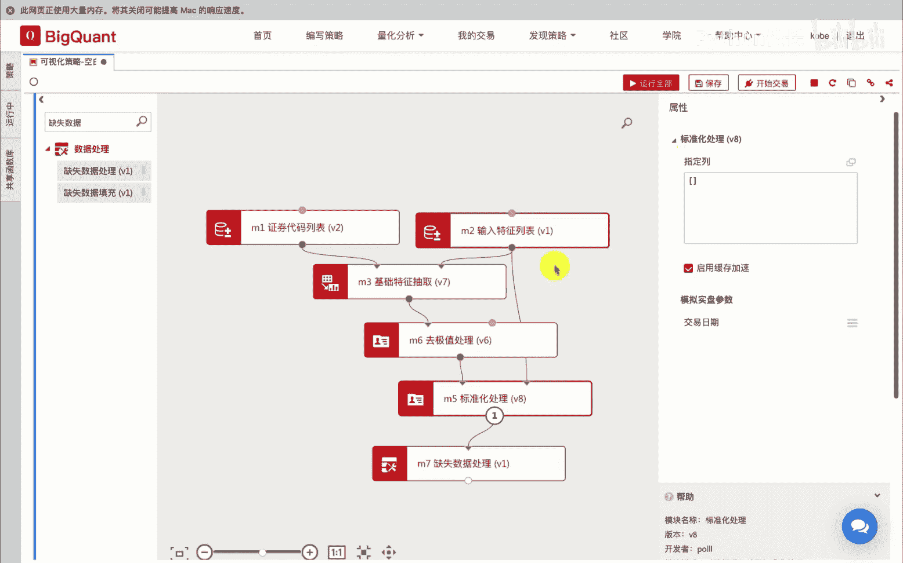

我们再次查看，经过缺失数据处理后的总行数变成了49万，1158行，此时还有缺失值为零，也就是说我们删除了相应含有缺失数据的行。

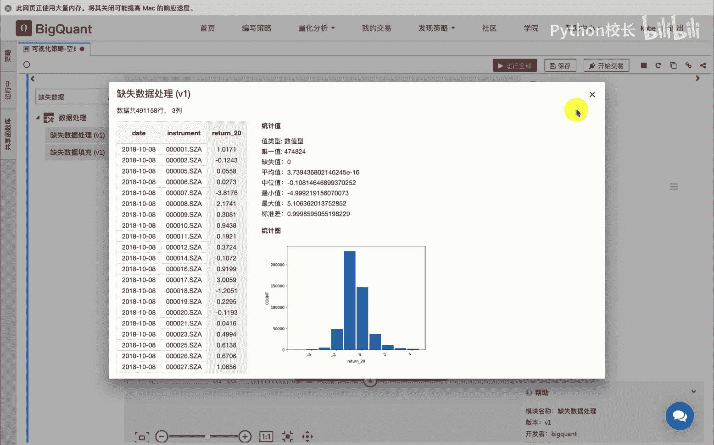

然后我们再拖入缺失数据填充模块，我们进行模块连接，并指定需要数据填充的列，这里我们填入缺失数据填充的值，我们填入零运行模块。

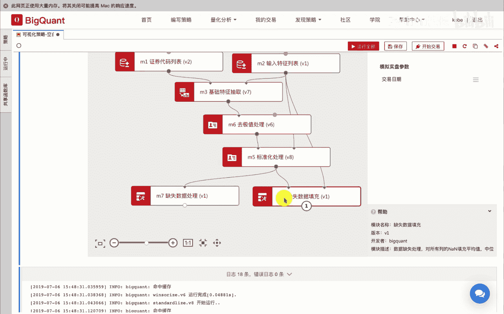

我们查看运行结果，可以看到经过缺失数据填充后，数据的总行数没有发生变化，但缺失值变成零。

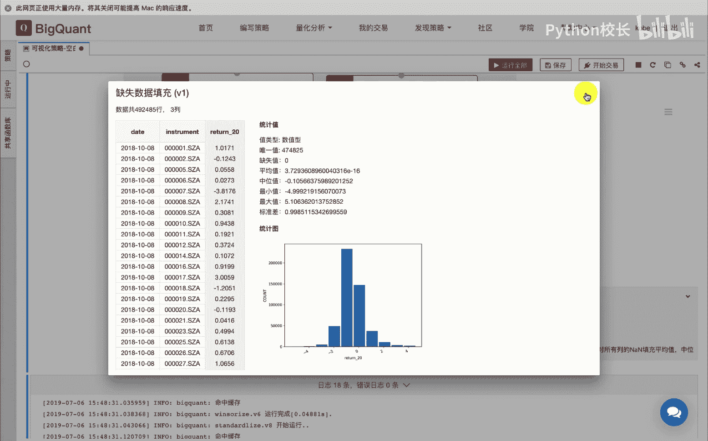