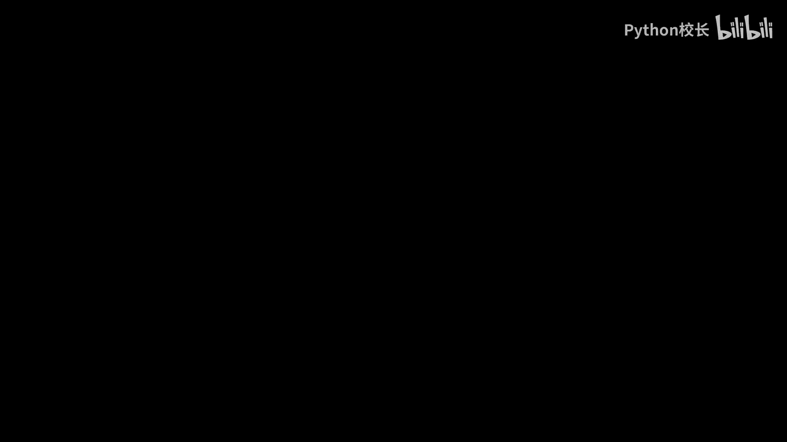
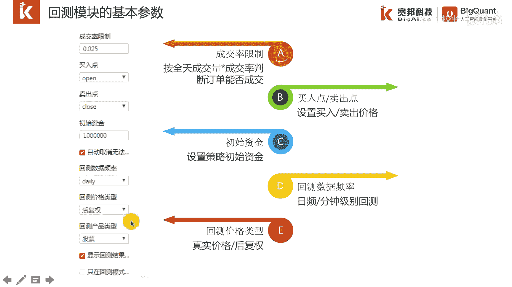

# P33：5.1交易回测模块介绍 - 程序大本营 - BV1KL411z7WA

大家好，今天我们这一章进入传统量化策略构建的介绍，之所以称为传统量化策略，主要是为了与ai量化策略相区别，我们平时所称的趋势策略，多因子策略，行业轮动策略，套利策略都在磁盘策略。

虽然咱们这次培训的主题是ai量化策略，但这并不矛盾，ai量化策略信号是由模型预测得出，但是信号如何转换成订单，还是离不开交易引擎，因此本篇我们专门介绍传统量化策略的构建，本篇主要分为四节。

第一节是交易回测模块的介绍，其实就是交易引擎的介绍，第二部分是传统量化策略的编写，第三部分是回测结果的解读，以及最后策略编写常用功能的介绍，首先我们进入第一节交易回测模块的介绍。

交易回测模块是量化策略开发中的核心模块，其主要功能可以总结为两个字回撤，甚至业内将回撤作为量化交易策略，最为突出的一个特征，如果一个策略不能进行回撤，那么他算不上量化交易的策略，交易回测引擎模块。

首先根据策略的逻辑产生交易信号，然后在历史的数据中，根据交易信号产生下单指令，并模拟撮合成交，最后展示策略的历史收益率，曲线和绩效评估指标，通过交易引擎的回撤，我们可以对策略进行验证。

判断其是否具备盈利能力，接下来我们看一下回撤是怎样的一个运行机制，目前在撤退回撤中，应用最广泛的就是事件驱动机制，该机制之所以被普遍采用，这是由于其符合了实际教育的真实情形。

金融领域的行情数据是非常标准的，往往拥有高开低收四个价格，这样的数据被称为k线数据，事件驱动机制，顾名思义，就是把每一个k线当做一个事件，按照时间发生的先后顺序，从左到右依次运行。

新产生一条k线数据的时候，我们把它当作一个新的事件，新事件发生后即产生一条新的k线数据，该推线数据会触发策略主程序的运行，如果策略买卖逻辑产生了订单，那么该笔订单就会按照k线的价格进行，模拟撮合成交。

从这幅图我们可以看出，一共有26个k线代表了26事件，从左到右，随着每个k线的产生，会依次触发策略主程序的运行，一个完整的策略回测流程，通常包含以下几个部分，以股票市场为例。

首先我们要确定回撤的股票池和起止时间，然后设置手续费和一些策略参数，第三步就是编写策略买卖逻辑，第四步就是在历史数据中依此出发策略逻辑，如果有买卖订单就模拟撮合，最后一步就是展示收益率曲线和绩效结果。

以便判断策略的盈利能力，这几个流程我们都封装在一个单独的模块里，train的模块用户可以快速的开发一个策略，运行完成就会看到右侧这个收益率曲线，以及收益率夏普比率，最大回撤等常见的绩效指标。

为保证交易引擎能够支持，全部类型的量化交易策略回测模块，我们进行了很好的封装，主要由这几部分组成，首先是基本方法，然后是交易对象，最后是基本参数，这几个部分呢我们会在后面的例子中。

通过实际的例子进行详细的阐述，所以说这里我们就不赘述了，基本方法表示，不同的时间点会触发不同的事件函数，比如策略在第一根k线会触发初始化盈利数，大意思，函数在后面的每根k线会触发主逻辑函数。

ha data，初始化函数和主逻辑函数是一个策略，最重要的两个函数，也是一个策略必须具备的两个函数，数据准备函数和盘前处理函数是可选项，一个策略不一定要有这两个事件函数，回程模块有多个对象。

比如标的对象，订单对象，交易账户对象和持仓对象，每个对象都有非常丰富的属性，比如交易账户对象，有账户的现金，初始资金，总资产，持仓市值等属性，最后一部分是回测模块的基本参数设置。

为保证策略的回撤逼近现实的真实情形，回撤包含了一些基本参数，主要有成交率的限制，买入点，卖出点。

