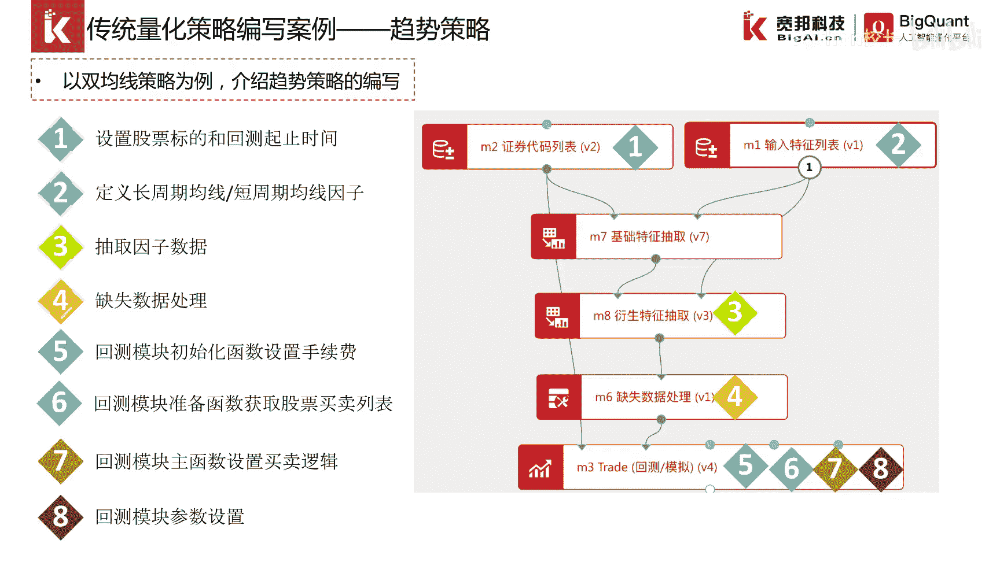
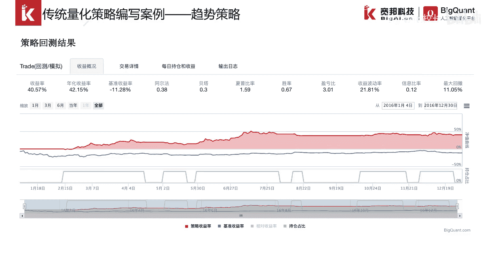
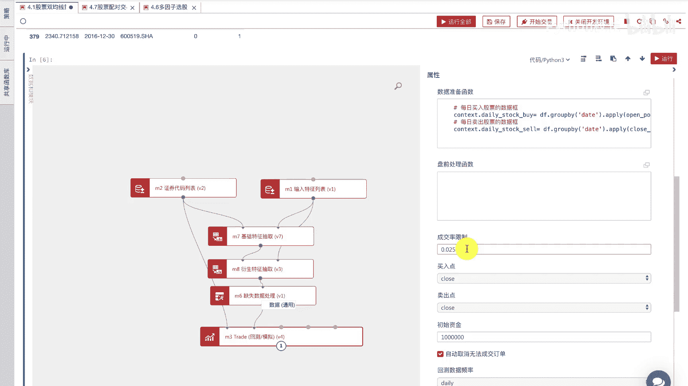
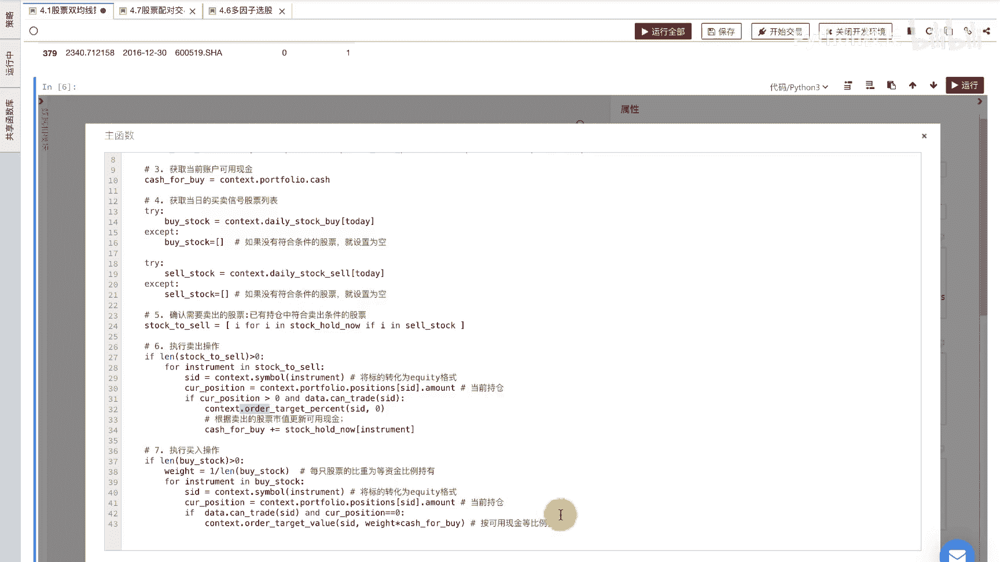

# P34：5.2.1 双均线策略 - 程序大本营 - BV1KL411z7WA

大家好，接着我们进行第二小节课程的一个介绍，第二小节课程的一个主题，是传统量化策略的编写，我们先以双均线策略为例。

双均线策略本质上是一种趋势策略，趋势策略是传统量化策略的代表，这里我们这个双均线策略一共可以拆分为八部，涉及到六个模块，我们后面会给大家详细的做演示。

怎么开发这么一个策略，那现在我们先快速的过一下，首先是我们通过证券代码列表，快速的设置股票的标的和回车的起始时间，可以看到这里的开始时间是15年1月号，结束时间是17年1月1号。

我们选择的股票代码是600010，这只在上海证券交易所上市的一只股票，然后我们通过输入特征列表模块，构建我们的衍生指标，这个衍生指标呢是买入的条件和卖出的条件，从这个表达式就可以看得出来。

是五日均线上穿十日均线的时候，买入条件成立，五日均线下穿十日均线的时候，卖出条件成立，然后我们通过基础特征抽取模块，衍生特征抽取模块缺失数据处理，将因子抽取出来，并进行简单的数据处理。

最后我们把生成的这个数据传入trade，回车模拟模块，这个模块也是策略编写过程中，最重要的一个模块，点击右键属性可以看到它包含主函数，数据准备函数，初始化函数，在这几个事件函数里面。

我们就可以编写策略逻辑，在初始化函数里面，我们进行手续费的一个设置，这里的手续费就是买入是万分之三，卖出是1。3‰，如果一笔交易不足五元，手续费就按五元收取，在初始化函数里面。

我们可以看到有一个叫做contest这样的一个参数，这个参数在后面几个事件函数里面，也是作为一个必填的一个参数，context是一个上下文交换的一个全局参数，可以理解为是账户的一个概念。

我们可以在这个账户的概念之下，通过set commission这个方法来设置，这个账户交易的一个手续费，在数据准备函数里面，它也有一个context这个全局变量，这个变量里面呢。

我们可以把外部的一个数据传进来，传进来是通过m。trade那个模块的，第二个数据源传入，传入了以后呢，我们就可以进行一些数据处理，并且得出一些其他的一些指标，比如说这个账户下每天应该买入哪些股票。

这个账户下每天应该卖出哪些股票，这是策略逻辑的一个主函数，在这个主函数里面，我们可以看到这个策略的一些买卖的一些逻辑，该函数有两个参数，一个是contest，一个是data。

这个data呢其实就是k线数据，因为我们是事件驱动的机制嘛，这个事件其实就是这个k线数据，我们在这个函数里面可以获取到当天的日期，以及当天的持仓股票，当天的一个账户的一个现金。

然后通过这样的一些代码的一些处理，我们就可以得到当天应该买入哪些股票，当天应该卖出哪些股票，然后我们接着在策略组函数里面，对当天应该卖出的股票，对它进行一个卖出。

卖出是通过order这个下单接口来实现的，order，它其实patient的含义就是，让该资股票的成交以后，它的市值为零，所以说这就是一个卖出全部股票的，这么一个逻辑。

下面是执行买入的操作价格设有多只股票，并且能够等权重买入，所以说我们先计算出账户现金，然后计算出每只股票应该买入多少，再通过order tt volume来实现按可用现金等比例买入，这样的一个逻辑。

最后一部分呢是m。k的这个模块，它的一些回测参数的一些设置，比如说成交率限制的一个设置，买入时间的一个限制，卖出时间的一个限制，账户初始资金的一个设置等等等等，这是策略的一个回车，结果回收完成了以后。

我们可以看到收益率曲线，基准收益率曲线以及持仓占比，以及相应的一些评估策略，常用的一些指标主要是包括收益率的一些数据，波动率的一些数据，相互比率和信息比率等，数据好的。

大致介绍一下双均线策略的一个基本流程，那现在我们去平台上演示一下。

这是我们对矿的平台策略研究界面，大家可以看到在这个主体部分，它其实是一个画布，我们策略开发模式是一个一个模块堆积起来的，然后类似于连线搭积木的这种方式，这种模块化可视化的策略编辑模式。

可以大大降低用户编写策略的一个门槛，然后要用到哪些模块，我们可以直接在这边进行一个输入和搜索，比如说我们要用到正确大门列表模块，我们就可以把它拖进来，拖进来了以后进行一个年限的一个操作，好的。

如果要删除这个模块，我们直接删除这个我们可以收起来，每一个模块这个地方可以看得到它是一个输入，它需要连接证券代码列表，于是我们就这样连线连起来，连起来了以后呢，每一个模块都可以运行。

看它的一个运行的结果，比如我们看一下m8 模块的m8 模块，右键运行选中的模块，这时候我们可以从日志看到运行完成，运行完成了以后，我们可以在上面插入一个cell单元，然后看一下m8 点模块。

它的一个输出，通过这个输出，我们看到最后五条数据，这两个因子by count型和cl condition，其中有一个唯一，就说明，这个股票在这个时间点，应该是属于空投的一个型号。

然后我们得到这个数据以后，可以进行一个缺失值处理，处理了以后再把它传入这个去的回撤这个模块，这个模块其实就是交易引擎，这个引擎我们可以右键看一下它的属性，或者这边展开展开了以后。

可以看得到它有初始化函数，主函数，数据准备函数，以及相应的一些回测参数的一些设置，比如说成交比例限制买入的一个时间点，卖出的一个时间点，成交比率限制，指的是当天股票的模拟撮合的成交量。

要根据当天股票的一个实际的一个，成交量的百分比来进行，这样的话就可以一定程度上控制冲击成本。

每一个函数我们都可以点进去修改编辑代码，这是初始化函数，我们设置设置手续费，然后在这个主逻辑函数里面，我们我们的只要引擎会从上到下依次运行，每一次运行的时候是代表某一个时间点，然后就是当天的一个日期。

这是目前的持仓的一个股票和市值，这是可用的一个现金，以及我们可以从外部context账户传入的数据，计算当时应该买入哪些股票，卖出哪些股票，最后就是对买入的股票和卖出的股票，进行一个下单的一个操作。

下单都是通过order相关的一些接口，这些接口的文档，大家都可以参考这里的帮助文档，帮助中心我们也可以在这里面进行编辑。

当策略编写完成了以后，我们运行一下全部代码，这个单元格可以删掉的，运行，运行的日志，我们可以在这里查看，可以看到哪些模块正在运行，以及运行的一个时间，然后我们现在看到回收模块已经运行完成。

这是回车的一个结构图，从这个结构图里面，我们可以看到相关的一些指标以及收益的概况，交易详情，每日持仓输出日志，输出日志呢也是分为多个级别，不同的日志代表不同的内容，好的双曲线模型我们介绍完毕。

这个代码后面我们会发给大家。

