# P35：5.2.2 多因子选股 - 程序大本营 - BV1KL411z7WA

接下来我们以基本面选股的策略为例，介绍多因子策略的编写，策略逻辑呢是通过市盈率，市净率，成交量，确定出，每个月月初就应该买入的35 30只股票，然后买入买入了以后一直持有，每个月要进行换超。

该粒子在策略编辑上其实和趋势策略是一样的，就是先通过因子抽取，然后数据处理得到交易信号的数据。

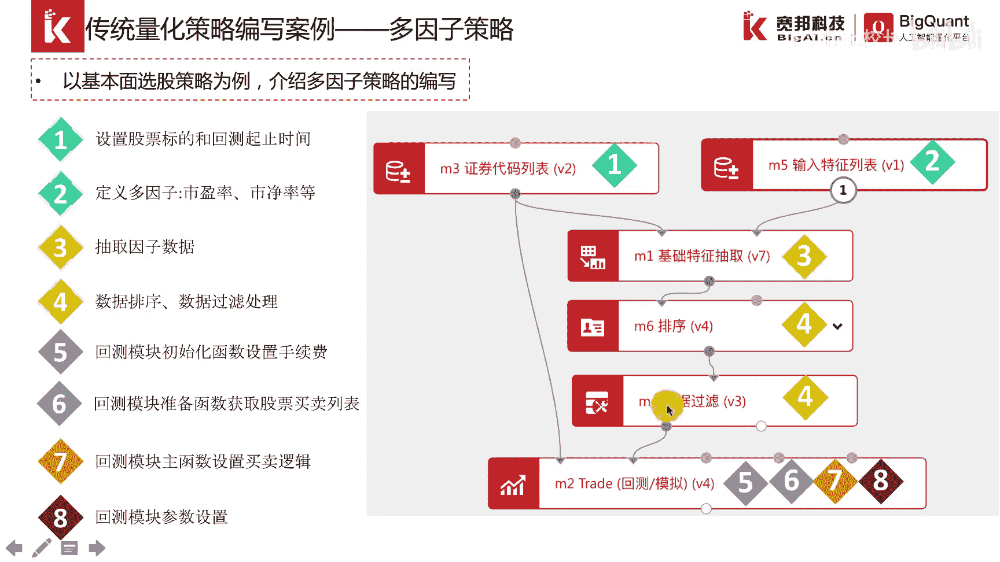

再把交易信号的数据传到吹的模块，因为后面我会在平台上这给大家演示，所以说这里我介绍的快一点，首先在最初的时候，我们透支证券代码列表模块，这是全市场，然后一段时间的一个回撤，因为我们要过因子来确定股票。

所以说我们想把相关的因子给输入进来，适应绿营者失金的原子以及成交量，这一页其实主要介绍的是排序和数据过滤，这两个模块，排序呢是我们按照市盈率和市净率，然后按照升序进行排序。

因为我们希望选择市盈率和市净率越小的股票，然后数据过滤呢是通过市盈率，市净率以及成交量，然后我们将一些不想要的股票给剔除，然后确定一个更小范围内的，一个满足条件的一个股票池，然后确定了这个数据以后呢。

我们再把这个数据传入到m。trade的这个回测，模拟交易引擎模块，这样的话，这个模块里面，就可以通过context这个账户的全局对象，去获取这个过滤后的数据，这是初始化事件函数，和双曲线模型一样。

我们先在前面进行一个手续费的一个设置，在后面呢，我们是给context这个账户增加一个索引值，这个索引值呢叫做index，它表明的是每根k线它的一个具体的索引，我们通过这个索引值。

就可以实现一个定期换仓的一个功能，这是数据准备函数，数据准备函数呢，首先是把外部的数据过滤后的这个数据传进来，读取，1号读取好了以后呢，设置一下这个账户策略，他买每天买入的股票数量。

他隔多少天进行一个换仓，以及我要把通过这个外部的这个数据，把每天要买入的钱多少只的股票给计算出来，这个呢就是通过一个pandas的group by，这么一个操作实现按日期date进行一个分组。

分组好了以后，再选择前30只股票，选择前30只股票，其实就是通过这个函数来实现的，所以说我们通过这个数据准备函数，就把每隔多少天换仓，每天换仓的，每次换仓的时候买是多少只股票。

以及每天买入哪哪30只股票给确定下来了，这是主函数的一个逻辑，我们可以看到在这个函数里面，它传入的context和date这两个参数，因为它需要每天运行一次。

那么这个date呢其实就代表着那个k线的数据，说是有这么一个参数，d盘代码呢就是呃这个账户的这个索引值，要随着每天的运行，它要逐渐增加，这样的话我们就可以通过这两行代码实现，每隔多少天进行一个反差。

因为这个数值我们在初始化函数里面，就设置为它为22，所以说如果他除以这个不等于一，那么它就会返回后面的代码就不会运行，但是如果再换上日，这个条件不会满足，那么他就会往下运行。

这样的话他就会确定要买入哪些股票，要卖出哪些股票，然后再根据这个for循环，将买入的股票列表和卖出的股票列表，通过order的下单接口，然后去依次下单，最后一步呢，就是对回测模块进行一些参数的一个设置。

这个在双曲线模型里面已经详细的介绍了。

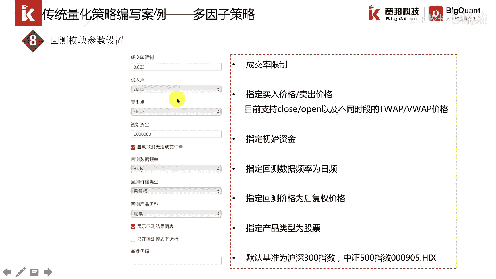

这个地方我们就不展开，然后再是回车这个图，现在我们在平台上演示一下。

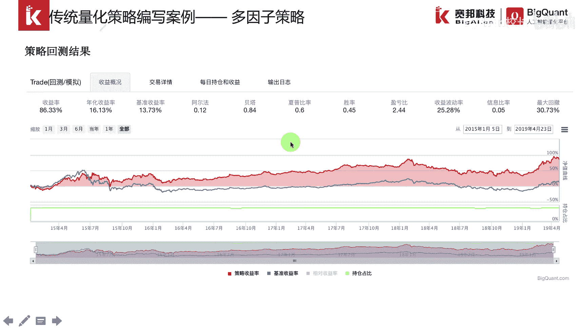

好的现在我们在平台上演示一下。

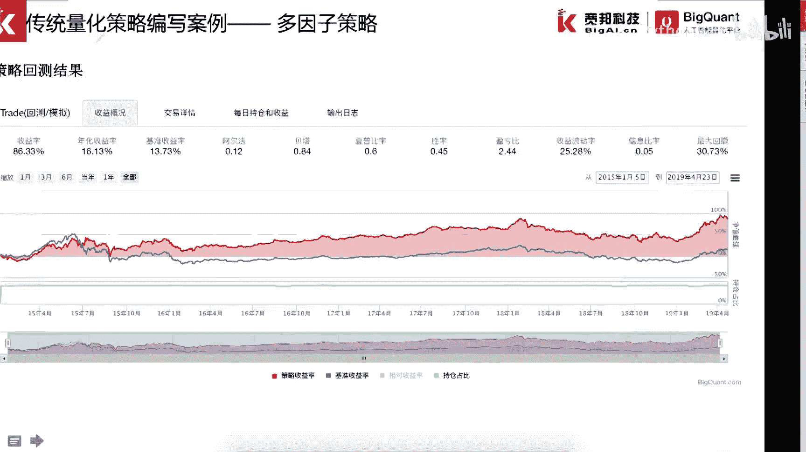

这是我们的一个策略研究的界面，这边是用户的目录。

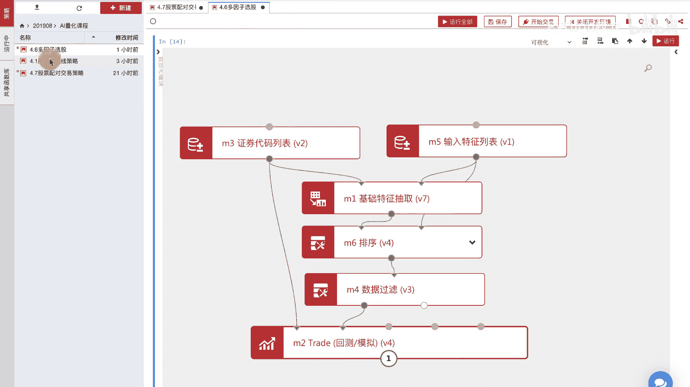

这个是可以收起来的，然后呢中间还是一个画布。

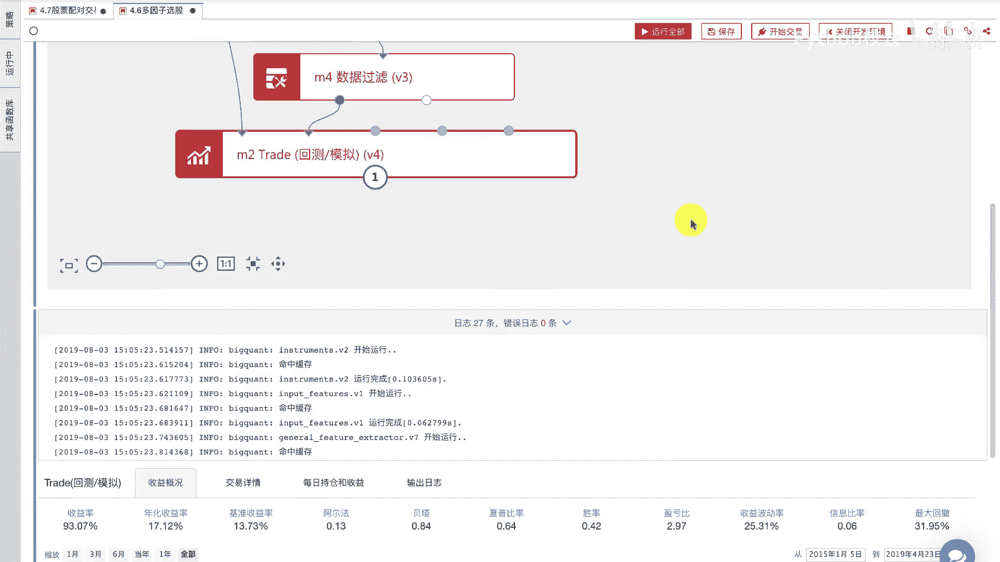

在画布上有一些模块，最重要的一个模块就是这个将引擎这个模块，然后呢，前面这些呢其实就是准备交易信号的一些数据，把这些数据传进来，这个正确代码列表模块，我们设置了，看设置了开始日期。

结束日期以及它的交易市场，这个地方呢如果不输入，就是全市场的股票代码，我们其实也可以看一下，因为它是m3 模块，我们就用m3 点data，点i a d。

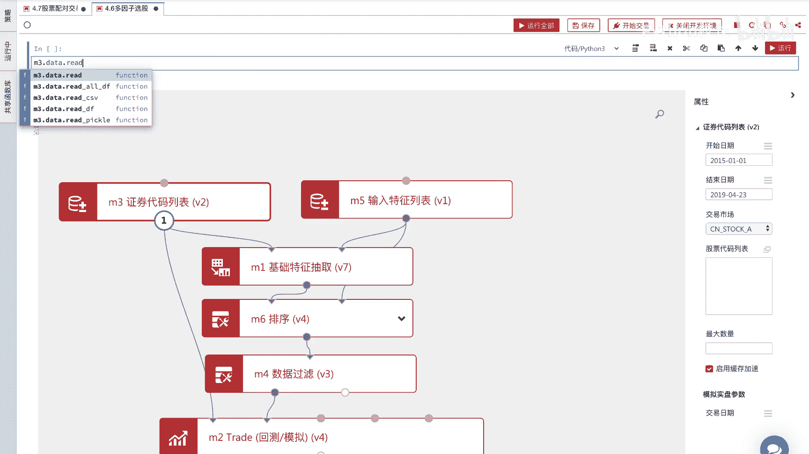

因为它是一个字典格式，所以说我们通过这样就可以看得出来，它的输入输入是这样的，开始时间以及结束时间以及股票列表，这是因子，因为我们是需要使用市净率，市盈率，成交量来选股，所以说。

我们先把这个因子的原始数据给抽取出来，抽取出来以后，我们可以看一下，这样的话就是运行m一模块，我们看一下m一模块，然后这就是包含日期股票代码，市净率，市盈率，成交量这些数值的这么一个f在后面。

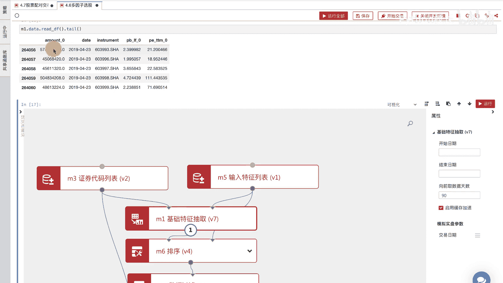

这两个模块其实就是数据处理，因为我们设计的是全市场选股，那肯定我们要把一些股票去掉。

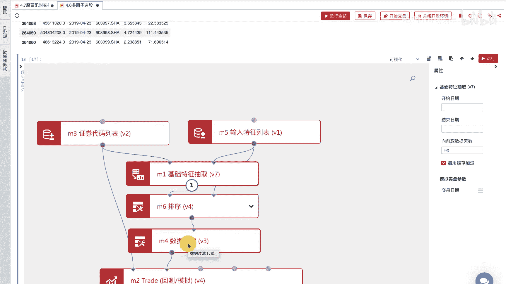

去掉的原则呢就是通过数据过滤的这个模块，按照一定的表达式，市净率小于1。5，市盈率小于15才将降大于零，这样的话就会把一些股票给过滤掉，过滤掉了以后呢，这是一个排序的一个模块，排序的模块。

就是因为我们倾向于选择，市盈率和市净率偏小的一些股票，所以说我们对它进行一个升序的一个排序，这样的话我们最后确定这个过滤后的数据，就可以传到交引擎里面，交易引擎就可以得到每天应该买入哪些股票。

这是交引擎这个模块，我们右键可以查看它的属性，下面的这些部分呢是回撤的一些设置，比如说初始资金啊，用哪种价格非全模式来进行回测啊，这个大家一看就明白。

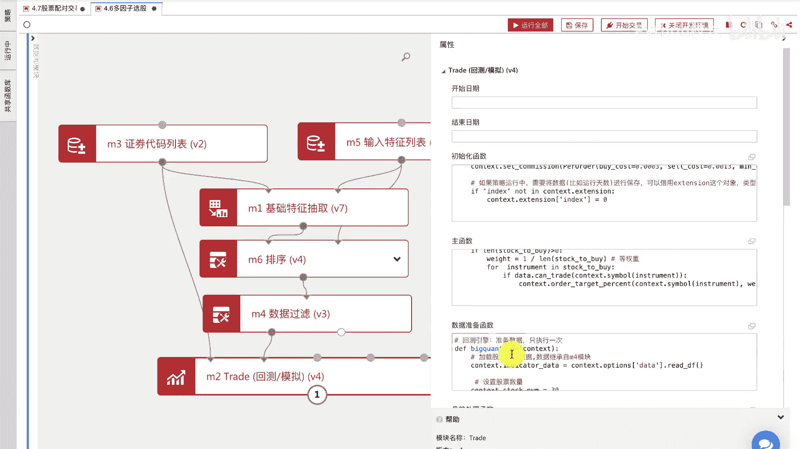

最主要的还是这三个函数，一个函数是初始化函数，这是初始化函数，初始化函数，这里是深圳手续费，这里呢是给这个context的账户对象，增加了一个k线值索引，这样的一个数值。

最开始的时候在第一天他这个数值是零，但是后面呢随着主函数的运行，每运行一次它就递增一，所以说它表明的就是k线一个索引子，我们通过这个索引子就可以实现定期换仓，然后在后面呢。

我们通过这个过滤后的数据传进来，然后就得到每天应该买入哪些股票，当前持仓是哪些股票，可以得到应该卖出哪些股票，然后再根据这些股票列表，通过for循环，然后通过order相关的接口来进行下单。

order下单的接口呢，大家也可以看这个班布函数，如果是这样写，我对他这个personal就是说使得成交以后，我这个股票的成交占比，持仓占比为零，所说就是全部卖出，下面这一部分呢其实就是按照个股进行嗯。

等权重的买入。

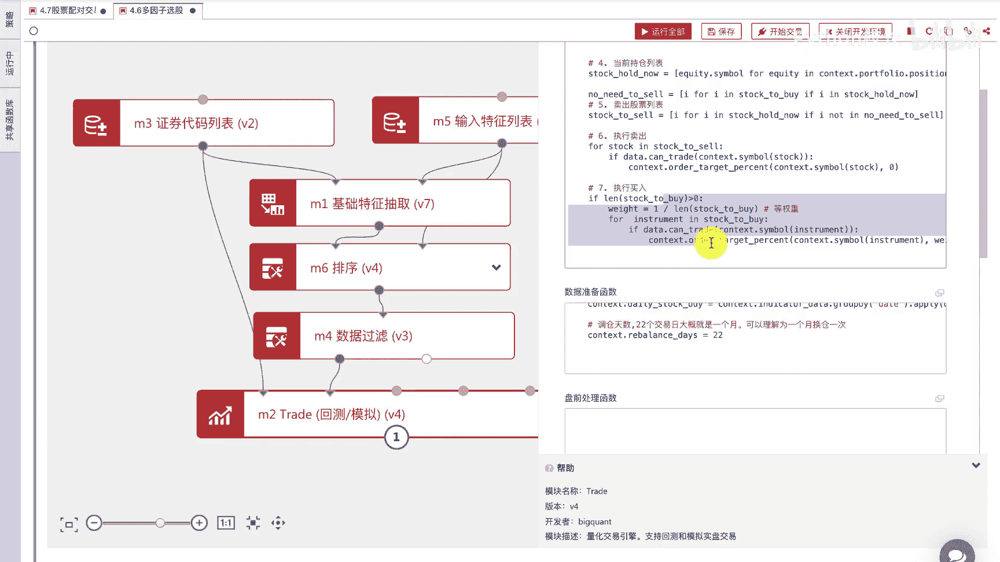

这一段呢就是把外部数据也读进来，这是把那个过滤后的数据读进来，读进来了以后，我确定出每天买30只股票，每隔22天进行换差，这一段代码就是把每天排序，前30只股票给选出来。

因为这里会涉及到就是对一个大的一个df嗯，做分组的这么一个操作，而且分组的类别是日期，所以说这个地方有个股数和b date，这么一个呃操作，然后具体选择股票呢，就是这个函数来选择的。

就是选择嗯前三四次亏啊。

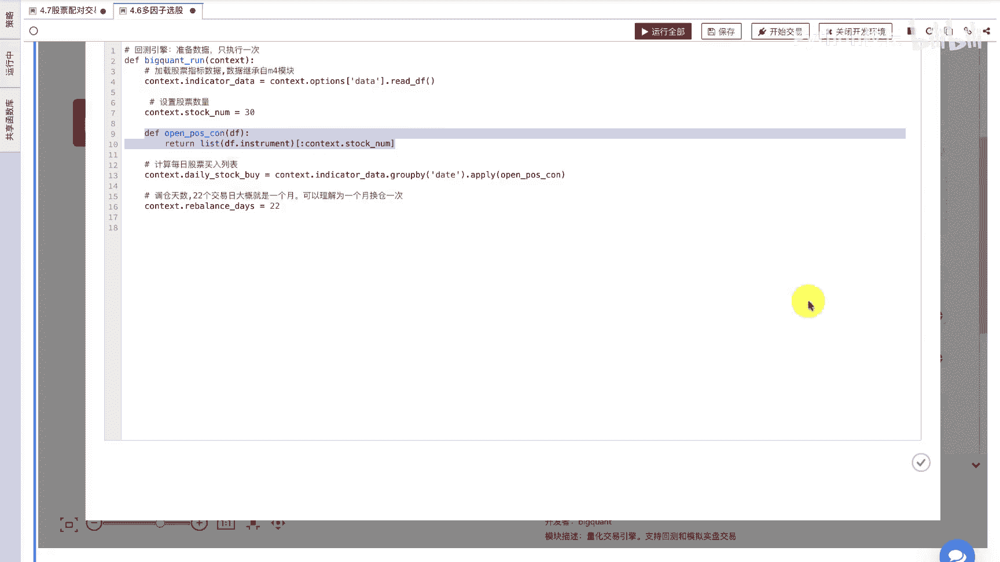

好的我们可以点击运行，看一下运行结果。

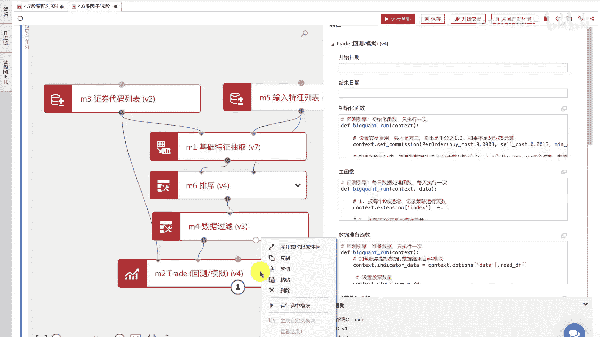

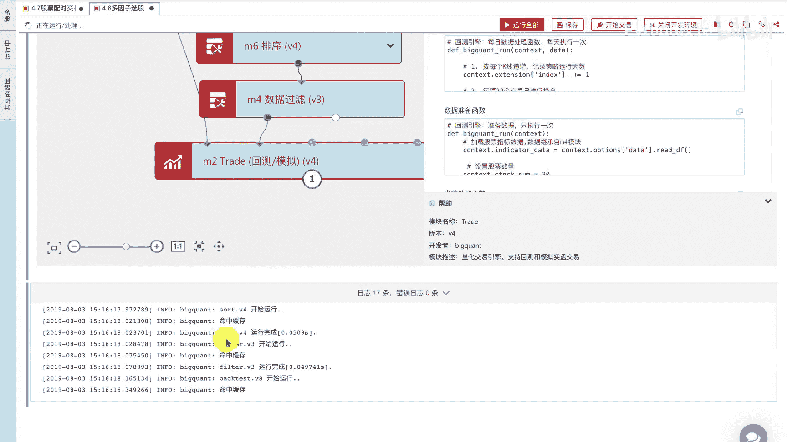

通过这边我们可以看一下日志，这个属性窗口我们可以先收起来。

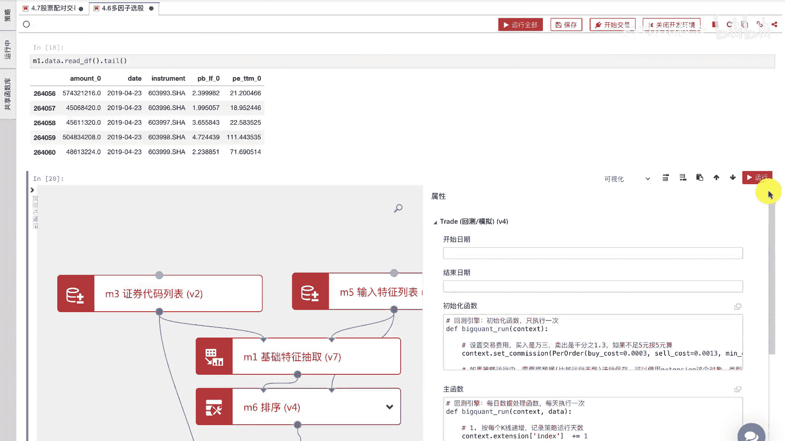

这就是回撤的结果，可以看得出来这么一个简单的基本面因子，选股策略，它其实能够长时间跑赢大盘，因为它背后是有一定的经济策略逻辑在里面的，就是说我通过市盈率，市净率来选择股票，这边是一些交易详情。

可以看到买入哪些股票，这边是每日持仓和收益，这个地方是一些输出日志，这些结果呢，可以帮助我们更好的来理解这个策略。

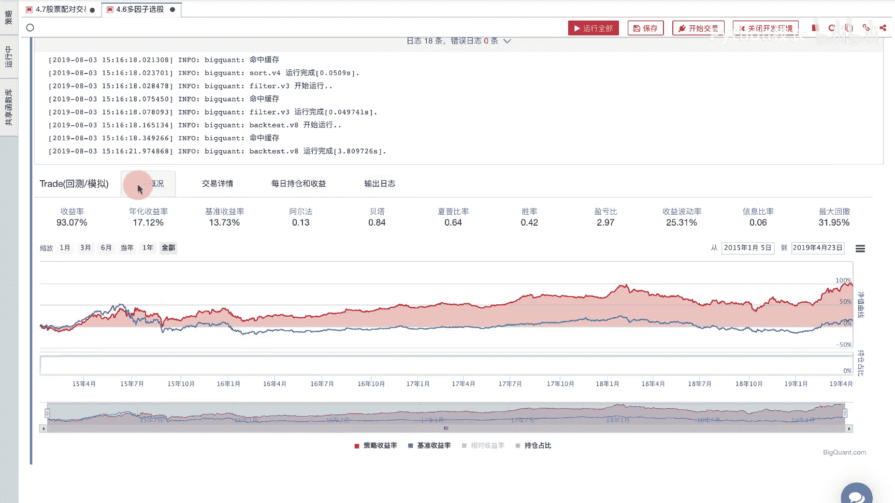

好的关于多因子选股的策略，我们就先介绍到这里。

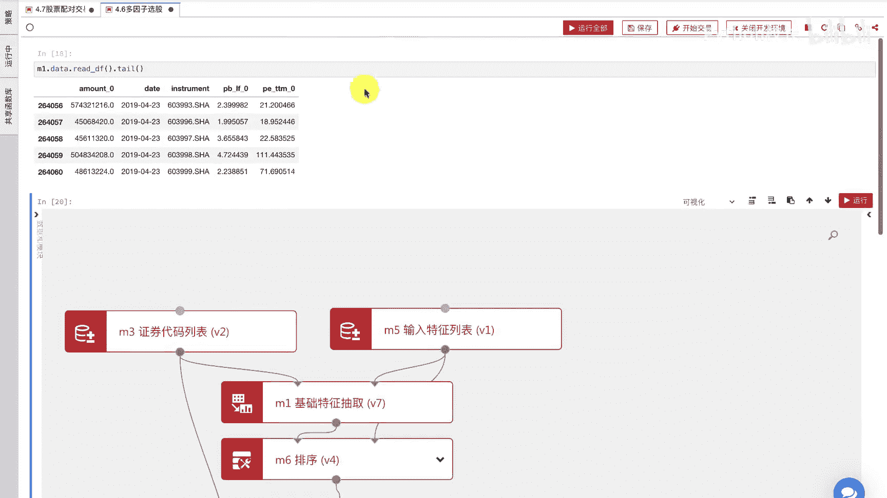

这个代码呢我们课后会发给大家。

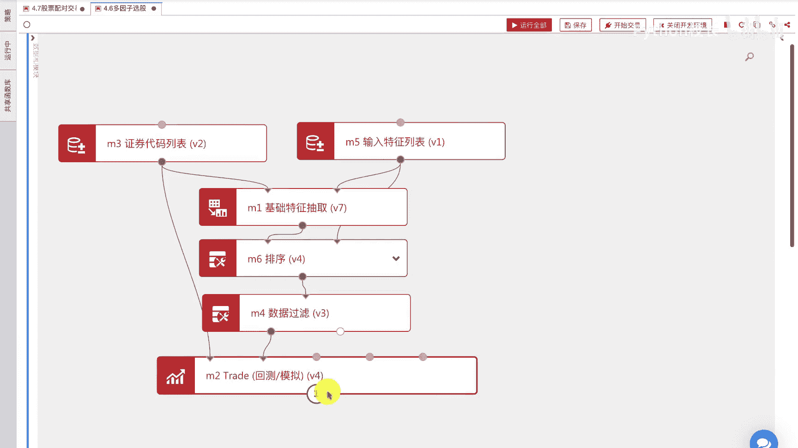