# P36：5.2.3 套利策略 - 程序大本营 - BV1KL411z7WA

前面我们介绍了，以双均线策略为代表的趋势策略，和以多因子策略为代表的选股策略，这一部分我们介绍套利策略，套利策略盈利来源是市场的不合理定价，我们以银行股的轮动策略为例。

介绍如何在不同银行股票之间进行逃离，套利策略，本质上和趋势策略以及以及因子选股策略，在策略编辑上是一样的，就是说先通过因子抽取和数据处理，得到价差数据，然后依据价差得到的交易信号。

数据最后传入trade这个回撤模块。

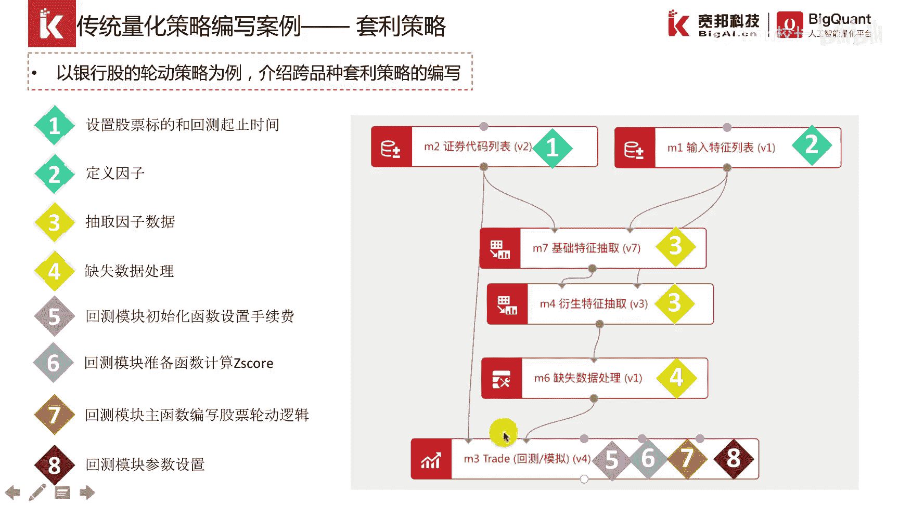

这是套利策略的一个概念，套利策略的假设是，用两只股票的价格存在长期的协整关系，价值观在一定的范围内波动，一旦价差超出范围，说明两只股票中的一只股票价格被低估，市场的有效性会使得价差回归。

低估的股票的价格也会补涨啊，如果是期货市场存在做空的机制，我们可以买入一个标的，卖空一个标的，但是由于股票不存在做空击者，我们只能买入一只股票，另外一只保持空仓，这里我们重点介绍如何编写某类量化策略。

不需要太多策略原理进行解释，感兴趣的朋友可以下来深入研究，价值八，我们在这里用this school这个指标来刻画，在证券代码列表模块，我们输入两只股票，一只股票是交通银行，一只股票是中信银行。

我们一般所做的套利，也是股票之间两两有一定的相关性的股票，然后在这边呢是我们通过输入特征列表法，收盘价的数据都抽取出来。

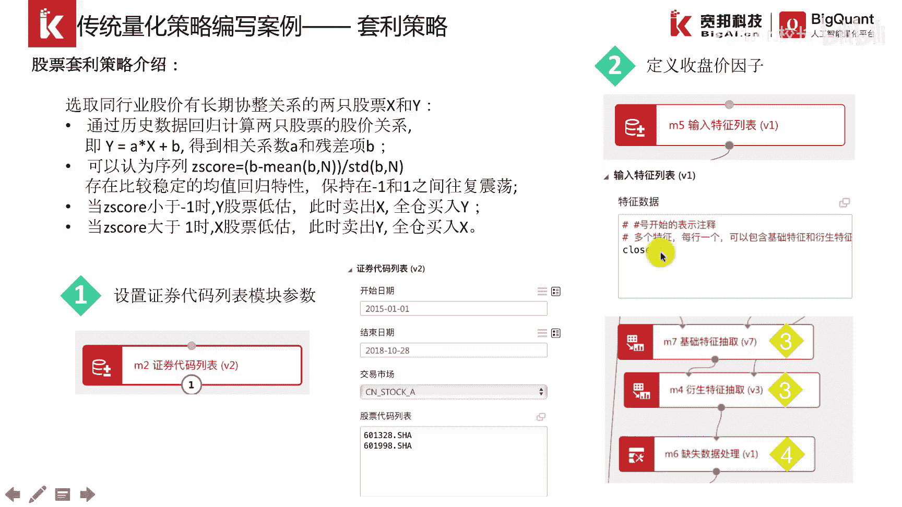

抽取出来了以后再进行一些数据的一些处理，这块呢是初始化函数，初始化函数还是设置手续费。

这一块呢是数据准备函数，数据准备函数，主要就是通过外部所抽取的那个因子，数据传进来，传进来了以后再读取出来，读取出来，保存为一个叫做df这么一个名字的数据框，然后呢再通过df的相关的一些处理。

计算出this school这个具体的计算，大家可以下来策略研究的时候再去细细研究，因为我们本节课子解绍策略的编写，所以说我们就不赘述，最后我们得到的一个数据呢。

就是说this school这么一个指标，这个指标呢，我们把它绑定到这个账户的一个对象上面，这样的话我们就可以上下文里面，每个函数里面都通过condex，可以把这个指标给调取出来。

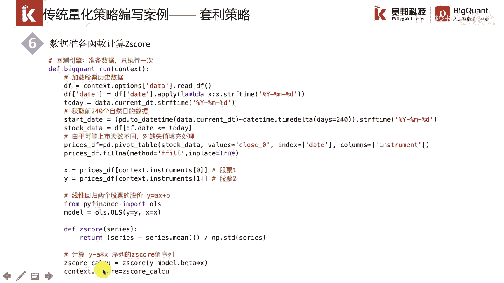

我们来看一看在主函数里面的一个策略逻辑，首先我们得到一个当前运行的日期，然后通过这个日期，我们可以得到当天的一个this school的这么一个，指标的一个值，然后simple一和simple 2。

分别代表的是交通银行和中信银行，因为这里stop list杠铃，这是一个字符串，我们要把它转化成一个股票标的，还需要用simple这个函数来进行转换一下，下面呢是分别获取当前账户里面。

这两只股票的一个持仓的一个情况，在下面就是具体的一个交易逻辑，交易逻辑呢是根据this school在一定的范围内波动，这个范围呢包括上轨和下轨，上轨呢就是一，下轨呢就是-1。

如果this school突破了三轨，那么价差到了一个非常大的一个幅度，这个时候申博一被低估，我们应该买入申博一，然后申报二完完全空仓，如果是小于下轨，这个时候simple 2被低估。

我们就应该全仓买入simple 2，然后simple一就买入空仓。

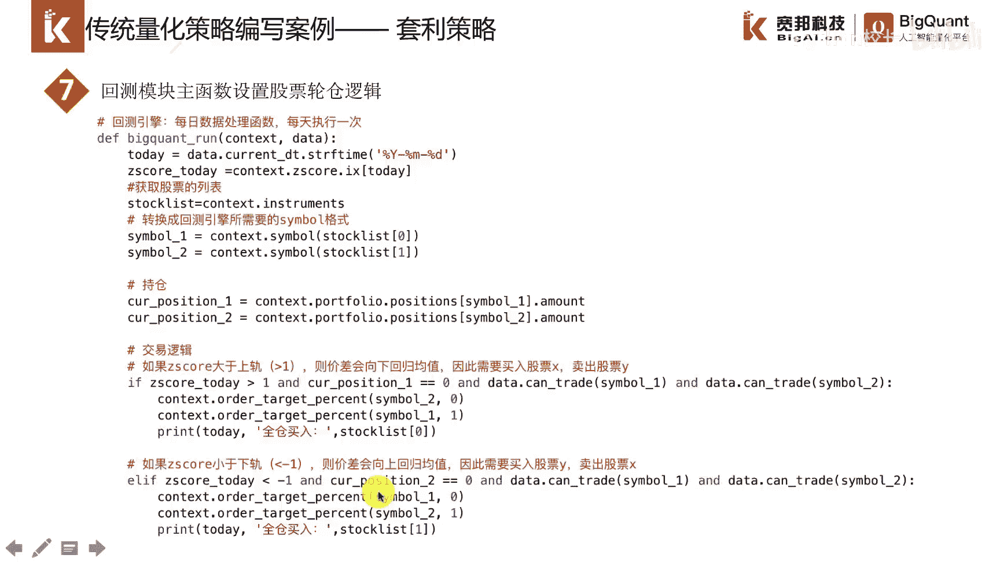

这是回撤的一些参数一设置，然后这是回撤的一个结构图，我们现在在平台上演示一下。

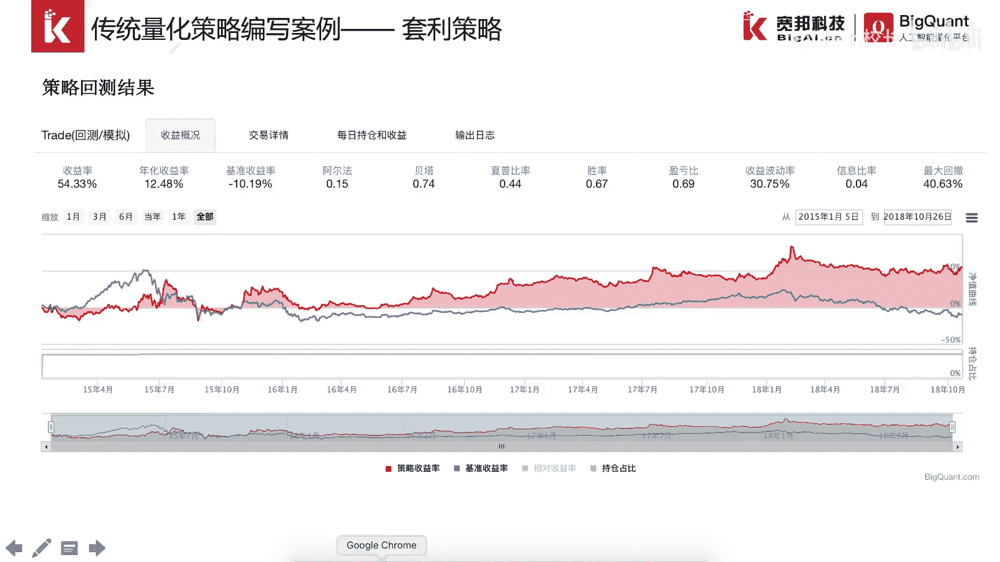

我们先把这个收起来，然后这是一个套利的策略，然后我们也可以把它叫做配对，交易的策略，主要就是呢是涉及到的两只股票。

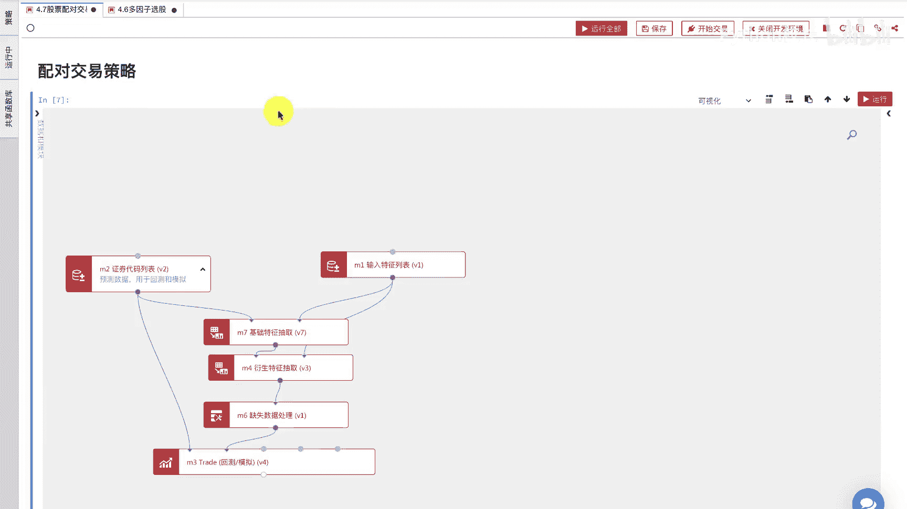

所以说叫做配对，然后这两只股票呢一个是交通银行，一个是中信银行，因为他们是在同一个行业银行业，所以说他们的价差很长的一段时间内，在一定的范围内是波动的，但是如果这个价差，突破了这个范围的上轨和下轨。

那么就意味着某只股票被低估，它就应该去持有另外一只股票呢就会被高估，那么就不应该持有另外一只股票的持仓，所以说这是这个套利策略的逻辑，这是证券代码，证券代码列表模块，我们确定了回车的开始时间。

结束时间以及相应的股票池，然后这边呢是啊输入特征列表模块，因为我们在确定交易信号的时候，是其实是通过价差来确定交易信号的，价差呢又是通过收盘价来计算出来的，所以说我们通过close杠铃。

这个收盘价把数据给抽取出来，抽取出来了以后经过一些处理，主要是缺失值处理，再把这个数据传入江引擎，将引擎里面呢，最主要是在盘前处理函数里面。

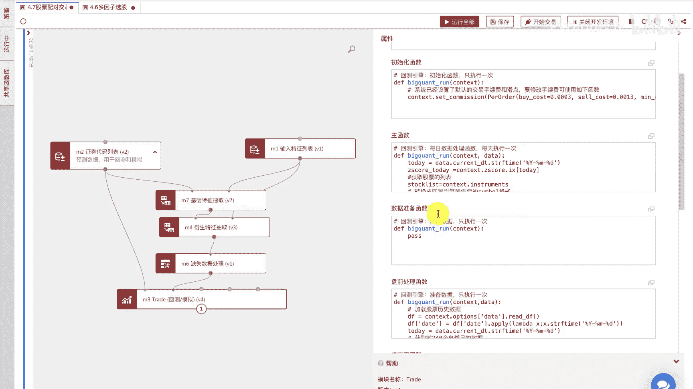

进行一个价差的一个计算，这个价差的计算呢是首先把这个数据，外部的这个价格数据读进来，读进来了以后，通过回归os这个方法来确定一个价差，这个价差呢我们把把它称为一个this school。

大家可以先不用去关注这个细节，因为我们现在是嗯讲述怎么编写策略，所以说这个是需要策略逻辑策略理论的地方，我们不用赘述，然后确定出来的这个this go以后，我们再绑定到这个全局对象账户里面。

这样的话我们在主函数里面就可以进行调用了，在主函数里面呢，主要是通过当前的日期，获得当前日期的一个z school，然后呢再判断一下当前的一个时尚状况，最后呢是编写策略的交易逻辑。

如果价差在一定的范围之外，那么满足一定的持仓条件，这个时候我们就应该买入低估的股票，卖出高估的股票，如果相反，我们就应该买入另外一只股票，卖出另外一只股票，这是这个策略的逻辑代码。

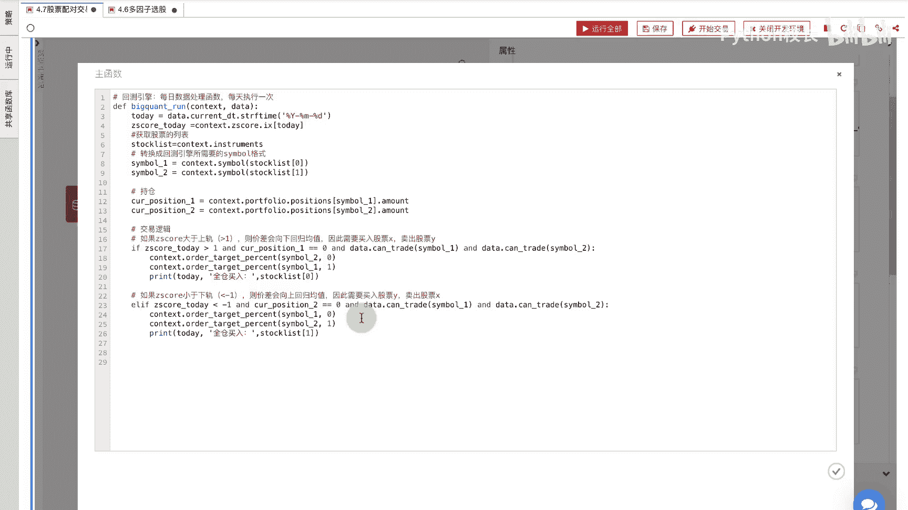

然后我们看一看运行的回测结果。

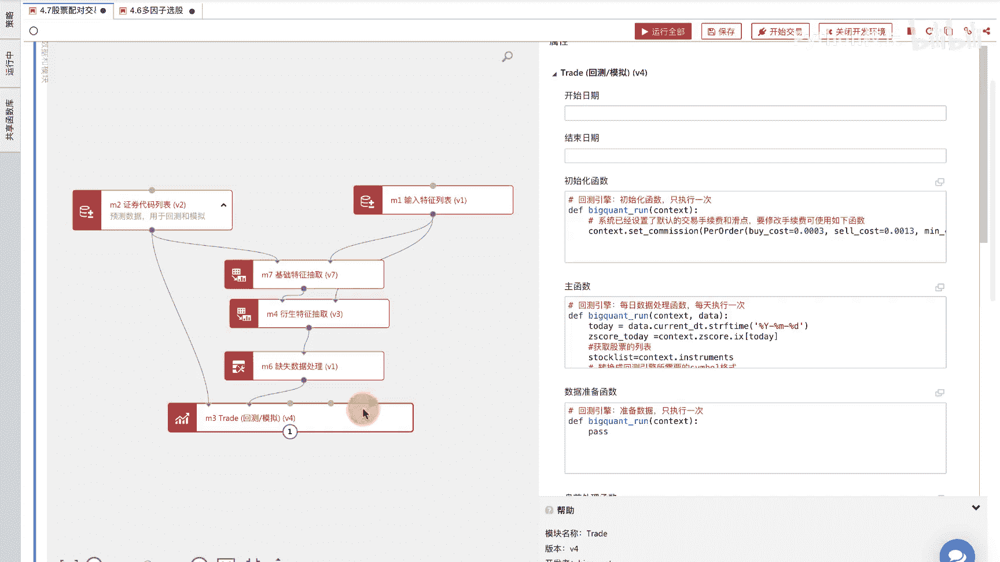

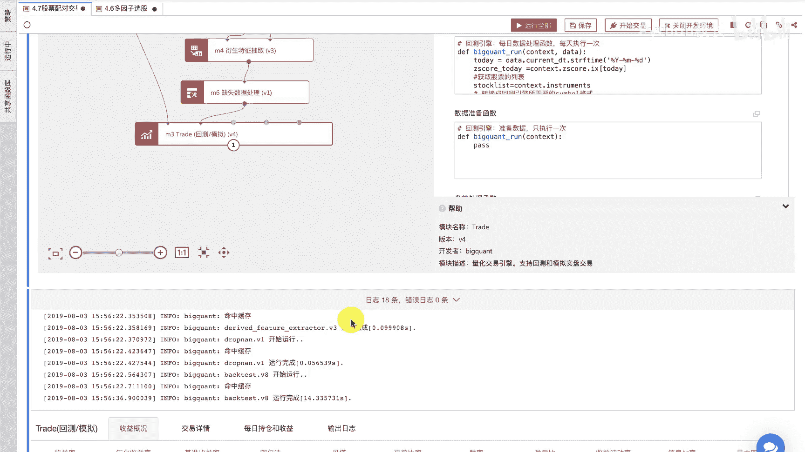

然后这是一个回车结果，可以看出来这个套利策略的收益也是比较稳定。

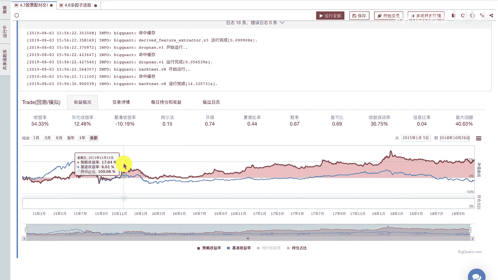

风险不是很大，然后这边是交易详情，可以看得出来他都是在某一天买入一只股票，卖出另外一只股票，然后再来回的操作，这边是他们的一个持仓，因为股票不能做空嘛，所以说一个时间点上它持有低估的那只股票。

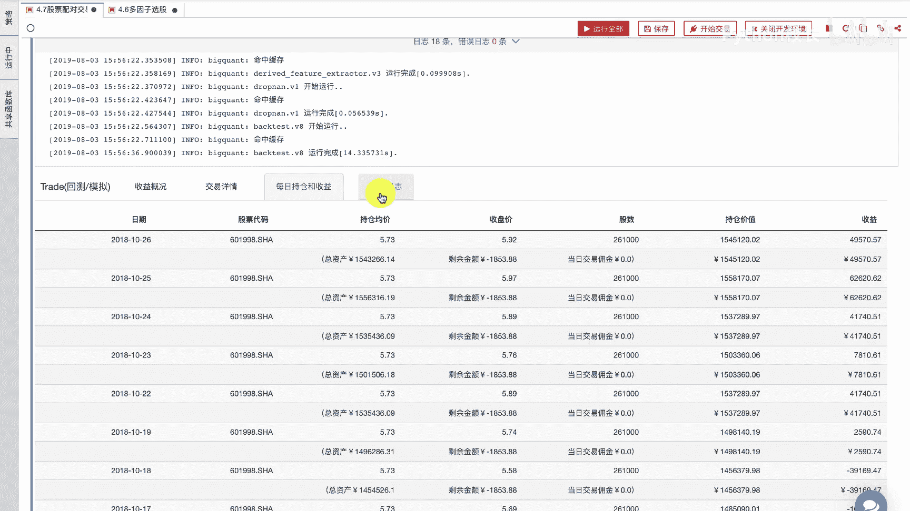

这边是输出日志好的，到此为止，我们已经介绍了趋势策略，多轮子选股策略以及套利策略，这三个策略都是传统量化策略里面的代表，我们是想通过这三个策略的介绍，让大家熟悉我们的交易引擎。

因为交易引擎是车队编写所必须要掌握的。

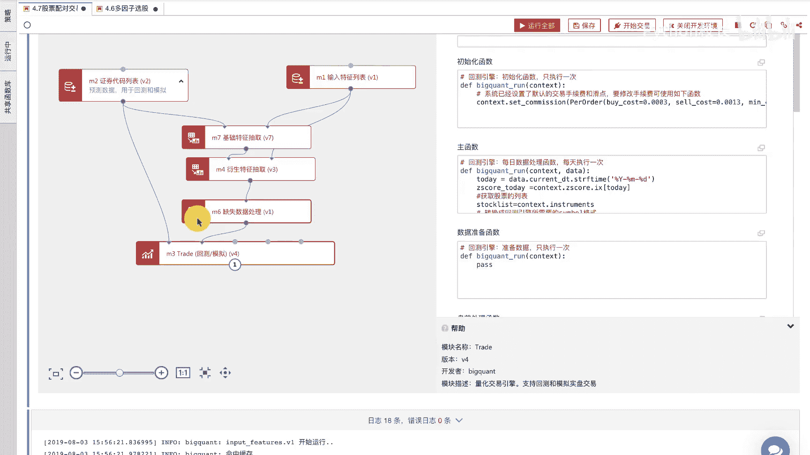