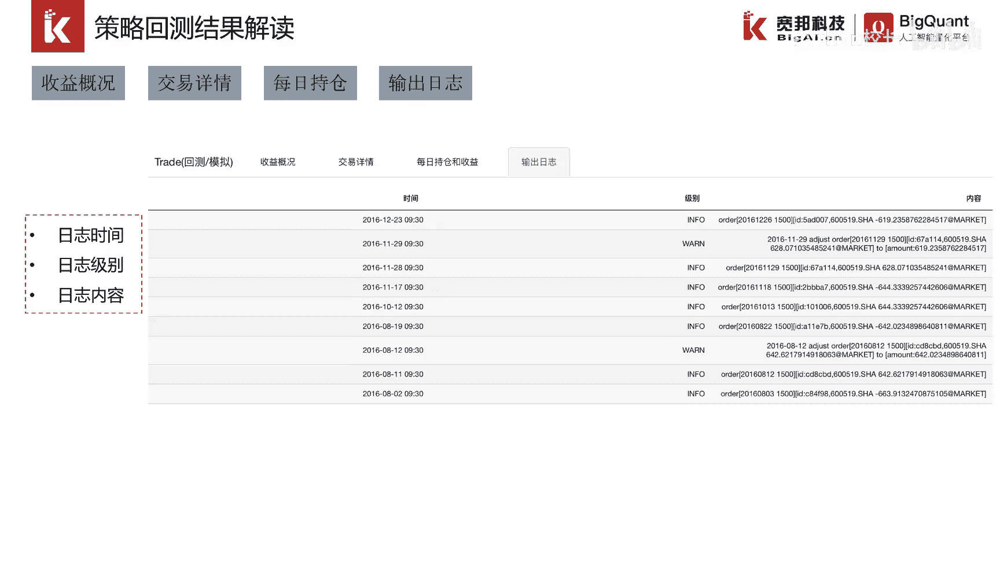

# P37：5.3策略回测结果解读 - 程序大本营 - BV1KL411z7WA

大家好，接下来我们进入第三小节的一个介绍，策略回测结果的解读，当我们运行完一个策略以后，会得到策略的回测结果，回车结果反映了该策略在历史数据中，按照策略的逻辑进行模拟交易后，收益风险的一个综合情况。

我们可以借此判断该策略的好坏。

反映一个策略收益的指标，有收益率，年化收益率，阿尔法胜率，盈亏比，反映一个策略风险的指标，有收益波动率，最大回撤，如果想对策略进行综合反应，既要考虑收益，又要考虑风险，这样的指标有下坡给率信息比率。

这是用来评估策略最通用的指标，回车完成以后，如果我们得到一条很漂亮的四位率曲线，比如45度这样的一个资金曲线，夏普比率很高，那么我们就会好奇到底是买入了哪些股票，带来了如此丰富的收益。

这时我们就可以查看交易详情，交易详情告诉我们，策略在每一天进行了哪些交易，买如何卖出哪些股票，成交金额，买卖数量，交易成本，交易佣金等等等等，通过这些明细的数据，我们可以对策略进行更加深入的一个分析。

与交易详情相关的是每日持仓数据，它反映出策略在回撤的开始时间和结束时间，这个时间区间内，每天持有哪些股票，持仓均价是多少，持仓的收盘价是多少，持仓市值和持仓收益又是多少，通过这些明细数据。

可以帮助我们进一步提高和完善策略，比如我们发现收益率曲线在回撤的那段时间内，持仓的股票亏损的很严重，那么我们就可以尝试设置一个止损的标准，当股票的亏损达到一个可以接受的最大幅度，就卖出。

这样的话我们就可以提高和改善，回撤的那段时间，他的一个收益的一个表现，还有最后一个板块，四个板块叫做输出日志，我们可以查看回撤过程中系统反馈的一些日志，策略，每日交易可能与我们最初在构建策略。

编写策略的时候有一些理解上的差异，比如我们连续下单，系统会告诉我们资金不足的时候下单会失败，比如某日股票下单，但是没有成交，系统可能会告诉我们当天股票一字涨停，所以买单是无法成交的。

如果在股灾和熔断期间，系统可能会通过日志告诉我们，买单是无法成交的，因为在千股跌停的时候，这类情形时常发生，因此系统需要给我们返回一些输出日志，让我们知道策略在回测过程中。

