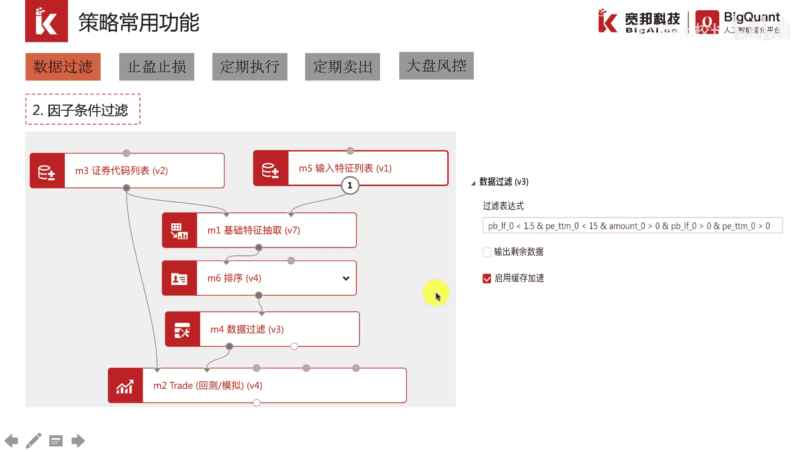
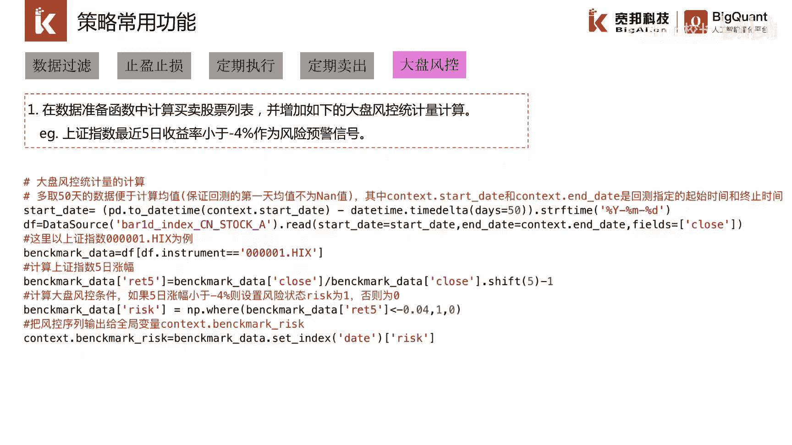

# P38：5.4策略编写常用功能 - 程序大本营 - BV1KL411z7WA

在最后一节我们介绍在策略编写过程中，经常会使用到的一些功能，策略编写是一个差异化很大的一个工作事项，它是对用户交易策略交易思想的一个复现，本质上是属于一门研究工作，因此灵活性和通用性至关重要。

在我们的交易引擎设计之初，就采取了贴近真实的研究和真实交易的场景，因此目前的交易引擎具备很强的灵活性，能够满足多类场景。

功能也非常丰富，在策略的研究中等着我们，诺列了一些常用的功能，比如数据过滤，以前面介绍的多因子选股的策略为例，末日情形下使全市场的股票进行选股，那如果测的思想稍微调整一下。

变成只在沪深300指数成分里选股，或者是在某一个行业成本里面选股，我们就需要使用a股的股票过滤模块，通过该模块，我们可以快速将不需要的股票剔除掉，确定一个更加精确的一个股票池。

这是一种常见的股票过滤的一种方法，除了按照行业和指数过滤，我们还可以根据具体的股票属性，其因子值的大小来进行过滤，比如在多因子选股策略里，我们按照市盈率，市净率对全市场的股票进行了过滤。

删除了部分不满足条件的股票，第二个常用的功能就是止盈止损，止盈指的是持有股票，满足一定的盈利条件的时候，卖出持仓落袋为安，及时锁住利润，止损指的是持有股票如果达到一定的亏损程度，卖出持仓及时止损。

将损失控制在一定的范围内，在策略编写的过程中，止盈止损是经常会遇到的一个场景，我们将其编写到策略里，其实也非常简单，就是在每根k线触发主逻辑函数的时候，都去获取持仓股票的最新价和成本价，来计算盈亏。

一旦达到一定的盈利或者一定的亏损，就卖出持仓，完成止盈和止损，从这个代码其实看也是比较简单，主要就是在主函数里面加入这么一段止盈，止损的一些模块，这里呢是一个止盈模块，举例止盈实现起来比较容易。

在最开始的时候是获取持仓以及持仓成本，然后对于持仓股票里面的每一只股票，获取它的最新价格，一旦最新价格超过成本价一定的数值，比如说三元，那么我们就对这只股票进行全部卖出，这就是只赢了一个简单的实现。

下面一个常用的功能是定期执行，因为目前的交引擎是，每根k线都会去触发主事件函数，对于每周换差或者每月换差，这样的策略就会严重的影响性能，我们可以通过k线的索引值来进行判断，实现定期缓冲的功能。

比如假设是每三天换仓一次，我们可以用k线的索引值除以三，如果余数不为零，就直接return返回不往下运行策略的逻辑代码，这样可以提高策略的运行性能，当余数为零的时候，策略才会往下去运行。

去执行策略的逻辑，实现换仓的操作，从这个模板代码看得出来，如果要实现定期换仓的功能，其实就只加入两行函数就可以，一个是k线的索引子去除以三，如果不等于零，那就直接返回了，这样的话在每一根k线运行的时候。

下面的策略逻辑代码就不会运行，只有真正在定期换仓的那个时间点，这个没有满足它才会运行，下面的逻辑，下面一个常用的功能是定期卖出，它指的是买入一个股票以后，我们每天记录持仓天数。

一旦达到某个具体的数字就卖出，这样的定期卖出的逻辑也经常会遇到，最简单的处理方式，就是根据当前的日期减去建仓的日期，一旦相差一定的天数，我们就将持仓卖出，从最后两行代码可以看得出来。

是当前的日期减去该持仓建仓的日期，达到一定的天数，我们就将持仓进行卖出，最后一个常用的功能是大盘风控，大盘风控指的是依据整体市场的一个表现，来对仓位进行风控的设置，可以理解为这时比如熊市大跌的时候。

可以用上证指数跌幅达到一定条件，作为风控触发的条件，这个支持起来也是比较简单，咱们可以把上证指数的数据读出来，读出来了以后，计算一下它最近一段时间的一个跌幅。

然后把这个跌幅的数据传context这个变量里面，一旦超过设置的最低值，就卖掉全部持仓或者是部分持仓减少。

