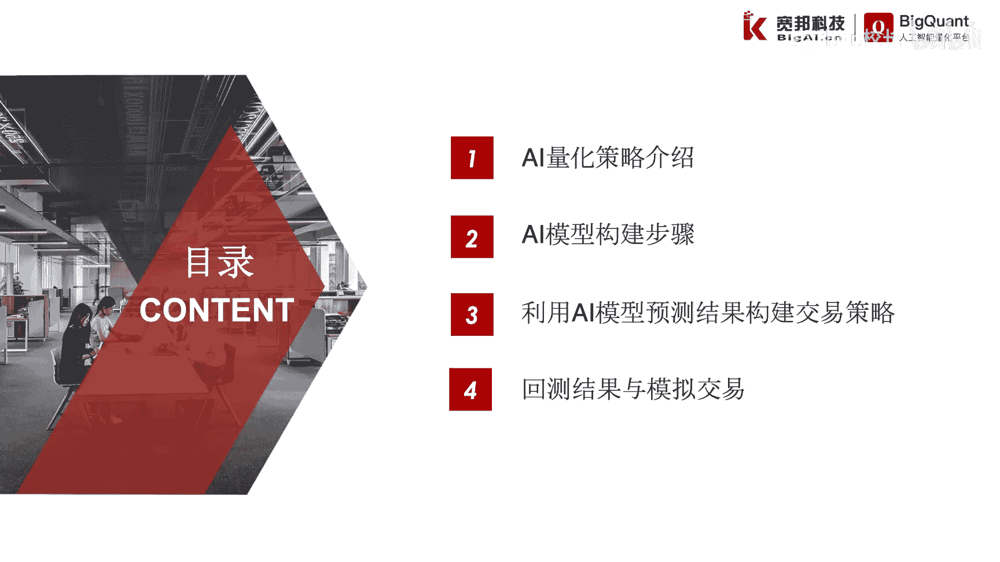
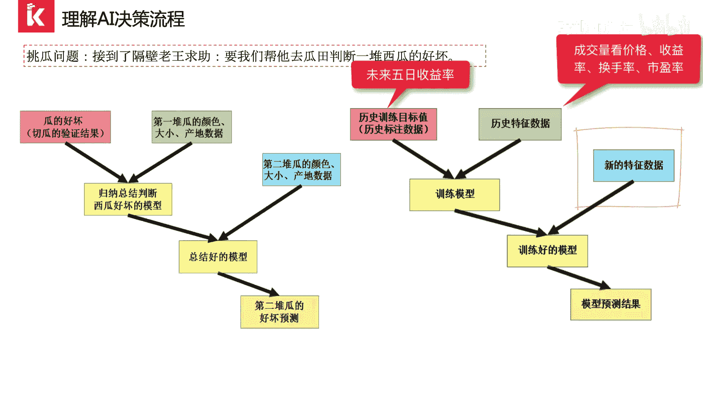
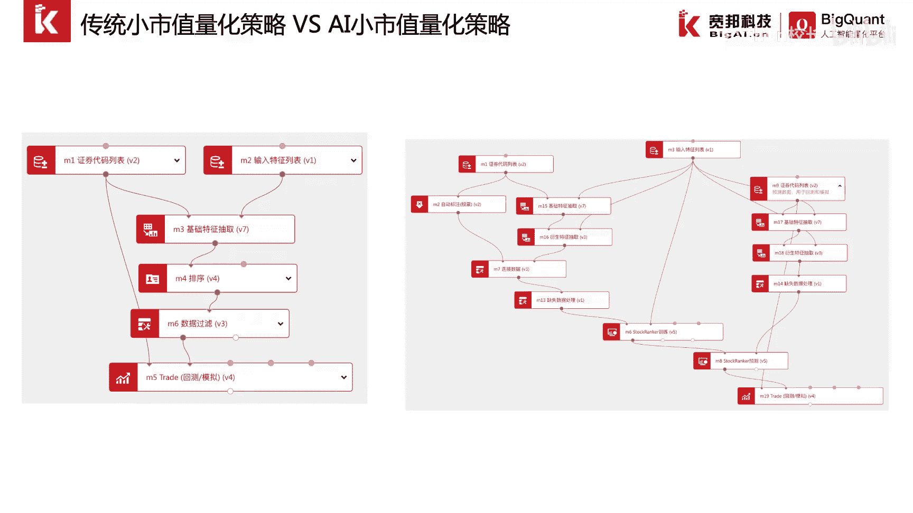
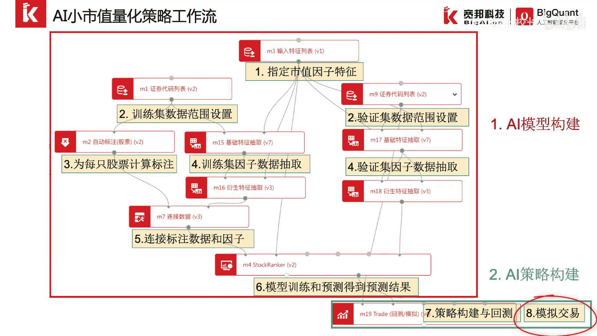
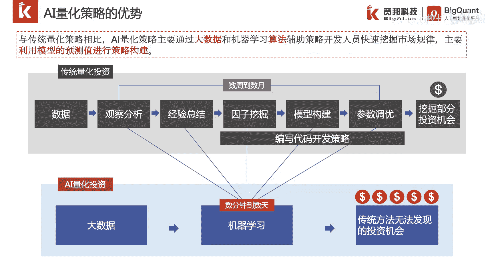

# P39：7.1AI量化策略介绍 - 程序大本营 - BV1KL411z7WA

这张我们介绍一下八部上手ai量化策略，本章分为四个小节，首先我们介绍一下什么是ai量化策略，然后我们会介绍一下如何构建ai模型，紧接着我们会利用ai模型的预测结果，来构建交易逻辑。

最后我们会对我们构建的ai策略进行回测，并提交模拟交易。

介绍一下ai量化策略，首先我们来理解一下ai的决策流程，我们先看一下人脑的决策流程，假设我们接到了隔壁老王的求助，他想要我们帮他去瓜田里看到一堆西瓜的好坏，如果我们并没有西瓜的种植经验，我们可以这样做。

首先我们将这段希望分为两堆，我们记录第一堆瓜的颜色大小，产地等数据，然后将瓜一一抛开并品尝，记录瓜的甜度作为我们评判瓜好坏的标准，我们依据瓜的甜度和瓜的特征数据，总结出什么样的瓜是好瓜。

我们利用总结好的模型或者是经验，对第二堆瓜的颜色大小，产地数据进行分析，进而预测出第二堆瓜，每个瓜的甜度，在这样一个例子中，人脑的决策流程是通过定义一个目标，也就是刮得好和标准，以及对瓜的相关特征。

例如颜色大小，产地数据的观察，总结出目标与特征之间的关系，也就是模型，进而用模型进行预测，ai的决策流程与人脑大致相同，只是用来归纳总结经验的不再是人脑，而是计算机和相应的算法。

假设我们需要完成股票的角色挑选，这样一个问题，我们首先定义股票的好坏标准，在金融数据中，我们通常利用时间序列进行收益率的计算，来判定股票的好坏，我们这里可以将未来五日收益率，作为评判股票未来好坏的标准。

然后我们获取历史某段时间每只股票的成交量，价格收益率，换手率，市盈率等相关特征数据，作为可能影响未来五日收益率的因子数据，我们利用未来五日收益率和对应的因子数据，构成的训练集数据。

选择一个排序模型进行模型的训练，这样这个模型就总结出，每只股票历史的特征数据，与未来50收益率之间的关系，我们利用总结好的模型，对未来的每天每只股票的特征数据进行分析，来预测每只股票未来五日的收益率。

这就是ai的一个决策流程，在理解的ai决策流程后，我们来看一下传统量化策略与ai，量化策略的构建步骤，对于传统量化策略而言，通过人工对少量的数据进行观察经验，总结数据建模和策略构建。

然后对想法进行回测验证，对于ai量化策略构建步骤而言，我们首先定义目标，然后从海量的数据中提取因子数据，对因子数据进行分割，我们将数据拆分为训练集，因子数据和测试集因子数据。

我们利用目标和训练集因子数据构建模型，我们利用构建的模型，对测试集的因子进行目标预测，利用预测的目标值进行策略构建并回测，通过算法和计算机的并行能力，我们可以对海量的数据进行，经验总结与规律探索。

我们来看一个具体的例子，这里我们构建一个小市值的量化策略，对于传统的小市值量化策略而言，首先通过人工观察，市值大小与收益率之间的关系，人工统计发现小市值的公司平均回报较高，于是可以通过人工建模。

利用市值进行排序选股，构建一个定期轮仓策略，并回测观察历史收益曲线，来评判小市值量化策略的效果，对于ai小市值量化策略而言，首先我们定义一个目标，即模型的预测目标，未来50收益率。

然后我们将市值数据拆分为训练集数据，和验证集数据，我们将训练集数据，2010~2015年的历史事实数据，和每只股票的未来50收益率目标值合并，选择排序模型，并利用训练集数据进行训练。

找到事实数据与未来50收益率之间的关系，然后利用训练好的模型和预测，及2016~2018年的市值历史数据，进行未来50收益率的预测，我们根据预测得到的未来五日涨幅的排序，构建一个定期轮舱模型。

然后进行测试回测，在big studio环境中，我们可以依据上述的策略构建流程，搭建对应的可视化工作流，如图所示，左侧为传统的小市值量化策略工作流，右侧为ai小时时量化策略工作流，这里我们重点讲解一下。

ai小时值量化策略工作流。

我们可以看到，该工作流主要分为ai模型构建和ai策略构建，两个部分，在ai模型构建中，第一步我们指定我们要抽取的事实因子特征，然后我们将数据集拆分为训练集和验证集。

某分别指定数据集的时间起始范围和股票范围，第三步，我们对训练集的数据，每只股票进行未来50收益率的计算，我们称这个过程也微标注过程，第四步，我们进行训练集因子数据即事实。

因此数据的抽取和验证集市值因子数据的抽取，第五步，我们将训练集的因子数据和标注数据合并，得到完整的训练集数据，紧接着，我们指定使用stop ranker这样一个股票排序模型。

并将训练集数据传递给该模型进行模型训练，找到市值因子数据和股票，未来股市收益率之间的关系，得到模型，我们利用这样一个排序模型，在验证集数据进行未来50收益率的预测，然后我们进行ai策略的构建。

我们通过得到的未来五日收益率的预测结果，进行轮仓策略的构建，并进行回测，最后我们将策略提交模拟交易。

进行实时追踪或者实盘交易，与传统量化策略相比，ai量化策略主要通过大数据和机器学习算法，来辅助策略开发人员快速挖掘市场背后的规律，主要利用模型的预测值来进行策略构建，通过机器的并行能力。

我们就可以将传统量化策略开发的流程，从数周到数月，缩短到数天乃至数分钟这样一个级别，同时利用算法的复杂性，我们可以实现传统策略无法发现的。

更多投资机会。