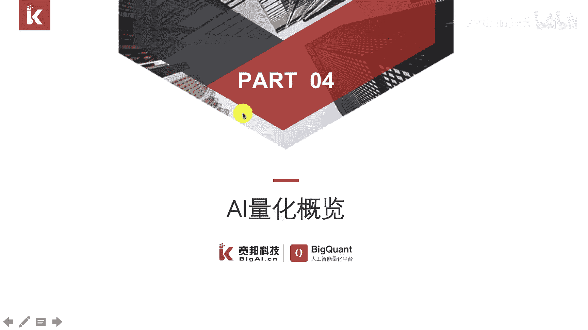
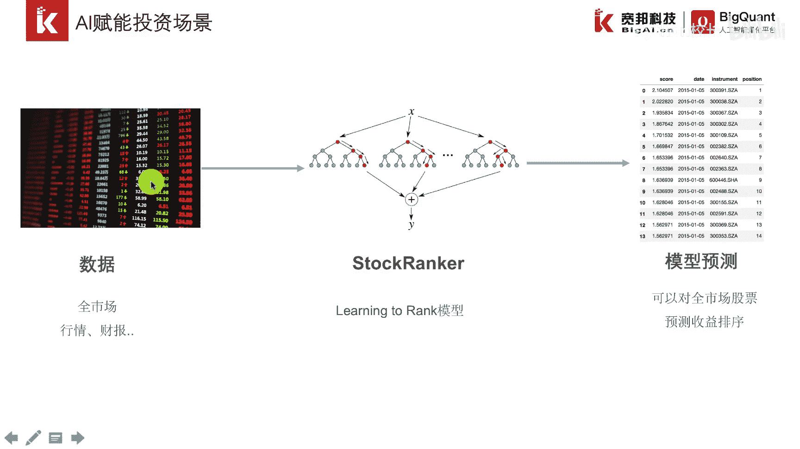
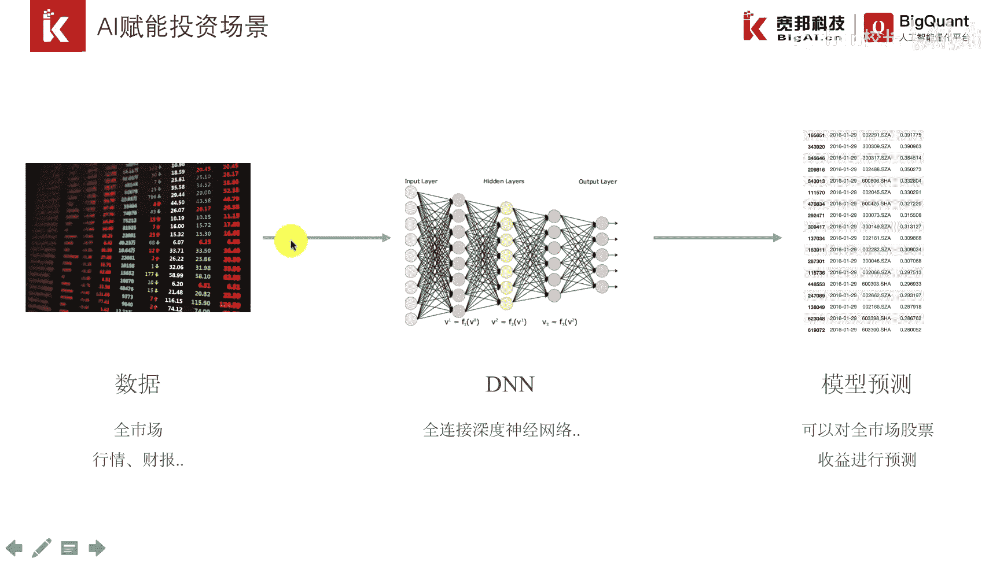
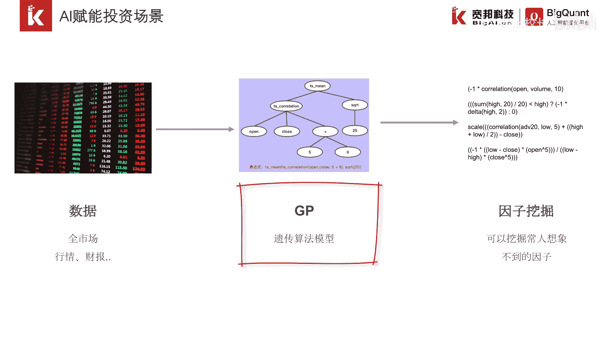
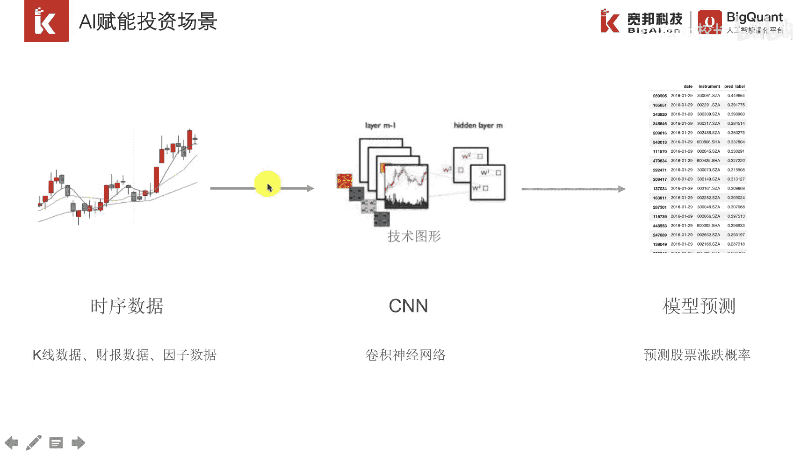

# P4：1.1.4 AI量化概览 - 程序大本营 - BV1KL411z7WA

这一节我们的主要内容是ai量化概览，说到ai的话，大家可能有点陌生，接下来我们举例几个ai赋能投资的场景，第一个场景是排序学习模型，在搜索引擎上我们输入一个词条，就可以从海量的网页中。

这个网页的数据规模可能是数千万，数亿获取到该词条的一个排序结果，其中排序越靠前的网页与词条相关性越高，在金融市场上，这样的模型被称为stop rank模型，从字面上看得出来，这是一个股票排序的一个算法。

可以对全市场的股票，按照未来一段时间的收益率进行预测排序，排序的依据主要就是依据股票的行情数据，财报数据等等，这样的数据在模型中我们统称为因子。

第二个af呢投资场景是深度学习的一个应用，深度学习是机器学习的一个子集，机器学习是人工智能非常有前景的一个领域，dn也被称为全连接，深度神经网络，可以算得上是深度学习中最简单的一个模型。

但其预测能力并不逊色，借助dn算法，我们可以对股票因子和收益率之间的相关关系，进行数据挖掘，找到其中蕴含的关系，一般这种关系非常复杂。

是非线性的，在2015年，著名国际量化基金word count，发布了一篇名为二发101的研究报告，在报告中公布了，企业基金所发现的101个因子，这101个因子的构建非常复杂。

正如最右侧的图片所显示的这样，第一个因子是最近十天，开盘价和成交量的一个相关关系，后面的这些因子甚至用到了，非常复杂的一些计算公式，比如说取对数开方排序，这样复杂的因子并非是研究员直接构建出来的。

而是通过机器学习算法自动从数据中进行挖掘，其中遗传算法是一个代表的一个算法，遗传算法是根据生物界进化的原则，在海量的因子种群中进行优胜劣汰，最终找到有盈利能力的因子，因此这些因子也比较复杂。

最后一个ai赋能量化的投资场景是cnn模型，这也是深度学习的一个疫苗，cn模型也被称为卷积神经网络，目前在计算机视觉，自然语言处理等方面取得了卓越的成效，因为在金融数据中。

持续相关性是非常重要的一个特征，前一天的数据和后一天的数据并不是没有关系，借助该模型的卷积和池化操作，一方面我们可以学习走势图中的一些，局部的一些特征，另一方面，我们又可以对金融数据走势图。

进行一个抽象和概括。

