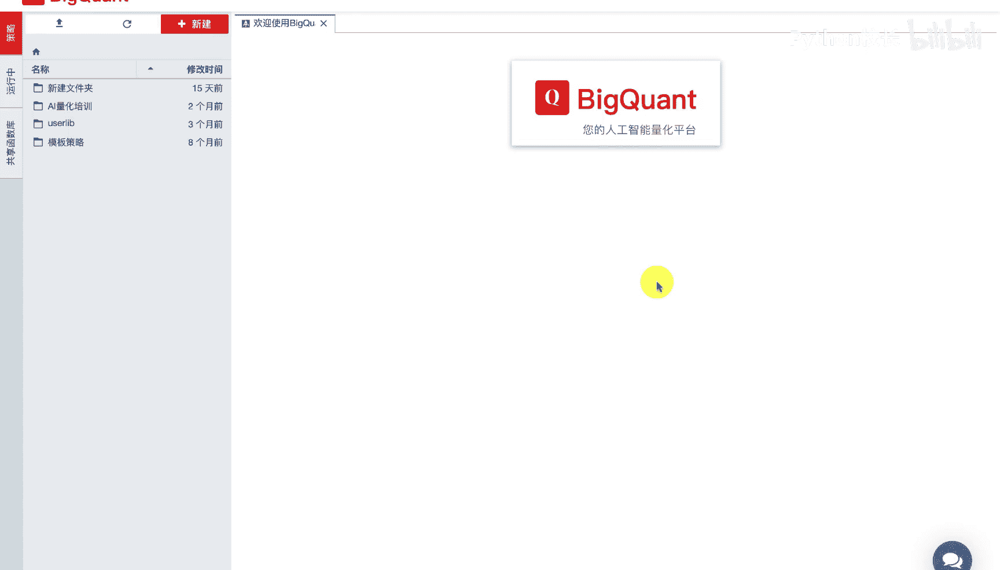
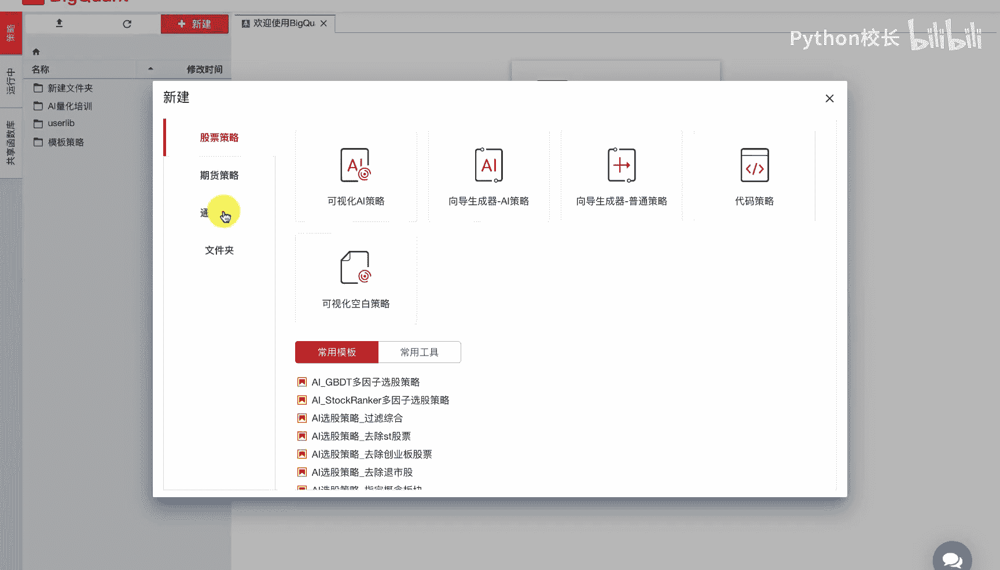
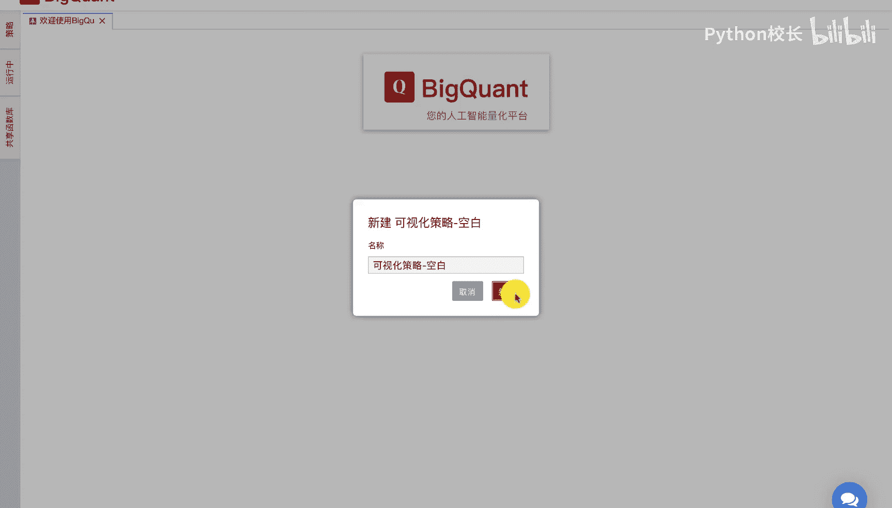
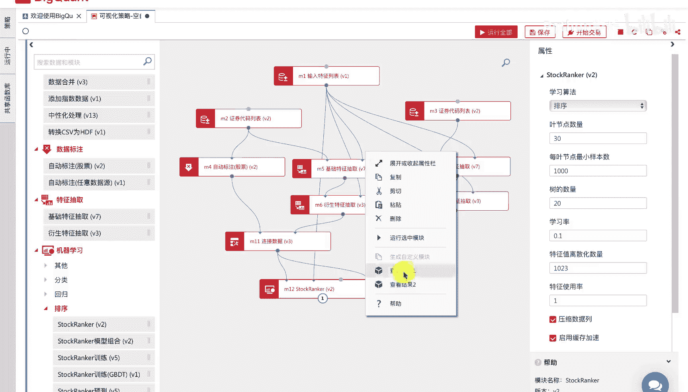
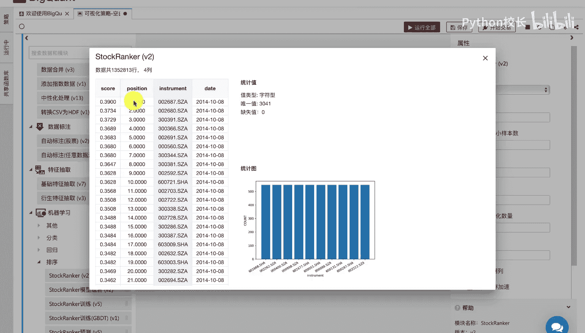
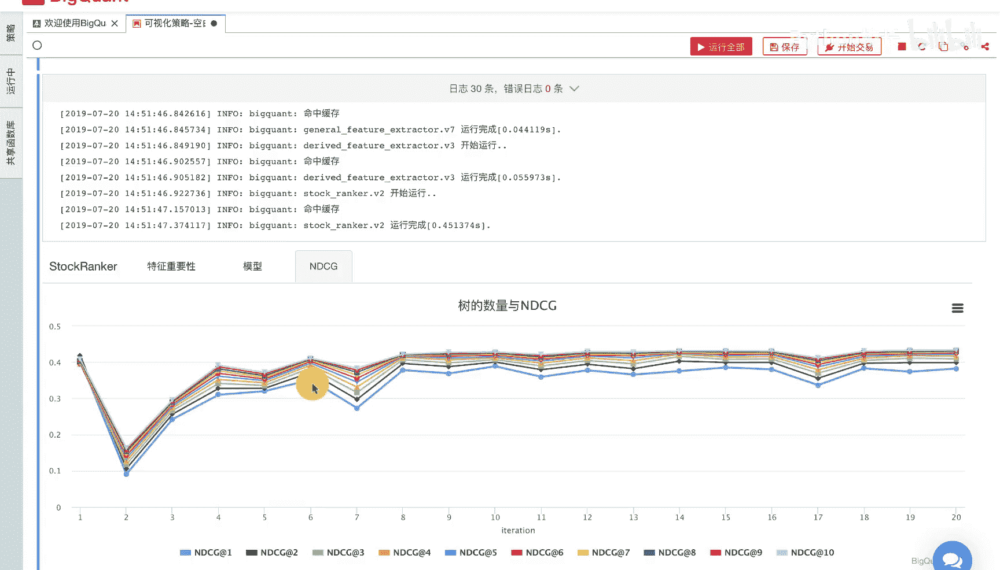

# P40：7.2AI模型构建步骤 - 程序大本营 - BV1KL411z7WA

我来介绍一下ai模型的构建步骤。

我们以对数市值因子为例，使用stock ramper排序算法来构建一个ai模型，可以看到该模型的构建分为六个步骤，第一步我们指定因子特征，第二步我们指定数据的股票和时间范围，将数据拆分为训练集和验证集。

第三步我们在训练集上计算每只股票的好坏，也就是标注，第四步，我们抽取训练集和验证集的因子数据，第五步，我们将抽取的训练集因子数据和标注进行合并，得到完整的训练集数据，第六步。

我们将训练集数据传递给stop rana模型，进行模型的训练，并拿到训练好模型，在预测集的因子上进行股票预测，得到预测题上每只股票未来五日收益率的排序，下面我们看一下具体的实施步骤，第一步。

我们通过输入特征列表模块填写，我们需要抽取的因此特征及对数流通市值，我们这里填入的log market cap float，零，也就是流通市值因子的倍数，这样一个表达式，就指定了对数市值这样一个因子。

第二步，我们通过指定训练集的股票和时间范围，和验证集的股票时间和范围，来将数据拆分为训练集和验证集，需要注意的是，这里我们拆分的标准是按照时间先后顺序，我们采用2010年到2015年的数据，进行训练。

使用2015年到2017年的数据进行预测，我们默认选择的是全市场股票范围，这里注意到我们所设置的训练集和验证集，的股票时间范围上没有交叉，可以看到，我们在时间轴上，将训练集和验证集的起止时间严格分开。

是为了防止金融时间序列的交叉，引入未来函数，进而影响我们的模型训练效果，第三步，我们通过股票自动标注模块，实现股票好坏的评价，我们这里采用表达式。

shift close-5除以shift open-1这样一个表达式，即股票未来50收益作为股票好坏的评价标准，并进行及时处理和分类映射，同时我们考虑了过滤一字涨停的情况。

我们可以通过运行该模块查看模块结果，来进行label计算值，相关统计数据和统计分布的观察，第四步我们进行，因此数据的抽取，包括训练集数据和验证集数据的抽取，因子数据的抽取分为三个步骤。

首先我们从基础的因子库中直接获取表达式中，基础因子字段，market cap float 0，也就是流通市值，然后我们利用衍生特征抽取模块，进行最终的表达式，log market cap flow的零。

也就是对数数值的计算，最后我们对计算返回的因子值进行缺失，数据处理，即删除掉还有缺失数据的行，这样做的原因是因为缺失值会影响模型的训练，导致模型训练报错，我们可以通过设置衍生抽取模块中的删除。

按数据这个选项，同时实现因子的计算和缺失数据的处理，注意到在基础特征抽取模块中，有一个参数叫向前取数据天数，该参数的含义如下，假设我们需要计算三日平均收盘价，mk close 03这样一个因子。

首先我们从数据库中需要抽取到close 0的数据，为了计算开始日期对应的，该三日平均收盘价的值，我们需要额外向前取三天close 0的数据，因此这里我们可以填入三或者更大的数据。

来保证我们的起始日期对应的，因此计算值不为难值，九步，我们连接数据和标注，我们通过连接数据模块，将训练集的因子数据和标注数据，通过日期date和股票代码instrument。

所以连接就得到了完整的训练集数据，对于预测题数据而言，我们只需要针对因子数据做出预测，因此我们这里并不需要进行连接数据操作，第六步网构建stop rank模型并训练预测，我们将训练集数据特征列表。

数据和预测及数据传给step rank模块，模块会自动根据我们输入的特征列表，模块指定的因子，训练集数据和对应的label数据进行模型训练，并在预测及数据上做出每日每只股票，未来五日收益排序的预测值。

我们运行完stove ranker模型后，会展示因子的模型重要度，得分以及可视化的数模型角色分支，我们通过右键运行模块，还可以查看模型在验证集上的预测结果，即每日每只股票的得分score以及它的排序。

position，下面我们介绍一下，如何在被框的平台上构建ai模型，首先我们进入编写策略界面。

我们点击新建，通用策略我们选择可视化空白策略。

我们点击新建，这样就创建了一个可视化的空白策略，我们在左侧的模块列表中，找到数据输入输出模块列表，我们拖入输入特征列表模块到画布中，我们修改该模块的相关属性，这里我们填入我们所需要抽取的表达式因子。

我们贴入log market cap float，零即对数流通市值，紧接着我们从左侧的模块列表中，找到数据标注，然后拖入，然后我们从左侧的数据输入输出模块列表中，继续拖入证券代码列表模块。

我们分别投入两个证券代码列表模块，既有设置训练集与预测级的起止时间，与股票池范围，我们首先设置训练集的时间，起始范围为2010年1月一日，到2015年的1月一日，股票是范围为全市场的a股股票。

然后我们设置预测机的起止时间范围为，2015年的1月一日，到2017年的1月一日，同样也是全市场的a股股票范围，紧接着，我们从左侧的模块列表中找到自动标注模块，并拖入画布中，我们连接证券代码列表模块。

和自动标注股票模块，我们点击自动标注模块，并设置我们所需要的标注，这里我们采用默认的未来五日收益率，作为股票的评价标准，我们对标注进行机制处理，分类映射以及一字板过滤。

然后我们从左侧的特征抽取模块列表中拖入，基础特征抽取模块和衍生特征抽取模块，我们按照输入节点的提示进行模块连接，然后我们设置相应模块的参数，例如基础特征模块抽取中的向前取数据天数。

并勾选衍生特征抽取模块中的删除，按数据选项，这样我们就完成了渲染机因子数据的抽取，同样的道理，我们再次拖入基础特征抽取模块，和衍生特征抽取模块进行，预测及因子数据的抽取，我们连接相应的模块。

我们进行模块的参数设置，同样勾选衍生特征模块的删除，那数据，这样我们就完成了第三步，特征因子数据的抽取，紧接着，我们在数据处理模块列表中拖入连接数据模块，我们连接训练集的标注数据以及特征因子数据。

构成完整的训练集数据，然后我们在左侧的模块导航栏中，找到机器学习相关的模块列表，我们找到排序模块列表，拖入stock ranker，我们连接训练集的模块数据到stop rank，作为模型的输入数据。

然后我们指定该模型的训练因子，我们连接输入特征列表，dostock ranker模块，这样stop runk就会训练并找到标注，即未来五日收益率与，因此特征对数流通事实之间的关系，从而构建模型。

最后我们连接预测集数据，如果我们想评价模型在训练集数据上的表现，我们可以连接带有label的训练集数据，作为测试集传给staff ranker，最后我们完成了模型构建的工作流后。

我们可以点击最上方的运行全部按钮，或者可视化cell的右上角运行按钮，进行工作流的运行，在工作流的运行过程中，左上方会显示运行状态正在运行，下方会给出对应的运行日志，包括模块的运行状态以及所用时间等。

模块已经后，我们可以看到模型输出对应的因子特征重要性，由于本模型我们只使用了一个对数流通，市值因子，因此这里只有一个柱状图，特征的重要性的值的大小，反映了该特征在模型中的重要程度。

然后我们可以通过点击模型选项卡，来查看stop rank数模型的结构，我们可以看到该模型由20个角色分支组成，我们点开每一个决策节点，可以看到对应着有不同的角色分支，每个分支的尽头有一个决策得分。

代表着该角色分支对每只股票的一个打分，我们将所有决策分支的最终得分累加在一起，就得到该模型对每只股票的一个决策总得分，我们根据总得分可以进行排序，就得到了每天每只股票在全市场中的一个排序。

我们也可以通过右键查看结果。

二来看到对应的结果，我们可以看到预测的结果包括两个字段，即每天每只股票的得分score，以及他所在的排名位置，position。

最后我们可以通过点击n d c g选项卡，来查看该模型在训练集上的一个表现，n d c g是排序模型的一个评价标准，反映了排序模型的稳健性。

nbcg的分值越高。