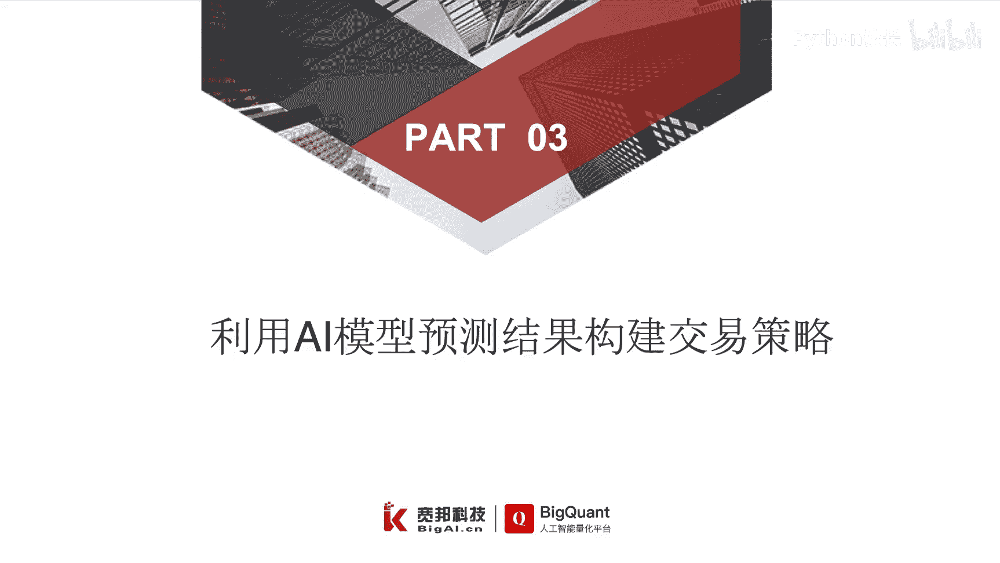
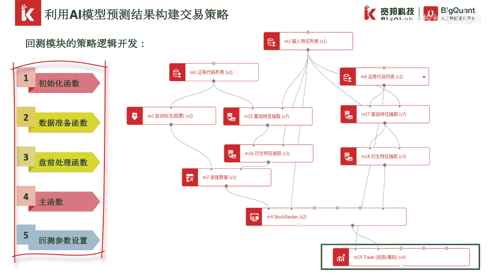
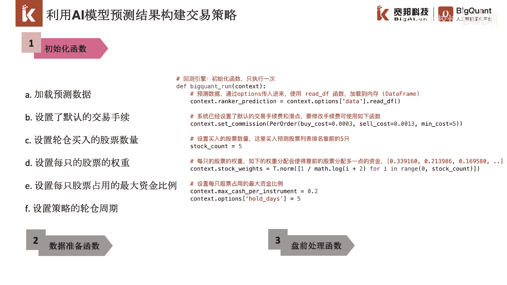
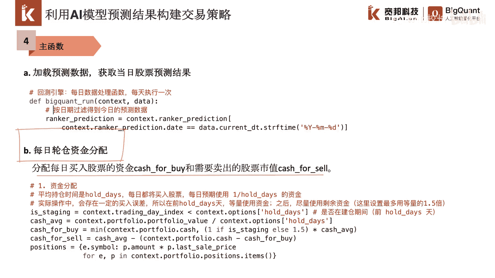
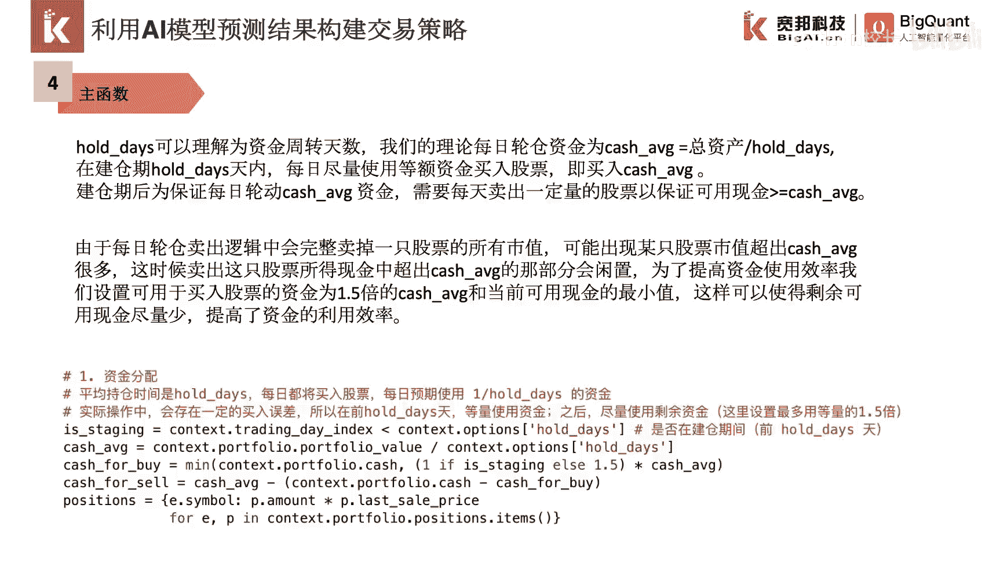
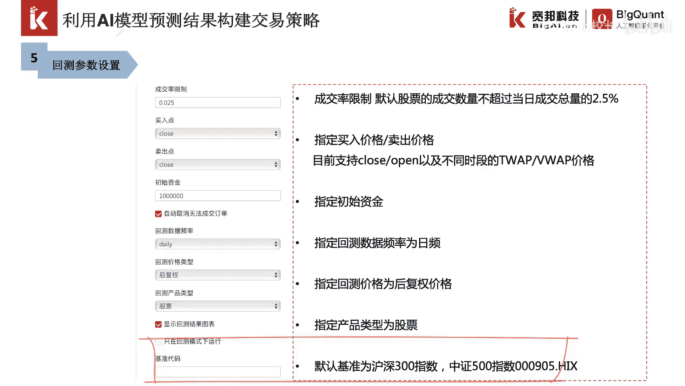

# P41：7.3利用模型预测结果构建交易策略 - 程序大本营 - BV1KL411z7WA

如何利用ai模型的预测结果来构建交易策略。

在上一节我们已经介绍了，如何在被框的平台下构建ai模型，这一节，我们利用stock ranker模型在预测集上的排序，预测结果进行策略逻辑的开发，我们拖入trade回测模拟模块。

首先我们连接预测集的证券代码列表模块，和stop ranker的预测结果，证券代码列表模块设置了回测模块的回测时间，起始范围和股票范围，而stop ranker的预测结果将作为我们轮舱的标准。

我们依据股票未来50收益率的预测排序结果，进行买卖控制，回测模块包含了五个重要部分，即初始化函数，数据准备函数，盘前处理函数，主函数以及回测参数的设置。

首先我们来看一下初始化函数，在初始化函数中，我们通过context，点options data来获取stop rank的预测结果，对应的缓存，我们通过点redf方法实现了预测结果的加载。

并赋值给context。rank prediction这样一个变量，紧接着，我们在初始化函数中设置了交易的手续费率，这里设置的买入的手续费率为万分之三，卖出的手续费率为1。3‰。

手续费不足五元时按五元计算，紧接着我们进行了每日轮仓股票数量的设置，这里我们设置每日买入股票数量为五只，同时我们设置了股票的分配权重，我们采用t。norm函数实现仓位的非均匀配置。

进而保证排名靠前的股票拥有更高的仓位权重，我们也可以通过其他的仓位配置方法，例如等权重配置等，最后我们设置了每只股票占用的最大资金比例，为20%，同时设置策略的轮舱周期，context。options。

hood days等于五，该轮仓周期表示了总资产的换手周期，即每天进行总资产的1/5仓位轮动，在本案例中，数据准备函数和盘前处理函数中，没有进行任何的操作。

我们的主要换弹逻辑编写在主函数中，主函数的结构如下，首先我们加载预测数据，并依据当天的日期，我们可以通过data。current dt来获取每日的日期，通过该日期对预测数据进行过滤。

得到当日的每日排序结果，我们利用预测的排序结果可以进行轮舱设置，紧接着我们来分配每日的轮仓资金，这里我们需要分配每日买入股票的资金，开始forbi和需要卖出的股票市值，catch for sale。

我们来看一下每日轮仓资金分配的逻辑。

首先我们设置了一个换成周期hood days，我们可以理解为资金周转天数，我们的理论，每日轮仓资金为总资产的hold this分之一，我们将投资期分为建仓期和非建仓期，在建仓期hot date天之内。

我们每天用等额的资金买入股票，在建仓期后，我们保证每日轮动资金，大于等于总资产的hod分之一，如果现金不足，我们则需要每天首先卖出一定量的股票，来保证我们的可用现金，能够达到伦仓资金的要求。

由于每日轮仓卖出逻辑中，会完整地卖掉一只股票的所有市值，因此可能会出现某只股票，由于其市值较高，导致卖出该股票后，我们的可用余额超过了每日轮仓资金，这时候超出的资金就会闲置，为了提高资金使用效率。

我们可以设置用于买入股票的资金，为1。5倍的每日轮仓资金，和当前可用现金的最小值，这样就可以使得剩余的可用现金尽量少，从而提高了资金的利用效率，紧接着我们进行轮仓卖出逻辑的编写。

我们在hold days建仓期之后，开始轮仓卖出股票，对于已经持有的股票，我们按照机器学习算法预测的排序，进行末尾淘汰，每次卖出一只股票，就记录一下可用现金是否足够轮仓资金。

最后我们进行轮仓买入逻辑的编写，我们按照排序预测的结果，买入排名靠前的固定支出股票，并保证每只股票的仓位，不超过最大资金比例的限制，这样就完成了交易策略的构建，最后我们为回测进行相关的回测参数设置。

这里我们需要设置成交率限制，即默认股票的成交数量，不超过当日总成交量的一定百分比，此外我们还需要设置我们的买入价格，这里我们可以指定买入价格为开盘价，收盘价。

以及不同时段的t w a p和v w a p价格，同样我们也要设置卖出股票的价格，然后我们设置该策略的初始资金，以及回测的数据频率，回撤价格的类型，我们可以选择后复权或真实价格，如果选择真实价格。

每日的回撤会模拟股票的填权分红派息，进行账户的更新，如果采用后复权价格，股票在回撤过程中，将使用后复权的价格进行下单，最后我们指定回测产品的类型为股票，并填入回撤的基准代码，默认的基准为沪深300指数。

即000300点，hi x，我们也可以指定中证500指数，000905点。

