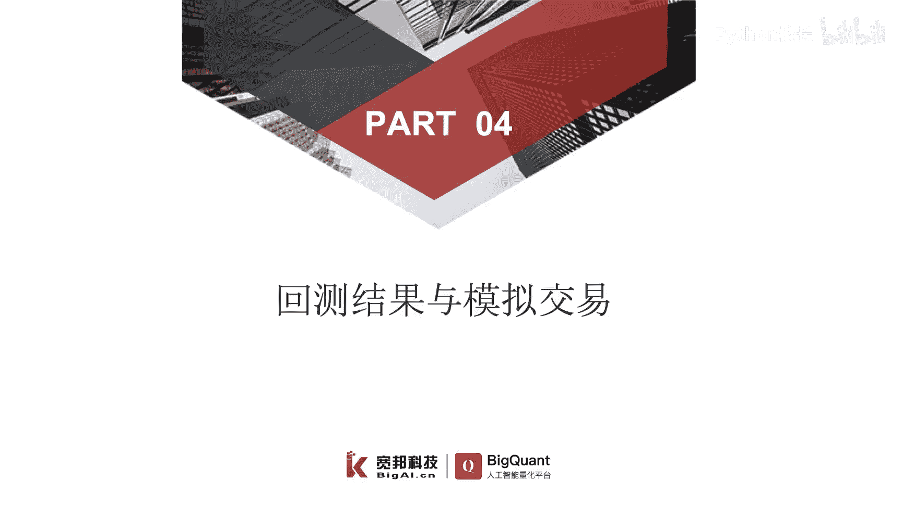
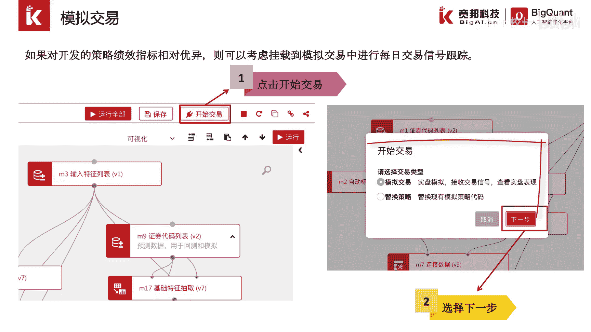
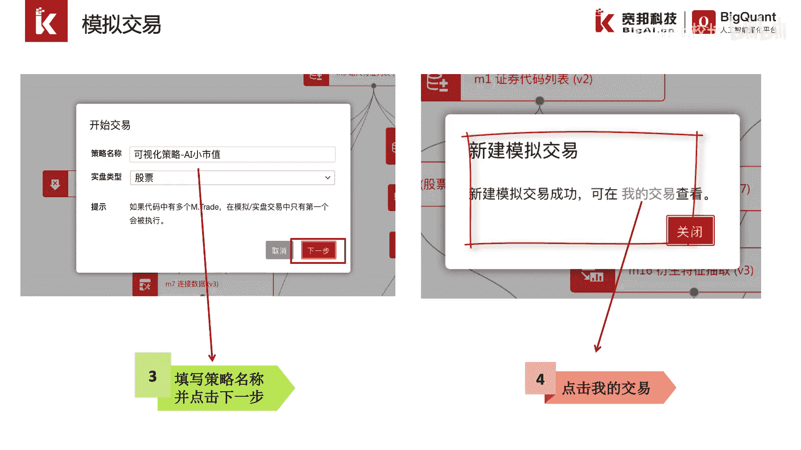
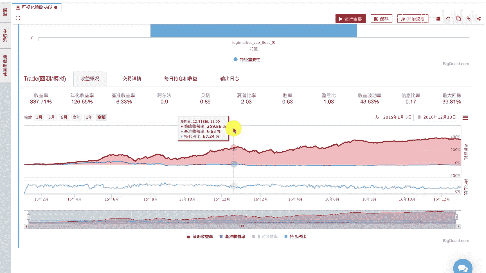
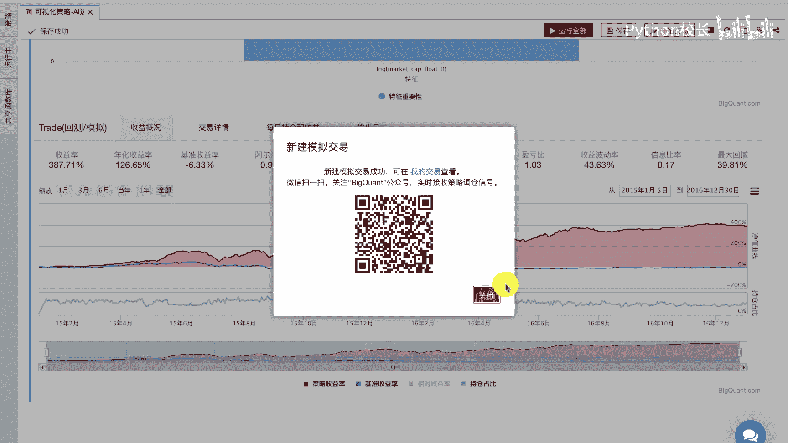
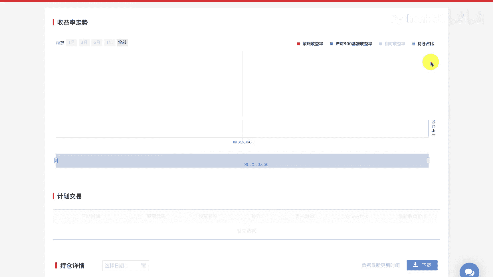

# P42：7.4回测结果与模拟交易 - 程序大本营 - BV1KL411z7WA

我们介绍一下回测结果的查看，与模拟交易的实现。

上一节我们介绍了如何构建ai股票策略，我们可以通过点击运行全部按钮，或点击可视化cell的运行按钮来实现策略回测，运行策略回测后将展示下图的策略回测报告，在收益概况选项卡中。

我们可以看到该策略的相关统计指标，包括收益率，夏普比率，盈亏比，最大回撤等信息，同时还将展示三条曲线，红色曲线代表该策略的累计收益率，蓝色曲线代表基准指数的累计收益率，绿色曲线代表每天的持仓占比。

我们点击交易详情选项卡，可以看到每天交易的股票代码数量，成交价格成本和交易佣金等信息，我们可以通过点击右下角的交易详情下载按钮，来下载查阅，在每日持仓和收益选项卡中，我们可以查看。

每天持仓的股票和以收盘价计算的，一个浮动收益，我们同样也可以点击下载按钮进行下载查阅，在输出日志选项卡中，我们可以查询每天的订单信息，和下单撮合的异常情况，原因等相关内容。

当我们进行交易参数的修改或模型修改，达到理想的模型回测结果后，我们就可以进入模拟交易，我们对开发的策略绩效指标进行确认，然后点击开始交易按钮，在弹出的选项卡中选择模拟交易。

点击下一步，我们填写模拟交易的策略名称，选择实盘类型为股票，点击下一步，这样我们就新建了一个模拟交易，我们可以通过点击我的交易链接，进入到我的交易页面中进行模拟交易的查看。

在模拟交易我们可以看到现有的模拟交易列表，针对每一个模拟交易，我们可以开启微信或者是邮件的信号推送，同时我们也可以将该策略，分享到策略天梯或者商城，模拟交易的每日运行流程如下，首先每日平台数据更新。

紧接着模拟交易，将策略文件预测及的起止时间，更新为最新的日期，然后抽取最新日期的因子特征数据，利用最新日的因子数据和存储的模型，对股票进行排序预测，根据预测结果回测模块。

各个函数依次执行交易逻辑并处罚下单指令，生成下单信号，最后我们将订单信息通过邮件或者微信的方式，推送到客户下面，我们在被控的平台上来查看一下，策略的回测结果，并提交模拟交易。

首先我们从回测与交易模块列表中找到trade，回测模拟交易这样一个模块，我们连接相关的输入，包括预测集的正常代码列表，以及dog rank模型的预测结果，我们保持trade模块中的各函数为默认状态。

我们点击运行全部或者运行gsl，进行策略的回测，运行后我们可以看到回测的结果，包括策略的收益率曲线，基准的收益率曲线，以及持仓占比和相关的统计指标，我们点击交易详情，可以看到每天买卖的股票相关信息。

点击每日持仓和收益，可以查看到每天的持仓和收益信息，同时支持我们下载这些详情进行查看，最后点击输出日志，我们可以查看到一些报错信息，例如股票一字涨停不能买入，假设我们认为该策略相对可信。

我们可以点击开始交易按钮，我们选择模拟交易，并指定一个策略名称，我们点击下一步，这样就完成了新建的模拟交易，我们可以通过微信扫一扫绑定vivo的公众号，这样每日的模拟信号就会实时的推送到手机端。

我们可以点击我的交易，进入到我的交易界面中，查看我们挂载的模拟交易，我们可以点亮微信推送，邮件推送也可以分享到策略天梯，我们通过点击策略名称，可以查看该模拟策略的一个交易行状态，包括每日的策略日志。

以及每日的计划下单等信息和策略设置，在策略设置中，我们可以修改策略描述或暂停策略，也可以选择申请上架到策略商城，或分享到策略天梯，同时可以点击开始启动或关闭邮件，调仓和微信调仓等通知。

设置在策略概述选项卡中，我们会看到该策略的每日收益走势，以及每日的计划下单以及每日的持仓详情，交易详情，卖出详情等信息，并提供下载功能，我们可以依据这些信息进行，实盘下单或策略的验证。

