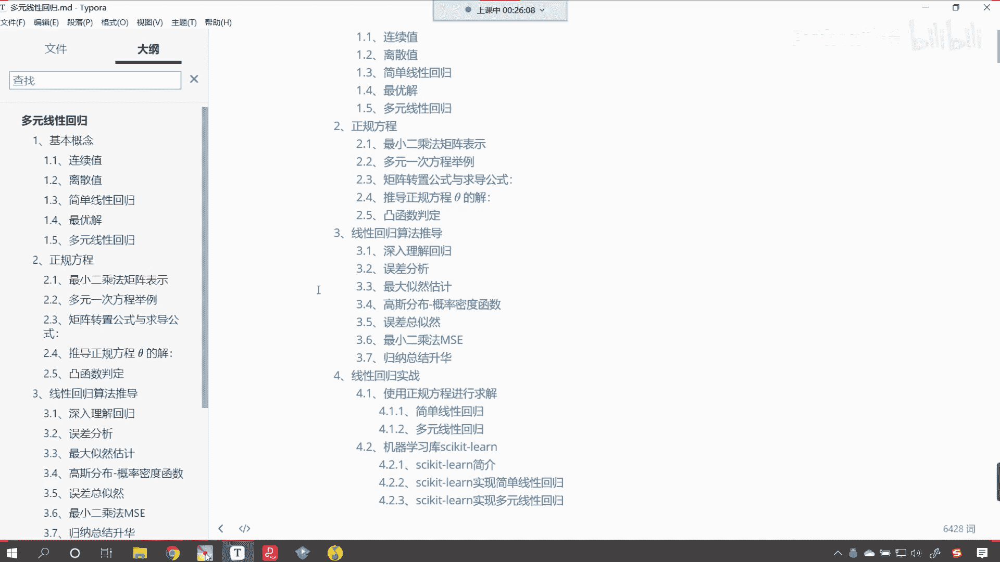

# P43：1-线性回归介绍 - 程序大本营 - BV1KL411z7WA

我们简单的算法呢是多元线性回归，那我们就看一下咱们这个多元线性回归，它呢到底是什么。

好那么这个呢是我们的第一个算法，那这个算法呢也可以帮助我们解决一些问题，比如说复杂一点的，比如说股票的一个走势，那我们很多人呢都想要知道股票到底是怎么走，它是怎么样的一个趋势，是不是啊。

这个明天到底是涨还是跌，这个呢其实是受很多因素影响，但是呢他受的因素非常多，那只要你收集的数据足够多，那其实它这个规律是可以预测的，你就像我对你，我对你的这个观察，我对你收集的规律足够多。

那其实我可以预测你的行为是吧，这是可以预测的啊，只不过呢咱们股票的预测它不是那么的精准，现在的一些大的这个科技互联网公司，金融公司，华尔街的那些公司，他们雇用最多的员工，其实就是程序员。

其实就是算法工程师，那这个这个呢我们就知道在咱们现代社会当中，算法程序在各行各业已经有一个广泛的应用了，那我们万事开头，咱们机器学习咱们呢就从线性回归开始，那听到这个词，大家可能会有点模糊。

这什么是线性回归呢，那什么是线性呢，什么又是回归呢，那我们知道咱们在进行数学实验，或者说我们在进行相应的这个嗯，自然属性操作的时候啊，你比如说啊，嗯比如说咱们整个人群当中的一个身高，它是不是有高有矮啊。

对不对啊，如果我们统计一下，就会发现个子高的人特别少，你像姚明是吧，中国就一个他长得那么高是吧，2米26这个呢就属于是特别高的人了，那还有有的人是不是特别爱嗯，比如说这个潘长江是不是啊，他个子相。

他个子相对于我们平常人而言，是不是就有点矮呀，对不对，那我们大部分人看咱们大部分人，是不是都是中等身材呀，对不对，都是中等身材，那是什么样的力量，把我们普通人变成了中等身材呢，哎这就是回归的力量。

那这个回归我们这些属性是谁在驱动呀，是不是你的基因呀，是不是我们每个人的基因呀对吧，那除了跟基因有关，那是不是还跟我们的饮食，是不是还跟我们的生活习惯有一定关系啊，对不对啊，你比如说同样一个人是吧。

双胞胎我们把它们分开，一个人饮食比较好，伙食比较好，另一个人饮食比较差，比如说把他送到非洲了，那20年之后是吧，长大成人肯定是生活在中国，饮食比较好，营养比较均衡的这个长得更高，是不是啊。

那如果说我们让他多吃牛肉增加锻炼，那么他的身高还会有还会有一定程度的增加，所以说这有很多因素决定，但是最终呢唉它会有一个分布，它会呢唉趋于某一个值，这个就是自然的力量，你看我们社会当中有经济学家。

有数学家，每1年都会颁发这个诺贝尔经济学奖是吧，这个在数学领域也有很多这个国际性的大奖，那这些研究呢哎都是在研究规律，那我们研究着研究着就发现其实很多事情是吧，是不是都有规律呀。

你就是你像现在这个火箭上天一样，前一段时间咱们神舟12号，是不是载人飞船给上天了呀，那它依靠的是什么原理呢，它依靠的是不是牛顿提供的万有引力，牛顿三定律啊，对不对啊，这个彩票没啥规律是吧。

仔细研究我们也能够发现其中的一定规律，那就是彩票中奖的概率特别小，建议你不要买，你通过买彩票想要改变自己的命运是吧，那就是非常小的概率性事件，所以说是吧，我们不能抱着这样的侥幸去去买彩票好。

那么咱们介绍了什么是回归，回归的话，我们就是通过一些通过一些数学上的工具方式，方法找到它的规律，把这个规律用公式给他写出来，你看牛顿之所以那么厉害，是不是研究了这个天体运动之后。

他最后是不是给了一个规律啊，叫牛顿第一定律，牛顿第二定律，牛顿第三定律是不是有相应的规律，我们发现无论是这个地球也好，火星也好是吧，还有这个太阳嗯，还有还有咱们的这个月球也好。

是不是都按照这个规律在进行运动呀，那我们设我们人类社会当中的一些问题，它是不是也有一些规律呀，对不对，他也有一些它也有一些规律，那这就是我们通过回归希望找到的这些规律，只要有了这个规律。

那你想你掌握了规律，你是不是就可以为所欲为了呀，哎咱们这句话说的有点夸张了啊，其实对于程序员而言，对于程序员而言，确实可以为所欲为好，那什么是线性的，你一定见过线条，是不是线条是不是都是直来直去的呀。

对不对，线条都是直来直去的，那线性回归呢，哎咱们其实呢就是一种研究呃，这个算法的一种方式，它呢最终为我们返回一个方程，这个方程呢是线性的，待会儿我们会看到具体线性回归，它的样子是什么样的好。

那么这个呢咱们就是对于线性回归。

