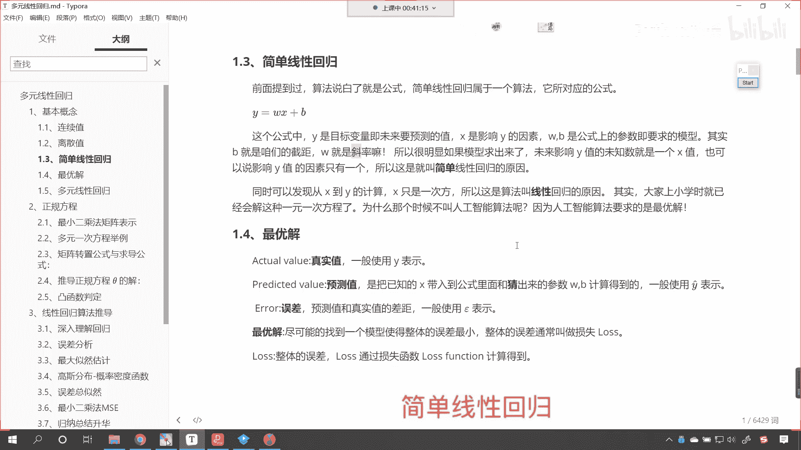
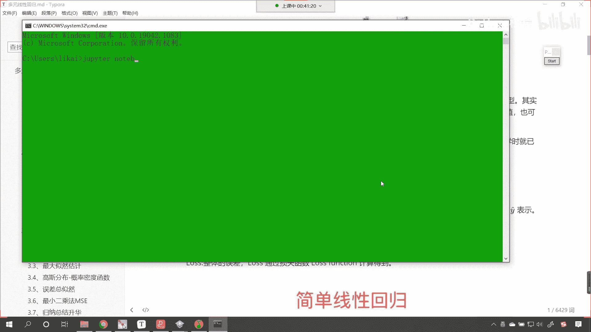
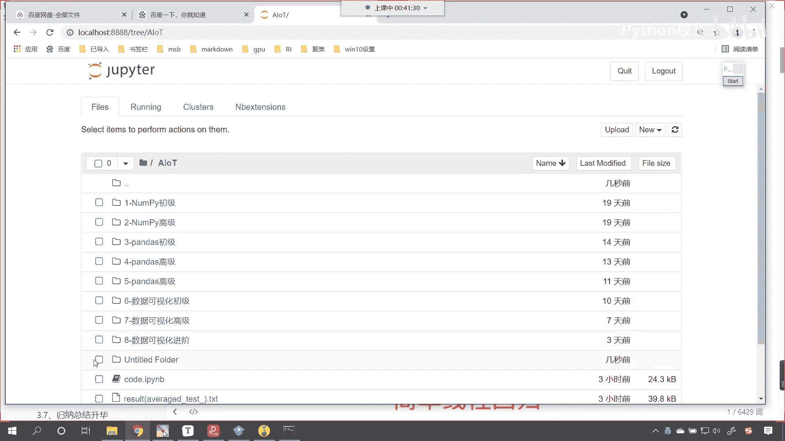
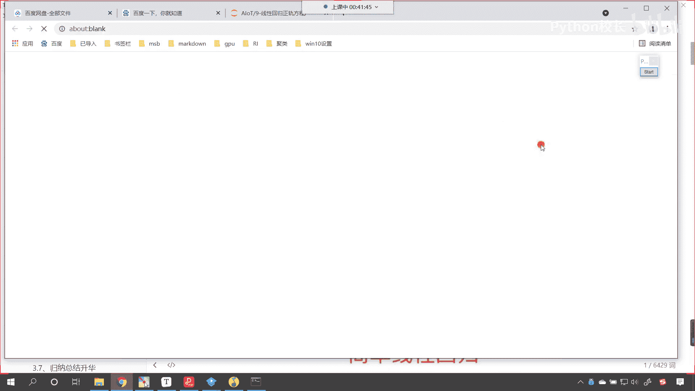
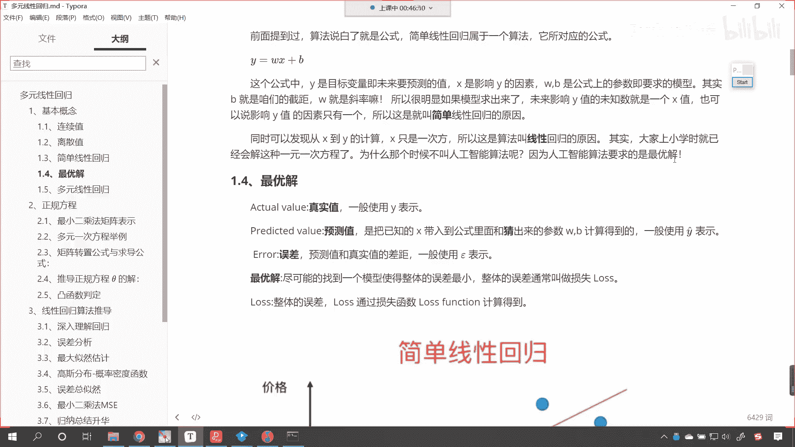

# P44：2-线性回归的基本概念1 - 程序大本营 - BV1KL411z7WA

咱们继续看相关的概念好，那么首先呢咱们看一下基本的概念，这线性回归呢是机器学习中有监督，机器学习下的一种算法，这什么是有监督呀，比如说啊这个你在考试的时候，你在这个上初中高中，那你其实都是有监督的学习。

比如说你做了相应的数学题，最后老师是不是会给你答案啊，对不对，你根据答案发现自己这个知识点搞错了，然后你根据答案校正自己，你是不是就是想要通过一次又一次的训练，去提高自己这个考试的分数呀，对不对。

哎所以这就是有监督，有监督，就是给他历史数据，让他学习从历史数据当中找规律，唉这叫有监督嗯，我们中国人常说叫以史为鉴，你看我们所说的以史为鉴，其实就是有监督学习咱们的回归问题。

主要关注的是因变量需要预测的值，可以是一个，也可以是多个和一个这个，一个或多个的自变量之间的关系，哎你看我们知道，万事万物之间是不是都有关系啊，那我们的x和y之间也有关系。

那这个关系呢就可以使用方程来进行表示，所以说大家看啊，这个重点是啊叫因变量，还有一个词儿是不是叫自变量呀，对不对，你看还有一个词，还有一个词叫自变量，这个因变量呢就是需要预测的值。

我们可以把它认为是明天股票它的价格是吧，这个是因变量，那还有一个词叫自变量，那你自变量什么样的信息，会影响咱们股票价格的走势呀，对不对，你比如说是吧，咱们中国有重大的技术突破。

是不是我们就是吧研制了一款新药，咱们这个平均的人均寿命可以活到300岁，那你看吧，这个股票一定会发生剧烈的变化是吧，因为寿命长了，你想是不是，某些股票是不是就会发生特别大的一个改变呀，那那咱们这儿说了。

这个因变量需要预测的值可以是一个，也可以是多个，大家注意啊，我们不能被个数给限制住了，那么因为方程，因为我们数学上的方程可以是丰富多彩的形式，可以是多种多样的呃，和一个或多个数值的自变量。

比如说咱们举例说影响股票是吧，除了政策之外，是不是还有咱们经济的发展情况呀，是不是，那甚至股票还和房价有一定的关系，甚至股票呢还和美国的政策有一定的关系等等，这些呢他们这些因素之间都存在一定的关系。

那线性回归算法就是研究它们之间的关系，我们把它量化，把它数字化，我们知道冥冥之中一定有关系，是什么关系呢，就是算法要解决的问题，咱们需要预测的值，我们把它称作目标变量，这个就是在机器学习当中的定义。

大家在我听课的过程当中，我们混一个耳熟，随着我们课程的继续，随着你对于这个行业的深入，那慢慢你就知道哎它是什么了，一般情况下咱们用target来表示，或者说使用y来表示好，那么这个值呢它可以是连续的。

也可以，这个值呢一般都是连续的预测变量啊，这个值一般都是连续的，啥意思呀，比如说身高，你看我们的身高呢，从171172173是吧，174。5，174。56，174点，这个五八我们把它细分的话。

这个身高是不是其实就是连续的呀，对不对，我们平时比较模糊，我们说一个人的身高是175，其实我们如果要精确测量的话，它是不是可以保留三位小数甚至四位小数呀，这个target就叫目标的意思啊。

所以我们把它叫做目标值好，那么影响目标变量的因素哦，我们把它叫做x，大家看这个就是x1 ，然后省略号一直到xn，它呢可以是多个，它可以是多个，那如果说我们想要建立它们之间的关系的话。

那其实咱们就可以写相应的方程，大家看啊，咱们这个方程呢我们就可以写成这个样的，比如说咱们的目标值叫y y呢，就等于w x，然后加上b哎，现在你就能够看到这个是不是就是一个方程呀，我们把这个叫什么。

咱把这个呢就叫做线性方程啊，我们把这个就叫做线性方程，那这个里边有两个数是未知的啊，这里边有两个数是未知的，一个是w，另一个呢是咱们的b，我们希望能够把w和b求解出来，有了方程，咱们是不是就可以预测。

他在任何一个点的位置了，你像当年是吧，咱们的这个开普勒是吧，开普勒他是天空立法者，他发现了这个行星运动的轨道，那其实就是一个椭圆嘛，计算出来这个椭圆之后，我在晚上的时候用天文望远镜。

我是不是可以根据它的公式，计算出来它特定的位置呀，是不是就可以找到他呀，对不对，所以你看这个开普勒发现的开普勒三定律，其实也是方程，对不对，好，那么我们把这个方程叫什么呀。

我们把这个方程咱们就叫做model啊，我们把这个方程叫model，model是什么，咱们把它翻译一下，这个是不是就是模型的意思呀，看到了吗，这个就叫做模型，那这个呢我们也把它叫做算法。

你看我们把它叫算法，这个是咱们最简单的一个算法，现在有复杂的算法，比如说深度神经网络，就像嗯现在的计算机可以模拟近似，模拟我们大脑一样是吧，像大脑一样进行工作，唉所以说这个算法数学都是一点一点演化。

一点一点进步到了今天是吧，哎我们其实就是站在了这个一个好的时代，那我们就迎接下一个时代，每一个时代是不是都有被淘汰的人呀，每一个时代也都有被选出来的这个天之骄子，那我们希望呢来通过自己的努力。

让自己变得更加优秀，这样的话是吧，这个最后时代才会进行一个选择，每个时代都是进行优势劣汰，只有不断的学习，才能唉才能有这个唉才能有自己的这个位置，在社会当中找到自己的位置，好这个呢是基本概念。

接下来呢我们继续看啊，这个连续值我们刚才讲到了连续值，我们刚才是不是也说到了离散值呀，大家看这个里边咱们所提供的这个连续值，就是身高，你想一下除了这个身高之外，咱们的连续值还有什么呀。

你像我们的体重是不是也是也是连续值呀，对不对，你像咱们的这个这个智商是不是也是连续值呀，对不对呀，你智商如果要精，如果要这个精确一点是吧，它就可以计算出来小数是吧，还有情商很多指标它呢都是连续值。

所以说连续值的特点你应该有一定的概念了吧，有一定的理解了吧，连续也就是说这个数值它是连续的，是不是好，我们接下来再看一下离散值，这什么是离散的呀，就是泾渭分明诶，这个就叫离散。

比如说咱们中国一共有多少个省市呀是吧，那这个我们得算上中国台湾，是不是啊，我们有34个是吧，这个省市还有这个直辖市，还有这个特区，是不是哎那你你看我们中国是吧，这34个他是不是就是泾渭分明呀。

新疆就是新疆，没有0。5个，新疆是不是青海就是青海，北京就是北京，河北就是河北，是不是，那我们如果要统计，我们学员都是来自于哪个省市，那你的这个统计的值是不是都是明确的呀对吧，你不可能说唉我既来自新疆。

又来自西藏，是不是，那不会是这样的，你的户口本上也不可能这么写，是不是啊，所以说这种值我们把它叫做离散之，那还有哪些值是离散值呀，各位同学们，你发挥一下你的聪明才智，来咱们在留言区，你给我反馈一下。

你能想到的离散值是什么，哎很好，我们有一个小伙伴是吧，stronger就说了性别对吧，像性别这样的，它也它呢也是离散值，对不对，那还有对啊，各个城市之间是吧，唉这些像这样的数据都是离散值。

还有军队的兵种是吧，我们海陆空是不是就三种呀，那接下来呢我们继续看啊，我们对这些概念有一定了解之后，咱们看一下简单线性回归，那既然是简单是吧，那我们就给一个最简单的那就是一个未知数，一个变量。

咱们前面提到了这个算法，说白了就是公式，看了吧，算法说白了就是公式，大家知道啊，这个数学史上非常伟大的，这个嗯非常伟大的数学家叫高斯啊，非常伟大的数学家叫高斯，高斯呢他就发现了这个最小二乘法。

它呢使用最小二乘法，发现了天上这个星星的轨道，那这个时候呢，其实这个啊这这个公式他当时发现了，但是呢他一直保密，别人问他说，你用什么样的算法，用什么样的公式，把把星星的轨道给这个算出来了呢，他说保密。

直到9年之后，高斯呢出了一本书是吧，把把这个公式呢给公开了，全世界人嗯，全世界的人都知道是吧，这个有最小二乘法了，我们线性回归，咱们就是基于高斯的最小二乘法推导出来的，所以现在呢我就讲了这样的一个故事。

那我们想要彻底地理解线性回归，咱们一步一个脚印是吧，把线性回归给它搞清楚，弄明白会使用好，那么咱们先从简单的说起啊，简单的线性回归属于一个算法，它所对应的公式大家能够看到是下面的。

y就等于w x加b在这个公式当中，y是目标变量及未来要预测的值，x是影响y的因素，w和b是公式上的参数，即我们要求解的模型，大家想一想，咱们的海拔和咱们的温度，是不是有一定的关系呀。

海拔和咱们的温度是不是有一定的关系，你看喜马拉雅那么高，对不对，它上面的温度是不是零下几十度呀，对不对，和他同一个纬度的，和他同一个纬度的这个云南是吧，那你看那儿的温度是不是就特别高呀。

是不是那儿的温度就比他高多了，那大家想海拔和咱们的温度之间，是不是存在这样的一个方程呀，对不对，存在这样的一个方程，那当然这个很多问题它不一定是线性的，但是呢在一定的范围之内。

它呢就是一定它呢就是线性的，这个我们大概知道这个之前咱们在之前呢，咱们在这个呃初中，高中在讲到海拔和温度关系的时候，呃，大概有这样的一个度量的标准，说这个海拔呢每上升1百米，那我们的温度呢大概降低0。

5度啊，大概降低0。5度，也就是说这个坐飞机的时候，你大概飞行在万米高空，在飞机外面它的温度啊，在飞飞机外面，它的温度呢唉大概是零下这个三四十度，这就是为什么夏天是吧，我们会下冰雹。

因为天上的温度比较冷啊，水蒸气鱼遇到这么冷的这个温度，它瞬间就结成冰块，是不是就下冰雹了，所以说这个随着温度的，随着海拔的升高，这个温度是降低的好，那么嗯嗯这个里边呢b就是咱们截距，w呢就是斜率。

这个是不是都比较容易理解呀，所以很明显，如果这个模型求求解出来了，那未来影响y的值的这个未知数就是一个x，也可以说影响y的因素只有一个，所以这就是我们把这种模型，就叫做简单的线性回归。

同时呢可以发现从x到y的计算x只是一次方，所以说呢这种算法叫线性回归嗯，如果说你对于数学，你看你对于数学有比较好的一个理解嗯，那我们就知道为什么一次我们把它叫线性了来。

现在呢咱们windows r我们启动一下主pater notebook。

咱们呢看一下这个为什么它叫线性进入，a l o t，现在的话我们创建一个folder。

我们呢给这个folder改个名，这个呢就叫做九杠，这叫做线性回归，今天我们要讲的是正规方程。

咱们在这个里边呢创建一个代码嗯。

创建一个代码，我们给它改个名，就叫做code code。

就有代码的意思，此时呢我们导入两个包，咱们import numpy as np，咱们import matt plot，lib piplot，起个别名as p l t执行一下这个代码。

现在我们给一个x x就等于np。lion space，比如说我从零到十，咱们呢把它分成50份，这个时候呢我给一个y y和x是什么关系呢，咱们让它是0。8，大家看啊，0。8我让他乘以x，然后我让他减去五。

这个时候呢我plot一下啊，plt。plot，咱们将x和y放进去，那我把它变成给他一个color，咱们呢让它是red，你看我一执行这条线是不是就是直来直去呀，看到了吧，是不是直来直去。

我们的x是几次幂呀，咱们的x是不是一次幂，这就是为什么我们把它叫做线性回归，看到了吗，因为它是线性，因为它是直线，因为它不是曲线，那怎么样才是曲线呢，来我现在再给你画一个图啊，双击咱们合起来啊。

同样咱们也给一个x np。lon space，咱们呢让它是从零到十，同样我们也把也把它分成50份，这个时候我们再给一个方程，y呢就等于x星号星号，你看这个星号星号是不是就表示平方呀。

然后呢我们让它加上这个四乘以x，然后呢它减去15，你看这个时候是不是就有一个方程了，对不对，现在你看啊，我plt。plot，我如果要把二次幂的这个函数画出来，你先来看一下它长什么样。

它是不是一个这样的一个曲线，看到了吧，这是不是就是一个抛物线呀，那他就是拐弯的，为什么拐弯，因为他带了一个次幂，看到了吧，带了一个平方，这是二次幂，那我们现在线性回归研究的唉都是一次幂的啊。

线性回归都是研究一次幂的，那其实呢这些大家在上学的时候，是不是已经学过这种一元一次方程了呀，那现在呢你看咱们到了机器学习，到了人工智能了是吧，那其实呢这个这就用到了，咱们之前学到的这个基本功是吧。

它是一脉相承的，都是相通的是吧，终于用到方程了，你像咱们之前中国有一句这个流行的话，叫学好数理化，走遍天下都不怕，现在依然也适用，知道吗，现在各种各样的互联网是吧，它用到的都是这些基础的这个研究。

这就是为什么你看华为特别重视基础投入，是不是啊，基础科学的研究，这些呢都有非常大的一个作用好，那么为什么咱们在上小学的时候，上初中的时候，它不叫人工智能算法呢，我们把它叫做方程。

是不是哎因为因为人工智能算法，咱们在那个因为人工智能算法呢，它是求的最优解，而我们那个时候咱们求的是不是，这个绝对直接就是是多少就是多少，这个方程解出来是三，那么它就是三方程解出来是五，那么它就是五。

我们把这个叫做唯一解，其实在咱们工业应用领域看看，在咱们工业应用领域，我们求最优解，你看这这个是啥意思啊，最优解就是合情合理的解，是不是，我给你举一个例子啊，比如说从中国到美国最短的距离是哪一条路呢。

你想一下，从中国到美国最近的一条路是哪一条呢，哎最近的一条路是直线，那直线的话是不是就是我们把地，我们把地球挖个洞穿过去，这个是不是最快的呀，对不对，看挖一个洞最快，对不对，但是你想这种方法可行吗。

那不可行，所以说那我们才会坐飞机嘛是吧，我们才会这个坐船是吧，嗯这个坐船坐飞机也有各种各样的路线，但是一定存在一个最短路线，是不是，但他但从理论上来说，最短的那条路线就是穿地下。

是不是这种你肯定穿不过去啊是吧，地球的这个核心温度很高呀，所以我们人工智能机器学习，咱们求一个最优解，知道吧，最优解最优解，也就是说能用就行，堪用就行好。

