# P45：3-线性回归的基本概念2 - 程序大本营 - BV1KL411z7WA

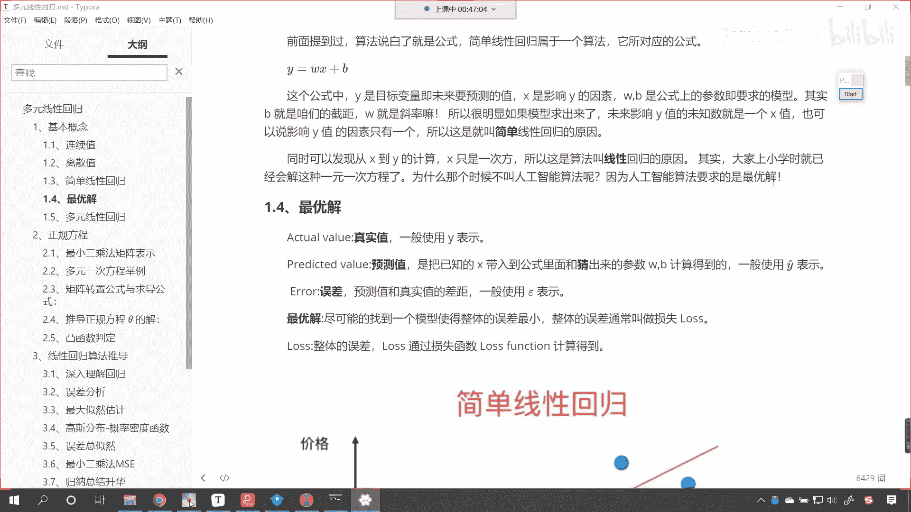

那我们接着我们刚才讲到的最优解，咱们呢继续向下延伸，我们真实值，我们一般用y来表示。

我们上面说了，它是不是代表着咱们的这个目标值呀。

看到了吧，y就是咱们的目标值，我们也把它叫做真实值。

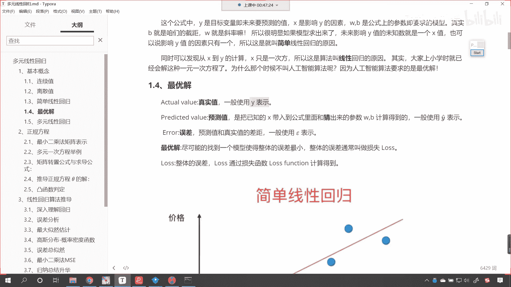

那还有一个呢叫做预测值，这什么是预测呀对吧，我们现在这个社会上有很多人是吧，都会进行预测，我们现在一些电视节目也会进行预测是吧，对不对呀，我们每天用的地图导航其实也是一种预测，对不对。

那天气预报说明天下雨，那你想有没有可能明天不下雨呢，这个是有可能的，是不是咱们的算法啊，我们的算法有了这个模型之后，咱们把相应的数据带进去，我们是不是就可以预测预测一下，这个预测一下相应的数据啊。

我们把已知的x带入到公式当中，猜是不是就可以预测一个结果呀，那么这个预测值咱们一般使用这个y y上，y的上面带一个帽子来表示，这个就叫预测值，我们辛辛苦苦，通过前人的努力和我们自己的努力。

咱们把模型找出来了，咱们把方程找出来了，方程一使用得到了预测值，我们是不是希望咱们的预测值和咱们的看，咱们是希望咱们的预测值和我们的真实值，它俩是不是越接近越好呀，对不对呀，他俩最好一样。

如果要一样的话，说明什么，是不是说明咱们的算法是不是比较精确，比较精准呀，对不对，但是呢这个没有完美，是不是啊，人也没有完美，所以这个时候会存在什么，看这个时候会存在误差，看到了吧。

一定会存在一定的误差是吧，我们就说了，美国的gps它是不是全球定位啊是吧，他现在这么豪横是吧，全球的国家他想打哪个就打哪个，是不是就想炸，想炸谁就炸谁，那他在精确制导的时候是不是也有一个误差呀。

可能是正-2米，这个已经足够准确了啊，唉这就误差，咱们现在北斗呢是吧，也有了天上也有很多卫星了，那我们呢唉这个也可以精确制导是吧，为全球提供定位服务，这个误差就是预测值和真实之间的差距。

我们一般用哎一般用这个符号来表示啊，我们就能够看到很多符号，是不是都是希腊字母呀，对不对，所以大家以后再看一些文献，或者说你工作当中遇到的时候，看到了某些符号，你要知道它是什么。

好接下来我们再来看最优解，就是尽可能找到一个模型，使整体的误差最小，那误差小，是不是说明咱们的预测值和真实值就越接近呀，对不对好，那么整体的误差呢，哎我们就用loss来表示，loss这个英语单词。

咱们翻译成中文是不是就叫损失的意思呀，对不对呀，我们每一个人都有损失厌恶，我们都希望损失越小越好，那对于算法又何尝不是呢是吧，你看你投资股票是吧，或者说你投入了一个相应的精力，你希望你获得的越多越好。

你希望你损失越少越好，那loss呢是整体的误差，咱们loss通过损失函数来计算得到，咱们刚才介绍到了高斯诶，这个数学家他所提到的最小二乘法，那么我们线性回归用到的就是最小二乘法。

这里提到的loss function啊，这里提到的loss function就是咱们后面要推导出来的，叫最小二乘法诶，你看这个公式很有魔力啊，这个公式很简单，但是这个公式呢特别强大，知道吗。

我一写你就明白这个公式代表着什么，咱们现在呢先留一个悬念是吧，我们呢先把整体的流程过一下，先知道一些概念是什么，先知道这个损失函数怎么计算出来的是吧，无论是损失也好，还是咱们的算法也好。

其实都是公式是吧。

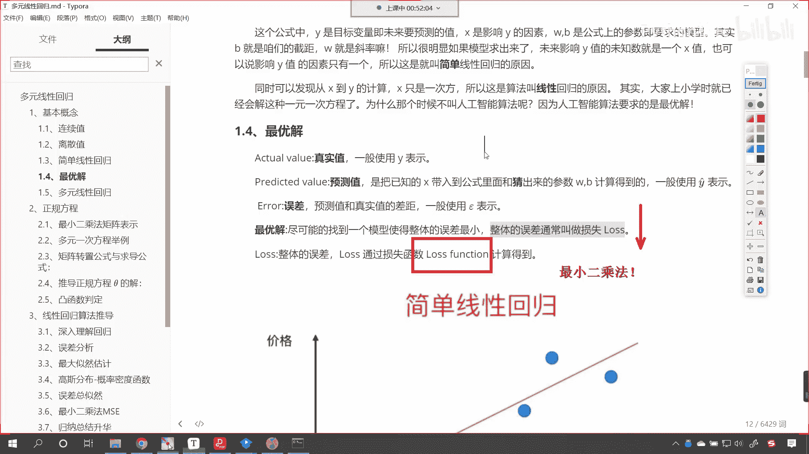

好那么咱们接下来呢继续往下看啊。

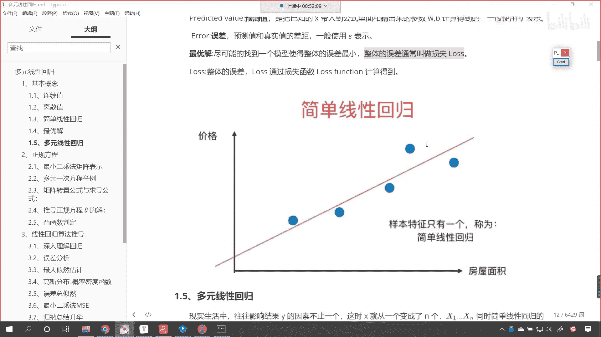

大家看这个就是简单线性回归，现在呢你就能够看到我这儿画了一个图，举了一个例子，那咱们知道这个房屋的面积和咱们房屋的价格，它是不是之间存在一定关系呢。

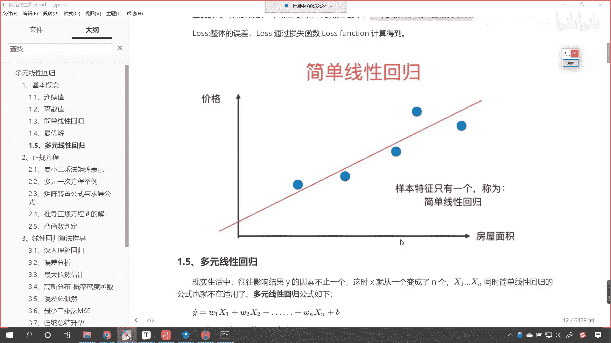

对不对，是不是存在一定的关系呢，唉这个我们这个沟通群里边说这个function是吧，function它有函数的意思啊，当然这个英语单词也有功能的意思啊。

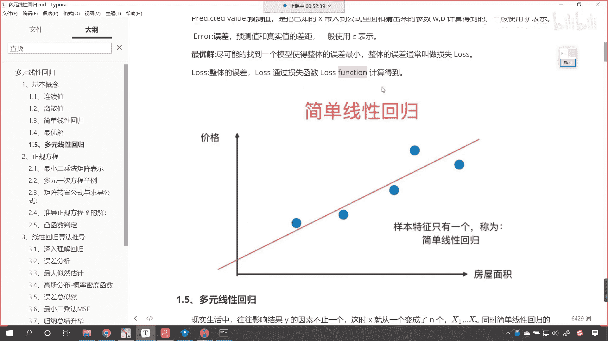

好那么我们知道他们是正相关的，是不是房屋面积和咱们的价格是正相关的，但是呢这个正相关，它是不是不是百分之百的正相关呀，并不是说你的房屋面积大，是不是你的价格一定就会高上天呀，对不对，你比如说我老家是吧。

我的房子是这个400平米的，还带着一个小院是吧，那跟北京是吧，二环内十平米的房子，那跟这个十平米的房子那就没法比，是不是为啥呀，因为地理位置是不是不一样呀，对不对，唉所以说呢它们会存在一定的波动。

但是呢一定会有一条线，就是咱们所看到的这条红色的线，跟这个红色的线是吧，都有一定的关系，你各个房屋，你的这个这个房型不一样是吧，布局不一样，朝向不一样，有一定的关系，但是呢这条线是吧，就束缚了这些点。

你的这些底儿是吧，不会波动特别大，当然有异常值，那些异常值就不是我们所考虑的范围，我们在进行数据处理的时候，咱们在学习pandas的时候，我们是不是介绍过异常值呀，对不对，你特别大或特别小。

对于我们研究是不是都没有实际的意义呀，比如说我们研究如何才能挣更多的钱是吧，你研究马云那是没有意义的，对不对啊，研究马云没有意义，因为马云属于是中国首富，他太富有了，他的他的这个财富是吧。

不仅仅是靠自己的努力，还有很大的就是一个运气是吧，碰上了这个时代是不是啊，所以说这就是特例，这种特例要删除，咱们要研究的话是吧，你就得研究像我这样的人，是不是我怎么通过一步一步的努力，从十几年前是吧。

月薪3000变到现在非常多，是不是，那你就得研究这个我是怎么做到的呀，那持续学习是吧，持续学习是一个非常重要的一个工具啊。

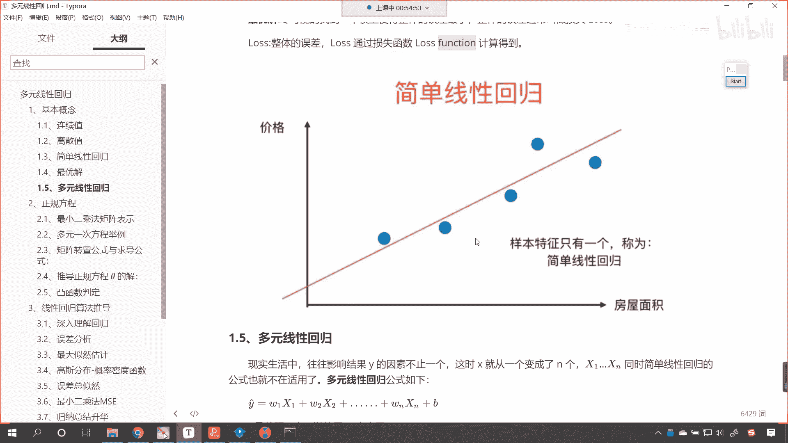

好那么这就是简单的线性回归，咱们就是要找到这条线，你想这条线是不是就对应着一个截距，b是不是对应着一个斜率w呀，对不对，那如何得到呢，对不对，如何得到呢，哎咱们有相应的方法。

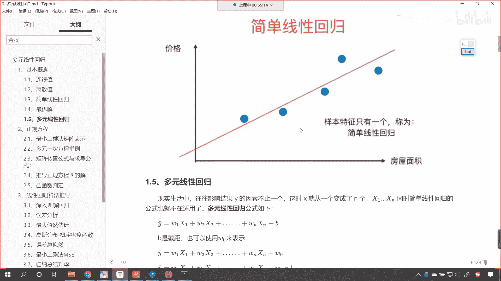

咱们有相应的招，接下来呢看完简单线性回归，咱们看一下复杂的那复杂的就叫多元线性回归，在咱们的现实生活中，往往影响外的因素可不止一个，这个时候咱们的x可能就变成多个了，比如说这个x11 直到x n。

那这些呢都是咱们的变量，比如说是吧，这个你之所以看啊，比如说银行要向你贷款是吧，现在这个有银行要为你提供金融服务，那请问你的信用额度是多少呢，对不对，你看我的支付宝信用额度就是30万是吧。

这个花呗呃戒备是吧，为什么这么高呢是吧，因为这个嗯因为我的薪资啊是吧，所在的城市呀，嗯还有这个我有良好的这个还款的，这个还款的记录，看这些是不是都影响，是这些是不是都影响着我的这个信誉啊。

它会根据很多因素，你比如说x1 x2 ，一直到x n这些共同的因素，是不是就确定了，我最终我的这个信用额度是多少呀，对不对，哎所以说那有些情况下，甚至说在大多数情况下，咱们自然世界当中的这些问题。

往往不是一个因素在嗯影响咱们的目标之外，而是有多个因素，这个时候咱们的方程就发生了变化。

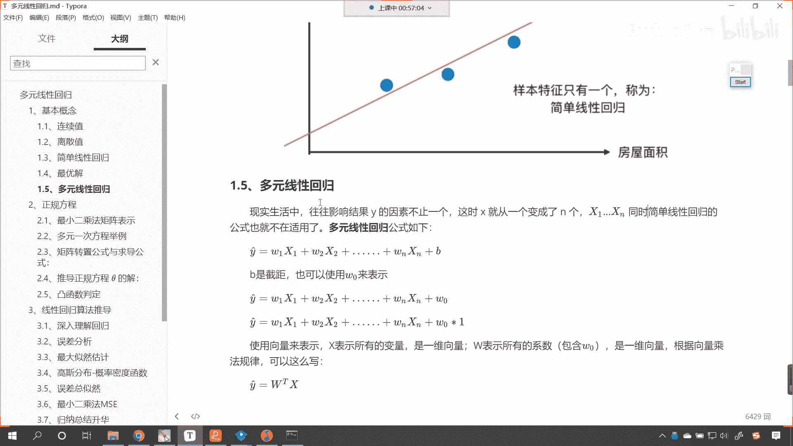

我们这个方程就叫做多元线性回归，如果说我们用公式把它写出来，现在各位就能够看到，你看我就写了一个y，看我这个时候是不是就写了一个y预测呀，咱们是w1 x1 w2 x2 。

如果它有多远有多个因素在影响它的变量，那么是不是就相当于有多个系数呀，你一个因素是不是对应一个系数呀，对不对，多个因素，那么就对应多个系数，所以说它是哎对应的关系啊，咱们都知道蝴蝶效应是不是哎。

所以说咱们这个我们要解决的这个问题，我们要找到的这个模型，它其实也是多方面的，当然我们各位小伙伴在群里边，在在咱们聊天时说到的这个蝴蝶是吧，和我们这个算法这个就稍微有点远了哈。

咱们呢想要研究某一个想要研究某一个问题，其实我们这个所能够提取的这些因素，它的个数它的影响是有限的是吧，我们不会考虑那么深远是吧，就是蝴蝶效应好，那么咱们这个b大家各位能够看到啊。

这个b是不是就是咱们刚才所说到的截距呀，对不对，你看这个b就是咱们所说到的结局，大家仔细去看一下啊，仔细去看一下这个b和咱们的w n，它有本质上的一个区别吗，看这个b和w n有没有本质上的一个区别。

看没有本质上的区别，我们的b是截距，咱们也可以使用w0 来表示，大家要注意啊，这个时候咱们的思维要转换一下了，你看你原来你要求的w1 w2 ，一直到w n求解出来，它是不是也是具体的数字呀，对不对呀。

你比如说我w一求解出来的系数是二，w2 求解出来的系数是2。5是吧，w n求解出来的是2。8，咱们最后求解出来这个截距，看最后咱们求解出来的这个截距，它是不是也是一个相应的数字呀对吧。

w和b都是咱们模型的，都是咱们模型的系数，那你看如果我们要对w0 继续进行演进，大家看咱们下面有一个公式，我们就写的非常好，你看这个公式嗯，咱们w一是不是和咱们x一进行了相乘呀。

w2 是不是和x2 进行相乘，那我们是不是可以这样理解呢，咱们的w0 是和谁相乘的呀，w0 是不是和一个常数一相乘的呀，对不对，所以说你看咱们的b有的方程里边把它写成b，有的方程里边把它写成。

有的方程里边把它写成w0 ，所以大家无论是看到哪种书写形式，看，无论你看到哪种书写形式，这个表达的意思都是方程的斜率和截距，都是这个意思啊，他们呢其实是统一的，你就像是吧啊，这些呢都是统一的。

那对于不同的形式，你看到之后你要知道它对应着什么，你就像是一只狗，在咱们中国，咱们是不是命名，把它叫做狗呀，你在英国是吧，在美国他是不是有自己的名字叫dog呀，对不对，在日本是不是又有日本。

在韩国是不是韩语啊，对不对，所以但是无论他什么样的标识符，它其实对应的是不是都是这个动物狗啊，对不对，都是这个动物狗，所以我们这也一样啊，我们这也一样，无论用b也好。

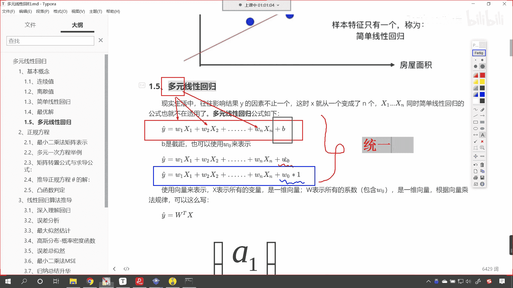

还是w0 也好是吧，都一样啊，好那么上面呢咱们是把它写成了一个方程，w一乘以x1 ，w2 乘以x2 ，依此类推。

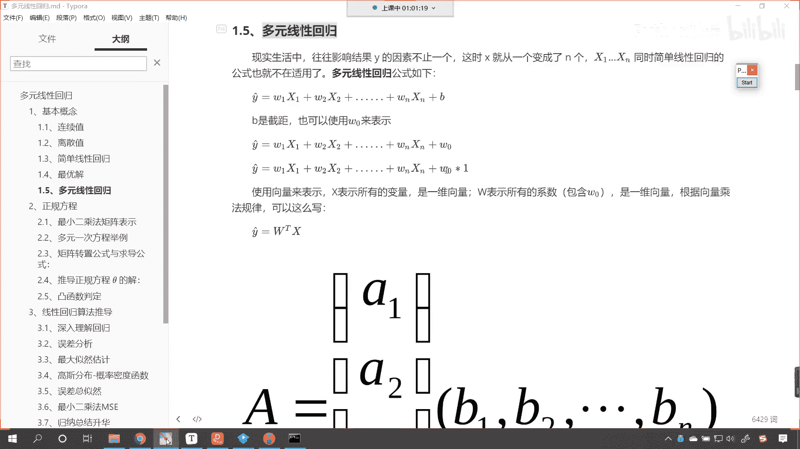

那么咱们还可以把它写成矩阵向量乘法的形式，现在呢就要带着大家回到咱们高中时代，甚至回到咱们大学时代是吧，咱们所学的线性回归，这个是非常有用的啊，你看这个方程熟悉不熟悉是吧，他的右上角带了一个t。

那个t表示什么呢，这个t就表示转置啊，这个t就表示转置，咱们之前在讲南派的时候，咱们讲到南派的线性代数，我们是不是介绍过t啊，这个t就是转置，转置是什么，如果w是行的话，他现在就得变成列。

你看下面我就有一个，下面呢咱们就有一个这个展示，那在进行矩阵乘法的时候，看再进行矩阵乘法的时候，它是怎样的一个规律呢，看就是一行是不是乘以这一列，然后a2 是不是乘以b2 啊。

最后咱们的an是不是乘以bn呀，那我们从网上找的这个图，我们把它叫a1 ，大家其实可以把咱们的a一是不是理解成，咱们看咱们这个a是不是，就相当于看这个a是不是就相当于咱们的w呀，对不对。

你就是符号用什么表示是吧，这个是无所谓的，那如果我们向量乘法有相应的这样的，这个运算规律是吧，矩阵乘法相应的运算规律，那么咱们这种写法看到了吧，咱们这种写法嗯，咱们画一个圈儿啊。

你看我们这种写法和上面的这种写法，是不是就一样了，对不对，你看咱们这种写法和上面的这种写法，它呢就一样了啊，大家想对不对，来再来标记一下，你看咱们这种写法和上面的这种写法，是不是就殊途同归了呀，对不对。

你看数学家就喜欢搞这样的事情是吧，他们喜欢搞事情，他们觉得上面这个方程比较复杂，我要把它写得尽量简约一些，所以说就是wt乘以x，所以你发现伟大的公式都非常简单，比如说是吧，咱们这个爱因斯坦的是吧。

智能方程e等于什么，e是不是就等于看m是不是c的平方公式，是不是相当的简约呀，对不对啊，哎数学家就喜欢搞这样的事情啊，所以你看到这个你知道它是什么意思。

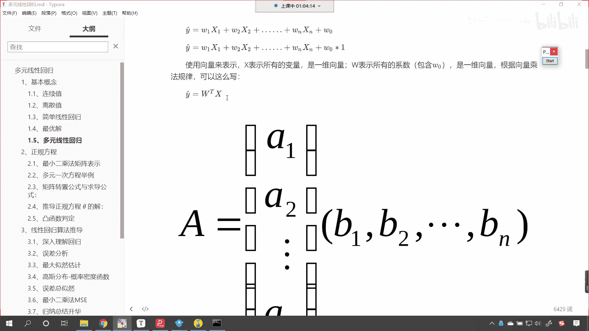

这就足够了啊，好这个就是咱们的多元线性回归。

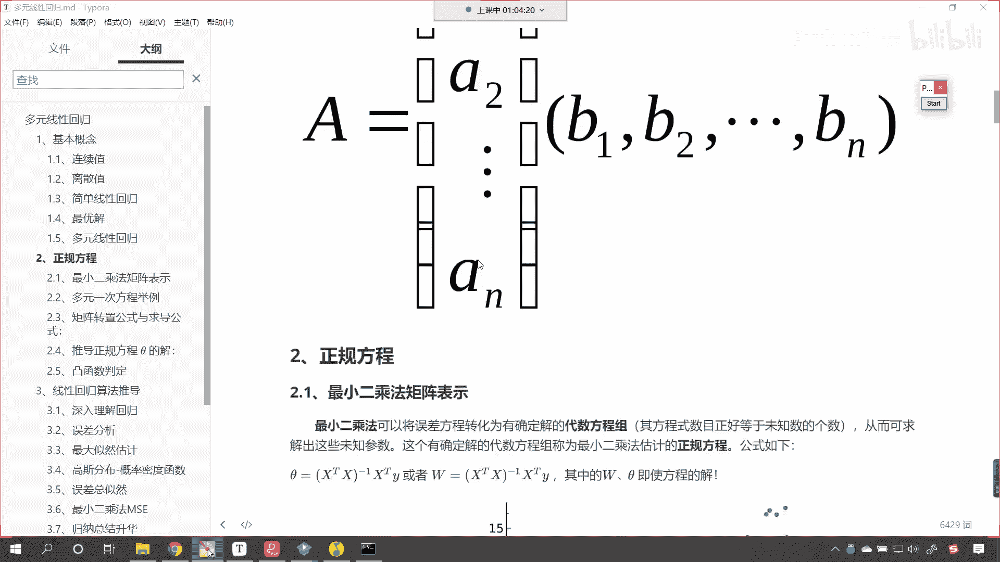

那么到现在呢咱们就为各位介绍了一下连续值，离散值，简单线性回归，什么是最优解，什么是多元线性回归，那这些基本概念有了之后。

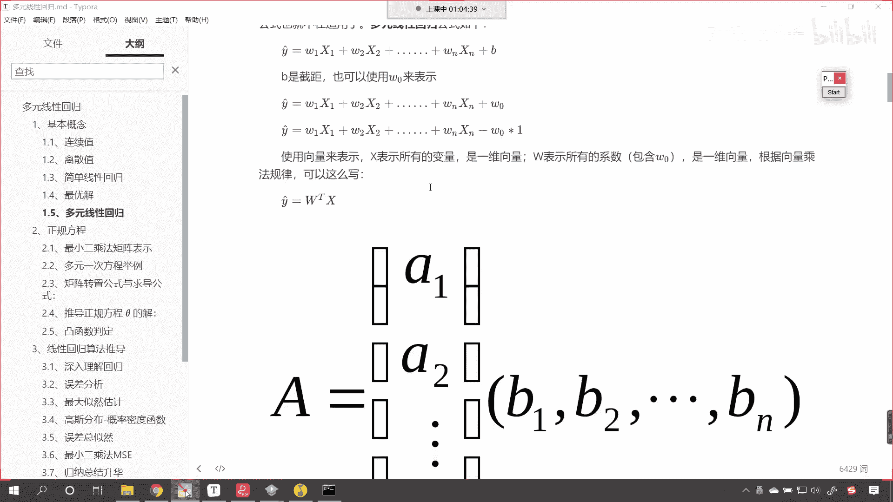