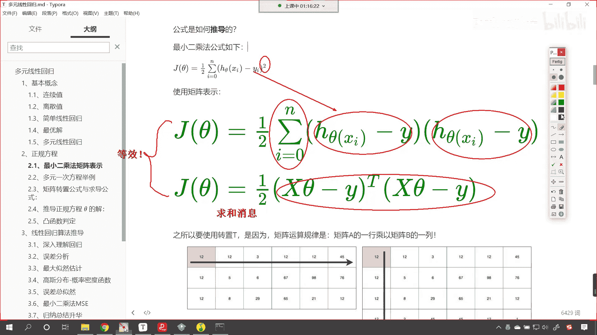
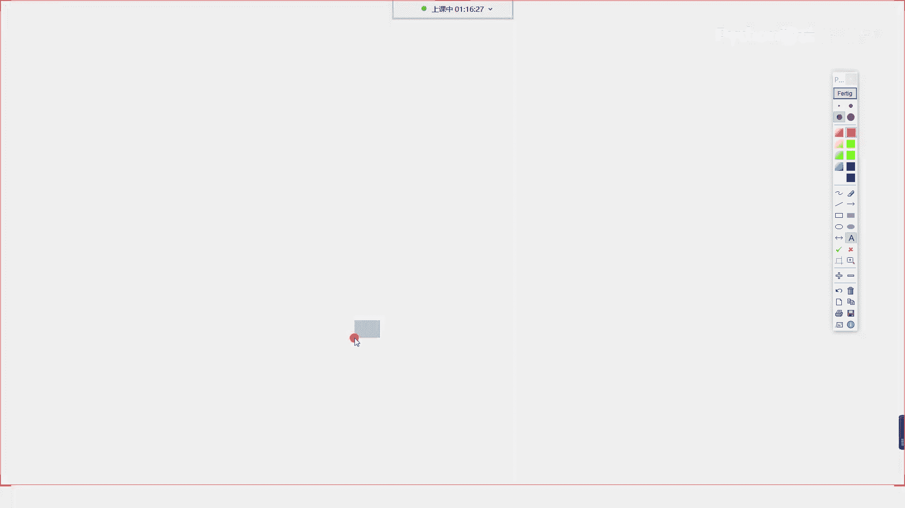
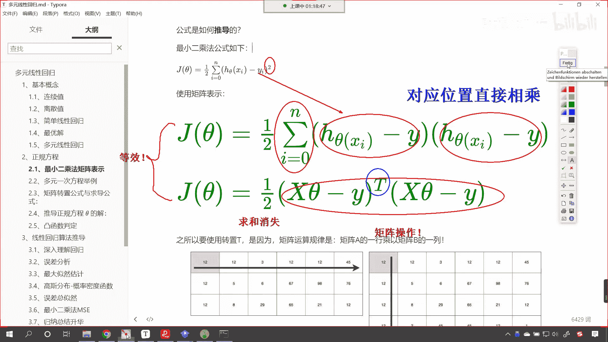
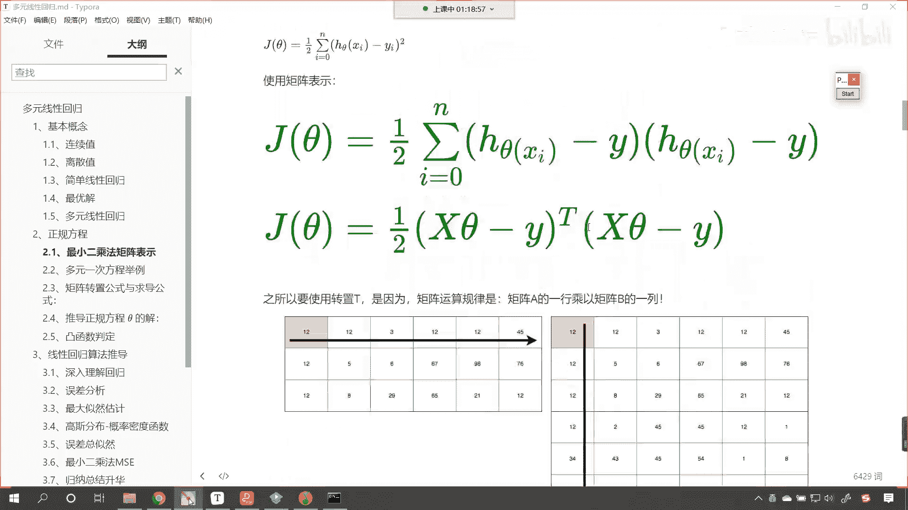

# P46：4-正规方程介绍 - 程序大本营 - BV1KL411z7WA

那我们就看一下正规方程，这是咱们今天上课的主题，对不对呀，那什么是正规方程呀，嗯我们看一下这个最小二乘法啊，这个最小二乘法可以将误差方程转换为，有名有确定解的这个代数方程，从而可以求解出这些未知的参数。

这个有确定解的代数方程，咱们称为最小二乘，成为最小二乘法估计的正规方程，看到这个概念，大家是不是就有点这个不太理解，他说的是什么，是不是，首先这什么是最小二乘法呀，上面咱们有过铺垫。

我们说这个最小二乘法，是不是当年高斯搞出来的呀，对不对，那我们看一下这个最小二乘法是什么啊，你现在看到这个公式，你看你现在看到的这个公式就是最小二乘法，它的公式我们对于这个公式进行一个分解。

首先你看这个是不是就是代表求和呀，这个明白吧，没有问题，不做解释是不是，然后它右上角是不是有一个平方，对不对，你看是不是有一个平方唉，我们刚才提到的，咱们刚才提到的这个高斯嗯，所提出来这个公式叫什么。

是不是叫做最小二乘法呀，对不对，你看我们把它叫做最小二乘法，那这个二是什么意思啊，看看这个二是什么意思啊，现在你和咱们这个公式对应是不是就明白了，二是不是就代表这个平方呀，对不对，二就代表平方好。

那么接下来呢咱们再来解释一下啊，你看这个yi表示什么，这个yi yi yi呢，它就表示啊yi呢就表示咱们的真实值啊，yi就表示真实值，那这个i是不是表示咱们第二个是吧，第二个数据对不对，这个是真实值。

那现在还有一个问题，大家看啊，你上面的这个hi代表什么意思呀，就是hc塔xi这个是什么意思，我们把这个搞明白是吧，那这个方程我们就介绍明白了，是不是，你看这个h c塔x i这里面有一个西塔。

那这个c塔呢表示系数上面，咱们在表示系数的时候，我们是不是用w对不对，我们说这个系数是不是也可以用a来表示啊，对不对，用什么表示，用什么符号表示是吧，那是你想经过咱们的数学发展。

经过这么多年出了这么多的数学家，他们的符号可能统一吗，是不是不可能统一，对不对，所以说即使不统一，到了今天咱们在进行操作的时候，我们在进行学习的时候，我们会介绍，我们会介绍其中最主流的哎。

就是书上大概都是这么写的，是不是哎，那这个呢h c塔x这个就是咱们的模型啊，这个就是我们的算法，这个就是咱们的线性回归唉，这就是那个方程啊，这就是那个方程，那这个方程它是不是有一个自己的这个叫法呀。

这个方程还叫什么，是不是叫做预测值，看它是不是也叫预测值呀，对不对，咱们上面讲到了那个预测值，是不是y上面戴着一个帽子呀，对不对，这就是预测值，我们那这个方程他就用这个hc塔x i来表示。

其实就是咱们上面的大家看啊，就是咱们上面的这个方程看到了吧，就是这个方程就是他啊，嗯现在明白了吧，就是这个我们可以把这个看来咱们画一个框，就这个是吧，就是咱们刚才所看到的啊。

其实就是h下角标是不是有一个theta对吧，然后呢跟一个什么呀，x是吧，如果要求特定的某一个值，那就是a就是数据的第二个数据嘛，对不对，有这个方程想求哪个方程，想求哪个点的数据。

是不是把a带进去就可以了，对不对，想求谁把谁带进去就可以了，所以说这个方程就对应着下面所说的这个啊，就说的这个好，那么到此为止，现在大家知道什么是最小二乘法了吧，你看这也不难呀，对不对是吧。

我也能知道啥叫最小二乘法是吧，就这个你看高斯就找见这个了，但是你能找见吗，你能推导出来吗，你能证明吗，这咱们就不能了，是不是啊，但是咱们知道了这个公式，咱们就可以使用它，哎这个是这个是我们可以做的好。

那么根据这个方程看，根据这个方程咱们就可以推导出来什么，看根据这个方程就可以推导出来什么，咱们就可以推导出来正规方程，那么正规方程的解看，咱们可以使用矩阵乘法来进行表示，无论是c他也好。

或者说咱们使用w也好，这个公式是一模一样的，咱们其中的w和咱们的c塔就是咱们方程的解，看到了吧，这个w和theta就是我们方程的解，这个就是我们要求的斜率和截距，所以到这儿你就明白了，他俩呢是统一的哈。

用thea符号表示或者用w表示，都是同一个意思好，那么之所以能够推导出来x t x减一，就是因为就是因为什么啊，我们来一个绿色的，就是因为咱们的最小二乘法是吧，这个他可有来历了，来头比较大。

这个呢是高斯是吧，考数学的时候，如果你不过是吧，那你就拜一拜高斯，是不是面朝西方败是吧，因为高斯的墓在德国是吧，面朝西方是吧，心里边想着高斯拜一拜，这个高数考试一定能考好好，那么你看这个公式是吧。

我们是不是进行了一个累加和呀，看到了吧，i等于零，一直到n，这是一个累加和哎，这个小伙伴你要注意了啊，同学你要注意了，你现在就觉得有点难了是吧，我们说咱们呢都要站在这个巨人的肩膀上是吧。

那我们其实就是使用巨人为我们，推导出来的公式，你就像咱们现在用到的所有的高科技产品，无论是手机也好是吧，无论是电脑也好，无人机也好，无人驾驶也好，这个1/2是啥，后面我们再做解释好不好。

现在咱们不做解释，1/2是一个常数，其实把它砍掉也没关系，知道吗，那数学家为什么非要写1/2呢，后面咱们再介绍，在这里留一个悬念，好大家看啊，上面就是咱们的最小二乘法的公式。

你看这个公式我们可以写成累乘a等于零，一直到n对不对，hc塔x y减y，你要注意啊，这个时候这个xi代表每一个数据啊，代表一个代表一个数，那如果我们使用矩阵表示啊，注意啊，这个时候我们使用矩阵表示。

咱们就是大x c a减y上面有一个t，这就代表转置，为什么要这样写呢，看为什么要这样写，现在呢咱们要进行一个说明，各位就能够看到，看各位能够看到咱们上面是不是有平方呀，对不对，那我是不是可以把它展开。

展开之后我是不是就可以写成hc塔x i，h c塔x i减y，就是从这一步从上边这一步到下面，这是完全没有问题的，对不对，完全没有问题的，扣一个六啊，就是从上一步最小二乘法到这儿，是完全没有问题的。

对不对呀，因为我们一看就明白平方嘛，把它拆开不就是这个样子嘛，对不对，接下来呢我们要看一下下面这种写法，大家看看下面这种写法，那对于下面这种写法，咱们呢就得做唉一个介绍了，嗯对于下面这种写法。

大家发现它和上面那种写法相比有一点不一样，看到了吗，它有一点不一样，咱们也用一个红色的啊，看它有一点不一样，啊它有一点不一样，我们看一下它是哪一点不一样呀，咱们就发现你看啊这个原来是不是有求和呀。

你看现在还有求和吗，现在还有没有求和，现在是不是就没有求和了，对不对，哎那这是为啥呀，你看原来有求和，现在是不是没有求和了，那我们你看求和没了，是不是啊，哎在这儿呢咱们进行一个介绍啊。

首先呢这个求和是不是消失了，那不用写了吗，嗯那既然是公式，大家想你，你下面这种写法和上面这种写法，是不是应该是等效呀，对不对，咱们就按照公式来说是吧，你都是jc他jc塔是吧，他俩是不是应该是等效呀。

对不对啊，他俩应该是等效，那为啥上面这个为啥下面这个就没了呢，唉这个就得从咱们矩阵的乘法的特征说起啊，他们应该是等效，对不对，好这一点我们可以确认吧对吧，这俩应该是等效，咱们这个求和消失是吧。

看啊这个地方我们应该是写错了啊，为了保证严谨擦掉。

咱们重新写好不好，哎那这个就是求和唉叫消失是吧。

那我们看一下这个是为什么啊，首先呢我们把它写成x，大家看大写的x这个就表示矩阵，此时我们x theta减y这个都是矩阵操作啊，这个都是矩阵操作，那矩阵操作有一个什么样的规律呢，大家看咱们的下面。

你看矩阵操作有一个什么样的规律，下面你看我都给你了，是不是一行乘以一列呀，看到了吧，是不是一行乘以一列，对不对，你看它就是唉我们让它一行是不是乘以一列，那还有一个问题就是为什么需要转置呢。

为什么需要转置呢，是吧，那这个t是怎么回事啊，对吧，你你为啥要转置呀对吧，这为啥要t呢，你想咱们上面这个数据是不是我们数字乘法呀，是不是直接乘呀，对不对呀，直接乘它是不是对应的地方乘以对应的值呀。

看到了吧，上面咱们总结一下啊，看上面咱们总结一下，上面是不是对应的对应的位置，是不是直接相乘呀，对不对，是不是对应的位置直接相乘，看看没错吧，看它就是对应的位置直接相乘，那么我们如何才。

我们如何才能够在咱们矩阵当中啊，如何才能够在矩阵当中进行描述呢，那是不是就是一行乘以一列啊，你你看现在看现在咱们这个矩阵乘法，你看啊，12 12 30 22 45，我们如果对它进行了转置。

这个时候你看是不是就是12 12，是不是就是对应位置和对应位置相乘了，所以我们的矩阵形式写成这样，它和上面的就刚好相同，明白吗，就刚好相同，所以说我们如果用矩阵表示的话。

咱们呢就写成下面这种形式唉就可以了。

