# P47：5-正规方程求解多元一次方程 - 程序大本营 - BV1KL411z7WA

我们将问题继续推进一下啊，我们就看一下多元一次方程，你看x加y等于14 二，x减y等于十，大家口算一下，告诉我我们的xy解出来是多少是吧，你告诉我这个xy解出来是多少，来各位小伙伴嗯。

算出来给我一个答案，非常聪明，是不是啊，你看八和六就出来了，来咱们现在回到代码当中。

我们把这个问题给他求解一下，好不好，来现在呢咱们就回到代码当中好，那么上面呢咱们插入一行，我们来一个三级标题，哎这个呢就叫做线性回归，线性回归，咱们的举例，呃然后呢我们刷新一下啊。

现在的话咱们哎这个标题目录就出来了是吧。

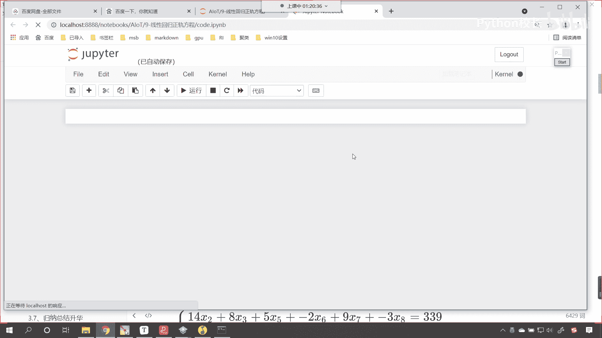

然后往下再插入一行，再来一个三级标题，咱们现在呢就看一下正规方程，啊正规方程它的一个使用，那我们刚才呢给了这样的一个方程，是不是，那咱们这个方程，各位就能够看到是x加y等于14。

那咱们怎么把它变成咱们的数学问题呢，我们就给一个xx呢，就等于np啊，np。arr小括号来一个中括号，第一个方程它是不是腰和腰呀，你看x和y的系数是不是幺和幺，第二个方程它的系数是不是二和-1呀。

对不对，我们将x打印输出一下，你看我一直行，是不是一和一二和-1，对不对呀，这是x和y前面的系数，没错吧，那它所对应的目标值等于多少，是不是np。a r，咱们小括号中括号我们给一个多少。

他是不是14和多少，是不是和十呀，对不对，这个就是咱们的y你看没错吧，14和十是吧，112 -1，那我刚才呢各位口算都能算出来，因为这个方程比较简单是吧，说明呢你们之前学的知识非常扎实。

是不是大学都是考上的是吧，恭喜你们一定也能够学完咱们ai o t的课程，顺利毕业，找到工作，升职加薪，迎娶白富美，走上人生巅峰，那咱们现在使用一下咱们高级的算法啊，看啊np点叫la l g啊。

这个就是线性回归的方法啊，这个就是咱们呃线性代数的方法，那这个里边儿看啊，这个里边有一个函数叫s so，是不是就有解决的意思呀，对不对，sol就有解决的意思，来上面是不是有一个问题，咱把xy放进去。

我们解决一下，这个时候你看过一执行来，各位小伙伴看到了吧，看结果出来了吗，井号是不是啊，l i n a l g啊，这个表示什么，这个就表示线性代数啊，这就表示线性代数是吧。

然后咱们so呢唉就表示它可以计算线性啊，可以计算线性回归问题来了，它就可以计算线性回归问题，计算出来是多少，是不是就是八和六呀，对不对，你看它计算出来就是八和六，那如果说我们要把它。

那你看这个时候咱们的这个xy这个方程，咱们是不是就求解出来了，对不对，你看这个方程咱们呢就可以求解出来了，那你看我插入一行来一个markdown，咱们是就是不是就可以将这个方程，进行相应的书写呀。

哎这个时候呢，哎其实就是这个八是不是乘以咱们的x是不是，然后加上咱们的6y是不是就等于咱们的，那我们就可以这样写f小括号x y，看是不是就等于这个方程，你看一执行方程是不是就出来了，看到了吧。

是不是就是8+6 y，是不是咱们就可以搞定了对吧，你看8+6是不是等于十，四，是不是二倍的x，然后减去-6是不是等于十呀，这个就是我们计算出来的方程，你看没问题吧，对不对。

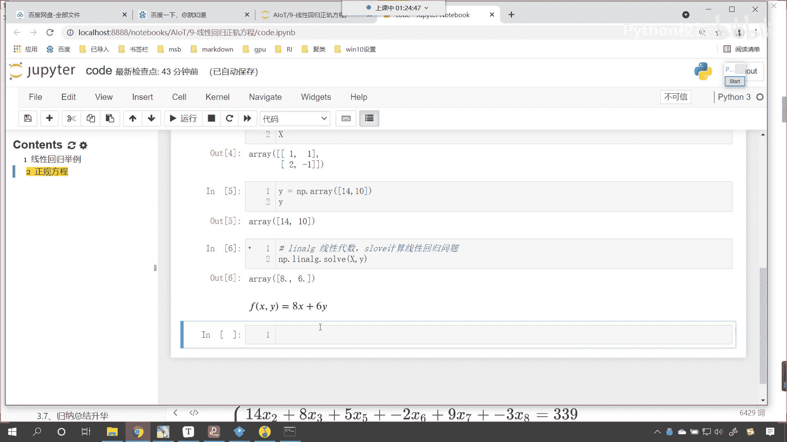

咱们刚才介绍了什么，刚才是不是介绍了正规方程呀，对不对，这个正规方程咱们复制一下哈，复制一下这个正规方程。

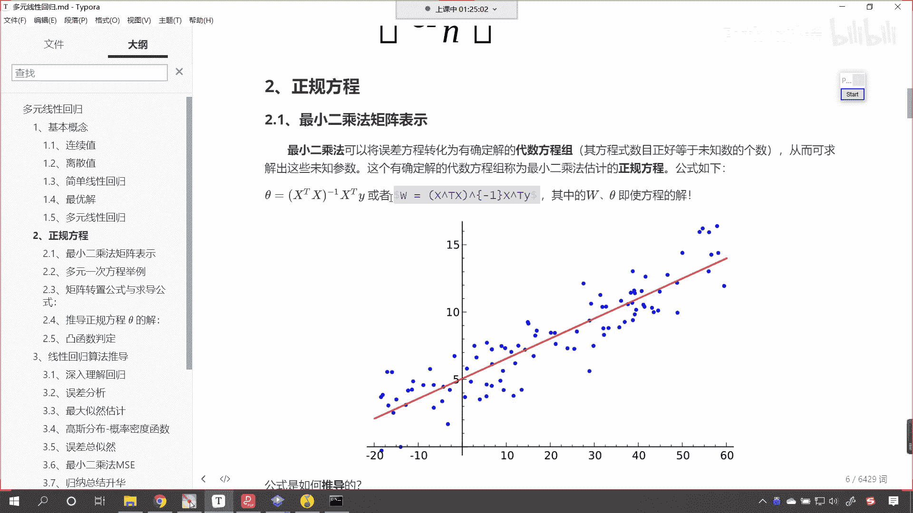

回到咱们代码当中，咱们也给他来一个markdown，ctrl v粘贴一下，你看这就是正规方程，那这个正规方程咱们先不看它是怎么推导的，我们先使用一下好不好，你看上面咱们是不是计算了。

x是不是声明了y对吧，那我们是不是就可以计算w了，这个时候x。t是不是就可以转置，你看一执行你原来的是不是112 -1，现在是不是就变成了121 -1呀，看这就是转置，转置之后呢。

这个小括号当中是不是直接进行矩阵乘法呀，那咱们就点dot啊啊，点dot小括号是不是把x放进去啊，你看一执行是不是就求解出来，大家这个时候仔细看哈，看我告诉你我们求解出来的是哪一部分。

你看现在我们就这个是不是对应，小括号里面的运算呀，对不对，好到这没问题吧，到这没问题，大家扣一个六，是吧，哎一个是转置，然后一个乘法，然后大家看啊，我们还有一个需要计算的，这个是不是-1呀，看到了吧。

是不是-1，对不对，那这个-1-1表示什么来，有哪位同学可以告诉我-1表示什么，哎，很棒啊，-1表示逆矩阵是不是-1呢，表示逆矩阵，逆矩阵呢，你就可以把它理解成，相当于咱们数字的倒数是吧。

相当于数字的倒数，比如说三三的倒数是不是1/3啊，那逆矩阵的倒数该怎么求呀，对吧，该怎么求来，咱们现在把它定义成a行不行，看我就定义成a好，这一步是不是求了，然后咱们再求它的逆矩阵b就等于np点。

找见咱们的la l g。i n v哎，小括号，咱们将a放进去哎，这个时候是不是就相当于是逆矩阵了吧，这个呢就是逆矩阵，你看这个就是逆矩阵，咱们看一下这个逆矩阵长什么样啊，打印输出一下好不好执行。

看到了吧，这就是我求解出来的逆矩阵，看到了吧，求解出来的逆矩阵，这个a和b它相乘是吧，它肯定是一啊，它是一个单位矩阵好，那么有了b了，接下来你看这个b是不是又乘以这个a，又是不是又乘以x t来。

咱们现在再来操作，那就是c就等于b是不是继续进行矩阵运算，x。t啊，对不对，你看是不是接下来是不是又成了一个xt，到这没问题吧，是不是啊，唉它就又相当于成了一个这个嗯矩阵运算啊。

点dot这个英语单词有点乘的意思，dotx呢它就是矩阵运算，那这个呢就是矩阵运算，就是行乘一列来，咱们现在呢可以将光标放到这个dot，小括号当中，shift tab，你看我对他看一下它的解释。

你看它叫做dot product of two arrays，是不是数组是不是矩阵，对不对，你看return to np dot for full document，是不是哎这个就是矩阵运算。

看这就是矩阵运算来到这c就有了，那这个c就相当于谁呢，咱们画个图啊，看啊这个c是不是就相当于这块看到了吧，这个c是不是就相当于这块，是不是最后还差一个谁，是不是还差一个y对吧，我们的矩阵运算。

两个矩阵写到一起，中间没有，中间什么都没有的时候，是不是表示它点乘呀，是不是表示矩阵运算，看这个时候就到这儿了，到这儿了之后，咱们最后一步是不是最后一步是不是c。dot，咱把y放进去。

这个时候你看过一执行诶，各位小伙伴，现在你有没有发现八和六，我是不是已经算出来了，看到了吧，c。dot y神奇不神奇，你告诉我神奇不神奇，看我们怎么把八和六算出来的，看到了吧，神奇不神奇。

你看这个就是正规方程，这个就是解析解是不是好，那么我们只要遵循这个方程，那咱们就可以把相应的斜率截距求解出来，知道吗，哎这是可以的啊，好那么咱们正规方程，这我们首先呢给了一个叫做二元一次方程。

二元一次方程。

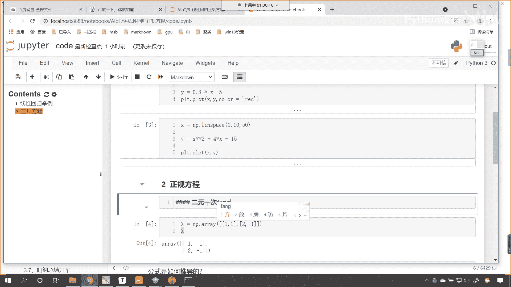

接下来我们再来一个啊，来各位小伙伴大家看一下。

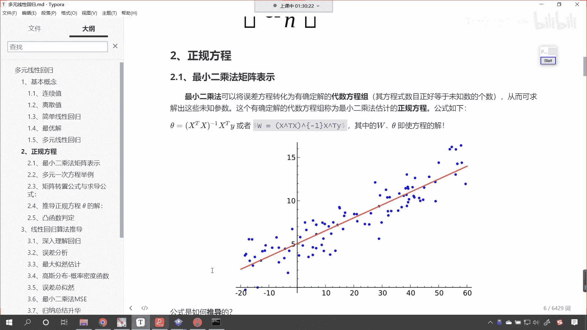

好那么你看我给一个三元一次方程x减y加z，然后2x加y减z等于83，x减3x减咱们的呃，大家看这个应该是给写错了啊。

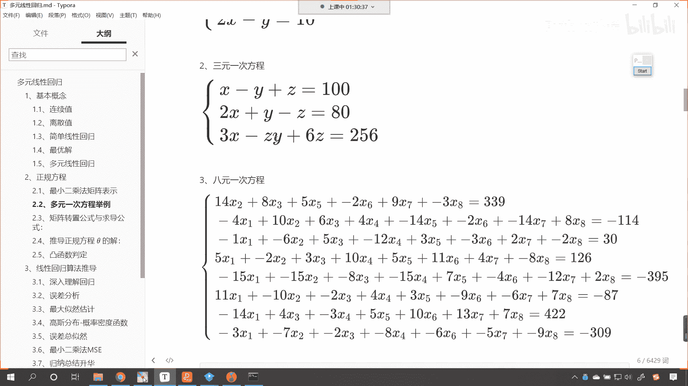

看这个3x减咱们的2y。

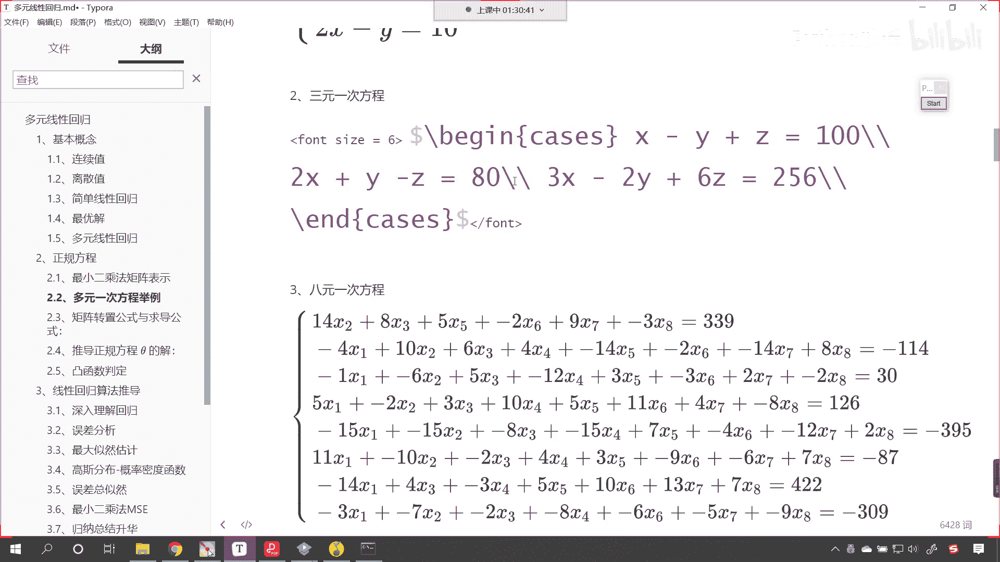

加上6z等于256，这个来各位小伙伴帮我算一下嗯，还能不能算出来好那么不能算出来，咱们现在呢就回到咱们的代码当中。

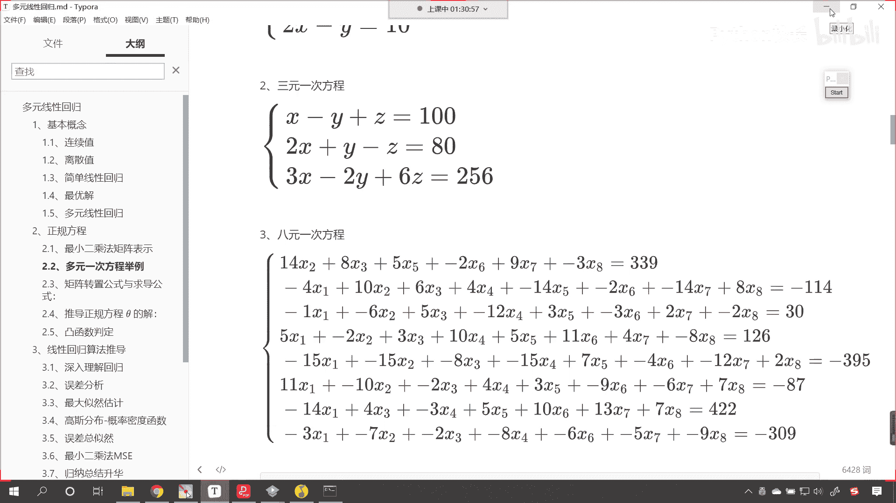

我们一起操作一下，好不好好，那现在的话我们就来一个四级标题，我们这个是不是就叫做三元一次方程呀，那对于三元一次方程哇，果然有厉害的啊，来咱们给一个x啊，x呢就等于np。a瑞。

咱们是不是也根据咱们的三元一次方程，咱们给它提取相应的数据啊，那是不是就是一-11，然后逗号再来一个中括号二，第二个方程呢它的系数是二一和-1，咱们第三个方程它的系数是三嗯是吧，然后这个-2。

然后逗号再来一个六，这个时候我们把x打印输出一下，大家看看这是不是咱们的系数，那同样我们也给一个y y，是不是就等于np。array小括号，那来一个中括号，它呢就是180，逗号还有256，好有了y了。

有了x了，咱们现在是不是就可以根据正规方程，对它进行计算了，现在这个正规方程呢我就直接写了啊啊，现在这个正规方程，咱们就根据刚才写出来那个公式，我们呢就直接写好。

那么我们的w呢就等于首先咱们来一个小括号，那就是x。t，然后是不是dot一下咱们的x呀，对于他俩的结果是不是求一个逆矩阵，np。llg。i n v，是不是这求完逆矩阵之后。

咱们接下来是不是要进行一个倒呀，倒谁x。t转置，然后最后再来一个dot，是不是把y放进去，这个时候咱们打印输出一下w，这个时候你看过一执行结果出来了，看到了吗，结果出来了，刚才在咱们的群聊天当中。

咱们的stronger是吧，确实算出来了，说这个x等于多少，等于60，但是你还没有来得及算，y还没有来得及算咱们的这个啊，这个z是吧，这个z是多少-1，这个y呢是-41，你再比对一下这个方程看看对不对。

一样不一样，看这就是它的威力，这就是正规方程，看到了吧，哎这就是正规方程，嗯代码貌似比计算有点复杂，是不是啊，看来退出江湖的计算能力很强呀。

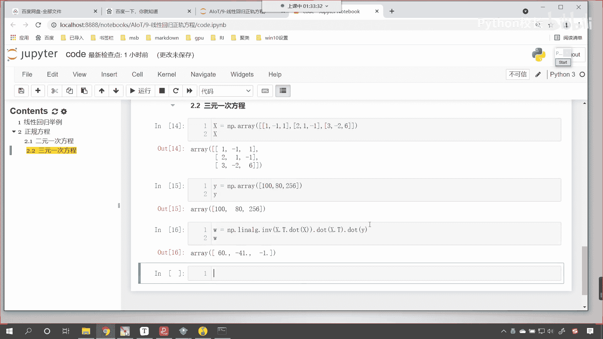

来现在再给你出一个问题，好看啊，八元一次方程来退出江湖是吧，退出江湖小伙伴啊，我现在呢给你两分钟时间，来来来给你两分钟时间啊，直播间大家都在等你啊，直播间都在等你啊，嗯那你要把这个方程算出来。

大家看这个就是方程有点多是吧，咱们就用x11 直到多少，一直到x8 来表示是吧，那八元一次方程是吧，这个时候是不是计算起来就稍微比较麻烦了，对不对，嗯好我们刚才有小伙伴问了一下，说t是啥意思。

这个t呢就是转置的意思啊。

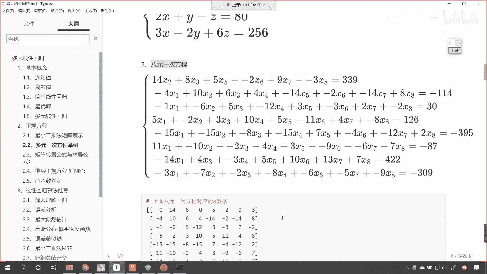

我给你演示一下啊，这什么是t啊，给你看一下啊，看啊这个是x，现在你就能够发现这一行是不是一-11呀，那什么是点t呀，点t就是转制，转置的意思就是行变成列，你看到了吧，原来这一行是不是一-11。

现在转制之后你看到了吧，一-11，原来的二幺-1，现在是不是就变成了二一-1啊，所以这就是t简单不简单，行转列，我们在线性代数当中有一个特殊的，有一个特殊的词就叫转置好。

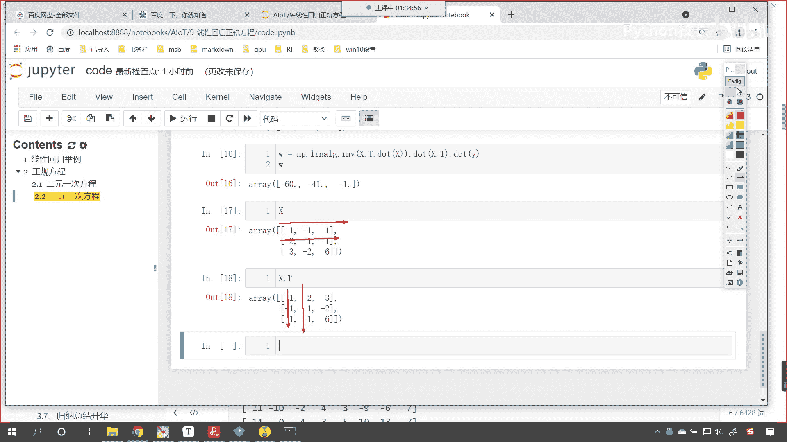

那么还回到咱们刚才那个问题，那这个就一下子就复杂了，是不是啊，我们叫八元一次方程好，那么它的系数提取你也得需要一定的时间，如果说这个要让你算的话是吧，你想一个小时你能搞定吗，算得快的可能一个小时能搞定。

算得慢的可能就得俩小时，有可能无解，那么唉我们的little小伙伴，little同学问了一个非常好的问题，有可能是吧，会误解。

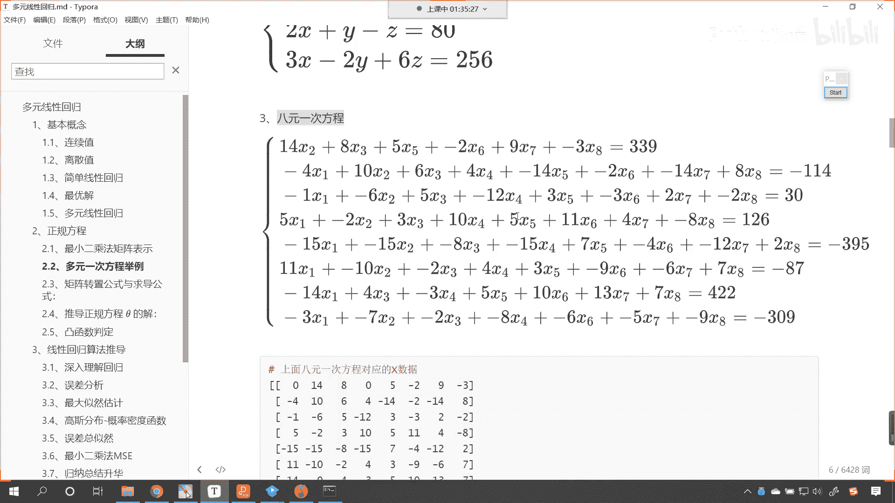

你想这个世界上有这么多问题，一定存在，无解的是不是一定存在，你说的无解是不是没有确定解呀，对不对啊，你说的无解是没有确定解啊，来现在的话，这是上面八元一次方程对应的x的数据。

咱们就不一个就不一个一个写了，直接复制回到咱们的代码当中是吧。

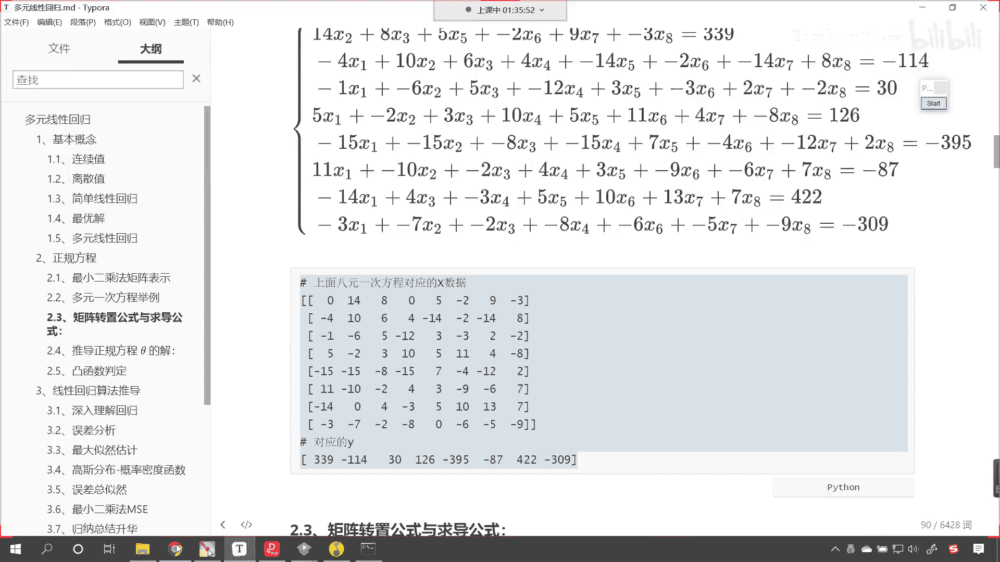

我在这儿粘贴过来，咱就把这个定义成x就等于np。array，哎小括号我们把它括起来好不好看，这个时候x是不是就有了，那么我们的y也就有了y就等于np。array，小括号好，那么此时呢咱们打印输出一下吧。

display咱们的x把咱们的y也放进去，唉大家现在就能够看到，此时咱们这个数据是存在一定问题的，是不是啊，咱们得来一个逗号啊，这个怪我粗心大意是吧，嗯这个时候数据和数据之间，是不是得来一个逗号呀。

对不对呀，哎咱们把它加上逗号逗号逗号逗号啊，这个时候这个数组的结构只要我们创建出来了，那么咱们是不是可以快速的根据嗯，是不是可以快速的根据咱们的线性，线性方程所推导出来的正规正规方程。

来进行相应的求解呀，对不对，看啊这个时候呢只要我们把它的规律提取出来，那么咱们就可以搞定这个问题，好现在的话x这块咱们已经搞定了，那y这个地方也一样，咱们加一个逗号，注意是英文的逗号好。

现在的话你看我一执行嗯，least must be teger of slides，not to be，我们看一下咱们的这个问题，好明白了，这个后面也得加逗号，逗号逗号就是列表和列表之间也得加逗号。

现在你看我一执行，ok这个数据出来了嗯，咱们呢就是发现问题，然后快速的去调整解决问题，现在呢我将写好了，这个给你发过去，你呢来操作一下啊，好咱们的这个发送的内容说太长了，还得分条发，是不是啊。

我再试一下啊，看看能不能发过去啊，好发送的内容太长了，那这个还呃，我现在呢上课呢没有在没有在微信群里边，那我先演示啊，好现在的话咱们继续使用是吧，w就等于np点线性呃，使用咱们的线性代数mv是吧。

然后去计算它的逆矩阵，那这个时候呢就是x。t。dot x，然后点dot是不是把x逆矩阵放到这儿，然后再来一个dot，咱们给一个y啊，这个时候你看过一执行结果出来了，来很快结果就出来了。

大家现在就能够看到看一五十五，384 17 12，这个就是咱们八元一次方程它的求解。

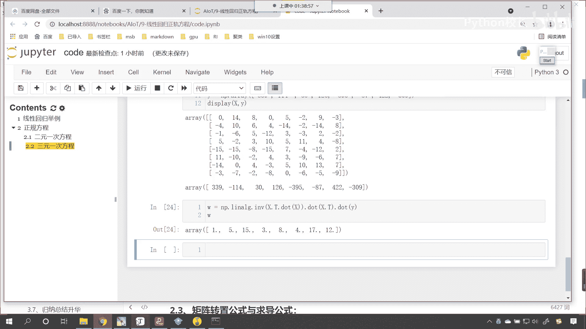

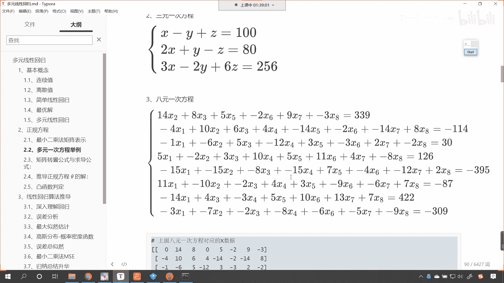

看到了吧，唉这个就是它的求解哎出来了嗯，是不是咱们已经搞定这个问题了，看就是你以后是吧，你以后无论遇到什么样的问题，是无论遇到什么样的问题，只要这个问题是线性回归问题。

那么我们都可以使用它来去解决这个问题。

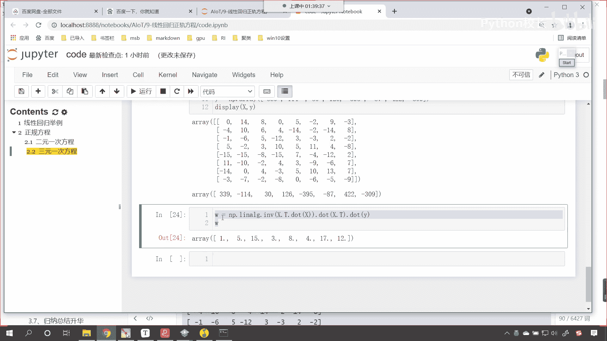

好这个就是咱们正规方程。