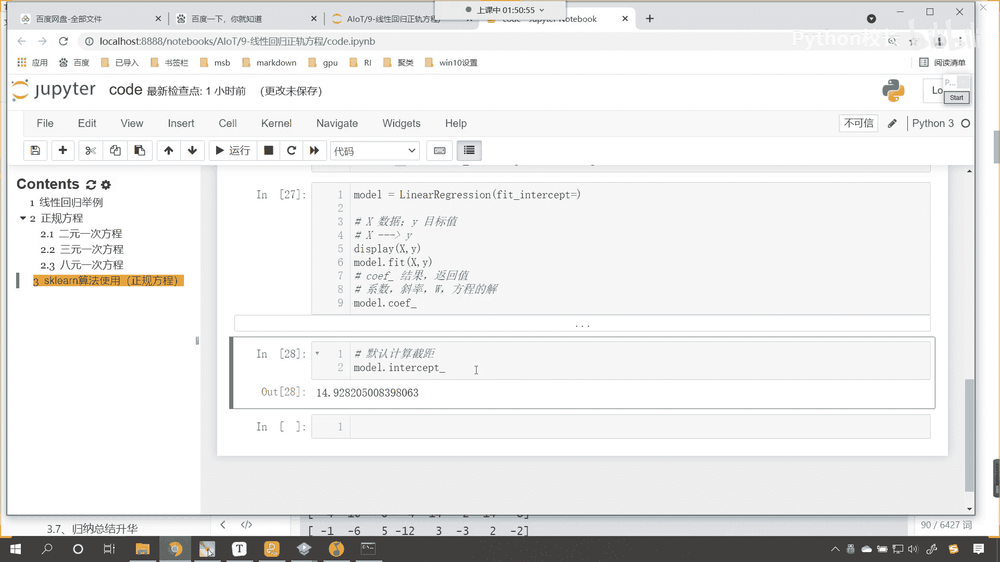
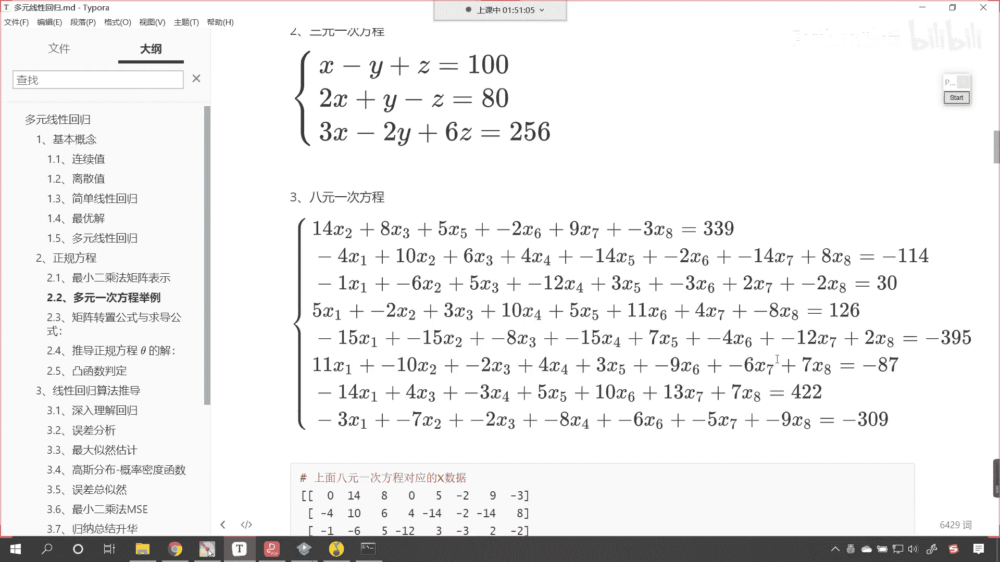

# P48：6-sklearn中线性方程正规方程运算 - 程序大本营 - BV1KL411z7WA

往下看啊，该关闭的，咱们呢都给它缩起来，接下来我们继续看，咱们再来一个三级标题，正规方程可以封窗，可以封装成一个函数，直接输出，直接输出x y好，接下来呢我们就看一下咱们的sk learn是吧。

sk learn这个算法的使用，今天是不是让大家安装了一个库呀，这个库就是sk learn是吧，那这就是sk learn的使用是吧，这个使用呢就是咱们正规方程，对不对呀，我们今天装的这个库。

到现在我们就可以应用了，你看如果我们每次都这样去写，是不是就有点比较麻烦呀，看到了每次都这样写，麻烦不麻烦你，最起码你是不是得记住这个公式呀，万一你要写错了，你少写一个点t，多写一个点t就比较麻烦了。

那现在呢咱们就使用简单的办法，就是你能想到的别人一页一定能想到，刚才咱们有小伙伴提了一个非常好的建议，说可以把这个封装成一个方法，是不是就可以重复使用了，那我给你演示一下哈。

叫from sk learn，点叫linear model，从这个当中导一个包叫linear regression，诶你看我把这个导包了，大家翻译一下，看大家翻译一下这个是什么意思是吧。

哎井号这个linear这个是什么意思啊，是不是就有线性的意思，model是什么意思啊，model是不是就有模型的意思呀，看model就有模型的意思，就有算法的意思，那我们导包导进来了。

linear regression，翻译一下linear regression是不是就是线性回归呀，对不对，你看线性回归是不是有前辈已经帮我们写好了，咱们一直在强调的是，我们呢就是普通人。

但是我们要站在巨人的怎么样肩膀上，鲁迅说得好，鲁迅说得好，鲁迅说天下文章一大抄，他也抄，知道吗，鲁迅也抄，是不是路人，对于这种大师，咱们就不能用抄了，我们叫什么借鉴，叫模仿。

鲁迅最厉害的地方就是抄了别人的东西是吧，又把别人给抄过去了，咱们中国也一样，国家也一样，个人也一样是吧，我们都是要学习别人的东西，然后实现反超是吧，你看美国现在就特别害怕中国，是不是为啥。

因为中国只要你允许抄是吧，超死美国是吧，这个嗯这个呢就是中国中国人既勤奋是吧，又努力来，那这个就是线性模型是吧，我们说了线性模型它的原理是什么，看线性模型是不是，就是咱们刚才讲到的这个正规方程呀。

那我们就声明一个啊，咱们就叫model，就等于linear regression是吧，咱们创建一个线性回归的方程，然后呢上面不是有数据吗，上面那个数据是不是，依然是八元一次方程的数据啊，对不对。

那咱们就调用model点，哎，这叫feat，咱们将相应的数据给它传进去，这个时候就是x和y看到了吧，x和y我们将x叫什么，x我们把它叫做x，就是咱们的数据，咱们的y呢是不是就是目标值呀，对不对。

如果说x和y一个一个的方程，对不对，你看x和y是一个一个的方程，它它们是对应关系，那你想x和y之间是不是存在一定的关系啊，对不对，x和y之间它呢是存在一定关系的，这个关系是什么。

是不是就是咱们上面正规方程求解出来的，幺五十五三八四十72呀，看是不是就是他没错吧，那就是他啊，所以说呢x是数据，y是目标值，那这个x和y它稍微复杂一些，display一下咱们的x和y他们是八个方程。

八个目标值是不是，你看对不对，你说的是哪个包呀，你没有桥北桥北同学，你没有安装sk learn吗，嗯咱们安装的话就是pap引到sk learn，唉通过这个来安装就可以啊。

所以说你在命令行里边安装一下就可以了啊，好那么大家现在就能够看到，你看我们可以这样理解看啊，咱们可以这样理解，你看这是不是一个方程看到了吧，这是不是一个方程，下面这个339，是不是方程所对应的目标值。

那么你看这个接下来是不是又一个方程，看到了吧，这是不是第二个方程，这个负的114是不是第二个方程的解，那我们最后一个方程你看是不是这个，然后我们负的309，是不是最后一个方程的解呀，对不对。

唉大家仔细观察啊，这个时候你能够发现咱们的数据x它是几维的，看我们的数据x是几维的，你告诉我来告诉我是几维的，哎大家看看它是二维的，这个二维看啊，就是说咱们机器学习当中这个数据是吧。

哎它有一个格式要求它就得是二维的，你想一下为什么得是二维的，因为这个x它是不是表示多个方程呀，对不对，你看你表示多个方程，而每个方程是不是又比较复杂呀，看了吧，你每个方程每个方程是不是又有多个。

是不是有多个数据啊，你看到了吧，你方程是多个，而你每个方程有多个数据，是不是看到了吗，方程是多个，每个方程有多个数据，所以说它是不是就是二维的，对不对，要带两个中括号对吧，要带两个中括号。

所以说呢对于咱们的数据x有一个要求啊，咱们的x是有要求的啊，要求那就得是二维，这样呢哎才不会报错，明白吗，嗯咱们解释了为什么好，那么现在呢你看现在咱们怎么样，是不是进行了训练，看到了吧，进行了训练。

训练之后，咱们输出一下它的结果，那就是model点口if啊，咱们获取他的口if，你知道口译是什么意思吗，口if翻译成中文口if你看他带着一个下划线杠，但凡带着下划线杠哎。

表示呢结果看么表示呢返回值扣if，咱们把它翻译成中文叫做coefficient，coefficient就有系数的意思，系数是啥意思啊，就是咱们上面所说的斜绿啊，就是咱们上面所说的斜率。

就是咱们上面所表示的w，也就是咱们上面所说的c塔，知道吧，唉就是咱们方程就是方程的解，那这个时候你看我一执行啊，咱们来看看这个时候咱们方程的解，现在呢我们就发现这个方程的解3。45，6。90。82。

大家看这个时候和咱们上面这个解，你看幺五十五三这个好像不太对应，是不是，那这是怎么回事啊，看这怎么使用linear regression求解出来的，和咱们上边自己算出来的不对应，是不是，那这是怎么回事。

唉我告诉你啊，咱们linear regression当中有一个参数，这个参数叫做feat intercept，看到了吧，有一个参数叫feat intercept，那这个参数是什么意思呢。

啊feat intercept这个intercept是啥意思呀，来看看这个intercept啊，咱们先调用model点，叫做intercept，现在我们就能够发现。

你看这个intercept是不是有截距的意思呀，对不对，也就是说默认它为我们计算什么了，是不是截距了呀，看默认去计算截距，默认去计算截距，但是我们所提供的这个八元一次方程。

你看它有没有截距呀，看到咱们咱们所提供的这个八元一次方程，它是没有截距的啊。

所以我们就告诉咱们这个算法，告诉我们的模型去拟合的时候，去计算的时候，不要去计算，不要去计算咱们的什么呀，哎不要去计算斜率，看到了吧，false如果设置为false。

那就是告诉我们的模型可以不用计算斜率啊，复制一下，在这进行一个说明，这个设置成false就是不计算截距啊，不计算截距，三个感叹号，咱们看一下它有什么样的区别啊，计算咱们截距的时候，我们求解出来是14。

928，现在如果要不计算刚才计算出来的斜率也不对，是不是和上面这个对应不上，那此时我执行代码，大家看，哎看结果幺五十五，你看和上面怎么样，幺五十五三八四十七二，你看幺五十五三八四十72。

是不是完全一样了，看到了吧，完全一样了吧，没问题吧，对不对，你看哎，这就是我们调整这一个参数，现在咱们算出来的结果，看到了吧，和咱们上面使用正规方程，我们求解出来的结果啊，这就是正规方程求解出来的结果。

那是一模一样的，你看到了吧，一模一样，是不是，对不对，你看啊，这个就是一模一样，没错吧，然后现在如果我要再去计算一下它的截距，这个时候你看一执行这个截距就是多少零，因为我们告诉他啊。

是不是因为我们告诉他说，如果说你要是feat intercept是吧，那fit intercept等于false，那么你看它求解出来的就是零了是吧，这个为什么不计算斜率，就和正规方程算出来的一样。

因为咱们圆方程啊，注意啊，咱们原方程的斜率其实是零零，知道吗，原方程的斜率其实是零，好那么现在各位小伙伴，你看我是不是就通过linear regression计算了一下，咱们上面方程的解呀，对不对。

以后你就用这个linear regression就可以了，好不好，用这个嗯，这个就相当于是站在巨人的肩膀上，来解决问题好。

