# P49：7-sklearn带截距运算 - 程序大本营 - BV1KL411z7WA

啊来咱们再来看好，那么我们呢就来一个再来一个三级标题，这个呢就叫做带这个就是呃，这个呢就叫做带斜率的嗯，这叫带节距，带节律的带截距的线性方程唉，它的计算啊啊我们的xy呢，我们模型当中再去声明变量的时候。

一般情况下我们将x写成大写，咱们将y呢写成小写，这个其实就是约定俗成，就像我们之前在上初中，高中方程，我们是不是一般把x当成变量，把y是不是当成目标值呀，对吧，我们都说方程y等于多少，x加3+4。

是不是，所以说这个也是约定俗成啊，其实你想代码是你写的是你要实现某种功能，对不对，我们的变量无论用大写的x还是小写的x嗯，这个对于我们的计算结果其实没有区别，对不对呀。

呃但是呢我们呃我们再去进行读代码的时候，或者说别人在读代码的时候，它其实是有符号的这个区分的，所以说呢咱们就使用大写的x是吧，使用大写的x更像矩阵啊，来接下来呢我们就看一下啊，咱们带截距的这个线性方程。

那我们就想办法，把咱们的这个嗯方程给他操作一下，好不好看，我们看怎么操作呢，你看我们可以这样看啊，我们原来的方程咱们是不是给他操作了一下，看原来的方程，咱们依然以咱们上面的八元一次线性方程，来举例。

是不是咱们上面八元一次方程，求解出来的结果啊，是这样的，井号ctrl v，你看上面是不是我们八元一次方程，求解出来的系数呀，一五十五三，那如果说我们要把这个方程给它描述一下，你看他是不是就可以这样写。

那就是嗯dollar dollar啊啊dollar dollar，那咱们是不是就可以写成f x，就等于x下划线一，然后加上五倍的x下划线二，然后加上15倍的x下划线三，然后加上三倍的x下划线四。

然后加上八倍的x下划线五，加上四倍的x下划线六，然后加上17倍的x下划线七，然后再加上，然后再加上多少嗯，然后再加上12倍的x下划线八，对不对嗯，我们看一下啊，咱们dollar dollar fx哦。

我看一下啊，这个markdown格式没有出来，是不是我们来一个空格啊，再来执行，我看一下到底哪个地方给出错了啊，fx等于啊，我我看一下啊，是啊是这个地方是吧，来再来执行诶，大家现在就能够看到。

咱们这个方程是不是就出来了，看到了吧，这个方程就出来了，好那么这个方程是没有系数的，对不对，咱们现在给它加一个系数好不好，那如果我想要给它加系数的话，你看我是不是就可以在后面加呀。

比如说咱们加的这个系数，我们让它是12好不好啊，加的系数上它是12，那这个加的系数是12的话，你想是不是所有的数值都统一加了12啊，那如果所有的数值都统一加了12，你想一下我们的y会怎么样。

你看你每一个是不是都加了12，这个时候这个y会怎么样，是不是也得加12啊，对不对，它是不是也得加12，那加完12之后，咱们让y再等于它好不好，那这个时候呢看一下这个y就等于多少了。

看这个时候这个y相对于原来来说，是不是就变成351负的，100 024 12，138啊，是不是负的啊，这个383好，大家看啊，现在带上结局了，对不对。

我们在使用咱们的model就等于linear regression，这个时候大家想它的feat intercept，此时我设置成true是不是就可以了呀，看到了吧。

哎也就是说我feat intercept设置成true，是不是就没有问题了，是不是，因为上面咱们这个方程它有了截距了，对不对，现在那咱们就操作一下啊，那就是model。feat xy。

看咱们再feat一个xy，那上次我们求解出来的结果，看到了吧，是一五十538，这回求解出来和上面求解出来的，是不是应该是一样的，只不过呢它是不是又多出一个系数的求解好，求解之后呢，咱们执行一下啊。

这个时候就是训练了我们feat这个操作啊，fit这个函数我们在这儿进行一个介绍，这个单词儿咱把它翻译成中文，有健身的意思，这个还有训练的意思，这个呢在我们算法当中，它呢就特指啊，这个就叫做特指呃。

它特指呢嗯咱们的模型，特指咱们的算法模型的训练，我们可以用另外一个词儿叫拟合，这什么是拟合呢，哎就是你数据之间一定存在一个规律，是不是数据x和咱们的y直接它存在一个规律，咱们怎么样呀，把它拟合出来。

就是找到，那就是拟合出来，或者说叫做找到哎，这个就叫做feat，那咱们现在呢上面这个代码运行了，那我就查看一下结果，看一下到底对不对，那就是model点，咱们这个时候呢先调用intercept。

你看我一执行嗯，这个时候呢咱们的intercept算出来，等于等于26。928和上面那个12是吧，还是嗯有点对不上啊，那我们现在再来看一下咱们model点呃，看一下咱们另外再来计算一下啊。

咱们model点叫做call if执行一下这个代码，唉，大家现在发现看现在发现，我们通过这个feat intercept求解出来的结果，和上面那个是不是还是没有对上呀，对不对呀。

看和上面那个还是没有对上，我们怎么把上面这个方程给它调整一下呢，看咱们怎么给它调整一下才能够计算出来呢，我们的数据看默认对它默认就是开启true啊，这个feat intercept默认就是开启true。

这个linear regression，如果他要把这个feat intercept开启为true，那么它在进行这个相应计算的时候啊，它在进行相应计算的时候，他就没有用到咱们的这个嗯，正规方程来进行操作。

所以和咱们上面那个一五十五三八四十72，就稍微有一点儿唉，就稍微有一点不同，但是这个结果是吧，但是这个结果它依然是一个解，那这个结果依然是一个解，何出此言呢，啊咱们来一个w杠啊。

啊我上w杠等于他咱们的w杠呢，是不是咱们线性方程求解出来的一个解，上面这个叫截距是吧，这是我们求解出来的截距，那我们用w杠啊，咱们呃行乘以列是吧，咱们进行相应的一个计算，那就是w杠，咱们来一个点t啊。

我们看一下啊，呃我们对它进行一个矩阵运算，这个时候就是x。dot咱们的w杠啊，这个时候咱们执行一下，然后再加上咱们的b盖，哎这个时候你看我求解出来的结果，看看我求解出来的结果。

和上面咱们这个y你看一样不一样，看双击合起来啊，咱们双击合起来，你看一样不一样，看到了吧，一样不一样，是不是也是一模一样的呀，你看啊，我给你截个图啊，各位小伙伴你注意观察啊，你看啊。

上面这个结果看到了吧，上面这个结果，上面这个结果是不是咱们的目标值，下面这个结果和上面这个结果，是不是一模一样呀，截距用到了啊，注意啊，咱们截距用到了，你看为啥说截距用到了，你看看到了吧，加了一个b杠。

这个b杠就是咱们linear regression算出来的，也就是说我x和咱们算出来的这个方程的系数，进行乘法之后，再加上这个b得到的这个结果，和上面那个结果怎么样，完全一样，看到了吧，完全一样。

这说明咱们这个方程看，这说明咱们这个方程是不是求解出来，这个结果是堪用的呀，算出来这个模型，你看它是不是符合条件呀，看到了吗，它是符合条件的啊，那咱们现在再跑一遍啊，我们观察一下好不好，来执行这个代码。

我们看一下b啊，原来是26。9282是吧，再来执行看26。9282，然后咱们的w呢，大家注意观察第一个和最后一个啊，三点四五七幺十二点7873，我再执行看啊，执行三点四五七幺十二点7873。

是不是没有变化呀，对不对，我告诉你为什么，因为只要我们指定了feat intercept等于true，那么它在进行解方程的时候，进行解方程的时候，他就没有用正规方程看井号。

咱们如果那指定了这个feat intercept等于true，咱们就没有使用，就没有使用正规方程，那咱们怎么着才能让它使用正规方程呢，那就是feat intercept等于false。

现在你看我再来操作一下啊，这儿呢咱们来一个四级标题，那这个四级标题呢就是修改数据x，看上面咱们说带截距的，看上面是带截距的线性方程，咱们也来一个四级标题，那我们是不是增加了一个截距。

这个截距是不是12啊，对不对，增加了一个截距，这个截距是12，咱们现在呢叫修改数据x，看这个数据x该如何修改啊，这个时候你看我一执行，这个是不是是不是咱们的数据x呀。

我们要根据咱们课堂上讲解到的看啊。

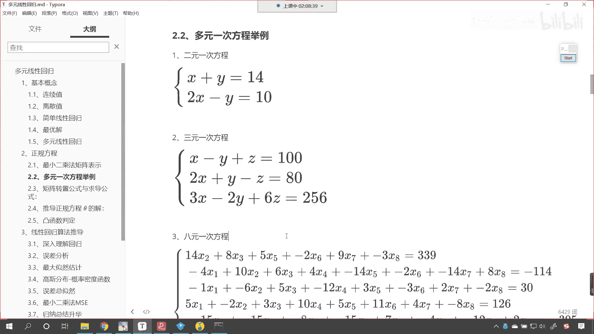

这个时候要回到咱们的课件当中，现在你能够发现你看我说b是截距，咱们是不是也可以使用w0 来表示，还记得吗，如果要使用w0 来表示，那么它前面的系数是不是统一就是一啊，对不对，看是不是就是统一是一。

那咱们现在怎么去修改数据呢，怎么去修改咱们的数据x呢。

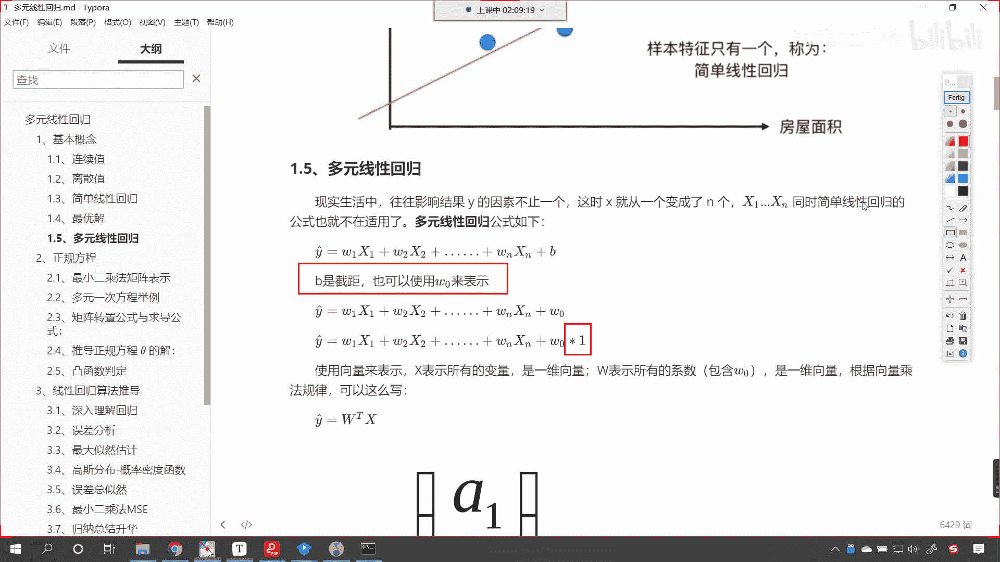

来回到代码当中，看我们像x的最后一列都给它增加一，这个时候呢就是np点，cocoinnate，小括号中括号，然后逗号给一个np点负小括号，我们数据一共是看看咱们的数据，一共是八行八列。

那么我们也给它八行一列，咱们few value，我们让它是一这个时候进行吉连的时候，咱们指定一个轴，这个时候你看过一执行，你现在发现数据x和原来相比，有什么样的一个变化，看有什么样的一个变化。

它的最后一列是不是都变成111了，看到了吧，最后一列是不是都变成111了，那这一列是不是就相当于咱们的相当于谁，是不是就相当于w0 呀，对不对，马上啊，现在呢操作完之后，咱们再把它接收一下。

叫做x这个时候呢x有了，y也有了，看displp l a y，小括号x放进去，y放进去，这个时候你看我一直行，看到了吗，这个x是增加了一列，五，y呢是增加了12，好y增加了12。

现在呢咱们再使用线性方程，model就等于linear regression feat intercept，让它等于false，然后model their feet。

重新学习x上面就是对于x这个数据的变换，学习完之后，咱们display一下，咱们将model的，叫做call if，把它的斜率打印输出一下，然后model。intercept，这个时候你看我一执行啊。

这个时候咱们再看咱们这个结果嗯，等会儿我看一下哈，display model coemodel intercept，这个时候解出来的依然不是这个正规方程，是不是呃，我看一下啊，行乘以咱们的。

对于上面咱们的x，咱们使用正规方程来操作一下啊，那就是np点正规方程n v，然后呢x。t。dot一下咱们的x，然后再来dot x。t，然后再来dot一下咱们的y啊，我们计算一下啊，我们来看啊。

一个两个三个四个五个六个七个八个九个嗯，这回咱们算出来的这个数据大家看啊，和上面的这个是不是就不太一样了，那肯定是咱们再进行嗯哪些操作的时候呃，我们做的不太对啊，来我来稍微做一个调整啊。

原来咱们的数据是一五十五三和八，然后40 72，那经过咱们这个方程的一个改进，x一的系数是一五，嗯然后我们就相当于是给它增加了一个12，是不是增加了12之后呢，这个w0 就相当于是，咱们给它增加了一列。

修改x的时候多了一列x9 嗯，我看一下，你说修改x的时候，咱们其实就是想让他增加一列嘛，修改x的时候就是想让他增加一列好，那么呃今天晚上呢嗯咱们的时间呢也到了啊，那我们大概回到咱们呢大概回顾一下啊。

咱们今天所讲的内容嗯，大家呢就把咱们的正规方程啊，就将咱们的正规方程所对应的这个公式搞定。

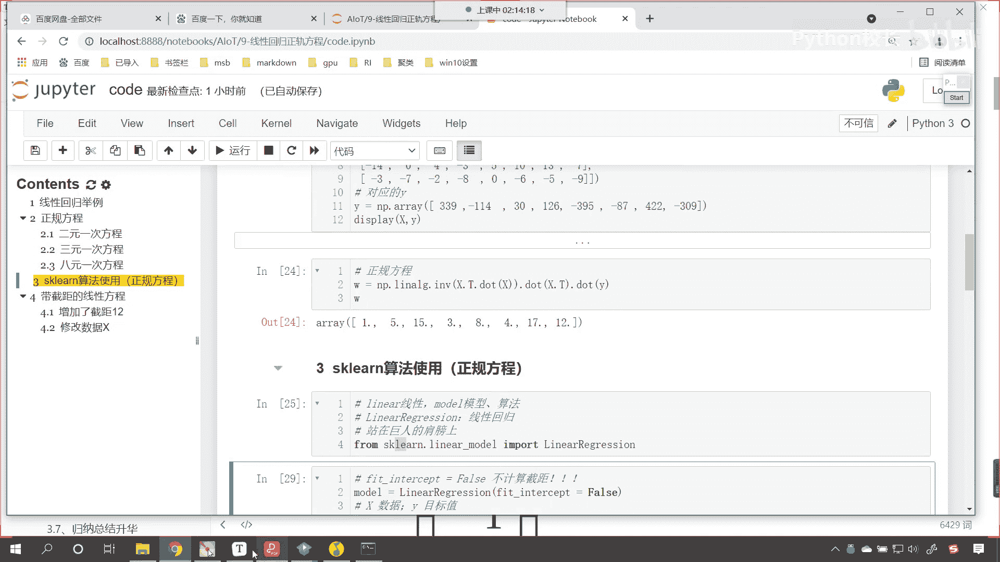

就可以了啊，对应的这个正规方程。

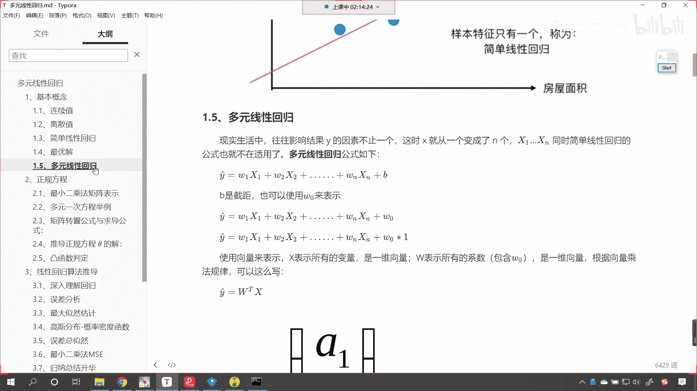

那么我们的正规方程所用到的这个公式，就是x t x减-1，这个-1呢就表示逆矩阵，xt呢表示转置矩阵，通过这个正规方程我们就可以求解出来，咱们呢就可以求解出来，它的这个斜率和咱们的截距。

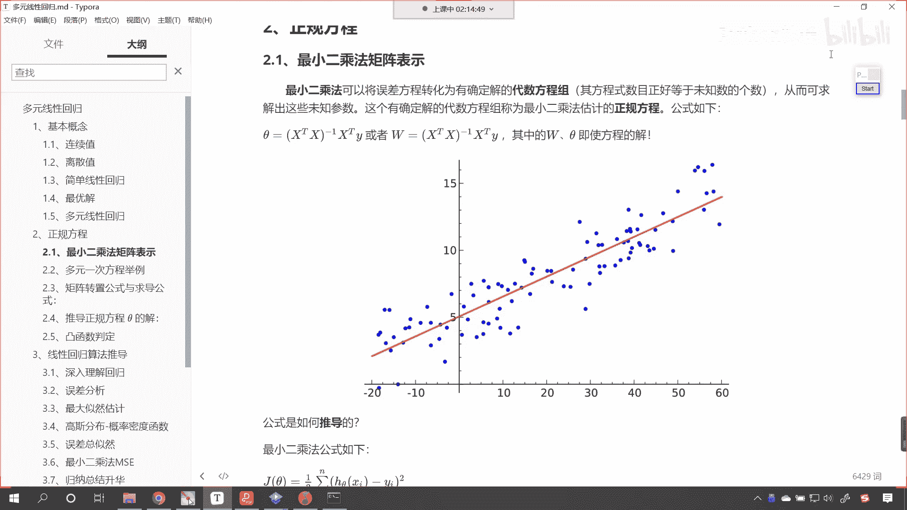

那咱们既可以使用正规方程进行求解，咱们也可以使用sk learn算法，是不是进行相应的操作呀，他们俩之间是有联系的啊，其实这个linear regret。

linear regression就是封装了咱们的正规方程，它的算法当中就是根据这个正规方程来进行的，一个改进好，那么咱们今天晚上呢。

嗯大家根据我们所学的内容，我们呢有相应的一个作业啊。

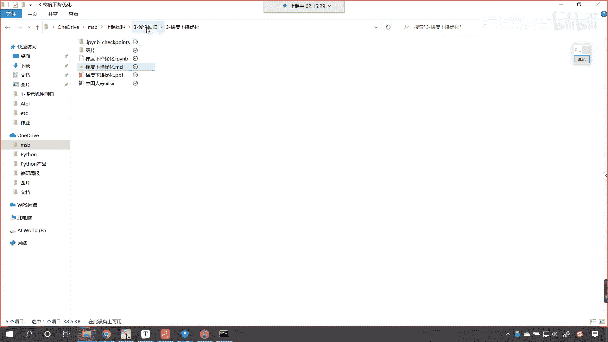

来咱们一起看一下咱们的作业，嗯咱们现在呢有一堆数据，咱们的气候会随着海拔的升高而降低，是不是啊，对不对，那我们假设海拔高度与气温的关系，可以用如下公式来表示，y就是气温w乘以x加b。

现在呢w和b这两个参数是未知的。

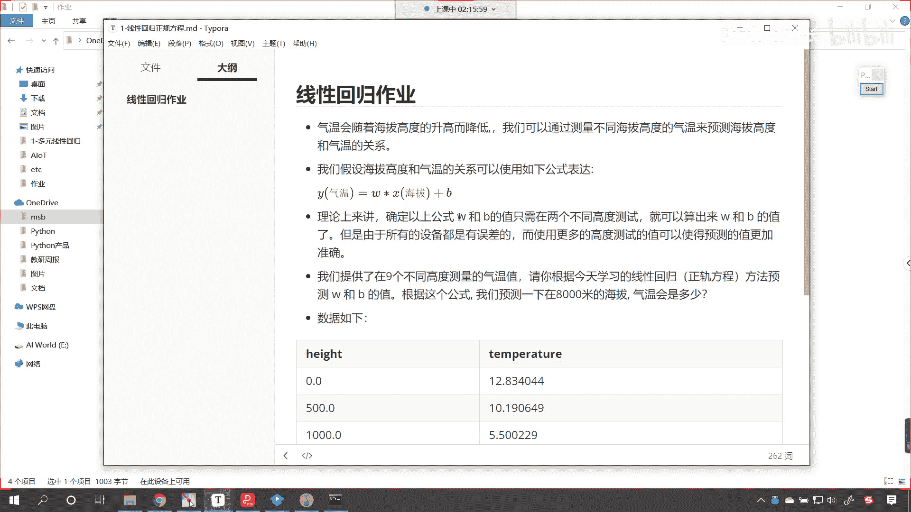

我们现在呢提供了九五个不同高度的，测量的气温值，大家看这个是我们提供的数据是吧，海拔4千米，它的温度呢就是-13度，零下13度，大家根据我们的公式，根据咱们的正规方程，根据咱们今天所讲的线性回归。

将咱们的w和b求解出来，求解出来之后呢，啊将这个w和b求解出来，求解出来之后呢，预测一下，咱们预测一下8千米高的这个海拔，它的气温会是多少，好，那么呃这个呢就是我们今天晚上所讲到的。

线性回归之正规方程的全部内容，大家呢嗯根据咱们所学的内容啊，然后我们把这个完成啊，我这个截图软件呢叫做point to fix，来我们群里边儿有小伙伴问到了是吧，是这么一个软件。

这个是德国一个公司开发的画图软件，免费开源，特别好用好，那么我们今天晚上的内容呢，咱们就到这里啊。

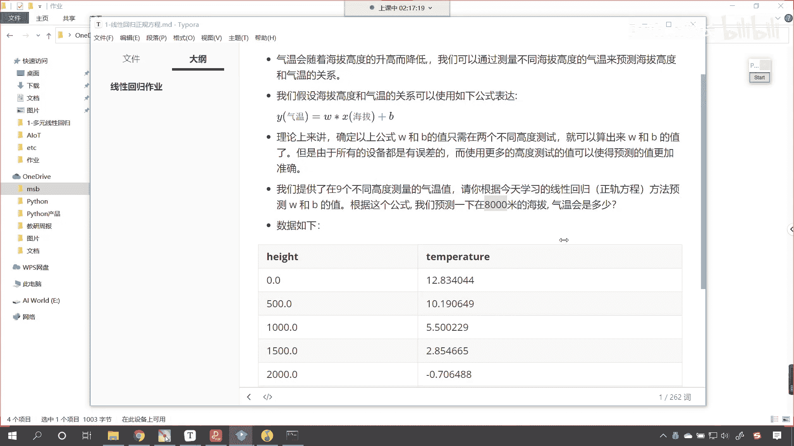

大家课下把咱们课件当中，课程当中所讲到的内容。

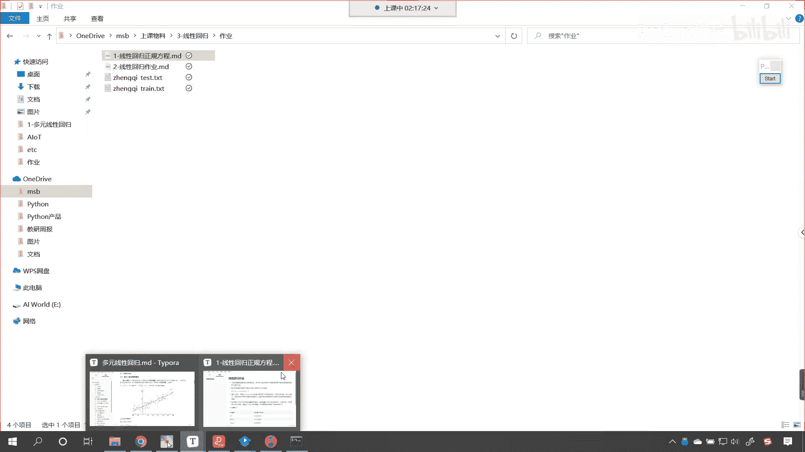

我们呢要好好的吸收一下。

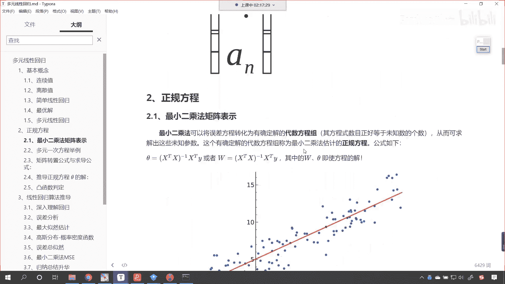

好咱们呃，下一刻我们周三再见。

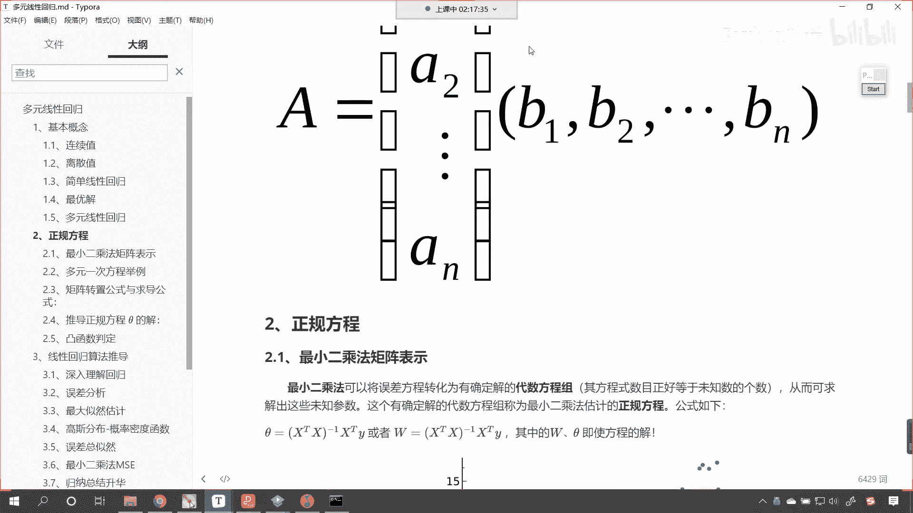