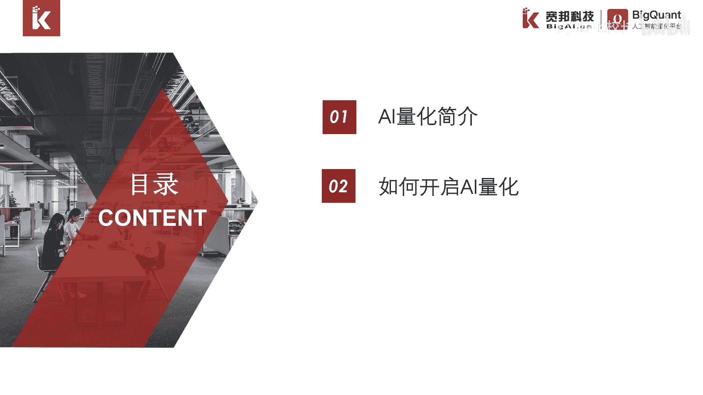
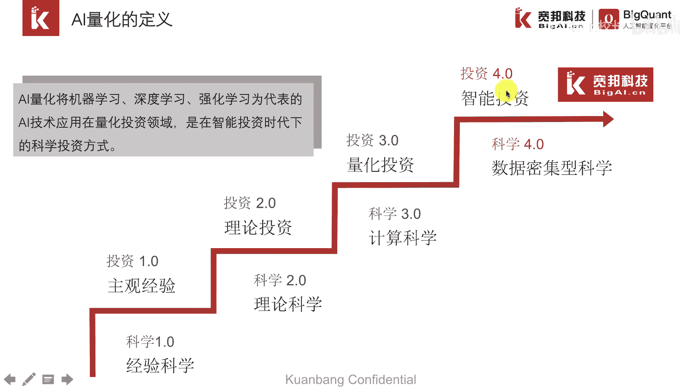
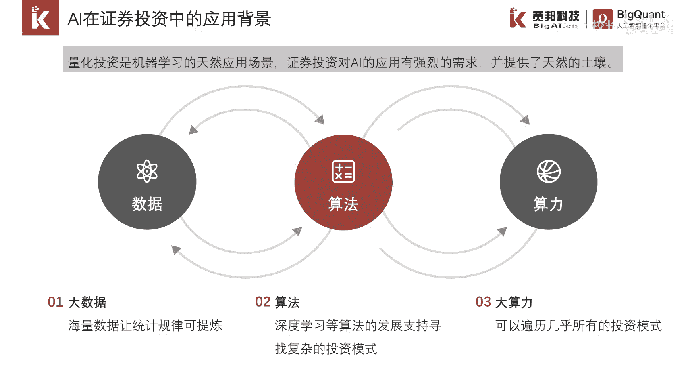
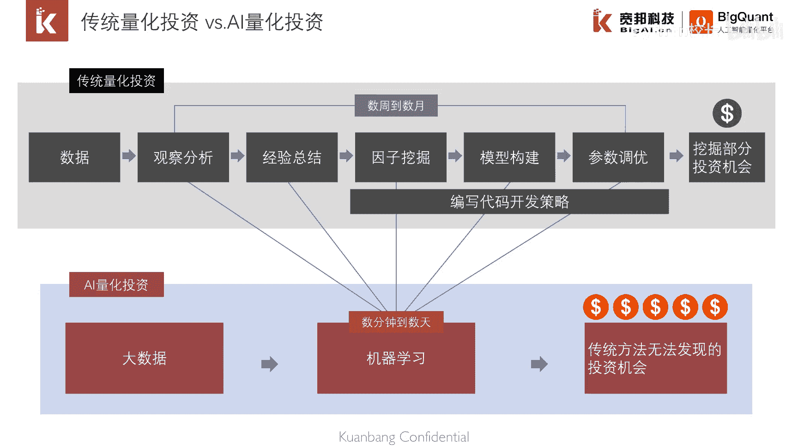
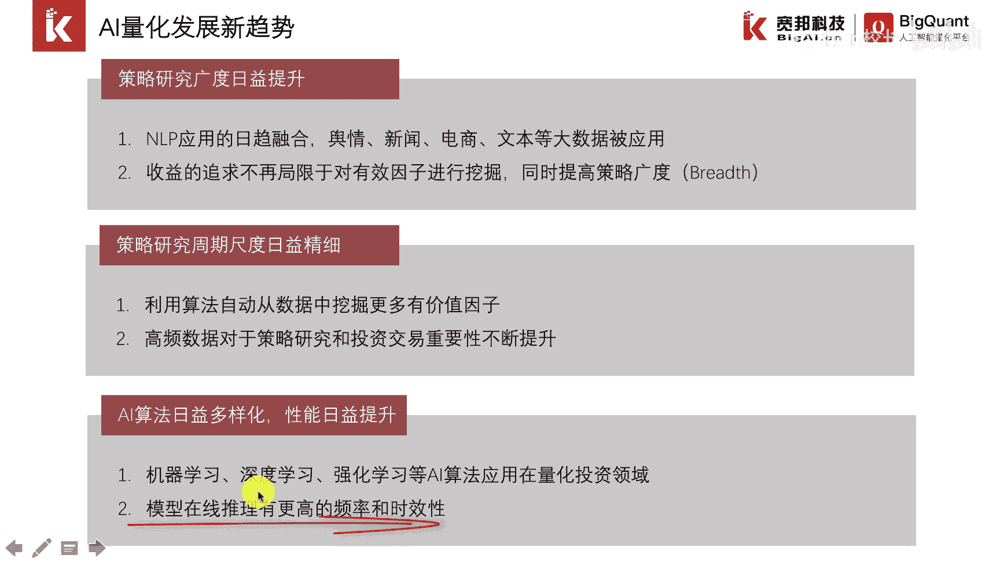

# P5：1.2.1 AI量化简介 - 程序大本营 - BV1KL411z7WA

大家好，今天我们进入第二章节的学习，第二章我们的主要内容是ai量化入门，ai代号入门，这一章我们主要包含两个小节，第一节是ai量化简介，第二小节是如何开启ai量化。

这是我们这一章的第一节ai量化简介。

ai量化是将ai技术用在量化投资领域，是在智能投资时代下的科学投资方式，我们先来看看科学研究经历了哪几个阶段，这里以飞机的制造为例，最早的飞机是莱特兄弟，模仿鸟类飞翔的仿生飞行器。

这是处于经验科学的一个阶段，后来人们意思啊，飞机的起飞是通过发动机产生升力，流体力学，这个阶段是理论科学的一个阶段，后来随着计算机的发明，研究员可以根据相关理论，把模型方程数值化求解。

得到求解结果进行仿真和模拟航空理论，届时有理论立体留学过渡到计算流体力学，如今我们都知道美国能制造出最好的飞机，但是有哪些原因呢，其其中有一个原因就是，美国拥有全世界最大的风洞。

风洞是以人工的方式产生并控制气流，得到大量的实验数据，让算法能够在海量的数据中去寻找规律，投资过程也是如此，最开始是依赖于交易员的主观经验，后来随着有效市场假说，资本资产定价理论的发展。

产生了基本面分析和技术分析等投资方法，在80~90年代开，随着计算机的发展，投资又进入了量化投资的阶段，在这个阶段通过历史数据来进行模拟，得到策略的回测结果，ai量化是属于智能投资时代下的投资方式。

模型自动从海量的数据中去寻找规律，量化研究不再局限的依赖于研究员，第三个阶段和第四个阶段最大的区别在于，前者策略研究以人为主导，后者以机器学习算法为主导。

人工智能的发展和应用依赖于这三个要素，数据算法和算力，在金融市场上每天会产生大量的数据，如果仅仅考虑主笔数据t和数据新闻数据，这个体量是非常巨大的，算法在海量的数据中提取统计规律，扮演着重要的角色。

其次是算法，随着谷歌，微软等大型互联网巨头将成熟，算法逐渐开源，算法从实验室逐渐走入业界，先进算法的获取和应用也变得异常容易，最后是算力，算力也就是我们说的计算资源，在海量的数据中挖掘规律。

需要大量的算力，算力的发展，也是目前我们能够处于第三次ai浪潮，的一个重要的原因，传统的算力指的是cpu，90年代开始，以gpu为代表的算力获取和管理变得相对容易。

这幅图形象的比较的，传统量化投资和ai量化投资的一个区别，从图我们可以看得出来，传统量化投资的研究流程比较长，策略开发需要较长的时间，而且只能发现部分的投资机会，而ai量化投资策略开发周期较短。

将传统量化投资数周到数月的策略，研发周期缩短到数天甚至数分钟，这就大大提高了策略的研发效率，不仅容迟，从效果和质量上也有一个提升，因为ai量化借助算法，在海量的数据中进行自动的数据挖掘。

可以发现更多的常人所难以挖掘的投资机会。

最后我们介绍一下ai量化发展，面临的一些新的趋势，新趋势也是体现在算法，算力和数据这三个要素上，首先我们来看数据指的是舆情，新闻，电商文本和一些高频数据，比如说tick数据逐笔成交。

数据逐笔委托数据开始应用在量化研究上，接着我们看算法，算法上指的是机器学习，深度学习，强化学习的一些ai算法，开始运用在量化研究领域上，在算计上是使用算法自动从数据中挖掘因子，需要更大的一个计算资源。

并且模型上限对未来数据的预测。

