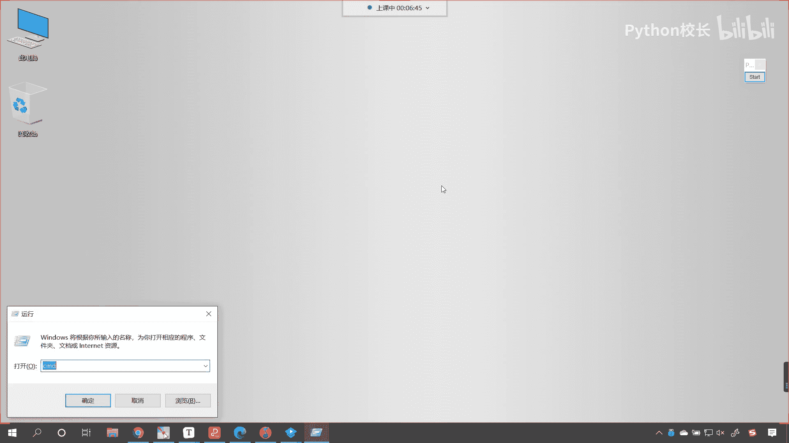
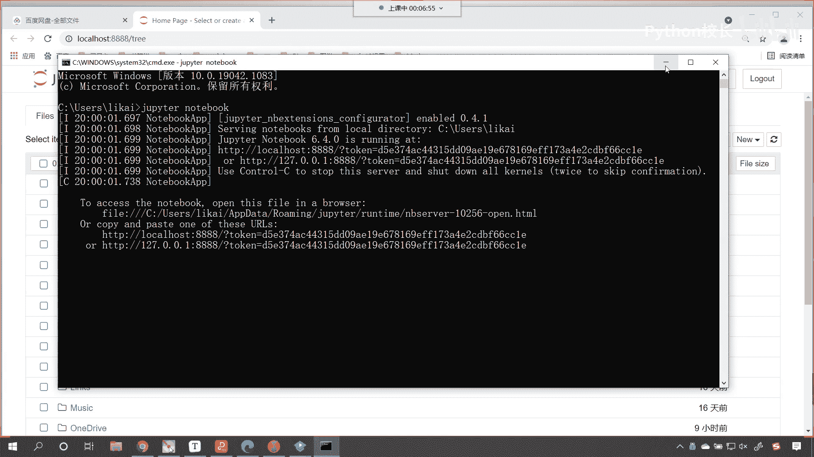
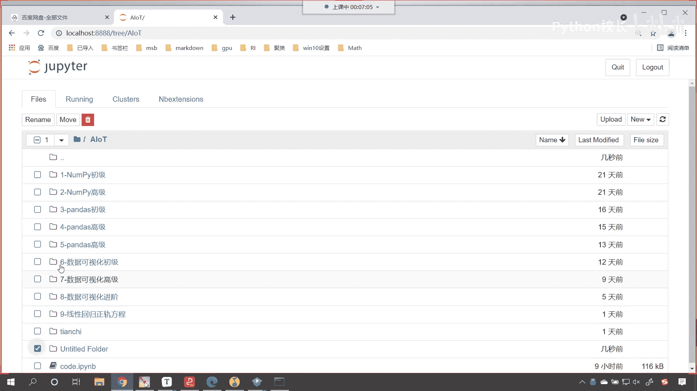
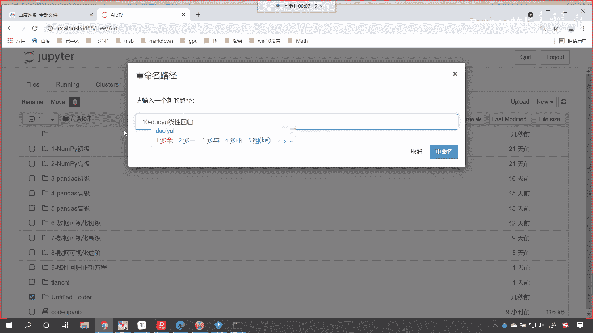
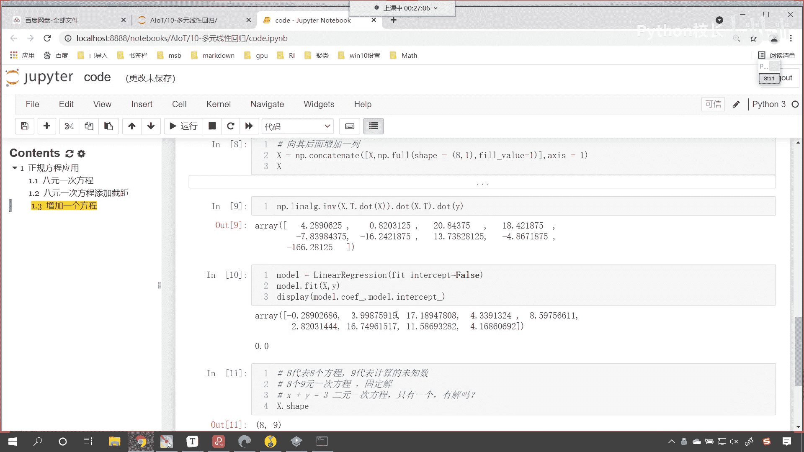

# P50：1-八元一次方程问题再现 - 程序大本营 - BV1KL411z7WA

作业咱们已经把答案和咱们的视频讲解，已经上传到咱们的群共享文件当中了，就是百度网盘当中了，大家呢去进行下载，把这个作业完成就可以了啊，那接下来呢我们看今天的内容啊，来我们启动一下咱们的代码编辑环境。

主peter notebook，启动完之后，这个命令行黑窗口我们就可以最小化了。

那我们在aot下边，咱们新创建一个文件夹，好不好，给这个文件夹选中。

重新给它改一个名儿，这个就是咱们十个叫做线性回归，我们就叫做多元线性回归。

那我们就进入到这个文件夹当中，咱们先创建一个python 3，我们给它改个名，这个就叫做code，首先呢我们来一个三级标题啊，看一下我们上一节课咱们讲的内容，我们做一个简单的回顾，好不好好。

那么咱们上一节课呢讲解了多元线性回归，它的一些基本概念，比如说连续值是什么，离散值是什么样的，简单线性回归长什么样，那什么是最优解是吧，最优解它不一定是完美解，什么又是多元线性回归。

昨天呢之前上一节课呢，我们讲解了正规方程，咱们在代码当中对于正规方程进行了使用，发现这个线性回归当中的正规方程，确实是一个好东西，可以帮助我们进行求解，那我们昨天举例子，咱们举到了八元一次方程，对不对。

这个八元一次方程咱们在进行操作的时候，那就稍微有一点儿问题是吧，那为什么我们给它增加了一列，是不是咱们计算出来的结果就不对了，对不对，好，今天呢我们一上课就把这个问题给它解决掉啊。

此时呢咱们就把这个给它复制一下，ctrl c放到咱们今天的代码当中，好，那我们今天的第一个呢唉就叫做正规方程，它的应用正规方程，执行一下，现在这个呢就是咱们的一个三级标题，那我们右侧是吧。

把目录给它显示出来，此时呢咱们导一下包，那就是import numpy as np，和正规方程相关联的算法，是我们sk learn当中的，我们从linear model当中。

咱们导一个包叫linear regression，大家要注意导包的时候该大写的地方要大写啊，一般情况下你根据代码的提示进行导包，导进来的不容易出错，如果这个单词你要自己写，是不是就会出错呀。

嗯咱们今天呢，就有同学在我们的班级群里边问了，说老师这个我导包怎么就报错了呀，就是因为英语单词给写错了，执行一下，然后ctrl v，那我们这个数据呢咱们就不一个一个写了，咱们直接粘贴过来好不好。

这个时候你看我一执行数据都好好的啊，没什么问题，是不是啊，大家注意咱们这个方程是几元一次方程呀，咱们给他来一个四级标题，你看他是不是八元一次方程呀，对不对，你看它是八元一次方程。

那在讲解八元一次方程这个求解的时候，首先要给大家普及一个知识点儿，那既然是八元一次方程，大家看既然是八元一次方程，如果这个方程有唯一解，那么请问我们至少需要看，咱们至少需要几个方程呢。

这个问题咱们先问出来好不好，大家呢先思考一下，那对于我们这八元一次方程啊，对于咱们这八元一次方程，咱们是不是可以使用咱们的正规方程，或者说使用咱们的线性回归，是不是可以对它进行一个求解啊。

咱们先使用线性回归对它进行一个求解，那就是linear regression，上面咱们这个方程在进行创建的时候，咱们是不是没有考虑，看上面那个方程在进行创建的时候，咱们是不是没有考虑它的这个截距呀。

没有考虑它的这个截距是不是啊，所以咱们在这个地方我们给一个什么呢，嗯叫做feat intercept，来一个false，然后咱们使用model。feat将咱们上面合格的数据，注意我所说的合格的数据。

咱们的数据x是不是一个二维的数组呀，那咱们调用feat这个方法就是进行相应的训练，训练完之后，咱们就可以display啊，我们对这个数据的结果咱们进行一个展示，首先呢咱们将他的q if打印输出一下。

然后把它的截距intercept打印输出一下，大家看一五十五三八四十七，这个就是标准答案，看到了吧，这个就是标准答案，咱们现在用线性回归是不是求解出来了，注意这个地方咱们给了一个feat是吧。

intercept等于false，那使用正规方程求解也是一样的啊，咱们调用np一点线性线性方程下面的i n v，这个就是求它的逆矩阵，那求完逆矩阵，咱们给一个x。t，然后dot咱们将x放进去。

然后继续dot x。t，然后dot我们的y，那这个时候你看我一执行，求解出来的答案和上面是不是一模一样呀，懂了吗，这个就是正规方程，我讲了很多遍，我记都记住了，如果你记不住也没关系，咱们有相应的课件。

是不是你根据课件是不是就可以进行操作了，对不对，根据这个课件上面的公式，你也可以操作啊，好那么我们说咱们要把它进行一个相应的变换，咱们如何给它变换呢，上面这八元一次方程它没有截距。

咱们呢就为这八元一次方程，我们给它怎么样呀，给它添加一个细，给它添加一个截距，好不好，这个时候我们给它添加一个截距，那我们说咱们添加洁具是我们自己添加的，我们是不是想添加这个截距，是数字几。

就可以让它是数字几啊，对不对，那咱们现在把这个截距我们给它添加多少呢，原来这个结局是零，对不对啊，现在呢哎我们就设咱们的截距呢，还是咱们上一节课所讲的12，你想既然这个截距是12了。

也就是说所有的线它是不是向上移动了12啊，y是不是我们的目标值呀，你y是不是就得进行相应的移动呀，对不对，嗯所以这个时候怎么样呀，咱们的目标值我们进行移动，那它的移动其实就是向上移动，对不对。

向上移动的是不是就是一个加法运算呀，那咱们这个地方就给了一个加法运算，没问题吧，你看操作完之后呢，咱们打印输出一下y啊，嗯咱们在操作之前print一下y，操作之后呢，print一下y。

这个时候咱们来一个说明和注释，这个呢就是增加了增加了截距，上面这个x呢就是没有上面这个x，它的呢截距是零，截距零，也就是没有截距呗，这个时候你看我一直行，现在你就能够发现增加完之后，下面这个数字是不是。

比上面这个要稍微大一些了，大家注意啊，我增加截距了，看到了吧，增加结局了，确实是不是向上增加了，对不对好，那么向上增加之后，咱们就说我们上课所讲到的，看咱们上课所讲到的这个多元线性回归。

如果要增加了一个截距，那这个结局是不是可以用b来表示，复制一下咱们这个markdown的这个公式啊，我们把它插入到这儿，你看粘贴一下，你看我一执行，你看这个公式，后面这个截距b是不是就相当于是12啊。

那这个截距b是不是也要我们去求解的一个，未知系数呀，它是不是也是一个未知变量，看咱们的b看它也是一个未知的，变量你想一下是不是，虽然是我们现在嗯我们知道，但是计算机他知道吗，计算机是不知道的。

b也是一个未知的变量，所以说也需要我们是不是进行方程的求解呀，你看它也需要进行方程求解，这个没问题吧，大家可以理解吧，好那么我们又说了，既然它是变量，那我们用什么符号表示，那是不是都无所谓啊。

那咱们现在呢就可以使用下面这种方式，来对它进行一个表示啊，大家看啊，我对它进行一个表示，来回到咱们这个课件当中，ctrl v好，现在你来看，你既然是变量，我把你写成b和写成w0 有区别吗。

是不是没有区别，对不对，你看咱们原来的方程是w1 w2 ，是不是一直到w8 呀，现在我是不是写成w0 ，你看这也是一样的，对不对啊，w人是我们要求解的值，那这个因为b前面的系数是不是都是一。

所以咱们原来的这个数据x，看原来的这个数据x，我们就可以对它进行相应的修改，原来的这个x呀，大家看啊，执行一下，你看原来的这个x它的数据是这样的，你看到了吗，就是原来你的x你比如说这个是x一是吧。

这一列就代表x1 ，这个是x2 ，这一列就代表x2 ，这个是xn，那我们的382，这个就代表咱们的xn，此时这个xn的就是八，你想你现在又多了一个系数，那此时我们是不是应该给它增加一列。

就是在这个后面是不是应该增加一列对吧，增加了这一列，你看它是不是都表示咱们w1 ，w0 前面的系数啊，你看它就应该是一是不是，然后再来个一，然后中间省略号最后是不是也是一啊，对不对。

那我们给他输入一个省略号啊，哎你看就是就是这个省略号，大家想一下是不是这个样子，那我们首先对x进行一个变形，好不好，根据咱们之前所学的方法，咱们很简单就可以对它进行一个变形，那就是np。

cocoinnate，小括号中括号我们把x放进去，逗号调用咱们之前所学的方法叫负，咱们来一个ship，那我们原来的数据是八行八列，现在呢咱们给一个八行一列，里边的值呢都给成一，咱们在进行吉连的时候。

我们让x等于一，这个时候你看过一执行，你看怎么样，咱们是不是就在最后一列，对它进行了数值的插入呀，看到了吧，现在是不是全是一np是不是很强的，插完之后呢，我们接收一下啊，大家看啊，插完之后咱们接收一下。

咱们呢就给一个x好不好，然后这个时候呢执行一下，大家注意啊，这个代码你只能执行一次啊，明白吗，如果你要再执行的话，他是不是又在x的身上的，后面是不是又增加了11111呀，对不对。

所以说这行代码咱们执行一次啊，你如果要是多执行了，那你就从前往后代码再执行一下就可以了，所以说这个写代码是很严谨的一件事，他这个考察到你的这个思维，所以你要搞清楚弄明白啊，哪个代码可以执行多次。

哪个代码，它不能因为这个代码就是它的作用是什么，向其后面增加唉，就是象棋后面怎么样，是不是就是增加一列呀，你每执行一次就增加一列，明白吗，好现在你看数据x也有了，是不是上面的数据y是不是也有了。

那咱们就来走起是吧，我们看看八元一次方程，增加了结局之后，我们增加的是12，咱们希望咱们的算法能够算出来好不好，你看我们希望算法能算出来是吧，因为算法嘛是吧，高大上，那咱们首先呢就是使用np。

一点线性回归当中的方法，线性代数当中的i n v小括号是吧，x。t然后点dot x，然后再dot x。t，然后最后呢再dot我们将咱们的这个y放进去，你看我一执行，大家看求出来了吗，有没有求出来。

没有看到了吧，没有求求解出来，得到的这个答案和上面是不是相差甚远呀，你这个答案是不是应该是幺五十5384呀，这个就相差甚远啊，唉怎么这回就失灵了呢，刚才这正刚才这个正规方程，不是说他很很牛吗是吧。

现在咋就失灵了呢，那我们在使用model，咱们在使用这个sk learn当中的线性回归，我们使用它求解一下好不好啊，那现在你看你不是有现在的话，咱们所给的这个数据是吧。

你看我们同样也是feat intercept，我们让它等于false，这个时候呢咱们就model。feat啊，咱们将x y放进去，然后呢我们就display一下，看display一下。

将咱们算法所计算出来的叫model。coif，以及它的截距intercept，你看我执行一下，大家现在来看啊，你看这执行出来是不是也不一样呀，看到了吧，这是为啥呀，你看负的289026。

三点九九八七十七点189，你看这回是不是就完全不一样了呀，你有没有想过原因呀，是不是为什么它就成了这样呀对吧，我们增加了一个节距，怎么就发生了天翻地覆的变化呀，来我告诉你原因，x。ship。

大家看一下它的形状，看一下它的形状啊，我们把它转换成代码，咱们执行，现在你能够发现，你看咱们数据的形状是不是八和九呀，那这个八你知道代表什么吗，八是不是就代表八个方程，对不对，看看咱们这个八代表什么啊。

来哪位同学能告诉我这个八代表什么，看这个八呢就代表八个方程，我们这个九代表什么，九是不是代表着咱们要计算的未知数呀，对不对，我们上面对于数据x对于数据外进行了操作，咱们其实把数据形状进行了改变。

那这个形状其实就变成了八个方程，九个未知数，用咱们这个数学初中数学的这个话语来说，我们就叫做八元一次，你看我们这个就叫做九元一次方程，那这个方程一共几几个呀，咱们一共八个九元一次方程，看到了吧。

一共八个九元一次方程，你想八个九元一次方程，这个有固定解吗，想一下有没有固定解，这个时候是不是就解不出来了呀，我们说算法它有一个厉害的地方，你即使没有解，我们也不能说是无解啊，这个其实呢它有无数个解。

对不对啊，无数个解，那算法呢它可以给我们计算出来一个最优解，知道吗，算法可以计计算出来一个最优解，就好比你看我们给的八元一次方程，它有点多，不好举例，咱们现在呢我就给你一个方程啊，你看叫x加y等于三。

你看这个方程是不是对应着嗯，这个二元一次方程呀，这个方程是不是只有一个，那请问它有解吗，看到了吧，它有解吗，看到了吗，有解吗，是不是没有解啊，你看到了吗，有解吗，它没有唯一的解啊，没有唯一的解。

那现在怎么办呢，来咱们找解决办法，你看你是八个九元一次方程，那我再给一个，再给它添加一个方程，是不是就可以了，来现在咱们再来一个四级标题啊，现在的话咱们就看再增加一个方程。

你看我们再增加一个方程是不是就可以了，上面呢是咱们昨天的情况。

对不对，好。