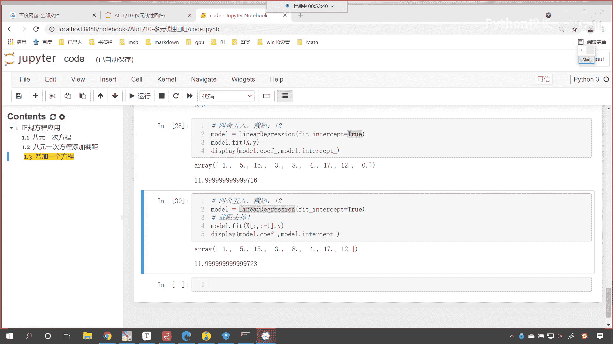
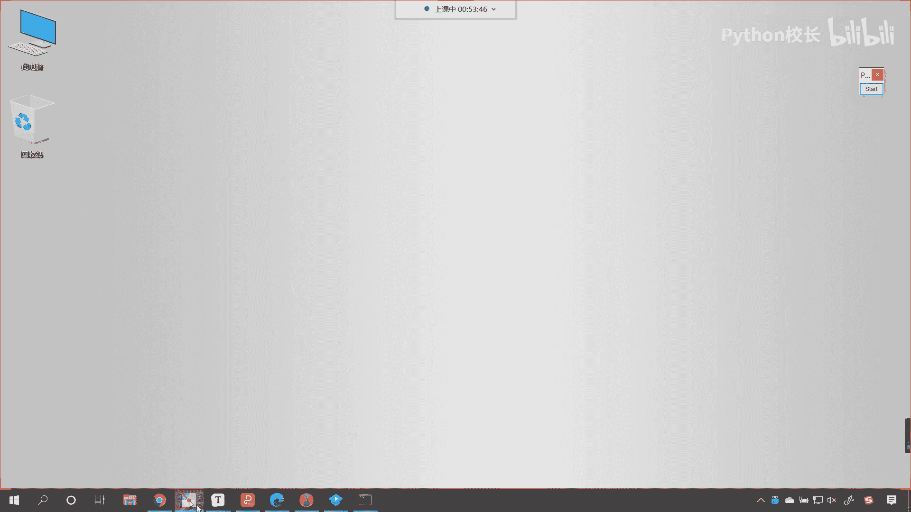
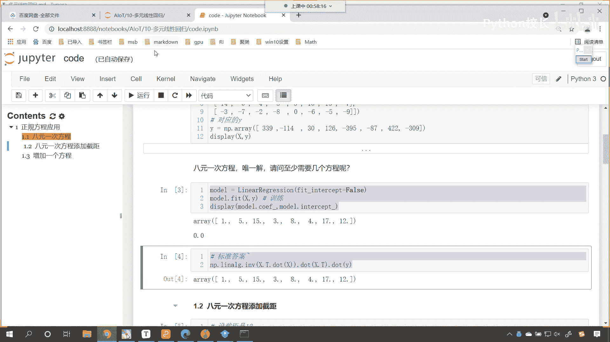
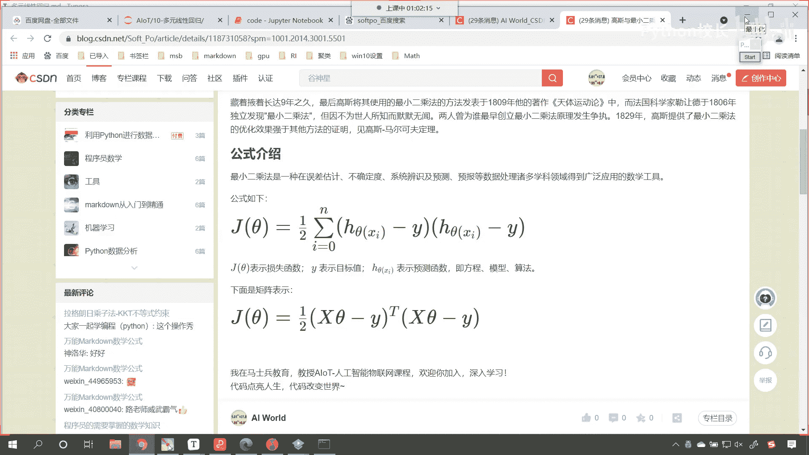
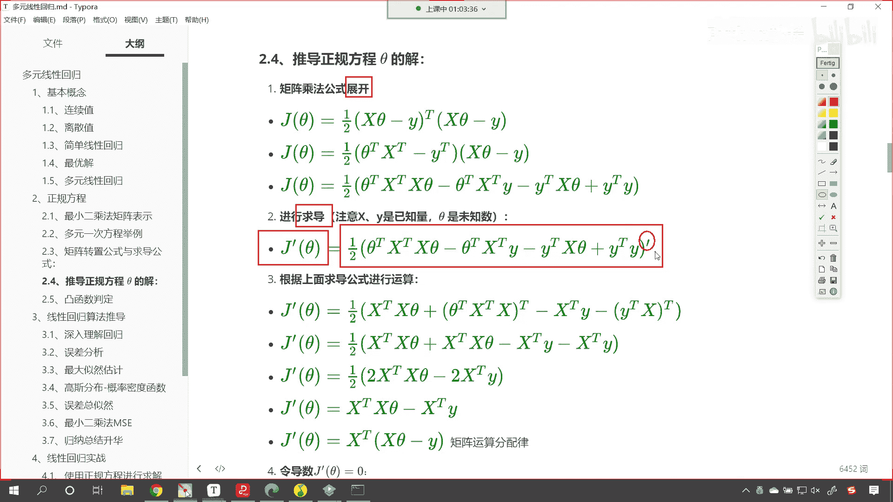
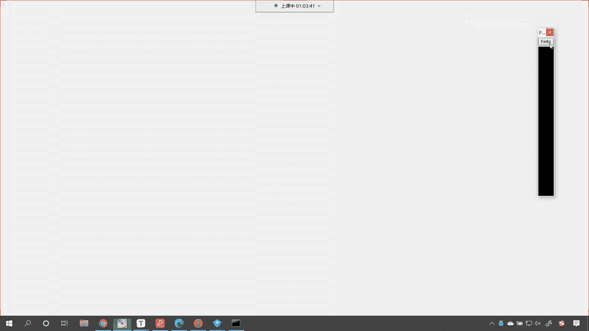

# P52：3-正规方程的公式推导 - 程序大本营 - BV1KL411z7WA

继续我们继续向下看好。

那么来我们再回到咱们的课件当中好。

那么接下来呢我们就这个看点难的啊，这个里边就涉及到公式的推导，那公式推导肯定难呀，对不对，你看这个当年中国刚刚建国的时候是吧，钱学森这个费了很大的力气才回到祖国，最后是不是研研发出来了导弹呀，对不对呀。

那个你像咱们中国的航天员杨利伟也好，聂海胜也好，他们每次从天上回来嗯，在前老孩啊，还这个健在的时候，都会去看望他，老人家给他报喜，那就是因为这个前十分是吧，太厉害了是吧，那为啥钱学森这么厉害呢。

钱老的数学功底很厉害，那我们所有的这个弹道导弹呀，所有的这个原理其实归根结底都源自于数学，把数学搞明白了是吧，其实发射导弹那就是轻而易举的事情，那我们在代码当中，咱们能够使用正规方程进行计算是吧。

我们计算出来的结果还很正确是吧，那这个正规方程它到底是咋回事啊，是不是啊，它怎么来的呀，那我们一起来看一下，咱们这个时候，首先给大家介绍咱们矩阵转置的公式嗯，与求导公式，大家现在能看到。

这个m a t看到了吧，a加b t看这些都是我为你总结好的，你有你没有必要问我为什么为什么a加b是吧，小括号它合起来进行一个转置，等于a t加bt是吧，为什么a和b相乘，他的转置等于bt乘以a t。

没有必要，你没有必要去问为什么，你记住就可以了是吧，这就是原理是吧，我们之前嗯在讲这个初中数学的时候，老师就告诉我说，两条两条这个两点之间直线最短是吧，你有没有这个接触过这个定理呢，两点之间直线最短。

是不是，是不是，这是不是就是一个定理呀，记住就行了啊，你不要问为什么，你说为什么两点之间它直线最短呢，是不是这个这个证明那就是数学家的事情了啊，你像我们a t，然后再来一个转置，是不是又变成它自身了。

接下来咱们看一下求导公式啊，看到了吧，哎这个x是吧，x转置对他对他自己嗯，对他自己就进行这个嗯进行求导，那么他得到的就是单位矩阵，然后咱们x t乘以矩阵，a对x求求他的这个导数，那得到的就是a看到了吗。

得到的就是a然后a x t对它求导数，那得到的也是a，所以说这些基本公式唉咱们了解就行了啊，我们现在不考试，所以这些你有必要背吗，没有必要背，是不是好，那么咱们接下来呢在这些公式的基础上。

我们就看一下正规方程到底是怎么推导出来的，那么咱们在一开始的时候就说到一个，那咱们在一开始的时候，咱们就看咱们就说到一个什么呀，就说到一个最小二乘法，看到了吧，我们在最最一开始的时候。

是不是就说到最小二乘法呀，这个最小二乘法是谁推导出来的呀，是高斯，看现在的话。

我们带着大家看一下咱们的最小二乘法啊。

刚刚我进入我自己的博客，哎我就叫soft pop，是不是现在呢咱们就进入我的博客，进入我的博客之后呢，哎你看进来了，进入博客之后，咱们就看一下高斯以最小二乘法的故事，我们有一个简单的了解啊。

看1801年意大利的天文数学家嗯，这个叫做朱塞普皮亚奇，发现了一颗小行星叫古神星，经过40多天的跟踪之后，谷神星就转到太阳背后了，这个时候找不到了，但是那个时候的天文学家已经知道，这个星星是吧。

他在天上都是转圈运动是吧，椭圆一定会转出来，但是你想太空这么大是吧，如果你没有办法对它进行定位，你再去找星星是吧，那很难了，知道吧，然后随后全世界的科学家，利用皮亚奇观测的数据，就开始找这个古神星。

开始算谷神星的轨道，很多人是吧，但是大多数人计算出来的结果，计算出来的轨道来寻找古神星是吧，哎这个都失败了，没找到，时年24岁的高斯也参加了计算，看奥地利天文学家是吧，哎就根据高斯计算出来的轨道。

重新发现了古神星，牛不牛是吧，高斯呢是数学王子是吧，他已经去世了啊，那别问别人，问高斯，你用什么方法算的呀，高斯说保密不告诉你，你看这个那时候的高斯是吧，也这样是吧，跟跟我们普通人差不多。

就是高斯长了一个特别聪明的嗯，这个大脑人家就是为数学而生的，那你就像现在可口可乐是吧，它的配方是不是也保密呀，你问他你的可口可乐的配方是怎么配的，他告诉你吗，不告诉你，高斯呢发现了这个数学公式。

计算出来天文轨道了，他也不说藏着掖着，长达9年是吧，然后的话就写了一本书，说这个9年都过去了，我把自己怎么算的，这个公布一下啊，哎就写书了是吧，天体的运动类，天体运动类用的就是最小二乘法。

法国的科学家呢，你看这个勒让德，也在1806年独立发现了最小二乘法，但是呢这个人比较低调，全世界都认识高斯，但不认识勒让德是吧，他俩呢吵架是吧，就争论说这个是谁，这个是我先发现的，高斯说是他先发现的。

勒让德是勒让德说是他先发现的是吧，所以说你看伟大的数学家也有争论，对不对，我们所有人都是凡夫俗子，那高斯用用什么发现了最小儿，发现了这个古神星呢，唉就是这个看到了吗，就是这个就是这个公式。

原来这么简单呀，对他就是这么简单，那简单的公式背后，往往蕴藏着特别深的这个原理，你发现它了，我们能使用，我们能计算，但是这个到底是怎么发现的是吧，当时就是从0~1，我们现在是在使用前人发现的科学成果。

这个其实是从一到十，这个比较简单，但是什么都没有的时候是吧，那你你突然就能想到这个公式，那这个不行，来我们有了这个公式，我们站在高斯的肩膀上。

咱们看一下这个到底是怎么推导的啊，每一步推导我都为你写了详详细细的推导过程，看到了吧，我怎么给你写的矩阵乘法公式展开，看到了吧，你右上角不是带了一个t吗，怎么办，是不是把它写进去呀，对不对，写进去之后。

写进去之后，咱们是不是就展开呀，好那么对于这个展开呢，咱们没有特别难的啊，看到了，其实就是展开，是不是啊，大家注意这是乘法乘法矩阵再进行乘法的时候，是不是有先后顺序啊，谁写在前面，谁写在后面。

这个要注意了啊，好那么这个是第一步，咱们接下来呢就开始进行干嘛是吧，你矩阵乘法都展开了，接下来呢我们就进行求导，看到了吧，是不是就进行求导了，那这个求导公式，你看哎是不是在它的右上角给他来一个撇呀。

是不是啊，你看哎优雅的我们就写上一撇儿，那求导可怎么求呀。

求导怎么求，你看我上面是不是。

把求导对应公式给你列出来了，对不对，咱们就可以根据这个公式，把矩阵，刚才那个方程的矩阵的导数，是不是可以给它写出来呀，就是稍微有点麻烦是吧，诶大家看啊，我咱怎么操作的啊，看咱们怎么操作的嗯。

那就是把这个撇是不是给他写进去啊，写进去之后你看就变成这样了，看到了吧，写进去之后就变成这样了，然后该化简化简是吧，到这一步最后是吧，唉咱们就到这儿了，看到了吧，最后我们使用矩阵运算的分配率。

该提到一块儿，咱们就提到一块儿，看到了吧，这就提到一块了，好那么这个就是咱们求导公式的运算，接下来再有一步，那接下来再有一步是什么，令导数等于零，看这为什么要令导数为零呢，你看高斯他推导出来这个叫什么。

是不是叫做最小二乘法呀，你看到了吧，什么时候最小呀，你知道什么时候最小吗，是不就是导数为零时是不是最小，看到了吧，导数为零时最小，我们这个方程它长什么样呀，给大家画一下啊，咱们这个方程呢你看它长这个样。

看到了吧，这个方程长这个样，请问它的最小值在哪里呀，是不是一定在它的谷底，没错吧，你好对不对，一定在他的谷底，那么在谷底的这个位置，看在咱们谷底的这个位置，它的导数等于多少，它的导数就为零，知道吧。

在谷底的位置导数是不是就是零呀，所以我们在这个地方令导数为零是吧，这个时候就求解出来了，你要注意啊，你看咱们的这个jc，他这个损失函数，它所对应的这个方程，你现在能够看到这个方程，它非常的特别看到了吧。

这个方程右上角是不是带了一个平方，看到了吧，是不是带了一个平方，带了一个平方，是不是说明它一定是它的曲线画出来，是不是一定是这样的呀，对不对，你看你带着一个平方，是不是你一定是这样的，是不是没错吧。

你看带着平方，大家知道无论你的里面的值是正还是负，只要你带着一个平方，我是不是能够把你转换成它一定是正直啊，对不对，唉所以咱们的正规方程在推导的过程当中，就是你这种写法和上面这种写法是不是一样的。

它是不是都相当于来了一个平方呀，对吧，所以说我们的曲线一定是这样的，那曲线一定是这样的，咱们在求解最小值的时候，我们是不是就是令jc塔等于零，没错吧，你看令它等于零肯定没问题，是不是令它等于零。

然后呢我们这个乘一下，你看这个乘完之后呢，我们把这个xt乘以xc塔，我们把它移动到左边，移动到左边，接下来你看就是看就是最后一步矩阵有除法吗，来现在呢咱们就又普及了一下，我们线性代数当中的知识。

咱们的矩阵没有除法对吧，那逆矩阵我们得需要求解，逆矩阵是不是咱们要求的是谁，要求的是不是c，他这个c它是不是就是咱们方程的系数呀，看在这看看咱们这个c塔它呢就是方程的系数，这个方程的系数啊。

你看它其实就是啥方程的系数，它是不是就是w呀，对不对，我们在公式推导当中，我们可能会用不同的符号来表示，但是你要理解它是什么意思，这个就是方程的系数就相当于w，那既然咱们要求解c塔。

你c它的左边是不是有一个x t乘以x呀，那怎么办，哎这个时候呢咱们就用到了，你看你方程，咱们的矩阵虽然没有乘法，但是我可以怎么样呀，我方程的左右两边是不是同时乘以一个矩阵，它是不是依然等式成立呀。

对不对，你看这原来是等号，现在是不是依然是等号，那乘完之后大家再来观察啊，你看你乘完之后你就成什么样了，看到了吧，乘完之后咱们矩阵运算虽然没有交换率，但是它有结合率，大家现在发现，你看你x t x-1。

就代表逆矩阵和xt x这两个相乘，这不就相当于是矩阵和逆矩阵相乘吗，相乘完之后它就是什么，相乘完之后它就是单位矩阵，咱们用i来表示，大家要注意啊，乘完之后这个就是单位矩阵，看乘完之后，这个就是单位矩阵。

那单位矩阵有一个特点，单位矩阵和任何矩阵相乘，是不是都是是不是都是它自身呀，你看你单位矩阵乘以c他是不是依然是它自身，对不对，唉所以咱们最终就求解出来什么了，看到了我们最终就求解出来这个公式了。

这个公式不就是咱们在代码当中用到的，这个公式吗，到此为止，咱们正规方程的推导就结束了，看到了吧，厉害不厉害，你看这就是正规方程的一个推导，好那么到这儿呢这个正规方程就推导出来了，呃那每一步都非常详细啊。

各位同学，你光看这个还不行，你每一步你都要自己写一下，你才能够真正才能够真正的弄明白是吧，这个方程是怎么来的，那这个方程咱们直接在代码当中使用就可以了，我们为什么还要讲解它的推导过程呢。

你看推导为什么还需要用推导过程呢，因为面试的时候你把我这个抄下来打印出来，写到纸上，如果别人问到你线性回归了是吧，问到你这方面的知识了，你给他讲一讲是吧，它会蛰伏的是吧，马上就把你录取了。

