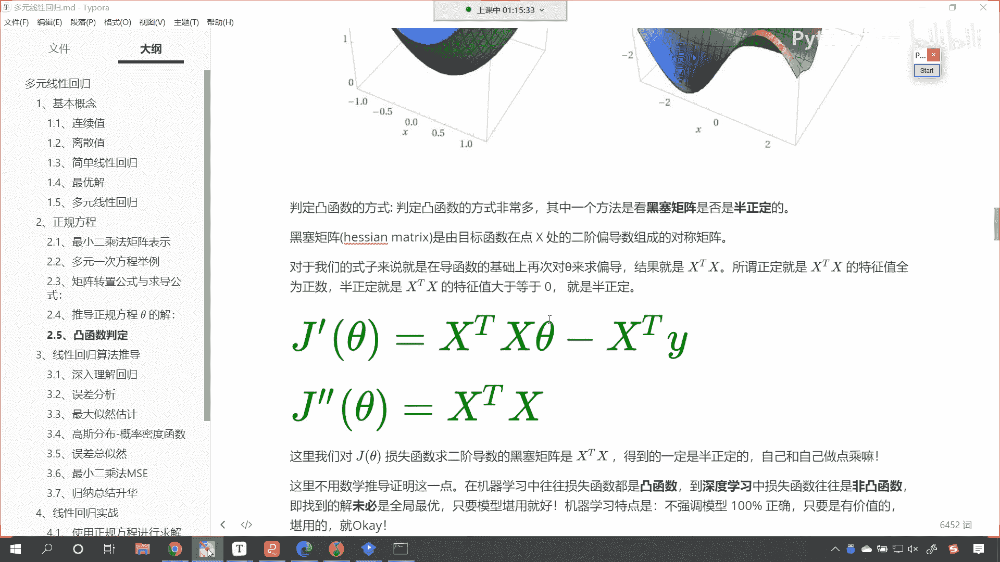
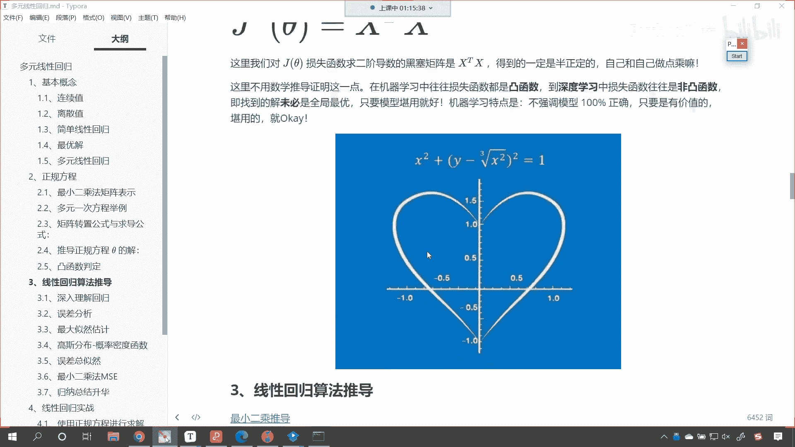
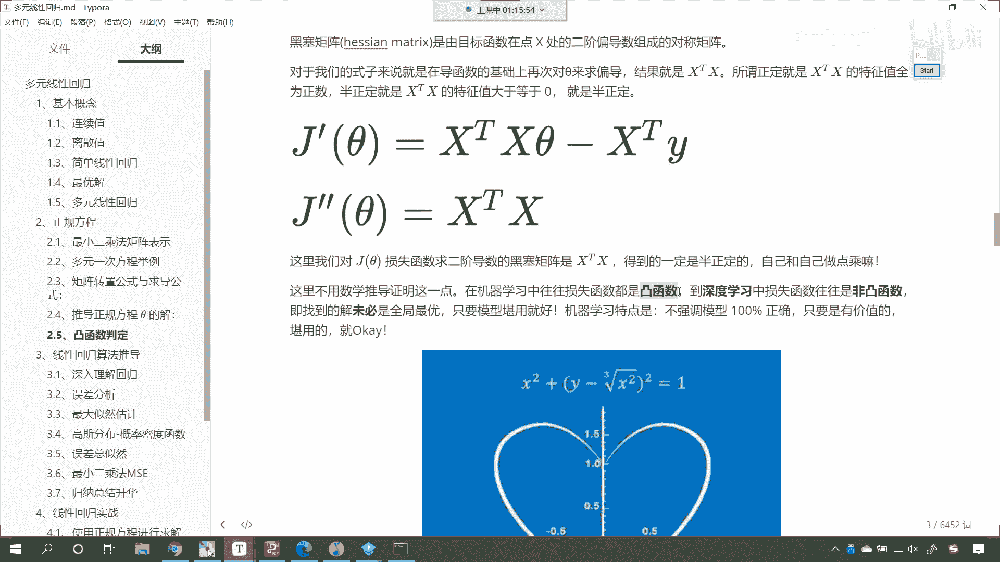
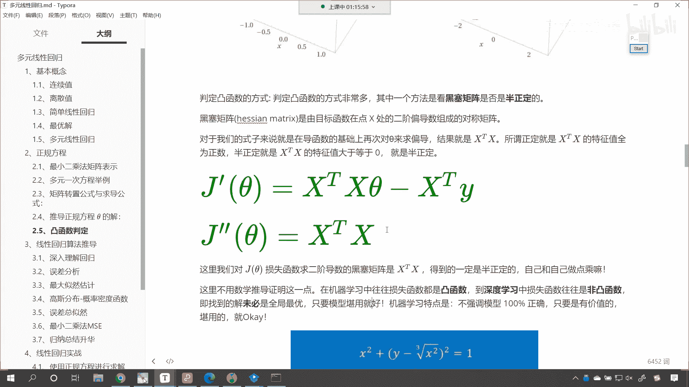
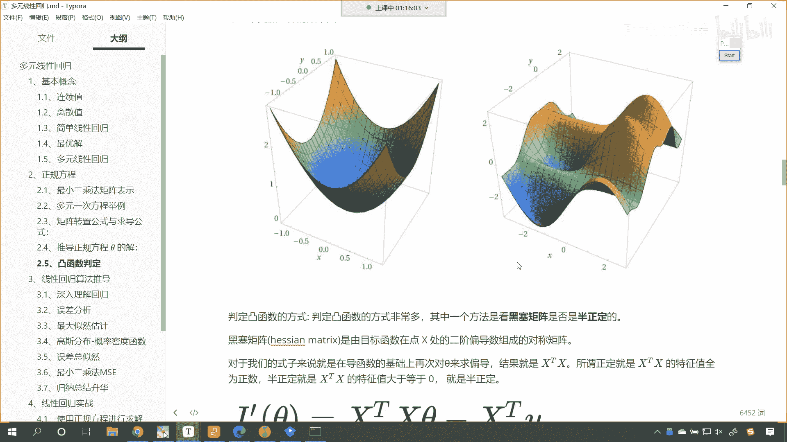
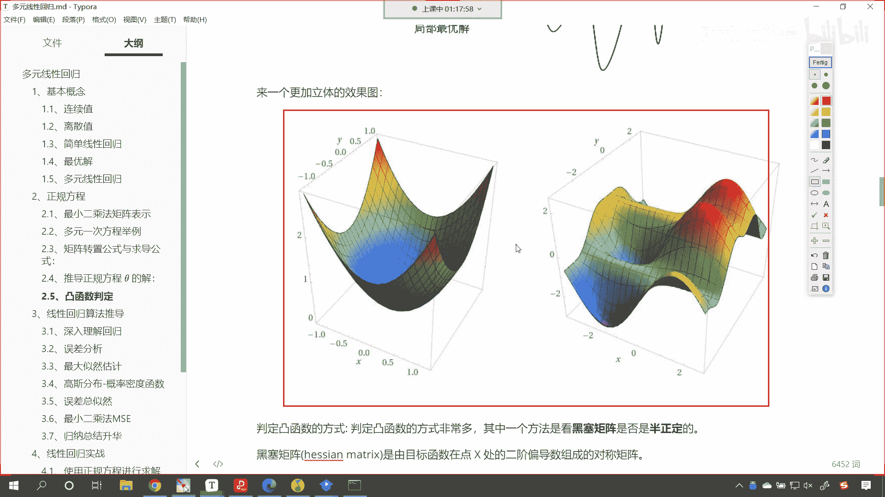
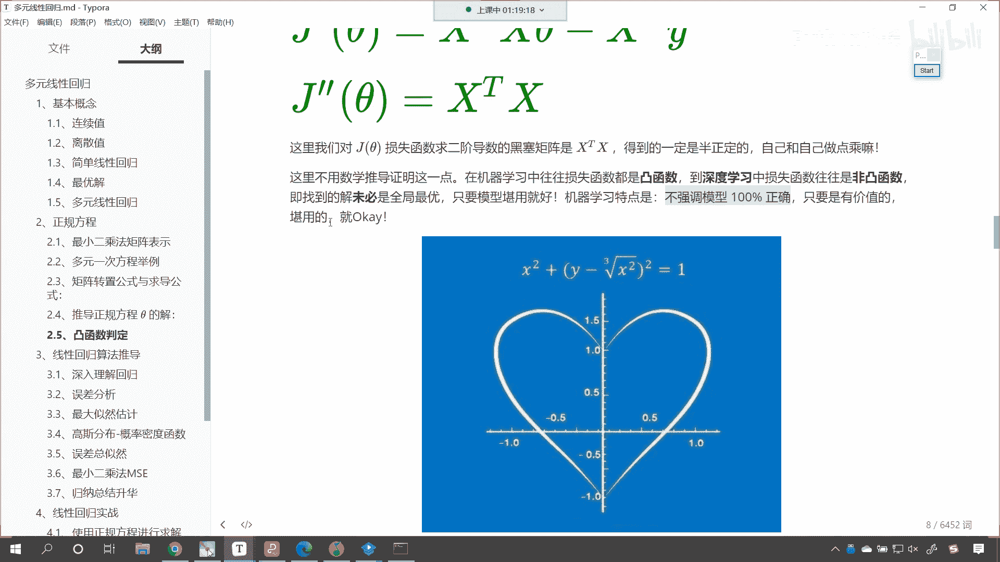
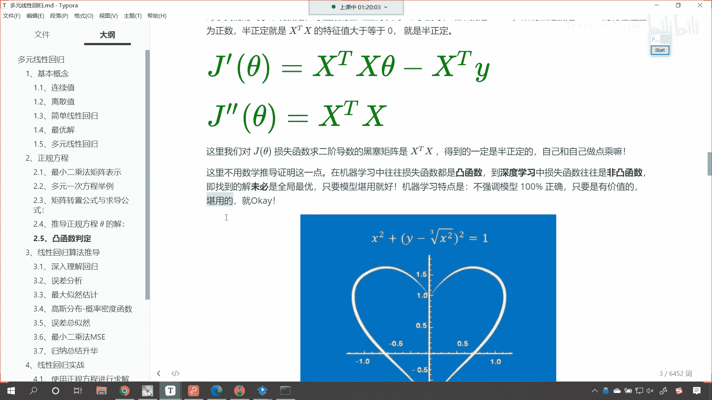
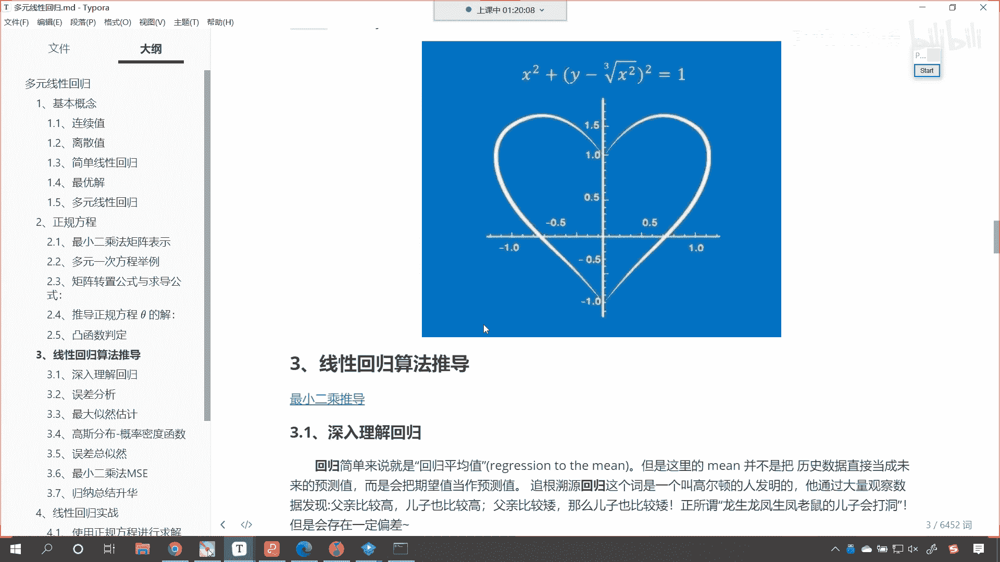

# P53：4-凸函数判定 - 程序大本营 - BV1KL411z7WA

向下看啊，刚才呢在我们的讨论区，有小伙伴就说了一个凸函数，是不是我们刚才是不是画了一个这样的，看咱们刚才是不是画了一个这样的这个曲线呀，看到了吧，是不是画了一个这样的曲线，对不对，这个就是凸函数。

来我们看一下凸函数是怎么定义的啊，咱们判定损失函数是凸函数的，好处呢就在于我们可以肯定的知道，我们求解的极值就是咱们的最优解，一定是全局最优解，知道吗，一定是全局最优解啊，那很多公式你不一定都要记住。

但是呢你要自己过一下自己的这个，过一下自己的心，就是自己手写一写是吧，不要光看，知道吗，好那么大家看上面这个就是凹函数，看我们有一些书上，或者说你从百度上搜索的凸函数，凹函数。

那这个中国和美国它们的定义是不一样的，知道吗，你比如说你看这个是不是看着特别像凹函数呀，这个是不是凹下去的呀，这个我们把它叫什么呢，叫下图，因为在美国他没有这个词儿，你知道吧，你想美国它有这个词吗。

有这个all这个词吗，他有to这个词吗，他没有，是不是唉，所以美国人它是怎么定义的，美国人呢他就定义这样的函数叫凸函数，定义这样的函数叫什么，哎叫呃定义这样的函数叫凸函数，定义这样的函数叫凹函数。

那你想现在这个呃一些算法的原理啊，都是老外发明的是吧，这个就有点可惜啊，希望我们班里边的这些小伙伴是吧，学习之后经过这一生的不断努力是吧，你也为国家做点贡献是吧，发明一些这个原理。

你看你看我们有小伙伴可能说，这是反直觉的是吧，因为中国人是象形文字，知道吧，中国人是象形文字，所以说你感觉可能有点反直觉，但是呢在机器学习领域，它对于凸函数还是凹函数有相应的定义，那是什么样的定义呢。

你看到了吗，有什么样的定义呢，唉我们一起来看一下啊。

有什么样的定义啊。

那我们要去求它的二阶导数，你看要去求它的二阶导数，如果这个二阶导数要大于零，那么它就一定是凸函数，知道吗。

它就一定是凸函数，那这个时候呢。

咱们就可以大胆放心的，对于我们的损失函数进行求什么呀。

咱们就可以对他求这个导数，令导数等于零，那么我们求解出来的那个解一定是最优解，你看最小二乘法，我们最小二乘法它的公式就是一个凸函数，看它就是一个凸函数，所以我们就可以使用。

所以咱们就可以使用这个正规方程了是吧，那他一定能够求解出来一个几，明白吗，那为什么我们这里要讲到凸函数的一个判定呢，你看到的这个是凸函数，你看到的这个fx你看它就不是凸函数了，看到了吧。

这个函数怎么样呀，是不是拐弯呀，曲溜拐弯，拐来拐去的，是不是啊，那你看你这个地方是不是局部最优解呀，对不对，那哪个地方是最优解呀，我们一看肉眼能看出来这个地方是不是最优解，对不对，但是当数据复杂了。

有一些数据是没有办法画出来的啊，你只能在大脑当中去想象，对不对，你看咱们的计算机呀，画图呀，你再复杂是吧，你也不能在计算机当中把一个人画出来吧，是不是啊，因为人是立体的，对不对。

咱们只能在计算机当中模拟出来，是不是好，那么唉你看这就是立体的一些图形啊，上面是二维的，看到下面是不是就是三维的呀，其实这个三维说白了是不是也是二维，他是不是给你调整的角度，让你感觉它是三维呀。

这个也是二维图啊。

看到了吗，这个也是二维图，所以说啊咱们，判定一个函数是不是，判断一个函数是不是凸函数是吧，哎那么怎么样呀，哎就是求它的二阶导数就可以了啊，求它的二阶导数，这个导数如果大于等于零。

那么它就是那么它就一定是凸函数，那你看我们最小二乘法，这个是求一阶导数，下面这个是求二阶导数，求完二阶导数是x t和x，这是不是自己和自己做点乘呀，你自己和自己做点乘，这不就相当于平方吗。

那一定怎么样大于等于零，所以说咱们这个它一定是凸函数好吧，这是凸函数判定的一个准则好。

那么你看我们机器学习呢，还有一个特点就是不强调模型百分百正确，只要有价值堪用就可以。

那么只要有价，只要有价值堪用，够用就行，知道吗，够用就行是吧，你比如说前一段时间日本是吧，这个又呲牙了是吧，你想如果日本要这么嚣张，那我们打它需要用到原子弹吗，当然不需要是吧，常规军队就把他干趴下了。

对不对，所以说咱们机器学习也一样对吧，我们求解出来的是吧，不要求百分之百正确，不要求百分之百完美，怎么样，只要有价值堪用就行，杀鸡焉用牛刀是吧。

