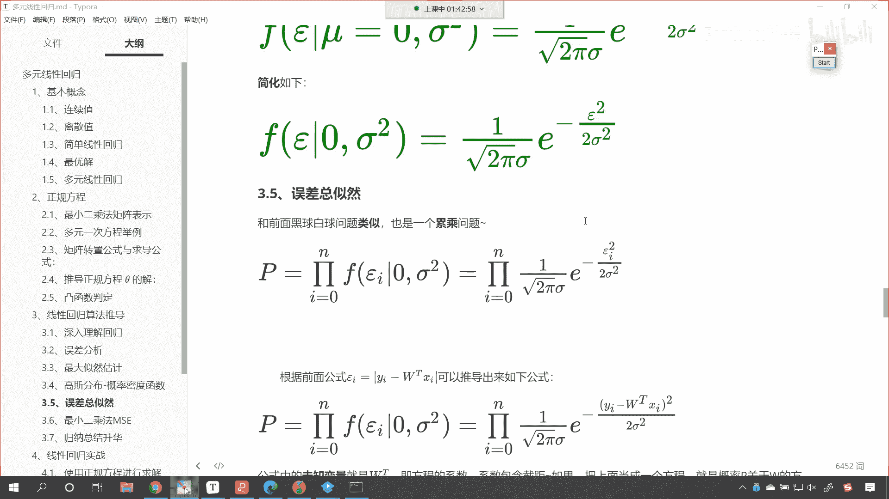
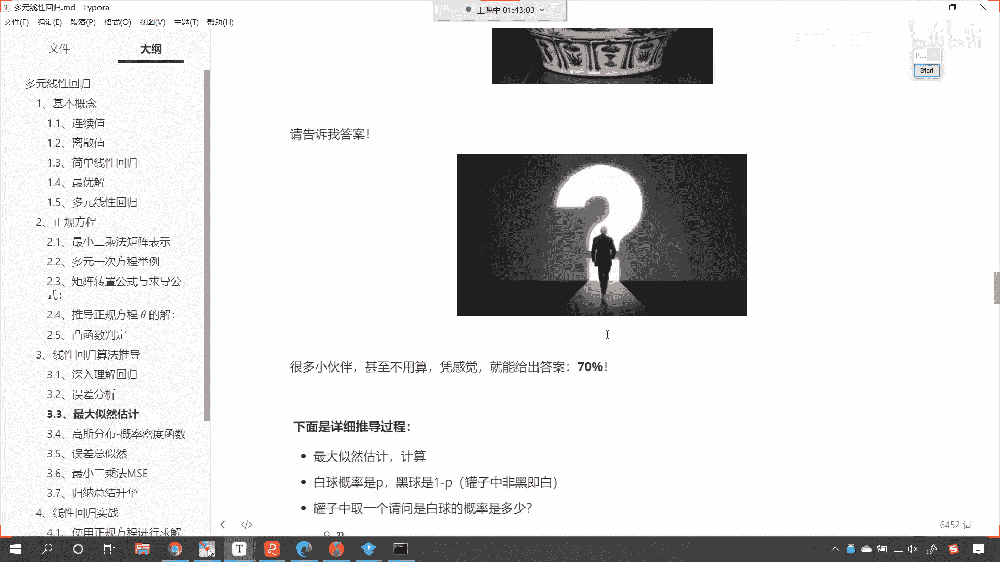
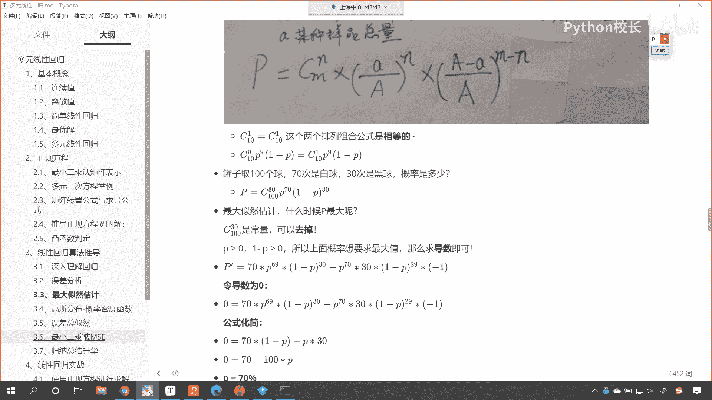
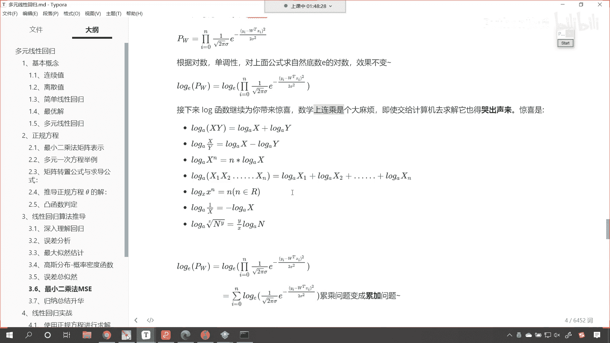
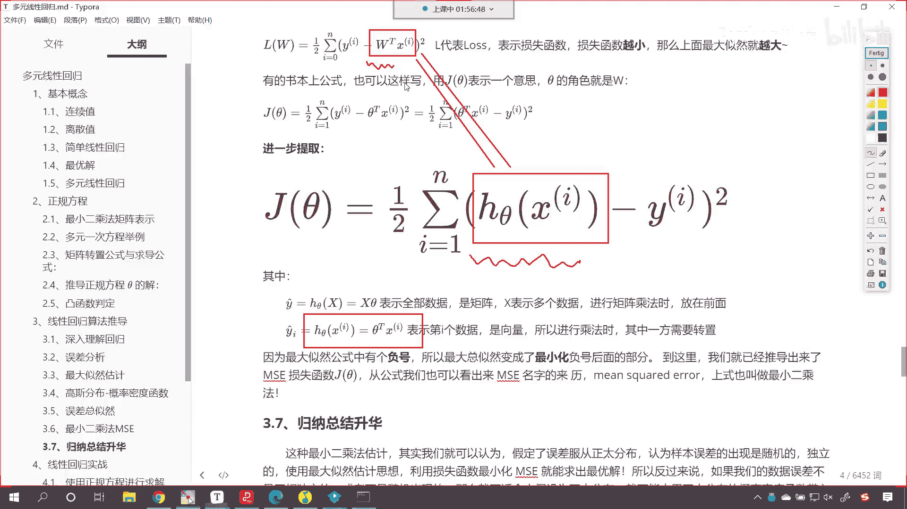
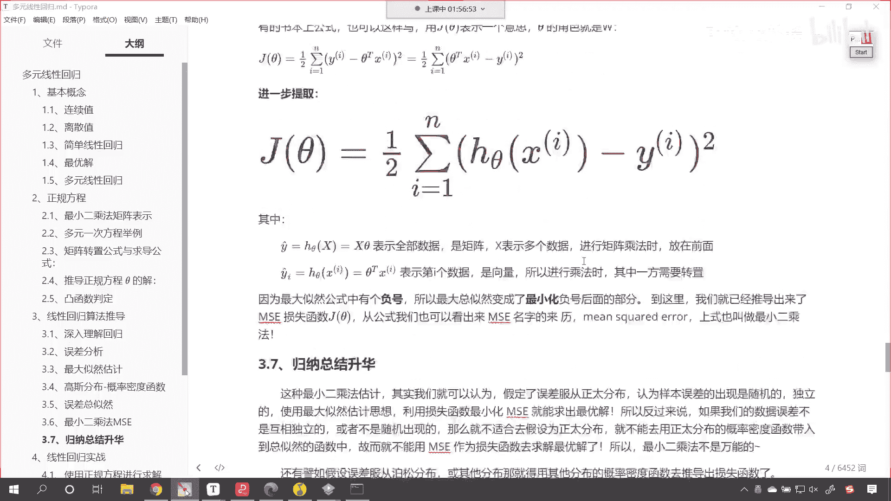
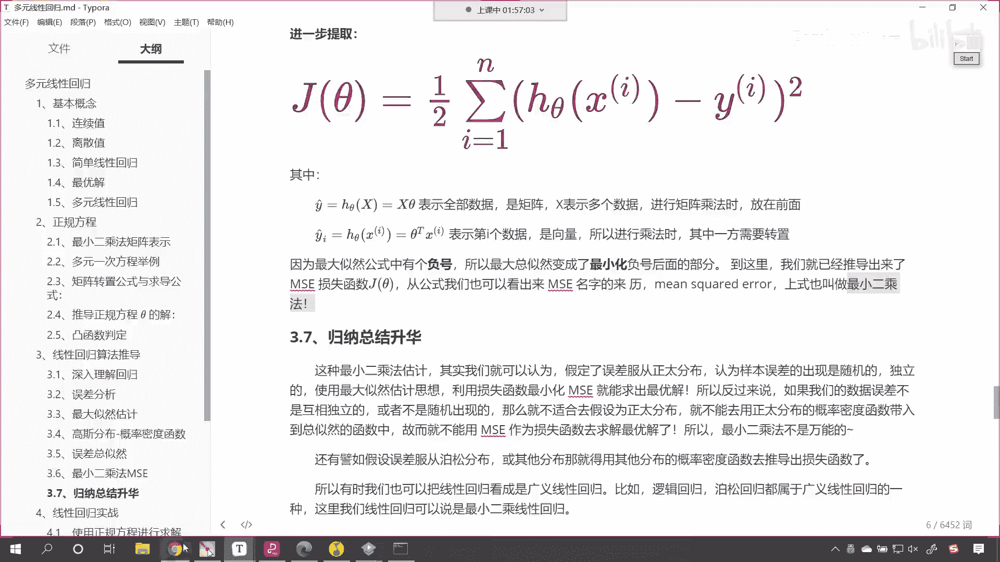
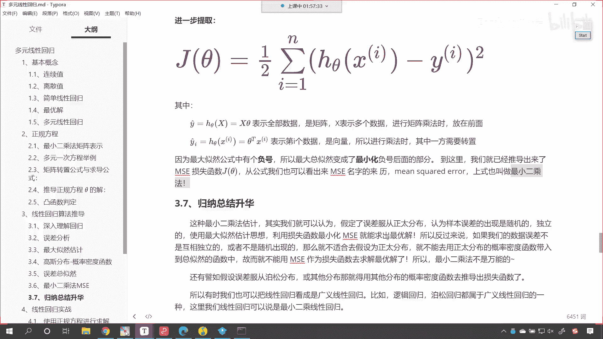

# P54：5-最小二乘法公式推导 - 程序大本营 - BV1KL411z7WA

大家看啊嗯好，那么接下来呢根据咱们之前所讲的，正态分布最大似然估计是吧，那其实就结合高斯分布的概率密度函数，咱们就可以把正态分布最小，二乘法给他推导出来了，看就差临门一脚了，知道吗，就差临门一脚。

咱们最常见的连续分布就是正态分布，这个也叫高斯分布，这个正是我们所需要的，它的概率密度函数如下，看到了吗，这个概率密度函数就是这个公式，这个里边我们就发现你看有有这个派派，是不是就是3。14呀。

还有自然底数e看到了吧，有自然底数e e是不是就是2。718呀，那这个里边儿呢还有两个数据，一个数据是meal，meal呢，就是平均值，还有一个数据叫这个叫西格玛。

这个西格玛呢就表示哎咱们的这个标准差啊，它呢就表示标准差，嗯上面这个上面这个mu唉它呢就表示平均值，你看我们只要知道了正态分布的平均值，知道了它的标准差，那么咱们就可以计算出来他的这个概率密度。

这啥叫概率呀，看到了吧，这里边又说了一个什么叫概率，你看这不就是咱们刚才所说的取出一个球，这个球是红球，这个球是黑球还是白球吗，你看咱们上面是不是也接触到了概率啊是吧，我从罐子中看，咱们从罐子中取球。

是不是从罐子当中咱们取是吧，那这个球是白球还是黑球，它的概率，那咱们的数据是正态分布是吧，那比如说有一个数值，那我们就可以计算一下嗯，就是嗯这个数值是吧，它的这个概率是多少，它所在的位置是多少。

也可以通过相应的这个公式把它计算出来，好那么这就是这个公式，我们能够发现在这个公式当中，有两个非常伟大的数字，一个是啊，一个是派3。14159265，35897926433，是不是无限不循环小数是吧。

有时候我就在想，为什么这个数字它就没有边儿呢，是不是啊，怎么算，他就算不到头，是不是还有你看这个自然底数e是不是啊，它也是无限不循环对吧，2。718是不是一直就这么下去了，没有头没有尾，是不是好。

那么这个公式呢，你看这个公式就是高斯这家伙搞出来的，看到了吧，我们直接用啊，咱们直接用站在他的肩膀上直接用嗯，那这个其实就是看这个，其实这个就是咱们之前所说的黑球，白球的p看到了吧。

这就是p他俩呢是等价的啊，看既然是概率密度函数，你是不是就是一个p啊，对不对，你看你就是个p，是不是你只要有了概率，你看只要有了概率，咱们再根据看咱们再根据上面的这个误差分析。

你看这里我们是不是就用到了epic on呀，看到了吧，就用到了epic龙咳，用到了epoc龙之后，啊用到了epoc龙之后，咱们就对误差我们进行一个什么呢，叫总自然。

那总自然是不是就像咱们前面黑球白球那样，是不是一个垒成问题啊，对不对，你看它是不是就是一个垒成问题，咱们说了这个上面是不是就是概率，对不对，你什么时候是吧，你的概率最大。

我是不是就相当于把你求解出来了呀，对不对，好，那么你看这个时候咱们进行了一个什么，咱们就进行了一个累乘，看到了吧，这个符号这个符号就表示累成相当于什么，你看相当于什么。

咱们上面再介绍，看咱们上面再介绍介绍最大自然的时候。

我们给了一个，咱们给了一个这样的公式，你看这个公式你想一下它是不是垒成呢，看一下看它是不是垒成，看它是不是一个垒成啊，垒成它是不是一个连乘呢，就是连续的一个乘法，对不对，你看它是一个累乘，它是一个连乘。

对不对，那这种形式和咱们正态分布的时候。

这种写法你看一样不一样，你看他俩一样不一样，是一样的，对不对，那我们上面黑球白球是如何求解的，是不是求导数呀，令导数为零，对不对呀，但是你看啊，咱们这个epoc on就是咱们的误差分析啊。

咱们这个一put系统误差分析是什么呢，是yi减去y他的预测值，对不对，你看y a减去y预测值，那谁是y i谁又是y预测值呢，你看它不就是看咱们现在进行一个说明，你看，你这个y看到了吧。

这个y y表示什么，表示咱们的真实值，后面这一堆看了后面这一堆wtxi，这个表示什么，看这个是不是就是表示预测值呀，对不对，yi呢这个就表示真实值，看到这个yi就表示真实值，所以说咱们这个公式。

和咱们刚才所写的那个公式它是一样的啊，刚才所写的公式就是p的70次幂，你看这也是一个连乘呀，然后再乘以一减p的30次幂是吧，当你不明白的时候，你就时时想着咱们上面所举的这个例子，是不是。

你看这也是这个符号，它就表示连乘是吧，你看这p的70次幂是不是p乘以p乘以，p乘以p是不是，然后再乘以一减p一到p30 个，对不对，哎所以说你看这是一样的，那你看我们把它表示成了大p对吧。

把它表示成了大p嗯，这个时候呢我们就进行了一个巧妙的一个转变，你看你这个时候是垒成垒成的时候是吧，咱们就把它变成了求最大自然问题了，看到了吧，转换了吧，上面咱们黑球白球通过最大自然求解了。

那咱们现在的这个正态分布也一样呀，那但是呢等等垒成的最大自然求解，是非常麻烦的对吧，特别是像这个公式，你求一个导数看看是吧，那接下来呢咱们对它进行一个转换，咱把对数是吧，求咱们的这个求对数。

咱们通过对数把累成问题，把它变成一个累加问题，看到了吧，怎么变换呢，看怎么变换，看咱们就可以这样来操作，看你现在是一个垒成问题，咱们对它求一个什么，看到了吗，唉这个时候非常巧妙的一个变化啊，看到了吧。

我对他求了一个对数，那为啥可以求对数呢，啊我们以自然底数e为底，就是你原来你的曲线是什么样的一个规律，当你的自然底数以e为底的时候，其实你还是单调递增，在这儿告诉大家一个非常高端的词儿，叫做单调递增。

听说过这个词儿吧，看了吧叫单调递增，看到我叫单调递增，是不是你原来你是累乘，你是不是就是一直增加呀，对不对，那我现在对你求一个对数，我是不是就对你进行了一定的缩放呀，对不对。

缩放之后它还可以带来一定的好处啊，缩放之后还可以带来一定的好处，那所以这个时候方程的左右两边，方程的左右两边同时求对数，所以这个就是咱们高中数学所讲到的知识，两边同时求对数，那这个方程的性质不变。

那我们求完对数之后，它会为我们带来惊喜，那会带来很大的惊喜，数学上连城就是一个非常大的麻烦，即使咱们交给计算机，那计算机也会哭出声来是吧，你看下面就是咱们对数的这个转变公式。

咱们就不一一介绍了是吧。

大家的大学是不是都是考上的呀，是不是啊，没有花钱买吧，是不是高考是不是都是自己做的题呀，对不对，那你既然都是通过自己的努力考上的是吧，这些公式对你来说，哎你就再把它翻起来就可以了啊。

好那么咱们接下来看一下咱们对数的转换，你看到了啊，看对它进行一个对数的转换，原来咱们是一个垒成问题，看到了吧，这个符号就代表看这个符号，它就代表垒程经过了求对数之后，你看它就非常巧妙地就变成什么了。

看非常巧妙的事就变成了一个累加问题呀，嗯对不对，非常巧妙的就变成了一个累加问题，垒成问题变成累加问题，接下来呢咱们就乘风破浪继续推导啊，乘风破浪继续推倒，好，大家看啊，上面的我把它加红了。

看上面就是一个上面咱们就是一个这个垒程，那我们为什么使用自然底数e呢，看咱为啥要偏偏选择这个自然底数e呢，上帝选择了自然底数e，看到了吧，所以我们在求对数的时候，咱们也使用以e为底。

因为你这个方程里边是不是有e的多少次幂呀，看到了吧，你原来的概率密度，正态分布的概率密度当中，它的公式当中是e的多少次幂，对不对，所以说咱们选择e选择e就可以把它消掉了，知道吗，选择e就可以把它消掉好。

那么咱们接下来呢就操作一下，看到了吧，接下来就接下来呢咱们就进行相应的这个操作，好，那么呃这个时候呢唉你看啊，咱们继续进行相应的这个转化好，咱们继续进行相应的转换。

你看现在这个小括号里边是不是就变成了看啊，原来我们是一个乘法，咱把它分开啊，你看啊这个树干左边是不是乘以右边啊，对不对，看是不是左边乘以右边，但是你对它求完，对它求完这个log之后，求完对数之后。

它是不是就变成了什么，看是不是就变成了加法呀，那这个地方你看它为什么是一个减法呢，啊这个地方为什么是一个减法呀，哎是不是因为这一堆呀对吧，我现在是e的多少次幂，我对于e又求了一个对数，那你想啊。

你看这不就相当于是ln是不是e的三次幂，咱们求解出来的是不是就等于三呀，如果他要是个-3，求解出来是不是就是-3，你e上面是不是负的这一堆呀，所以我们求解出来是不是就是负号哎，所以说到这儿了。

那到这儿之后呢，哎咱们对它进行相应的整理啊，看整理完之后你看就有这一堆了，有了这一堆之后，你在这个公式当中，有没有发现一个特别的地方呀，看到了吧，有没有发现一个特别的地方，你看这个符号诶。

你看这个符号是不是yi减去w t x i的平方呀，这个和我们之前讲到的最小二乘法像不像，是不是就很像了，对不对，你看啊，接下来它是怎么操作的啊，咱们上面的公式是最大自然求对数之后的变形。

其中的派西格玛都是常数，对不对呀，咱们的yi减去w t x i的平方肯定大于零，没错吧，没错吧，是不是上面求最大问题，我们可以对它进行一个转变，咱们是不是可以求最小问题啊，求最小谁，你看啊。

咱们的上面这个地方有一个减号，就是你这一堆减去它是吧，让整体怎么样最大，自然是不是让整体最大，那因为你的派西格玛是不是都是常量呀，对不对呀，派西格玛都是常量，怎么样才能让它最大。

是不是就是这个公式是不是就越小越好，看了吧，我来一个向下的箭头，就表示越小越好，没错吧，对不对，它你看就是越小越好，所以你看哎就有了什么，这个时候是不是就有了看到了吧，是不是就有了他看到了吧。

就有了l w2 分之一哎是吧，这个l呢就表示咱们的损失，所以说这个公式这个方程它呢越小越好，它越小，上面的最大自然就越大，我们求它的最小就相当于求上面最大，自然的最大，你想是不是到这儿听明白的同学。

扣一波666是吧，我们求这个的最小就是求上面的最大啊，咱们求这个lw的最小啊，咱们求这个的最小就相当于求上面最大自然，最大是不是，那既然到这儿统一了，看到了吧，到这儿咱们就统一了，此时我们就发现是吧。

高斯这个人果然名不虚传，是不是啊，是不是果然名不虚传呀，所以说呢这个就是咱们的公式，咱们上面这个公式是吧，我们进一步提取，看到了吧，就有了咱们最开始为各位介绍到的最小二乘法，只不过我们进行了相应的看。

咱们进行了相应的提取，看看我们进行了怎样的提取啊，看啊我们这个里边儿呢，是不是就写成了h c塔x i啊，看到了吧，那这个h c塔x i它就相当于什么呀，哎这个h c塔x i就相当于咱们的西塔tx i。

就相当于看到了吧，就相当于咱们的w tx i，你看它既然是一个方程，那我是不是就可以把方程用一个符号来表示呀，对不对，他俩是等价的哈，他俩是等价的，就是一旦你理解了某些公式之后是吧。

一旦你理解了某些公式之后，这个符号是什么，这个是无所谓的啊，因为数学家有很多不同的数学家，在推导数学公式的时候，用的符号都是不统一的，明白吗，用的符号都是不统一的，所以说咱们再看一些书籍呀。

或者说我们在看一些算法推导的时候，会有不同的符号，我在课程当中尽量为大家筛选用的符号最多的，哎，一般情况下就是咱们这个c塔，你看我为了让大家能够理解咱们呢，有的时候在写公式的时候还用w w。

不就是咱们方程的系数吗。

是不是到此为止。

大家看上市推导出来的就叫做最小二乘法，看到了吧，它有非常广泛的应用，高斯就是通过这个方程看到了吗。

高斯就是通过这个方程，是不是根据皮亚奇这个天文学家，他的数据，是不是把古神星的轨道给算出来了呀。

对不对呀，你看它就通过这个算出来了，所以说唉这是一个神奇的公式啊，好那么我们这一部分内容呢，咱们就讲解了嗯，这个最小二乘法是吧。

