# P55：6-正规方程进行演示 - 程序大本营 - BV1KL411z7WA

如果数据不符合高斯分布，咱们用最小二乘法计算，那肯定就不准确了啊，你想一下是不是啊。

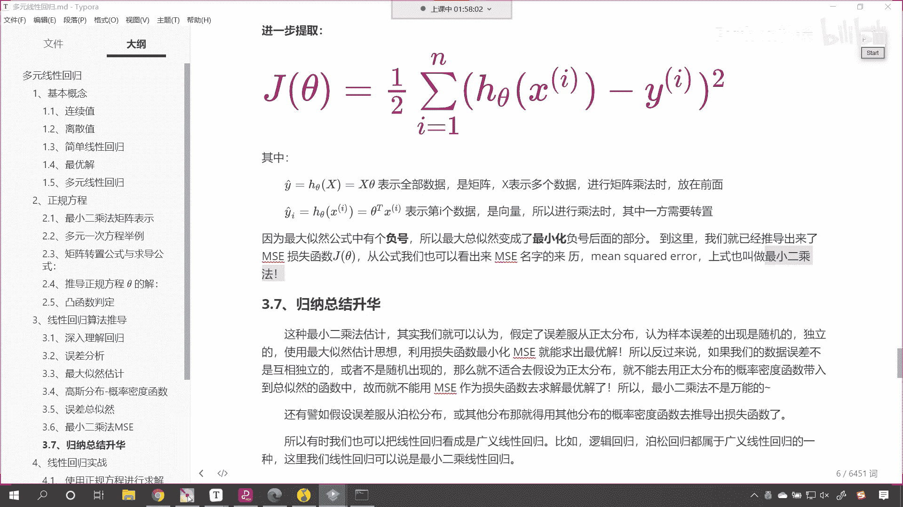

肯定是这样的啊，但是我们大部分问题就是我们在解决这个呃，数学问题啊，或者解决算法问题，我们很多数据很多数据都是服从正态分布的，明白吗，你像我们的身高体重相貌是吧，还有这个唉身高体重智商这些都是正态分布。

但是咱们人类社会当中有一样东西，它不是正态分布。

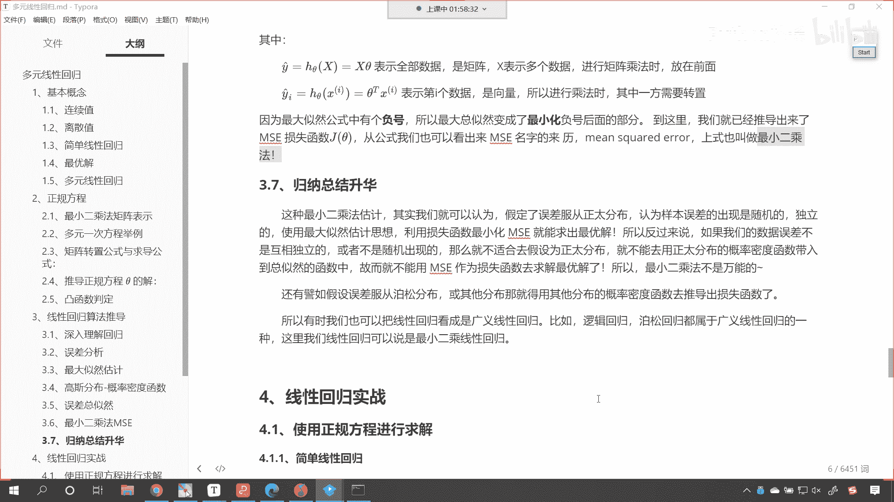

你知道是什么吗，来你想一下，知道是什么吗，人类社会当中就有一些东西它不是正态分布，知道是什么吗，年龄也是正态分布，看年龄也是正态分布，诶我们有同学说对了，财富看到了吧，财富不是正态分布。

所以我有时候我也经常在想是吧，这个财富跟什么有关呢，跟智商有关吗，哎不是是吧，跟你的这个年龄有关吗，也不是，你看马云他的智商能比我高一万倍吗是吧，能能比我高这个呃这个几千万倍吗，他也是一个人呀。

但是他的财富是我的成千上百万倍，是不是，所以我们就是要通过学习，来掌握财富的密码是吧，你持续的学习一定能够多挣点钱，现在呢我已经跟我的很多小学同学，拉开了很大的差距，那这个里边我总结了一下原因是什么呢。

是我在上小学的时候，我坚持上学，努力学习，考上了大学是吧，大学毕业之后我也一直在努力的学习，所以是吧才会有今天的一点点差距，这就是日积月累，咱们唉送给大家一句话叫流水不争。

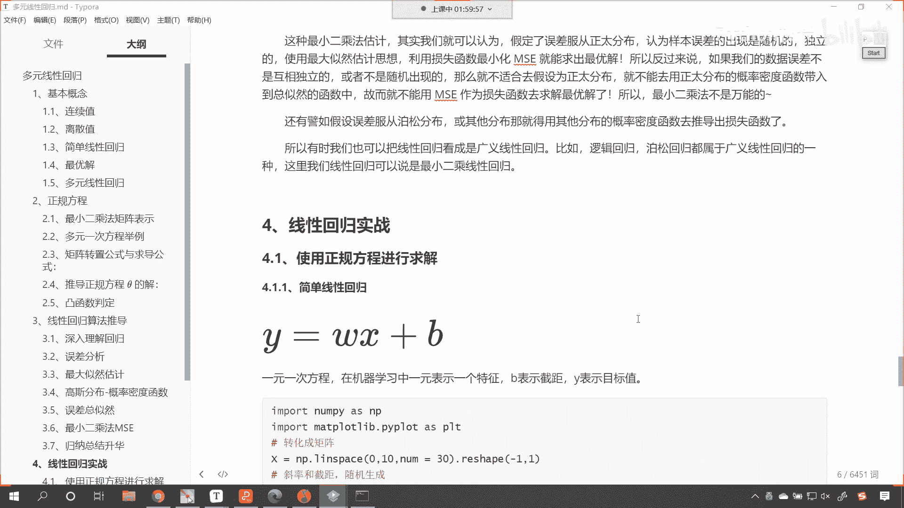

先争的是滔滔不绝。

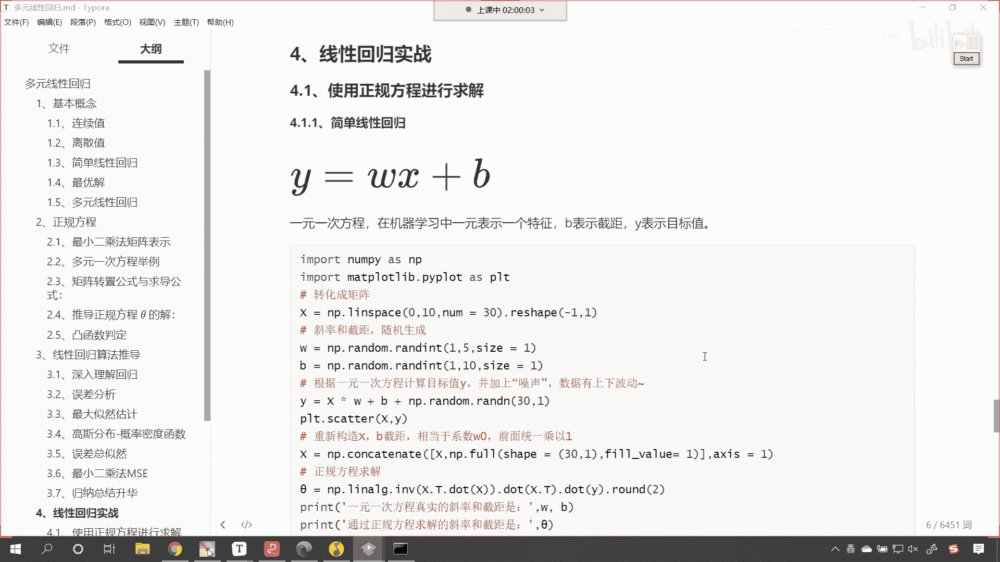

大家呢就像流水一样是吧，持续地进行学习，你不要看一天两天，看得长远一些，你总归能够挣到钱，没上学的都成了大老板，这句话是调侃大老板才有几个呀，是不是没几个知道吧，嗯那是少数。

我们容易把少数的个例放大对吧，我们非常容易把少数的这个没有上过学，但是成了大老板的人一上新闻，那就是这个全国人民都知道了，但是你真正的使用，咱们今天所讲的正态分布是吧，唉你来统计一下。

你就会发现没有上过学的大部分人都比较穷，知道吗，上过学的大部分人是吧，都比那些没有上过学的要好，所以说这就是科学，这才是科学，知道吗，不要被某些新闻的标题萌活自己的眼睛，知道吗，你学了。

咱们今天线性回归掌握了正态分布了，那你就应该知道是吧，它的这个关系啊来好，那么到此为止，咱们就豁然开朗了好，那么我们就使用咱们的线性回归，使用咱们的最小二乘法，咱们来进行相应的操作好不好。

那我们同时呢咱把图形也给它画出来啊。

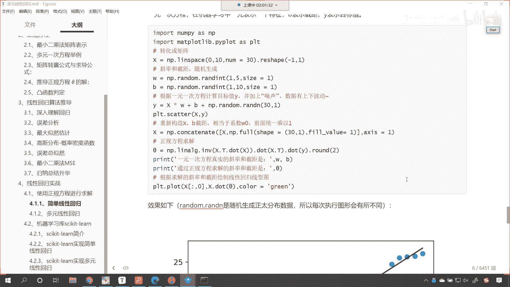

咱们正规方程，咱们其实已经在上一讲的代码当中进行讲解了，那我们再来操作一下，我们首先给一个简单的线性回归，就是y等于w x加b来。

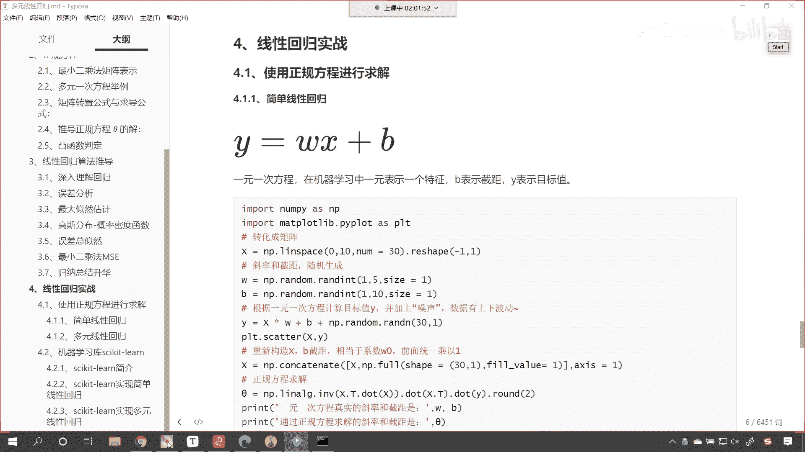

这段代码呢咱们复制一下，回到咱们的课件当中。

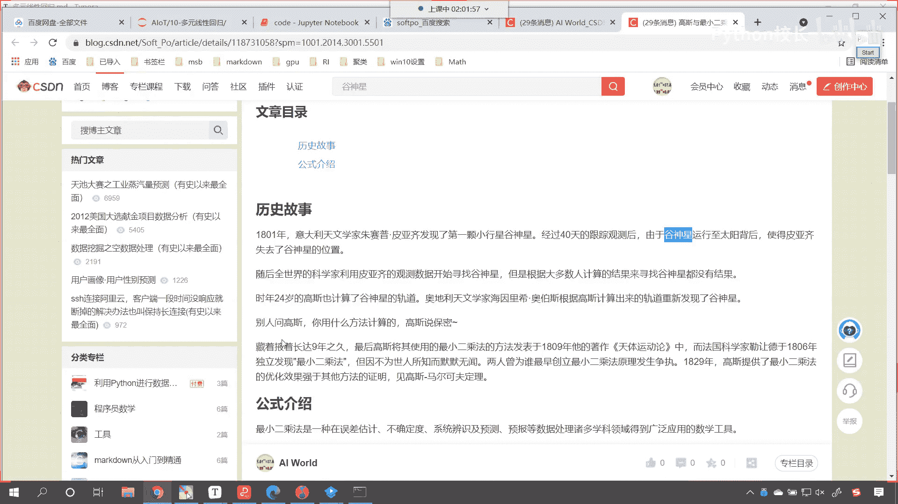

好咱们在这儿呢给它插一个三级标题，咱们呢就使用正规方程，那我们使用正规方程，咱们来进行计算好，那么正规方程呢，咱们首先来第一个，这个呢就是简单的线性回归，来ctrl v好。

那么大家现在能够看到这个是导包，咱们就不介绍了，接下来呢我们创建数据，看创建数据x呢，我们使用线性回归，看到了吧，我们是不是给了30个数据呀，大家注意啊，这个地方有一个画龙点睛之笔。

我们进行了reshape，来你告诉我为什么我进行了一个reshape呀，那我reshape这个-1它代表什么，后面这个一表示什么，唉咱们有同学回答了，咱们这个算法是不是要求，这个数据必须得是二维的呀。

对不对，你看我们这个是简单线性回归，那咱们的简单线性回归呢，看咱们的简单线性回归，它是不是就是一个啊，是不是就是一个系数呀，对不对，是不是就是一个变量呀，对不对，所以咱们这个地方是一明白了吗。

然后呢我们随机生成斜率和和w，你要注意啊，此时我也不知道这个w和b是多少，随机生成的，有了w和b，咱们是不是就可以根据方程计算出来，咱们的目标之外看到了吧，哎计算出来，那这个目标值y它就相当于真实值。

然后它就相当于真实值，但是这个时候呢我们给它增加了点噪声，就是让这个数据呢有点上下的波动啊，让数据有点上下的波动好，那么到了这儿之后呢，咱们先把这个图形给它画出来，你看下边这个代码，我们先注释掉。

你看这个时候我已执行，唉，有看到吧，是不是就是这个样的，看到这个就是这个样的，我们的数据呢是随机生成的啊，run是随机生成的，所以说每次和每次可能会不一样，看到了吧，每次和每次可能会不一样。

哎现在你知道这个嗯这个线大概是什么样了。

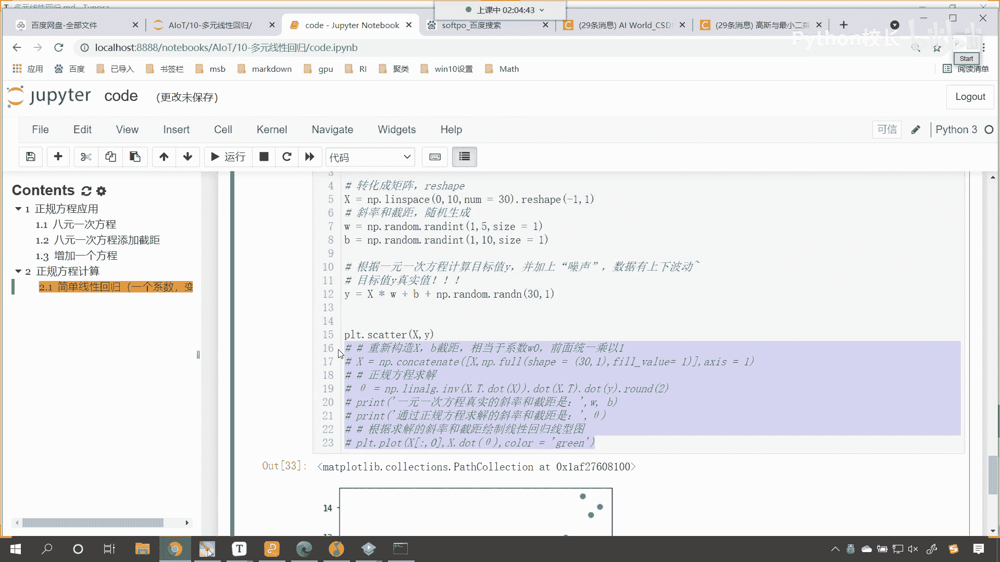

那我们不用算法，咱们就是凭直觉，我也知道这条线是不是大概是这样的呀，是不是让这条线穿过这些底呀，但是这条线的具体斜率和截距数字是多少呀，那咱们是不是就不能通过直觉来感觉了呀，对不对。

你看我们人是一个视觉动物，对不对啊，所以你看你在追女朋友的时候是吧啊，或者说女的在找男朋友的时候都喜欢找帅的，都喜欢找漂亮的，是不是，其实呢你应该找什么样的呀，看其实你应该找靠谱的，知道吗。

应该找靠谱的啊，这样才才能够这个长治久安，好过来人的经验啊，来那么画完图之后呢，你看咱们接下来又进行了一个操作，看到了吧，我们进行了一个什么样的操作呢，你看我们进行了啊，这个叫吉连，因为系数w0 。

我们是不是让它乘以一啊，对不对，然后呢嗯咱们就使用这个正规方程，你看进行相应的计算了，看到了吧，使用正规方程，你看这个地方我专门从网上找的符号叫c塔哈，看到了吧，然后正规方程计算之后。

这个时候你看我一执行，咱把它画出来，唉你就会发现，看你就能够发现一元一次方程，真实的斜率是一和五，你看为啥它是一和五呢，因为这个数据是我构造的假数据，对不对，这个数据是我构造的假数据。

我知道这个w和b是多少，但是计算机是不是不知道呀，我希望用这个算法来验证一下，看看他能不能找到一个解，对不对，那这个时候你看他找到了吗，果然找到了，你看求解出来是多少，是不是0。97，你原来是五。

我求解出来的是不是5。07呀，嗯咱们说我们的算法正规方程求解出来的，不是百分之百的标准答案，对不对呀，他只要堪用就行，够用就行，是不是因为我的数据我给它加了点盐，我给它加了点噪声，让它有上下波动。

所以说你看这条绿色的线，是不是可以满足咱们这些点的规律呀。

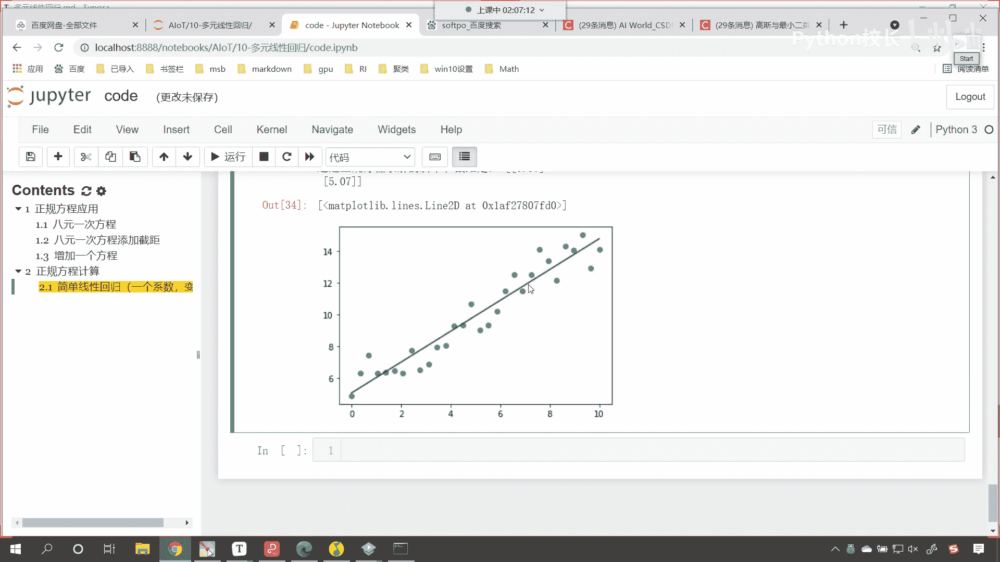

好那么这个就是咱们简单线性回归我们的这个。

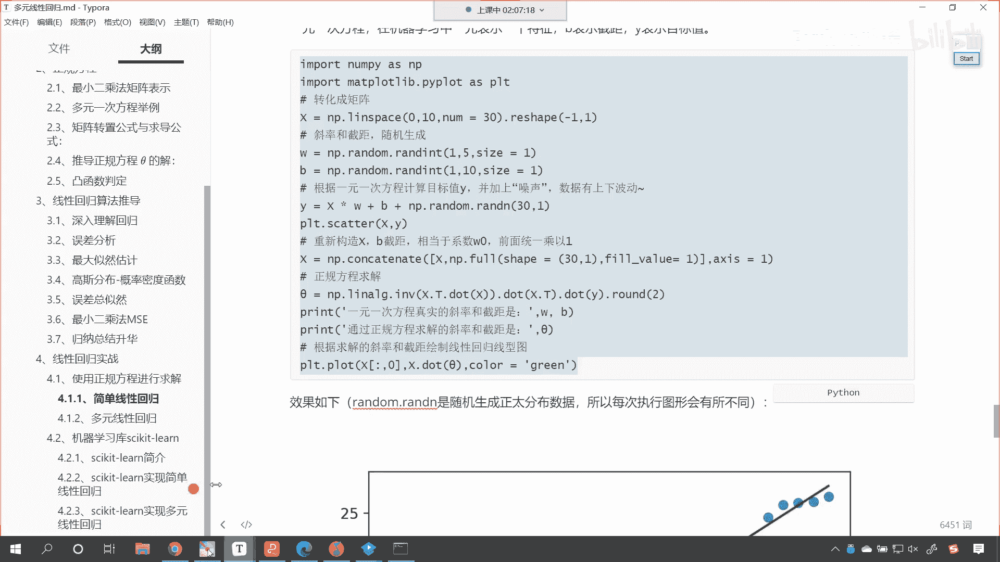

大家看你看咱们下面这个呢，你看下面这个是是什么，是不是就是复杂一点的呀，复杂一点的，咱们你看给他w一乘以x1 ，w2 乘以x2 ，这个是不是就相当于二元一次呀。

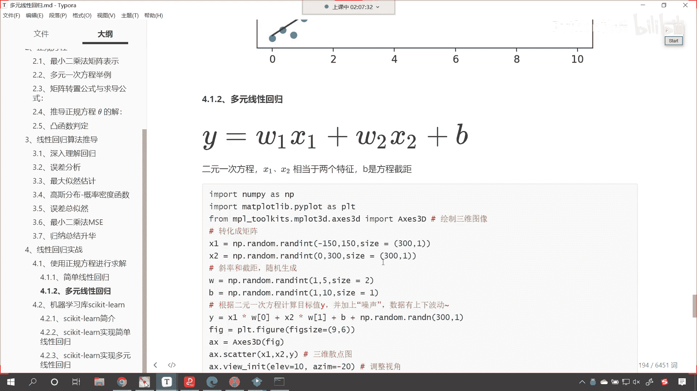

来咱们ctrl a ctrl c回到咱们的代码当中，咱们呢再给他来一个四级标题，哎这个就是复杂的，多元一次方程好，那么这个多元一次方程咱们使用二元来举例，知道吧，我们使用二元来举例。

这样我们可以画图来显示，知道吗，ctrl v也一样啊，此时现在你就能够发现你看我既然是两个数据，那现在你就能够发现，你看我给的是不是x1 x2 啊对吧，然后呢你看我这个系数w看到了吧。

我这个系数w我给了几个两个，这两个是不是就对应咱们上面的看到了吧，x1 x2 ，对不对呀，那这x1 x2 的范围是我随便给的啊，-150~150，这个是0~300，是不是。

然后呢我们也根据看咱们也根据什么，x一乘以w0 ，加上x2 乘以w1 ，咱们是不是也根据二元一次方程，是不是计算目标值呀，也就是说，上面这些这些代码，和咱们上面这些代码是类似的。

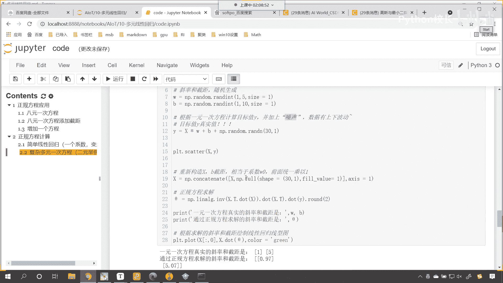

只不过它稍微复杂一点了。

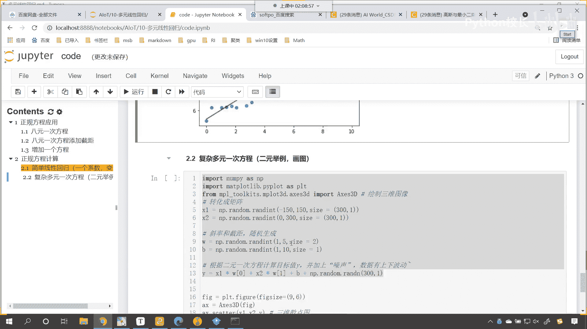

我们之所以使用二元举例，就是因为可以画图，三维的，咱们三维的数据，高维的数据没有办法画图，你看那我们在这儿画图。

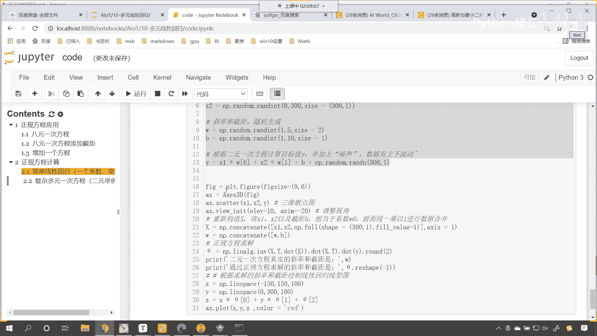

这是不是就进行了相应的看操作呀，然后重新构造数据，是不是，就是在这个数据x当中给它添加了一个系数，w0 呀，对不对，w0 全是一，你看到了吧，few y6 全是一，然后呢咱们就使用正规方程求解。

正规方程求解，然后呢咱们就把这个图形画出来，看到了吧，图形画出来，你看这个时候我一直行，唉现在各位就能够看到看到了，此时各位就能够看到，你看这条红色的线和咱们这些点，是不是就是拟合了嗯，大家注意啊。

这个这一行代码是调整视角啊，我代码当中的每一行都有注释，明白吗，大家呢要仔细看，同时呢咱们这些内容，在我们之前讲解mat plot lib，数据可视化的时候。

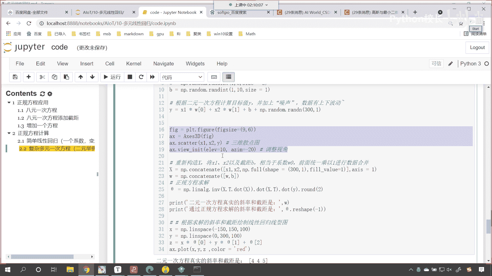

我们是不是都讲过呀，对不对，那现在你看有一个粉红色的提示。

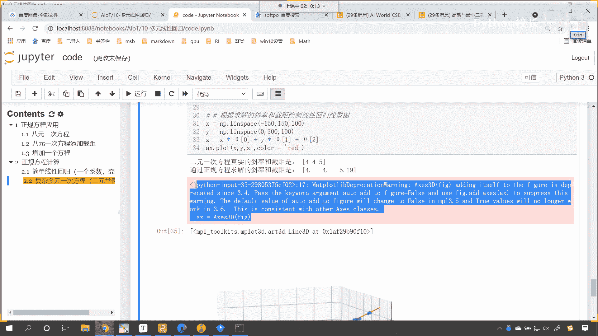

咱们如何把它去掉呀，哎就是因为这个方法他现在不再用了啊，那那这个该怎么办呢，哎咱们可以这样啊，看咱们就p l t点，咱们嗯调用sub plot来一个111，然后呢逗号projection。

我们给他一个什么3d是吧，唉执行这个时候，你看这种方式是不是也可以看了吧，忽略提示也行啊，看到了吧，唉这也可以，你看计算出来的结果看看对不对，看到了吧，141。9，你原来不是二吗，我现在计算出来的1。

9。

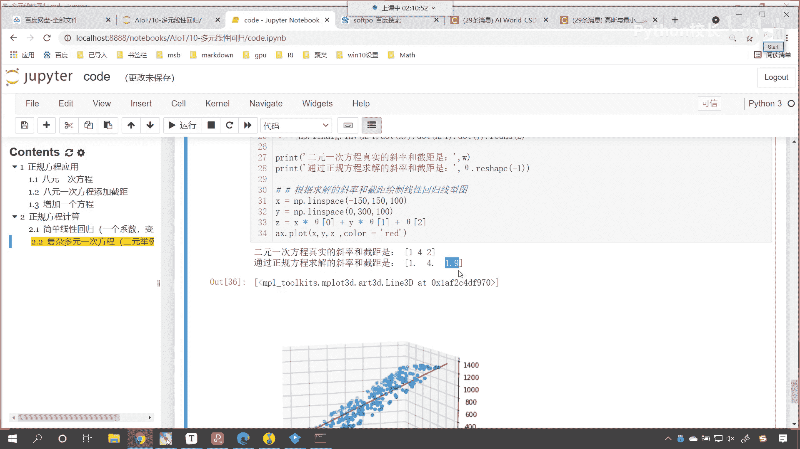