# P56：7-sklearn线性回归演示 - 程序大本营 - BV1KL411z7WA

最后再花五分钟。

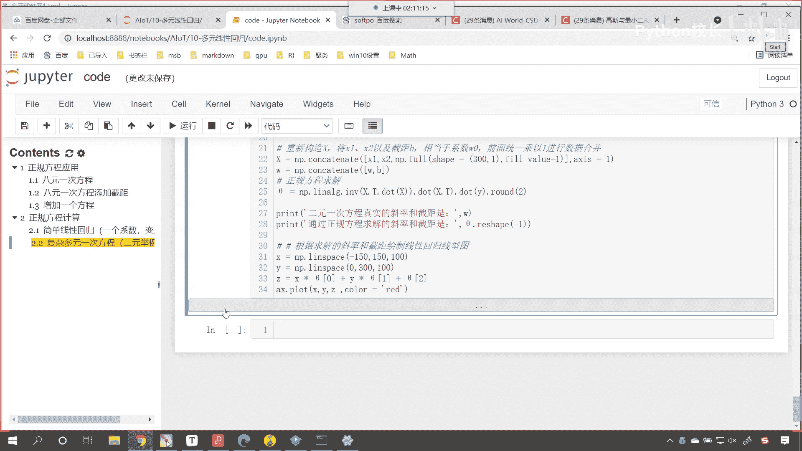

咱们看一下我们最后这部分内容。

你看最后这部分内容呢，就是这个机器学习的三kit learn。

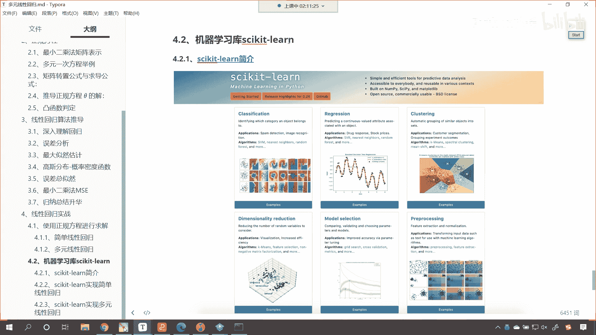

这个库是不是这个库，其实我们在上一讲当中都介绍到了。

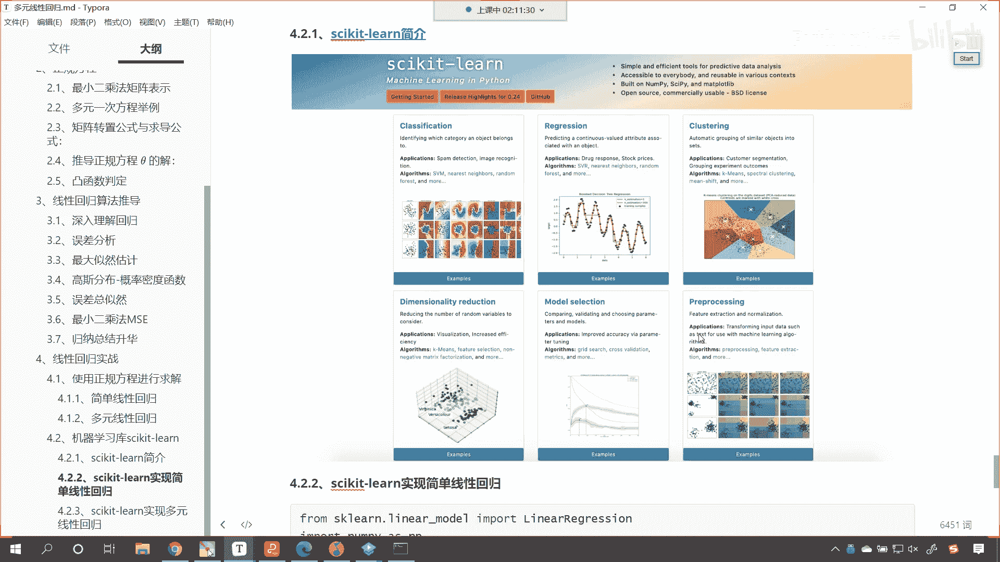

那这个是它的官网，你进入这个官网之后，你就能够发现这个库是干嘛的，看这个库就告诉我们，simple and efficient tools，简单看到了吧，说到了啥，简单高效的工具to啊，来来干嘛呀。

预测咱们的数据分析，accessible to everyone and reusable in variable context，就是说每个人都可以用啊，免费开源的，你随便用。

想在哪用就在哪用build啊，np cp and matt plot lib，也就是说这个库呢它是基于np pandas，np cpd和mac pro li，原来我们之前所学的东西。

到这儿是不是就贯穿了呀，贯通了对不对，open source是吧，commercial useful bsd license，也就是说这个就是开源的，以后你开了公司，这个随便用，没有版权问题是吧。

没有法律问题随便用，那你看啊简单介绍一下啊，就这个sk learn它可以解决什么问题呀，可以解决分类问题，回归问题，聚类问题，降维问题，模型选择问题，数据预处理问题，我的英语比较好。

所以直接就给你翻译了啊，好希望大家在学习咱们算法的过程当中是吧，这个啊同时呢把英语也进行一个提升，唉没准儿啊，咱们这些学员以后做得好。

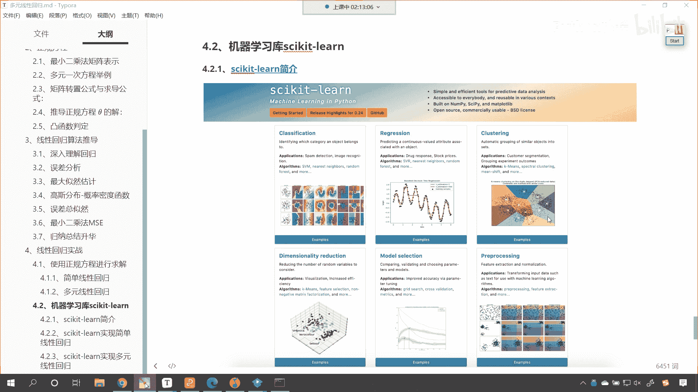

还真有可能开公司，是不是好，那么咱们呢现在就使用linear regression，来操作一下咱们上面的这个案例。

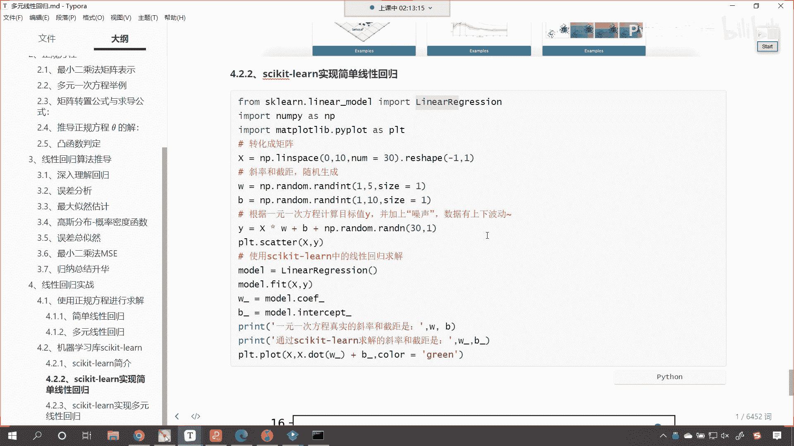

你看这也一样啊。

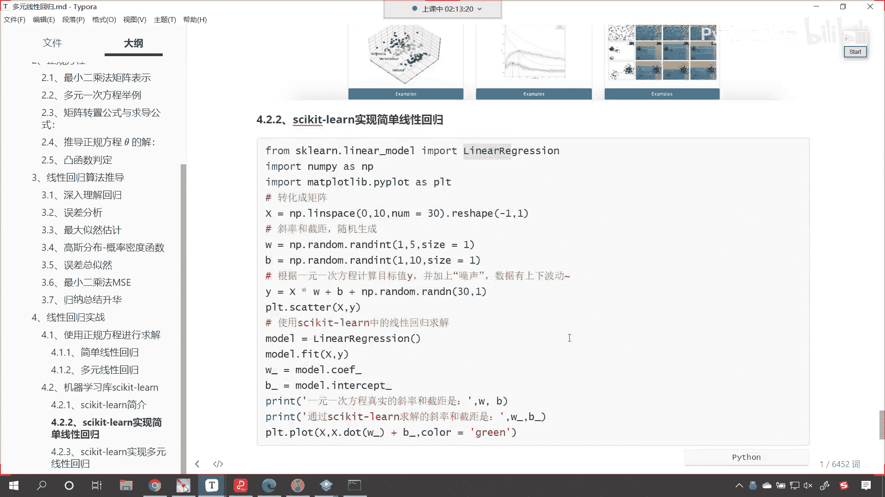

来代码复制一下，ctrl a ctrl c回到咱们的课件当中是吧，那我们在这儿呢创建一个三级标题，这个呢就是sk learn，你看sk learn当中的线性回归，这个注册公司不用花那么多钱，知道吧。

没你想象的那么复杂啊，好那么我们sk learn，咱们第一步给的是这叫简单线性回归，那简单线性回归和上面那个一样，都是一元一次的嗯，那在这儿呢你看啊。

我们呢就调用线性回归当中的linear regression，来进行求解，同时呢找到它的，找到它的这个斜率和截距，把图形画出来，咱们看一下，你看求解出来的结果是不是符合咱们的要求呀，看到了吧。

符合要求吧，看二和四我们求解出来的是2。03，求解出来的是3。66，这个就完全符合要求，知道吧，好那么接下来咱们再来看啊，再来看一个叫做复杂的，啊复杂的线性回归，我们依然以二元来举例。

那和上边是不是都是一样呀。

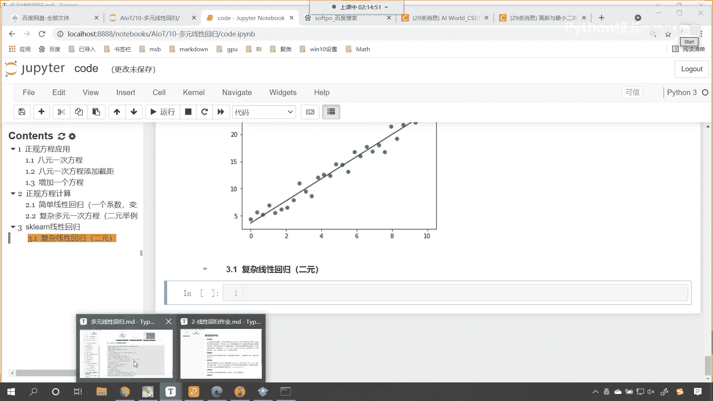

对不对，你看和上面都一样啊，ctrl a ctrl c来。

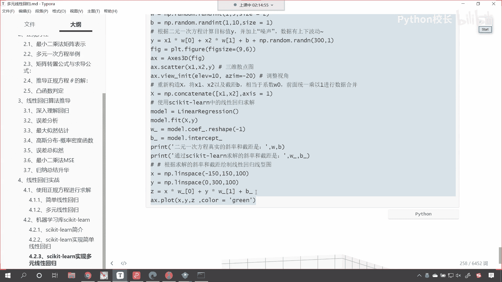

咱们呢就是在代码当中演示一下，你像来一个段行，上面是不是就是创建数据啊，上面是导包，然后创建数据，对不对，然后的话我们就画了个图，你看是不是这个就是画图调整视角，接下来呢咱们就是模型训练。

并且获取到他的什么斜率和截距，看到了吧，和上面一样，只不过在这儿呢我们直接使用模块看，在这儿咱们是直接使用模块上面，咱们是不是用了正规方程的那个公式呀，那他俩的结果一样吗，唉你看一样看到了吧。

唉这个时候是不是也就求解出来了，咱们现在又遇到粉红色的提示，是不是啊，我们还有一种方式是不是就是把它忽略掉呀，来咱们导一下包啊，那就是import warnings。

然后调用warnings叫嗯叫filter warnings，就是过滤他的警告，怎么样呀，一个闹执行一下这个代码，哎现在你再来看是不是就没有问题了呀，对不对，唉所以说无论我们使用正规方程来进行计算。

还是使用sk learn来进行计算，咱们都是可以看，我们都是可以进行操作的啊，好那么咱们今天所有的内容我们就介绍完了，洋洋洒洒是不是啊。

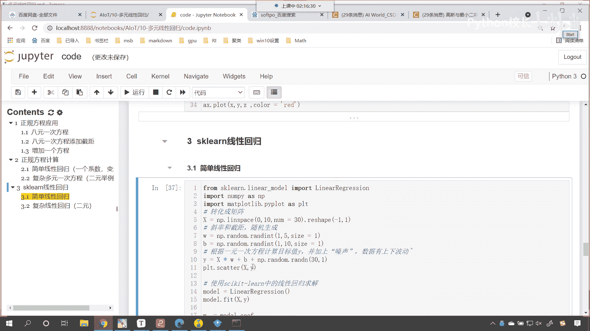

两个多小时是吧，我们是两个小时15分钟了。

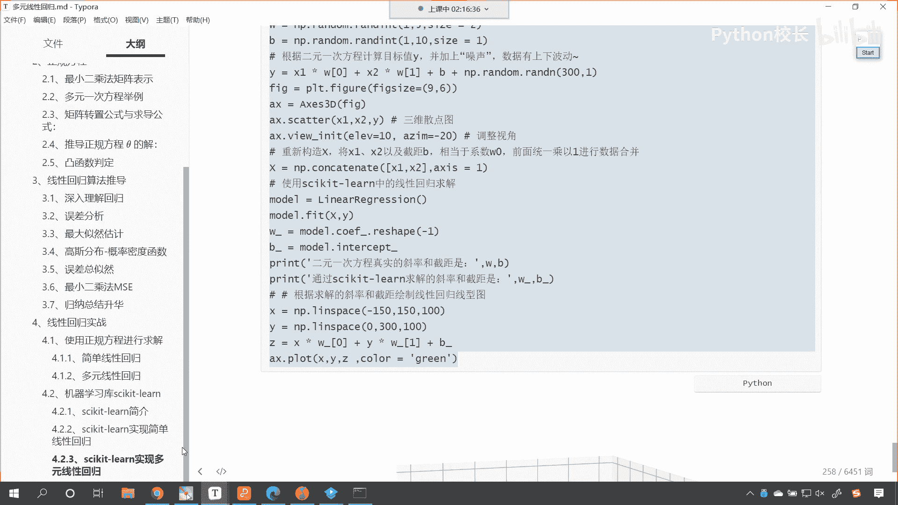

好，又该批评我自己了，是不是又拖堂了，但是呢。

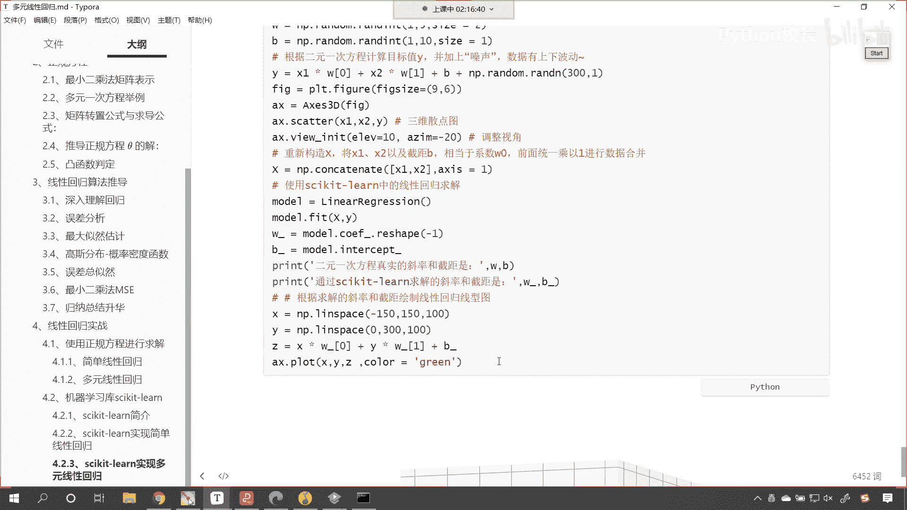

呃还是希望大家能够，把我们的这个基本原理是吧。

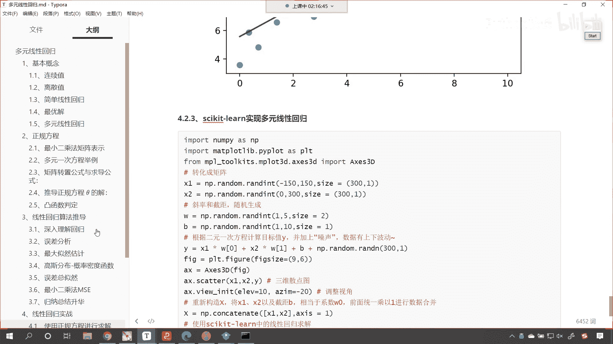

掌握一下，你想咱们的代码是不是很简单，你看到了吗，一旦你掌握了原理，这个代码使用的时候，你只要导入就行了，这个就是工具是吧，我们都是从美国买是吧，但是现在美国卡脖子了，你看华为就没有芯片了。

是不是我们呢既要会使用芯片，能够用这个芯片造出来高端手机，咱们还要干嘛，还要能够自己造，想要自己造，你就得掌握它里边的核心技术，那咱们线性回归是吧，多元线性回归正规方程，还有线性回归的算法。

推导最小二乘法，咱们呢就为各位进行了相应的梳理好。

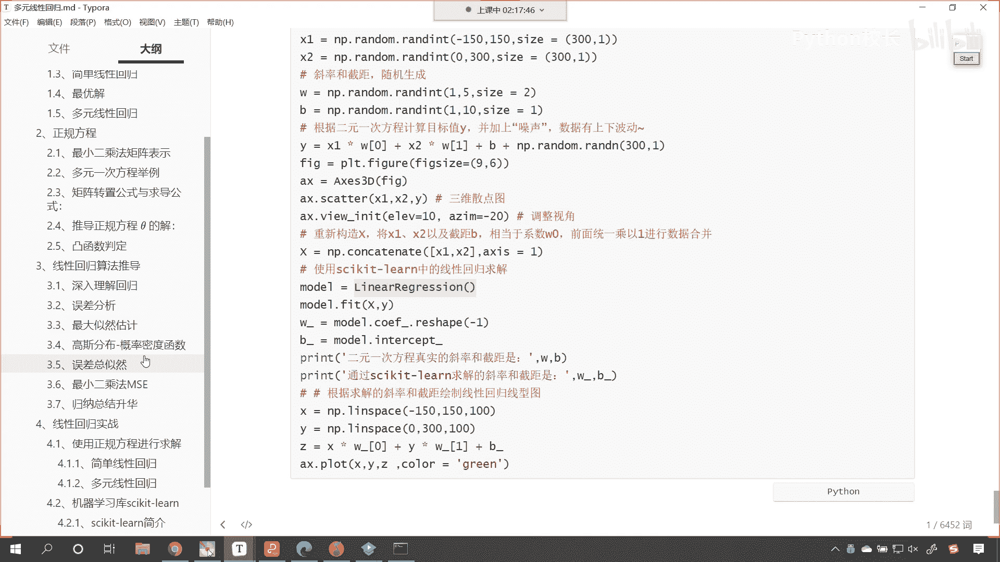