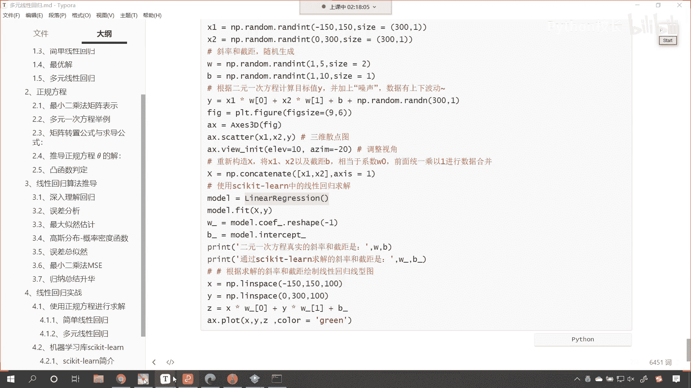
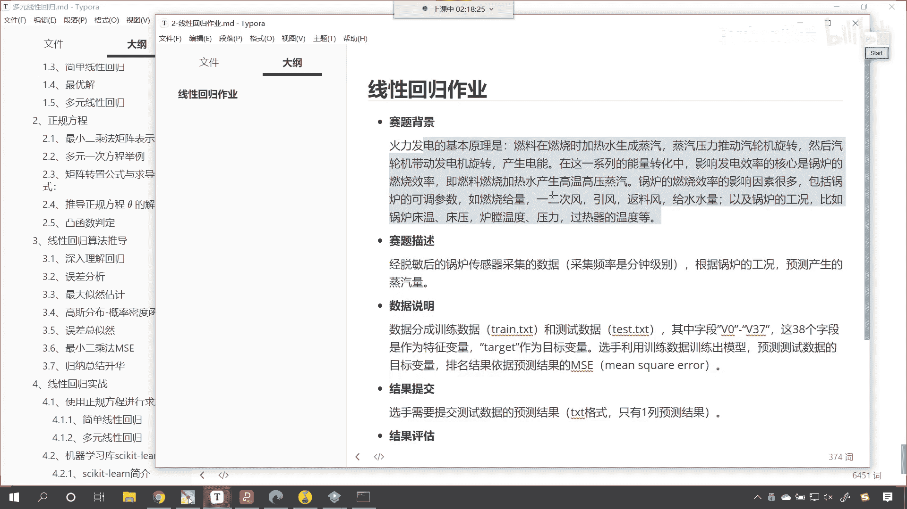
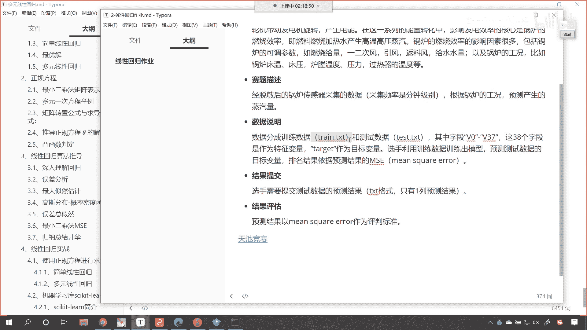
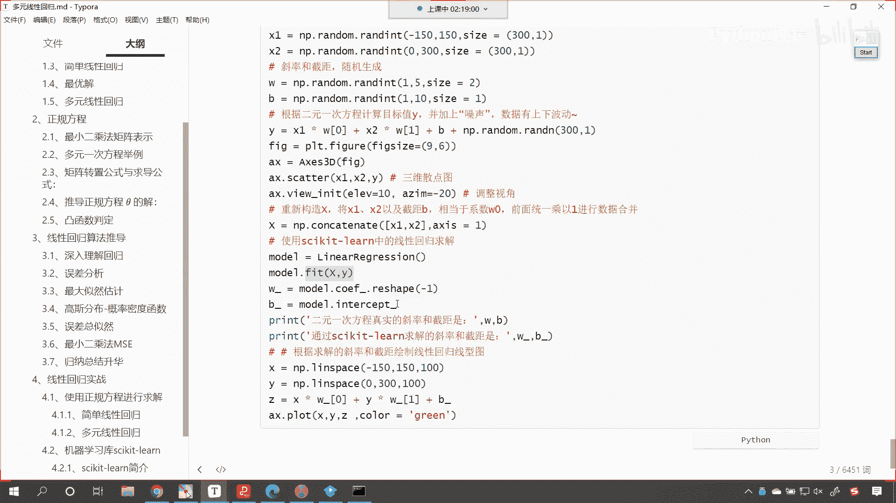
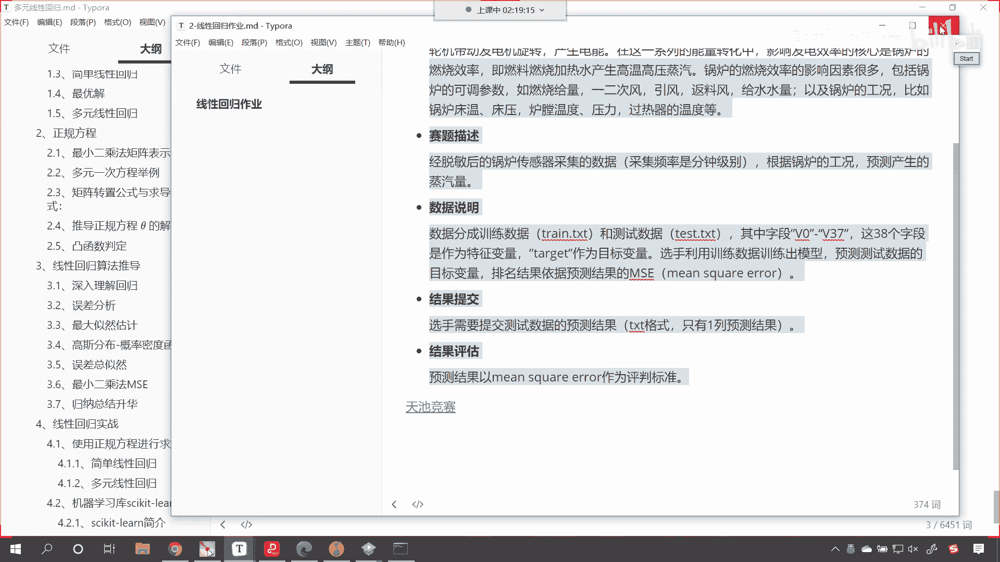
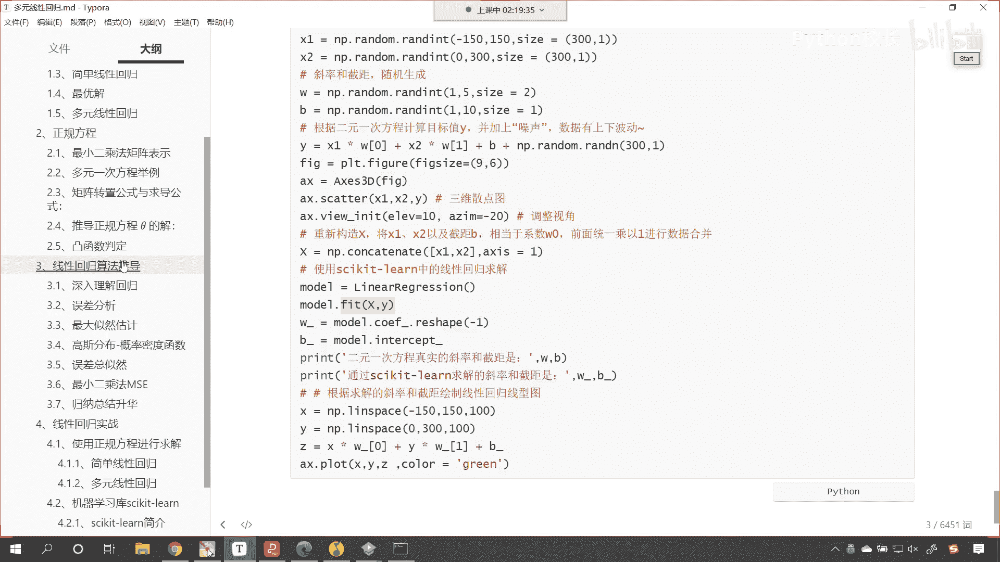

# P57：8-作业介绍 - 程序大本营 - BV1KL411z7WA

有一个小小的作业，哎各位啊各位各位先别走，最后还有一个小小的作业呃。

咱们使用线性回归，看咱们使用线性回归将什么呢，将咱们这个火力发电是吧，使用线性回归，我们呢预测一下火力发电，那这个火力发电的数据呢哎都有啊。

有两个文件，一个是train txt，另一个是test txt是吧，这里边有字段v0 到v37 ，那么啊咱们呢使用线性回归，训练一下咱们的这个train txt，嗯嗯这样吧啊这个我们呃在那个作业。

咱们在课堂上，我们只讲了这个linear regression，它的feat方法，我们没有介绍他的这个预测方法。

咱们这个作业呢我们下一次看咱们这个作业，等下一节课讲完具体的内容之后，咱们再来完成这个作业好不好，我们今天讲的这个内容。

咱们今天讲的这个内容呢有点难，大家呢可以就是这次的作业是吧，我们可以先这个把我们当中的这些知识点，梳理一下，我们给各位缓一缓好。

