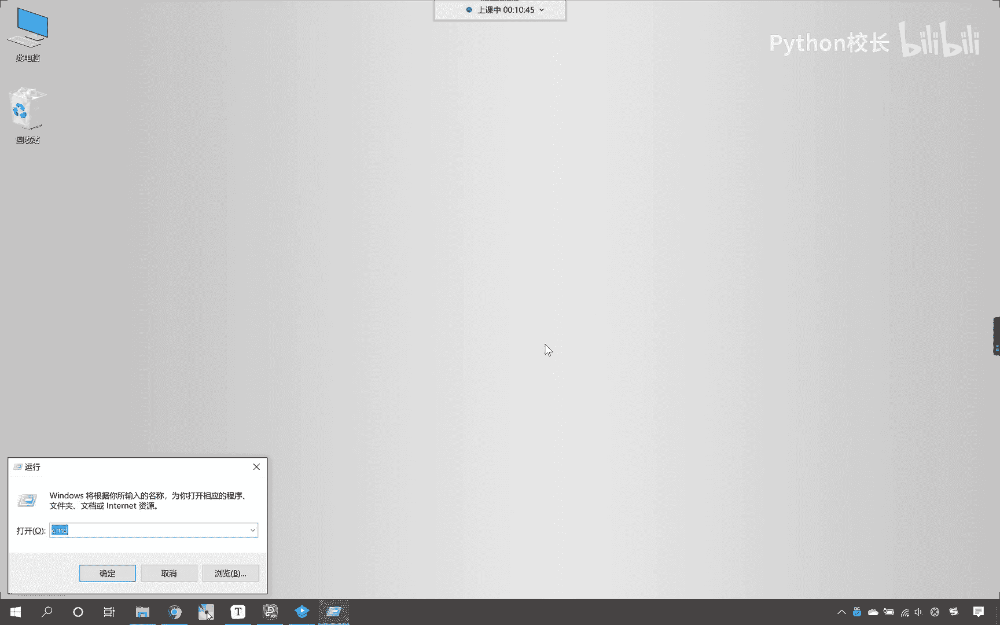
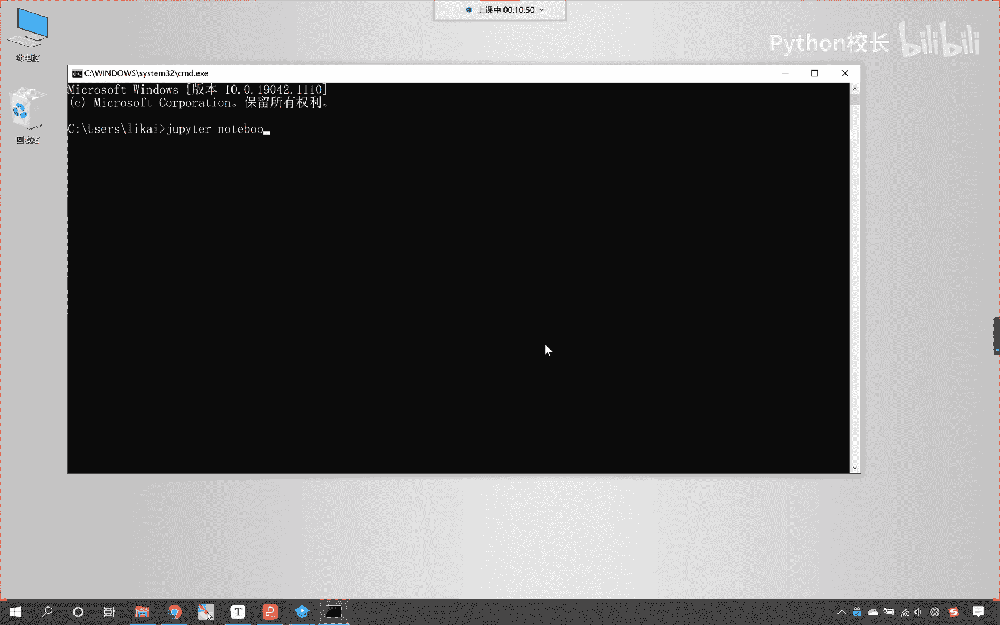
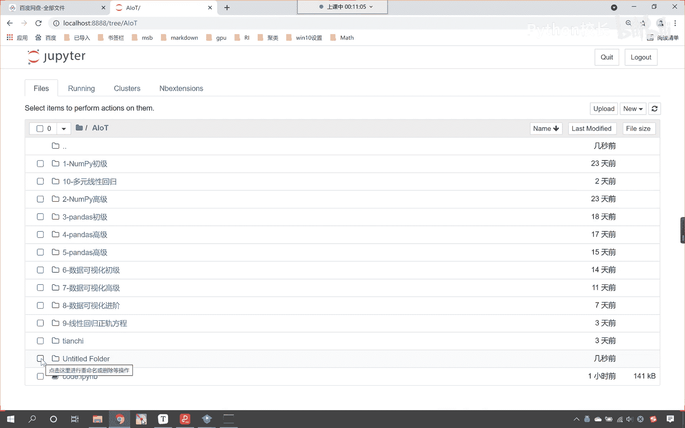
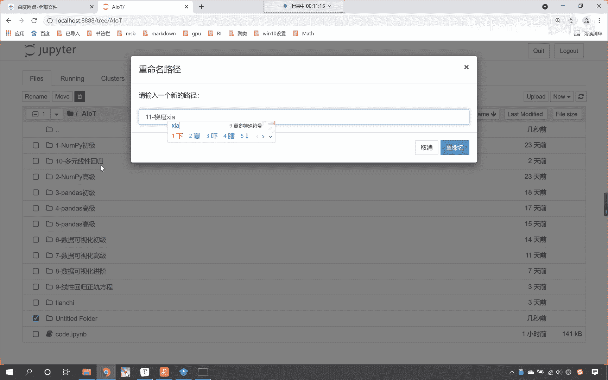
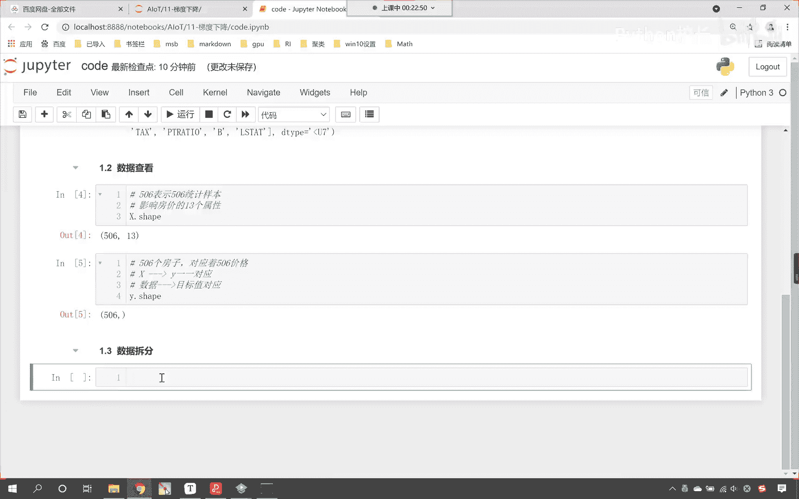

# P58：1-波士顿房价加载和查看 - 程序大本营 - BV1KL411z7WA

好来现在呢我们windows r。

这个时候呢咱们启动一下我们的终端，执行咱们的主pater notebook。

启动一下，好，那么启动了之后呢，现在咱们就进入这个ai o t，那我们呢就新创建一个folder文件夹，咱们选中它。

我们为它改一个名儿，这个呢是咱们的第11次直播课，是不是，那这个呢就是咱们线性回归当中的梯度下降。

好那么我们呢一起来看一下啊，咱们前两节课讲线性回归，咱们已经学会了正规方程的使用，以及呢sk learn这个库当中，咱们学了它为我们封装好的线性回归，对不对，那么咱们现在呢就使用这个算法。

我们来进行相应的预测好不好，咱们现在呢就使用线性回归，我们呢来预测一下房价，咱们都知道这个房价呢和地段是吧，和环境和学区房呀等等各种各样的因素有关系，咱们的房价呢还和它的面积。

还和他的这个到底是两室三室，是不是都有一定的关系啊，好那么咱们现在呢就回到代码当中，咱们呢就使用线性回归，我们呢来预测一下房价啊，看一下咱们前两节课所学的这个算法，他该如何进行一个使用好。

那么我们就在当前路径下，咱们呢就创建一个代码文件，我们为这个代码咱们给它改个名，就叫做code，好那么现在的话咱们进行相应的导播，在导包之前咱们把它变成一个markdown。

那这个时候呢就是一个三级标题了，好那么就使用咱们之前所学的线性回归，咱们进行房价的预测，那我们在刚才介绍了，咱们的房价呢是跟一系列因素，它是不是跟一系列因素有关系啊，对不对啊。

那这些因素它可能是面积是吧，它可能是位置是吧，它还可能是咱们房间的这个布局，是不是啊等等跟这个都有关系，是不是好，那么咱们现在呢就导一下包啊，咱们import numpy as np。

然后呢咱们from sk learn，咱们从这个当中导入一个data sets，我们这个data sets呢大家注意啊，它呢是一个数据集啊，这个data sets是一个数据集，咱们在导包的时候唉。

大家注意啊，我们在导包的时候呢，咱们如果写了相应的内容，那咱们如果写了相应的内容，因为咱们这个代码有自动补全功能，是不是，那你看我刚才在导包导data sets的时候是吧，大家注意啊。

嗯这个我们我的手速比较快是吧，可能我在啊，就是说你写了data sets，稍微等一下，等着他补全了之后再按回车，那么它所补全的这个单词就是正确的，然后呢咱们from sk learn。

点linear model，从线性模型下面咱们导入，我们将linear regression，咱们给它导进来，好执行一下咱们的代码，那接下来呢咱们就加载数据，那我们就low的波士顿。

这个呢是波士顿的房价，这个时候你看我一执行，大家看咱们这个数据是不是就得到了呀，看到了吧，这个数据就得到了好，那么我们得到的这个数据呢，它是一个类似字典的这个数据，好，这个声音现在有电流，是不是。

那稍微等一下啊，我将这个声音呢哎在现在呢现在怎么样，现在咱们这个声音还有电流吗，看现在这个声音来，我们桥北小伙伴来给我反馈一下啊，好了是不是好，那么现在呢我们继续往下看啊，哦没有，就是声音有点小。

是不是声音有点小吗，声音现在变小了，是不是啊，各位小伙伴们，声音变小了，是不是，你看你那边是否可以调大啊，嗯因为刚才呢我们桥北小伙伴说，把这个声音调小之后，把这个哦这个声音要调大一点是吧。

它会有相应的这个电流，是不是，那等会儿啊我再稍微调大一点，现在怎么样，现在是不可以啦，合适了吗，看现在怎么样好，那么我继续啊，真我呢就把声音调小一点，那我说话呢大一点好，那么我们获取里面的数据吧。

大家看这个data是什么data呢，就是咱们的一些属性，比如说它的面积啊，位置呀，房间布局呀等等，是不是，那具体是什么呢，唉咱们得看他具体给了我们什么样的数据，target是什么呀。

target就是咱们的目标值，也就是说你这个房价是多少呀，这个地方标注了24，那就表示它是24万美金，我们获取的是波士顿这个城市的一些房价，那有的房价高，有的房价低。

好现在的话咱们就可以得到这两个数据啊，根据他的key就可以得到这个数据，现在我们还能够发现，这个地方是不是有一个feature呀，那这个feature就是对于特征的一些描述。

咱们待会儿呢把这个特征也给它拿出来，我们进行相应的一个说明啊，好现在的话咱们就得到数据了，是不是好，那么我们就接收一下叫波士顿，那有了这个波士顿之后呢，咱们从波士顿当中获取我们想要的数据。

找见波士顿来一个中括号，得到他的data，这个呢就是数据，那正是因为这些数据它影响了房价，你看在我老家，我的房子呢是400平米的啊，是不是很很超级富有呀对吧，那但是他是在农村啊。

那如果说你在北京有一个400平米的四合院，你想这个房子是不是就是2亿以上了，好那么我们的y呢它叫target，这个呢就是咱们具体的这个房价是吧，它到底值多少钱，比如说它是24。

那这个24就表示是24万美金，诶他呢就是这个意思啊，好那么我们呢还有一个我们还有一个字段，哎咱们这个字段呢叫feature names，那这个feature names。

咱们在这儿呢给各位小伙伴进行一个说明，这个呢就是咱们具体的特征得到波士顿，唉，你看上面这个x是不是具体的数据，那这个数据统计的是哪些指标呢，对不对，你既然是数据，你是不是就得统计一些指标呀。

那我们的feature names就表示咱们的具体指标，那我们看一下它有哪些指标啊，咱们将feat names打印输出一下，各位唉，在这里我为你进行简单的一个解释，在这儿呢咱们就能够看到crime。

对不对，这个crime呢就是犯罪率，如果一个城市的犯罪率很高，那么它的这个治安不太好，是不是治安不太好，你想他的房价能高吗，晚上你出去遛弯儿，是不是啊，结果被枪杀了，对不对，好，那么我们再看一个啊。

它还有什么叫n o x这个呢就是空气污染，哎这是氮含量是吧，这是空气污染，唉我们再看一个啊，再看一个还有什么叫tx tx，这个是不是就表示税收呀，对不对，哎那有些地方呢挣的钱又多，税收又少。

他是不是就很吸引人呀，对不对，其他的指标呢咱们就不做一一的解释了啊，反正这些指标都是跟房价有关系的啊，这些指标都和房价啊，这些指标都和房价它呢是有关系的，好那么我们看了这些指标了是吧。

那咱们接下来再看一下数据x和数据y啊，好在这儿呢咱们就x。ship，哎现在各位小伙伴，我们就能够看到这个是506和13，那通过这一行代码，咱们是不是查看了数据的形状呀，这个506呢。

它就表示咱们一共有506个统计样本，看咱们一共有506个统计样本，那么13表示什么呀，就是影响房价的13个属性，唉它就是影响房价的13个属性，上面你看我们的feature names是吧。

这个就是影响房价的具体指标，它你数一数里边的长度就是13个好，那么咱们呢往上面插入一行，咱们给他来一个四级标题，那这个呢就是我们加载数据呃，然后接下来呢我们再往上插入一行，也来一个四级标题。

这一行呢就是我们数据的查看，唉看到这个就是咱们数据的查看好，那么咱们查看了，咱们查看了x y目标值的数据，我们也查看一下，各位小伙伴，各位同学们，你来看一下这个是不是也是506呀。

那这个506是不是和上面的506，是不是正好是对应的呀，咱们在这儿呢进行一个说明啊，你想我有506个房子，是不是啊，那这506个房间，是不是就对应着506个价格呀，对不对啊，它就对应506个价格。

所以唉咱们以后嗯是不是啊，你在进行机器学习的时候，其实咱们的x呢和咱们的y，他俩呢是一一对应的，你要明白这个道理啊，他俩是一一对应的，这就是咱们的数据是吧，数据和我们的目标值，它们是对应的关系。

有多少数据是不是就应该对应着多少目标值呀，好那么到这一步呢，咱们进行了数据的查看，接下来呢咱们再来一个四级标题，那我们呢将数据进行一个拆分诶，大家看啊，此时呢咱们就将数据进行拆分，好不好。

