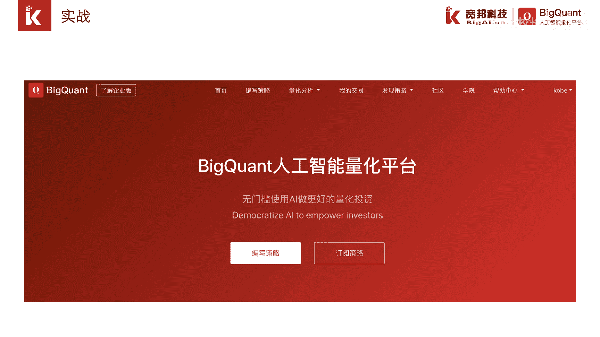
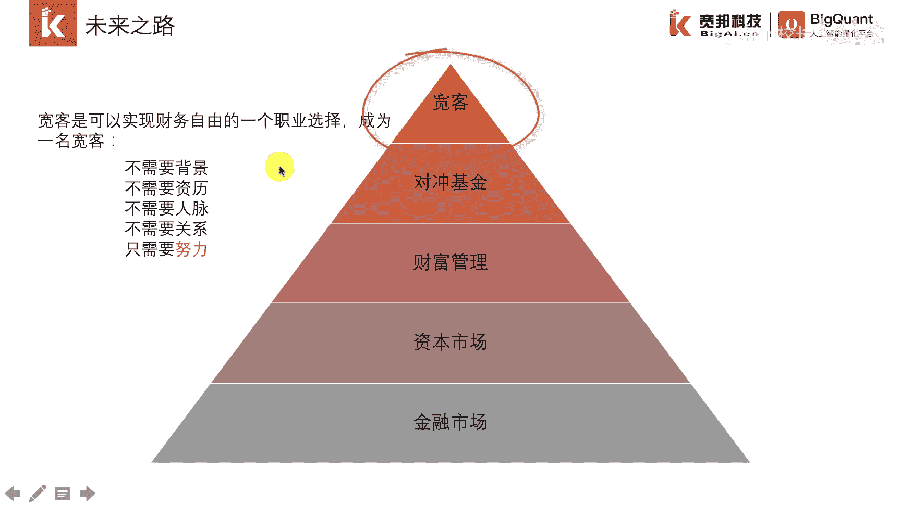

# P6：1.2.2 如何开启AI量化 - 程序大本营 - BV1KL411z7WA

大家好，从前面的章节的学习，我们了解到，在投资的四点阶段，ai量化是必然选择，本节告诉大家如何开启ai量化。

开启aa的话，最快的途径就是在b count，人工智能量化平台上进行策略研究，bill控的是国内唯一一家，以ai为基因和特色的量化平台，成立资金已经有3年多的历史，bio矿头成立的初衷。

是希望将ai的能力赋予给广大投资者，不仅如此，我们依然可以从影响ai发展的，三个要素上依次展开，首先在数据上，六矿头拥有股票期货，期权基金，美股，港股等数据，在算法上。

优矿的支持主流机器学习和深度学习框架，比如curious tensorflow skyline等，还提供专门针对股票市场的专有选股排序模型，都rank在算力上，b count提供比本机更强大的计算资源。

而且配置比较灵活，ai量化课程体系主要分为这三部分，在初级阶段，我们会介绍编程知识，和ai量化策略的基本研发流程，帮助大家可以按照模板策略，快速复线策略并运行起来，然后在模板策略会。

或者别人分享出来的策略的基础上，进行一些创新和调整，修改一下参数或者算法或者是交易逻辑，最后在第三个阶段，我们是介绍因子研究体系和机器学习，深度学习的最佳实践，帮助大家深入理解策略和评估策略。

帮助大家理解策略的收益和风险，本次培训的编程语言选择，目前在量化投资领域比较热门的python语言，python语言的最大特点就是灵活，并且有大量的开源包，不仅如此，在所有编程语言里面。

python还算得上是上手比较容易的语言，虽然python的性能不如c加加，这就好比我们要去市中心，我们不可能选择速度最快的飞机，而是选择比较灵活的汽车，这就是为什么选择python的原因。

因为在策略研究上，研究人员会将时间精力聚集在业务逻辑的灵，活调整和修改上面，python是最高效的，在金融的数据处理上，python有众多开源的比较强大的包，其中有两个包使用特别多，第一个是南派。

第二个是pandas，这两个金融领域比较热门的包，在最开始的时候，他们设计的初衷就是针对金融研究领域，一旦踏上ai量化的学习之路，名就成为了一名宽客，宽客算是处于金融领域金字塔塔尖的一群人。

掌管着基金资产的管理。

