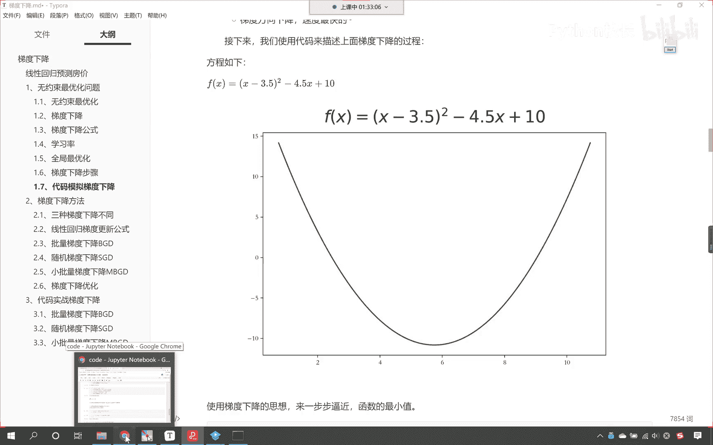
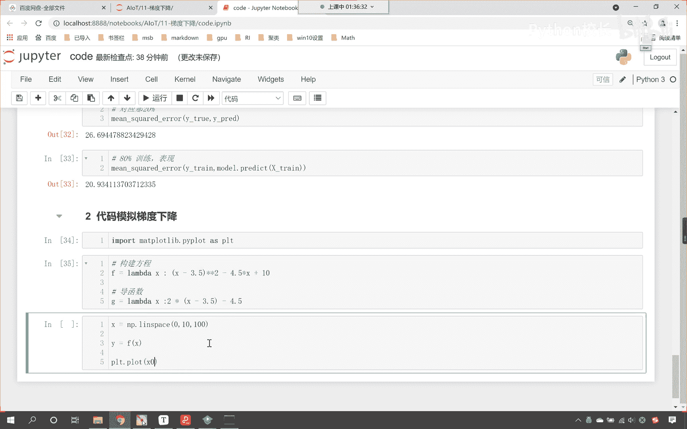
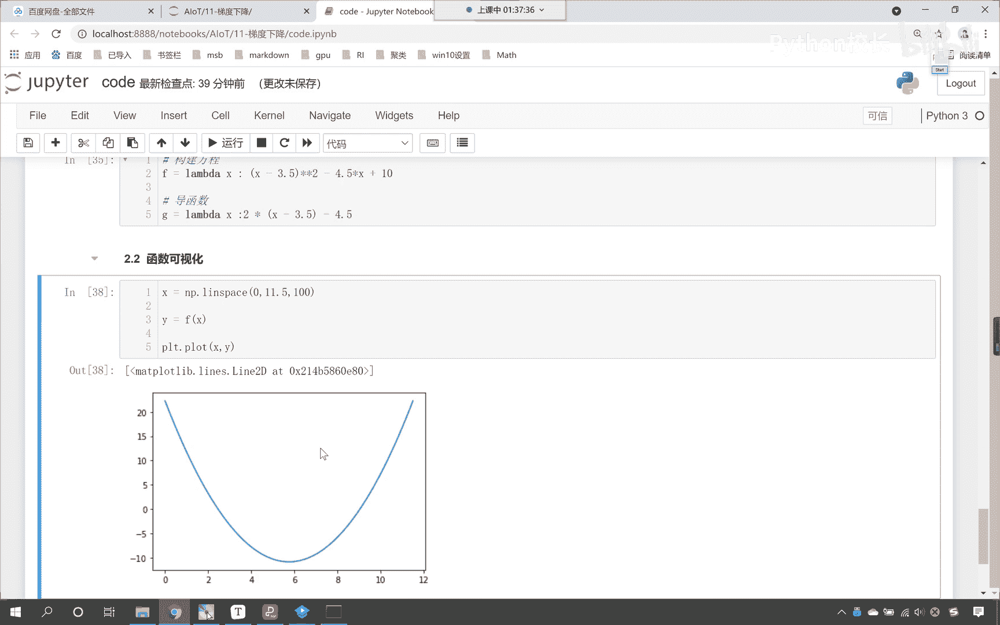
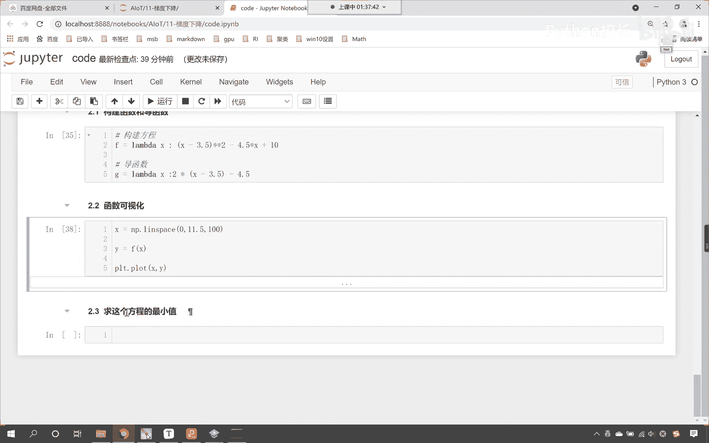
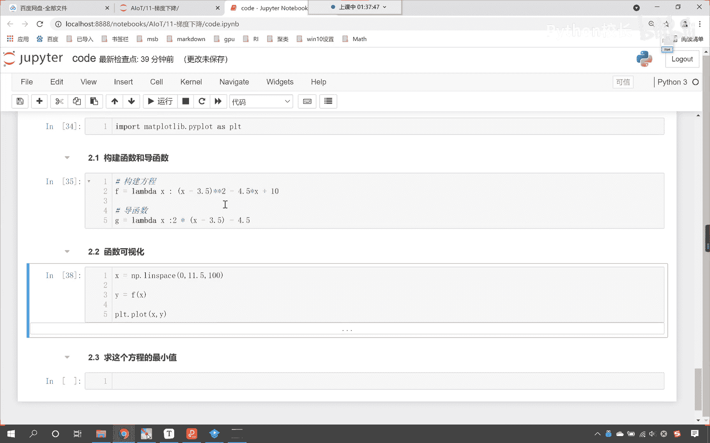
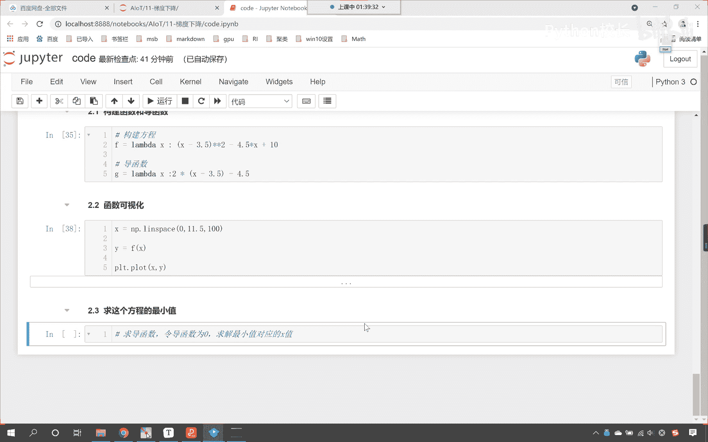
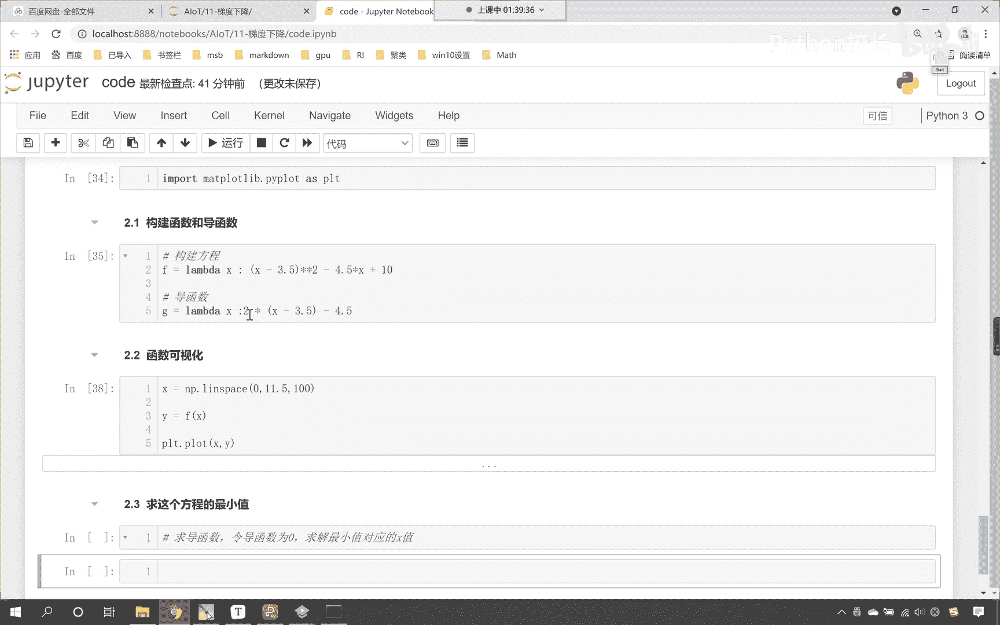
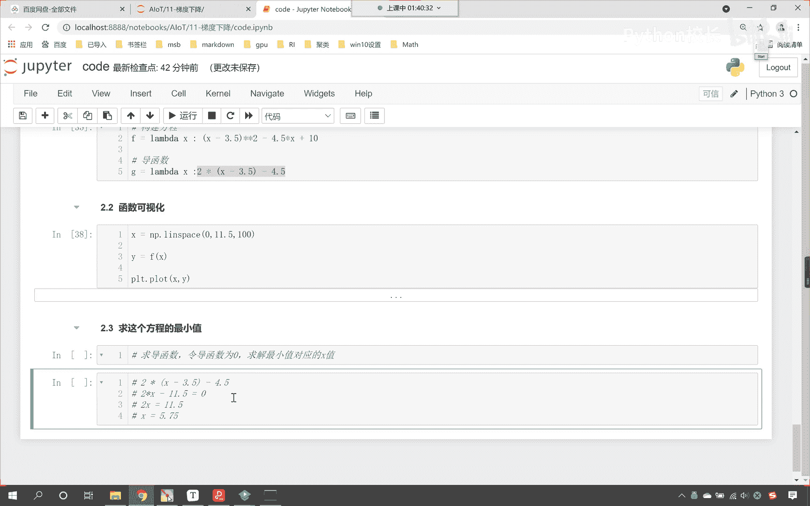
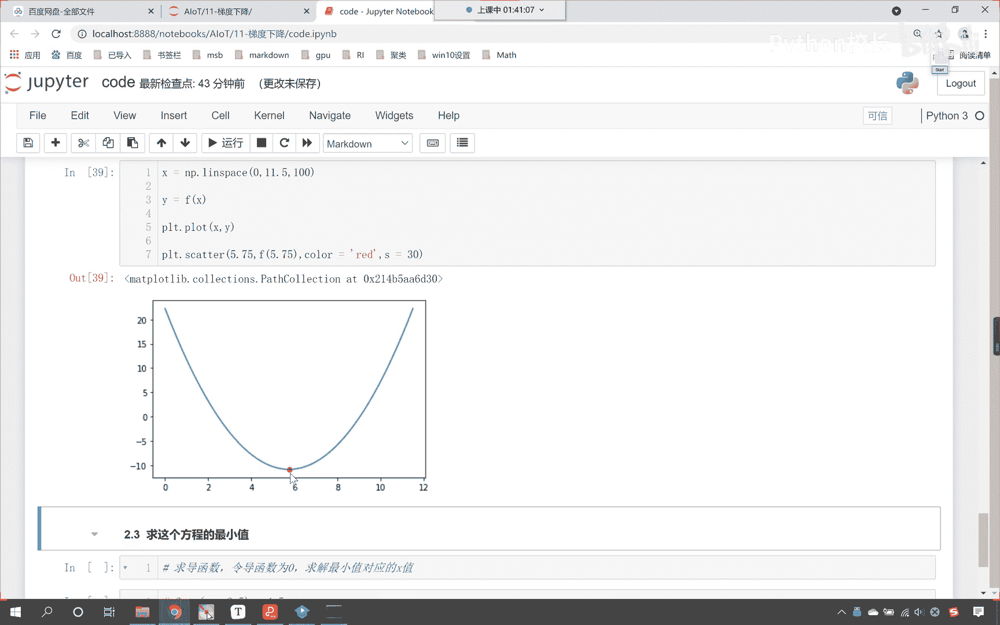
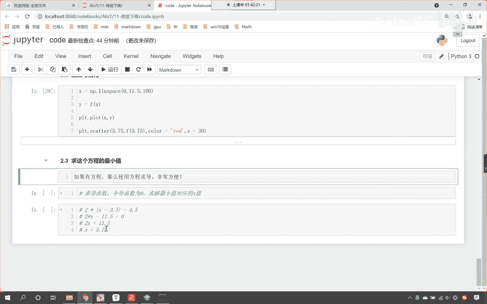

# P63：6-函数与导函数求解最优解 - 程序大本营 - BV1KL411z7WA

咱们现在呢就使用代码，我们呢给一个方程，大家看这个方程是一个抛物线，对不对，那比如说我想要求这个方程的最小值，你能告诉我它的最小值是多少吗，能求解出来，对不对，我们只要令导数为零。

咱们是不是就可以求解出来啊，来咱们现在呢就回到咱们的代码当中啊，咱们就代码模拟一下梯度下降好不好。

来回到咱们这个代码当中，咱们现在呢给他来一个三级标题，这个呢就是代码啊，代码模拟我们的梯度下降好，那么首先呢我们给一个方程呃，咱们首先呢先导一个包啊，import mat plot lib。

咱们来一个piplot as plt，把这个导包导进来，咱们是为了画图，让各位能够更清楚地看到，这个梯度下降到底是怎么进行的，然后呢我们就创建一个函数好不好，那这个这个函数呢咱们就可以这样定义啊。

叫做f f呢，咱们给一个兰姆达表达式，里边呢给一个x，然后来一个冒号小括号，咱们让x减去嗯，看咱们让x减去3。5，然后呢星号星号在它右上角，我们给一个平方好不好，然后呢咱们再减去4。5乘以x啊，乘以x。

最后呢我们加上十，你看这是不是对应着一个方程呀，对不对，那这个方程我如果要对它求导数，它是多少，看它的导函数是多少，来咱们现在呢进行一个说明啊，看它的导函数是不是就是如下呀，对不对，导函数的话。

咱们其实看导函数很简单啊，那咱们的导函数是不是就是二倍的，小括号x减去3。5，你看是不是看到了吧，二倍的，因为你这个二看星号，星号二是不是就代表着它的平方呀，如果要对这一块进行求导。

那是不是就是二挪下来，然后让然后让2-1啊，2-1是不是就是一次幂是不是就消掉了，然后再对里面的求导数，你看x是未知数，咱们对于x求导数，那它是不是就是一呀，一就不用写了，这个-3。5它是不是常数。

常数也就不用写了，对不对啊，然后咱们再减去多少，是不是减去一个4。5呀，对不对，好，大家看啊，上面就是咱们构建了一个方程，看到了吧，上面呢咱们就构建了方程，对不对好，那么这个方程长什么样呢，咱们现在呢。

是不是可以把这个方程给它画出来啊，对不对，来现在呢咱们把这个方程呢我们给它画出来啊，我们给一个范围x我们就让它np。lion space，那这个时候呢咱们就给他一个范围，我们让他从零开始好不好。

咱们让让他到十，我们把它分成100份，这个时候你看x有了，那y是多少，y是不是就等于fx上面我们构建方程，我们是不是用的拉姆达表达，拉姆达表达式呀，我们有可能一些小伙伴还不太理解，什么是朗姆达表达式。

那么你就得需要花点时间去看一下，我们的python基础是吧，对于这样的知识点，咱们就不做过多的介绍了啊，来现在你看我画一个图，那就是plt。plot，咱们将x和y放进去是吧。

这个时候你看我一执行，来各位看到了吧，你看这个图形是不是就出来了，咱们左右两边不对称是吧，咱们让他到11，我们看一下啊，哎这个时候你看是不是就差不多了，是不是，或者说我们来一个11。5看到了吧。

哎这个时候嗯这个图形你熟悉不熟悉啊，是不是特别熟悉，好现在的问题是啊，现在的问题咱们在下面插入一行，那我们把问题描述一下是吧，咱们希望求看啊，现在呢咱们希望求这个方程的最小值，看到了吧。

我们希望求这个方程的最小值，那咱们在上面也插入一行，来一个四级标题，这个呢就叫做构建函数和它的导函数是吧，构建函数和导函数嗯，那这一行呢咱们其实就是进行了函数的可视化，唉，那很显然这是一个凸函数。

这是一个抛物线，对不对。

很简单啊，看到了吧，那现在的问题是求这个方程的最小值。

当你看到这个方程的时候，我们如何求它的最小值呀。

根据咱们之前所学的知识，咱们是不是求导数，对不对，求它的导函数，然后我们令导函数为零，是不是就可以得到最小值了，看求导函数，然后呢咱们令导函数为零，那是不是就可以求解最小值，对不对。

是不是就可以求解这个最小值所对应的x值，来告诉我，对不对，来咱们呢在讨论区互动一下啊，那么我说的这一句话，求导函数令导函数为零，咱们就可以求解出最小值对应的x值，这句话理解的弄明白的，来我们回复一下啊。

扣一波666好不好，是吧，那么我们不明白的扣一波888啊，来不太明白的小伙伴嗯，抠一下是吧，看来呢咱们中国的教育都非常成功，是不是这个呢，其实呃在你这个初中高中是吧，应该是高中，其实你就学了。

大学的时候也有是吧，虽然你忘了没关系，但是我说出来之后是吧，你没有办法辩驳，是不是啊，你你找不出来他的错，就是你隐隐约约当中知道他对，是不是这个导数，不是啊，导数不是大学才学的啊。

高中就学了一定的导数了，那我们就操作一下，是不是他导数是多少啊。

是不是就是这个看到了吧，导数就是这个来咱们复制一下啊，咱把导数拿到好不好看，ctrl v这就是导数，那我们进行相应的化简是不是就可以了，对不对，那这个时候其实就是2x看了吧，其实就是二乘以x对不对。

然后它减去多少，看到了吧，减去七，然后再减去这个4。5，那是不是就是11。5呀，对不对，我们令它等于零，看令它等于零，咱们再来化简，那这个时候不就是2x，是不是就等于11。5呀，那我们求解一下。

那请问这个x是多少啊，你看x是不是就是这个x呢，是不是就等于这个5。75呀，看到了吧，是不是就求解出来了，看到了吧，就是5。75啊，哎大家注意啊，是五点啊，是5。75啊，是不是求解出来了吧。

我们看一下咱们这个图形，你就能够发现，看到了吧，看一下这个图形来，咱们把最小值给它画出来好不好，那怎么画出来呢，你看plt。scanner，scanner是不是画他的散点图呀，那我们将谁5。75放进去。

然后再来一个f5。75，我们给他一个红色好不好，咱们呢给他一个color啊，我们让这个color等于red，然后呢咱们给一个size，size表示大小，我们给一个30，这个时候你看我一执行。

看看看红色的点是不是最小值，来告诉我是不是最小值。

看到了吧，哎确实啊求解出来就是啊看到了吧，确实是最小值好，那大家看啊，这是一种求最小值的方法，大家最熟悉，对不对，因为有什么，因为有公式呀，有了公式我就可以求解出来，对不对。

但是呢你想我们是有非常明确的导数，对不对，看到了吧，这个地方咱们是有非常明确的方程，有非常明确的公式，那你想如果我们有一堆数据告诉你，那我让你帮助我把这一堆数据的规律找到，那这堆数我们只有数据。

是不是没有方程呀，有方程的时候，咱们自然使用方程求导数，是不是最方便，对不对，你看如果有方程，看到了吧，如果有方程，那么咱们使用方程求导，这个是不是就非常方便呀，对不对，是不是就非常方便。

那直接用这个方法计算就可以了，对不对，好。

