# P64：7-梯度下降代码演示 - 程序大本营 - BV1KL411z7WA

出来了，你看啊，我在下面插入一行，咱们怎么样，哎我们再来一个四级标题，那这个呢就是如果没有方程呢，看到了吧，如果没有方程呢，现实生活当中往往是不是就没有方程呀，那么在这儿呢我们就介绍另一种方式。

另一种方式呢就是梯度下降啊，那梯度下降呢就是没有方程，没有方程，我们数学家也为我们找到了相应的这个方式，来进行求解好，那么咱们现在呢就看一下这个梯度下降是吧，他该如何来做啊，现在我们给一个学习率。

咱们给一个不服，咱们这个不符呢，我们就叫一塔好不好好。

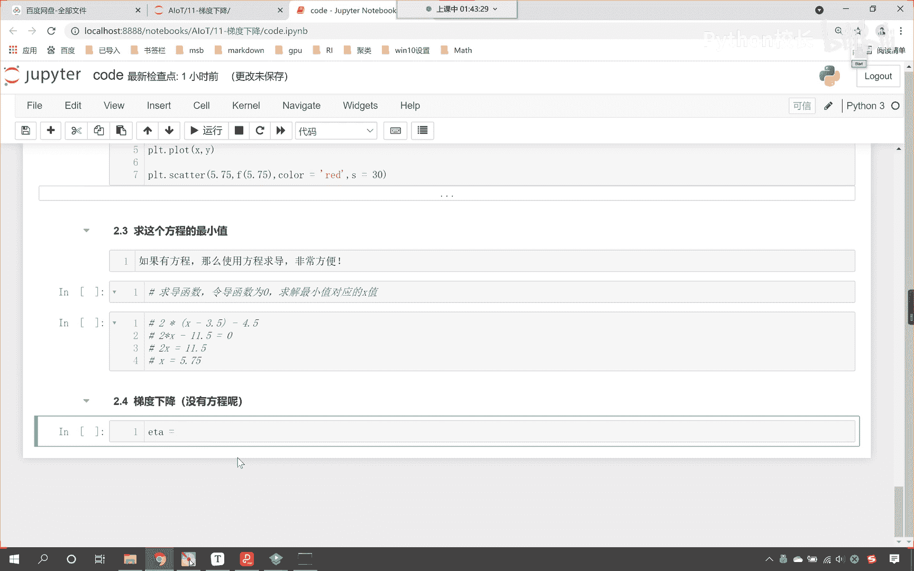

那么咱们给多少呢，0。1咱们在课堂上进行了相应的介绍。

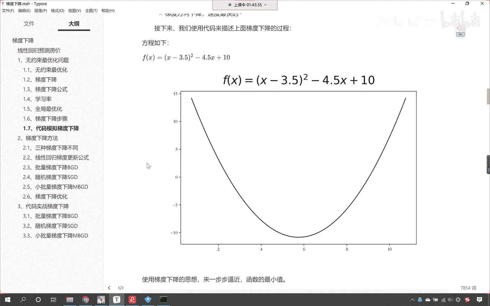

我们说这个学习率到底给多少呢，是不是得试呀，0。10。01是吧，0。001是吧，给的太小不行，学习的慢，给的太大也不行，是不是容易容易跳过去是吧，容易这个容易震荡。

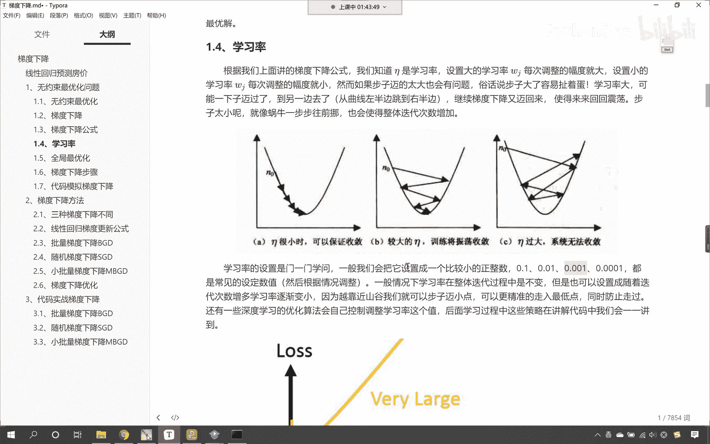

所以说咱们一开始先给个0。1啊，好那么咱们在代码当中的符号我们就用一塔。

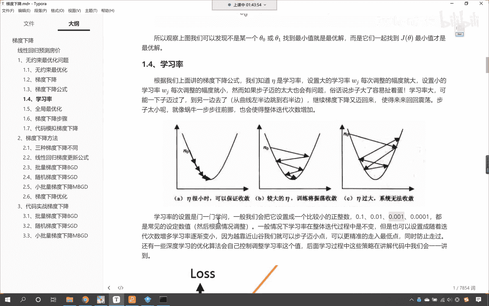

那在这儿咱们注释一下，这个呢就是学习率，大家看有了学习率了，那我们这个时候呢咱们要给一个看，咱们不是要求x嘛，对不对，看到了，我们要求x，我们上面求解出来的标准答案是5。75，那假设说我通过梯度下降。

你看咱们通过梯度下降，我求解出来的答案是五点，是5。749，你说他算不算答案呢，看5。749它算不算咱们的一种答案，算不算肯定也算，对不对啊，这你想这已经非常接近了，是不是。

但是呢这个x它一开始是多少呢，那咱们这个一开始咱们就随机是吧，唉我们就随机给它进行一个赋值啊，啊用咱们刚才上面那个步骤，咱们是不是就叫做瞎蒙呀，来咱们现在就瞎蒙一个，那就是np。random。

咱们来一个rint，那么这个范围呢我们从零到12，咱们给一个size，让它等于一，然后中括二零，咱们把它取出来，大家注意啊，中国二零把它取出来，而是因为取出来之后它就是一个数字了，知道吗。

取出来之后它就是一个数字，好，大家看诶，这是不是咱们的初始值呀，对吧，哎这是随机的一个初始值，那这个初始值它一定不是答案，对不对呀，哎然后呢咱们再来一个定义啊，叫last x。

你想我们是不是会进行for循环多次，对不对，我们会进行for循环多次，只要我们求一次，咱们的x是不是就会更新一下呀，对不对，求一次就会更新一下，那么我们，那么咱们就把上次更新的这个数据记录一下。

我们叫做last x，那这个last x呢咱们也给它一个初始值，咱们只需要让它在这个当前的情况下是吧，让它和上面这个x有点不一样就行了，你看因为我们要进行多次的循环，是不是要进行多次的while循环。

那么我们每次循环看咱们每次梯度下降，咱们的值是不是都会更新呀，对不对，那更新的话，我们就记录一下上一次的上一次的这个值，哎为什么要记录一下上次的这个值呢，咱们是为了比较看到了吧，咱们是为了比较唉。

我为什么要比较呀，来回到咱们梯度下降。

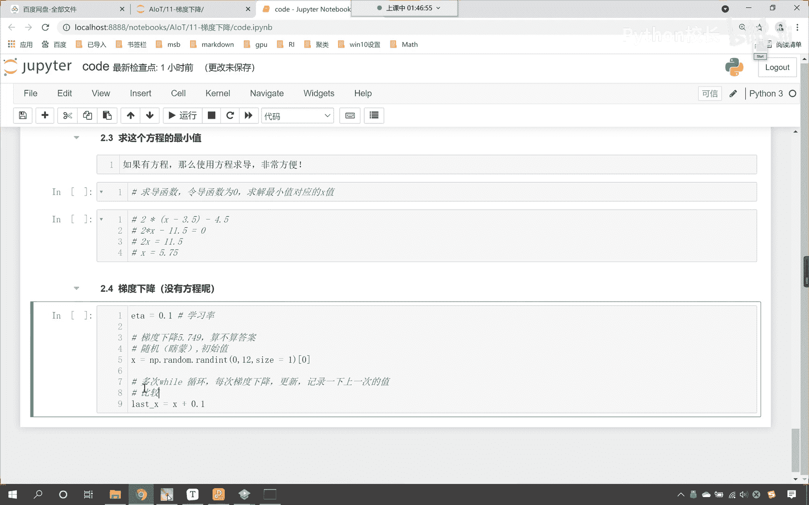

这你看到这个图，你看到咱们紫色的这个点是不是梯度下降，一步一步向前走呀，对不对，你看它越接近于咱们的真实值，它更新一次，它是不是就是不是就越小呀，你想他如果要到达了这个正确答案，这你想他还能再更新吗。

是不是就不能再更新了，所以说呢我们呢就让这个就让这个点儿，和它的上一个值，看我们就让看咱们就让这个值和它的哎，你看这个值是不是当前的x，它的上一个值，是不是它我们让他俩进行一个比较。

你看如果咱们新的值和上一个值，它们的差距基本没有差距了，比如说这个是x，然后咱们上一个值呢是last x，你比如说经过更新之后，这个x和lx基本没有差别了，你想我们是不是就可以停下来了。

因为你再怎么走是不是也走不动了，是不是当看看咱们的x，你看当x和它的上一部求解出来的，last x差不多的时候，就是说这个呃你比如说他俩这个精确度是吧，他俩相减，比如说它小于0。001。

你想这是不是已经有非常微小的一个变化了，对不对，那我们就可以认为ok到这你基本走不动了，是不是我们就可以停止了呀，所以咱们的代码当中，你看我们就执行了这样的操作。

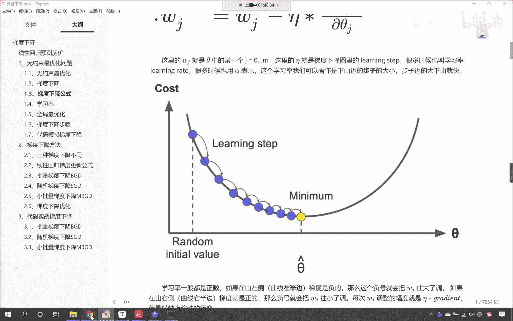

它是为了比较唉，那这个呢就涉及到一个精度是吧，如果这一次和上一次相比，基本没有特别大的变化，那咱们是不是就可以停下来了，好这是last x啊，在这儿呢我们要注意一下这个0。1，你看它是不是加了一个0。

1啊，其实你加你看这个时候你加0。2也可以，对不对，你加你加一也行，也是没问题的啊，之所以要加上一个数值，是为了让他们一开始的时候有差异，知道吗，一开始的时候就是为了让它有一个差异好。

那么接下来呢咱们再来一个啊，我们再来一个pre精确度，然后咱们再来一个精确度，那这个精确度呢我们就叫做precision，这个precision呢咱们就给0。001吧，万分之一好不好，哎。

万分之一其实上面就是为了比较啊，一开始有差异，咱们的目的是为了比较好，然后呢我们就给一个精确度，看到了吧，咱们现在是不是有了精确度了，那有了这个精确度之后呢，现在呢咱们就print输出一下啊。

来这个叫做杠杠杠杠杠是吧，那我们随机的x是冒号逗号，咱们是不是可以将x打印输出一下呀，那接下来准备工作咱们就做好了，做好了之后，咱们就开始写这个循环了啊，叫做while true。

大家看我这是一个死循环吧，看到了吧，这是一个死循环，那一般情况下碰到死循环，你一定要有退出条件，知道吧，碰见死循环一定要退出条件，你知道死循环如果没有退出条件会怎么样吗，它是不是会一直执行下去啊。

我给你讲一个真实的案例啊，之前有一个朋友在美团猫眼电影有没有用过，有没有用过猫眼电影呀，那么他们公司呢就招聘了一个新的python开发人员，这个python开发人员呢，他的这个工作就是抢票。

就是把电影院的票都抢过来，你看我们从猫眼电影上买电影，比从电影院买电影便宜，是不是，那猫眼电影它怎么挣钱呀，他呢其实就是一个票贩子倒卖票的，他低价的把一些票，他他从那个电影院是吧，抢过来之后。

然后他一张票加五块钱卖给你，那但是你这个买票票量比较大，你不能用人去买，怎么办，程序去买，那这个程序呢票很多，我就写了个while true死循环，结果这哥们儿就没有退出条件，那这个代码跑了一整夜。

把北京所有电影院，所有场次，所有座位的票全买了一晚上，花了1000多万，看了一晚上，花了1000多万啊，结果这个哥们儿是吧，就被开除了，开除了之后，他第二份工作特别顺利，你知道为什么吗。

然后他在简历上就写到是吧，他呢在猫眼电影这样的大公司做过，做过python开发，后面呢他又加了一句，他说我在这儿做过千万级的大项目，所以说呢你只要在简历上说了是吧，我在这个公司做过千万级的大项目是吧。

找工作很顺利好，那么咱们呢首先来一个退出条件好不好，那就是np。abs abs是不是就是求绝对值呀，我们让谁减谁呢，看啊咱们让x减去last x，如果它要小于咱们的precision。

这个是不是精确度呀，那咱们就怎么样break，看到了吧，这个是不是就退出了，看到了吧，这个你看他退出的条件说明什么，说明咱们说明我们在更新时是不是变化甚微了，看到了吧，说明变化甚微。

这个时候是不是就可以终止了呀，对不对，你看这个时候就可以终止了，是不是啊，所以这就是咱们的退出条件，然后接下来呢我们就干嘛，咱们是不是就开始更新了，咱们根据什么来更新呢，咱们呢就根据梯度下降来进行更新。

那在进行更新之前，它在进行更新之前，咱们呢last x就等于x，看我们我们进行了这样一步操作，就是x是当前数值，对不对，你看x，当前的计算出来的数值，然后呢我们把它赋值给，因为你要更新了。

咱们是不是就把它赋值给上一个值呀，你看last x就等于x，然后这个x就等于多少呀，它就减等，你看它就减等减等，是不是在它自身的基础上发生了一个变化呀，或者说咱们也可以这样想，他就等于这个x呢。

就等于x是不是减去。

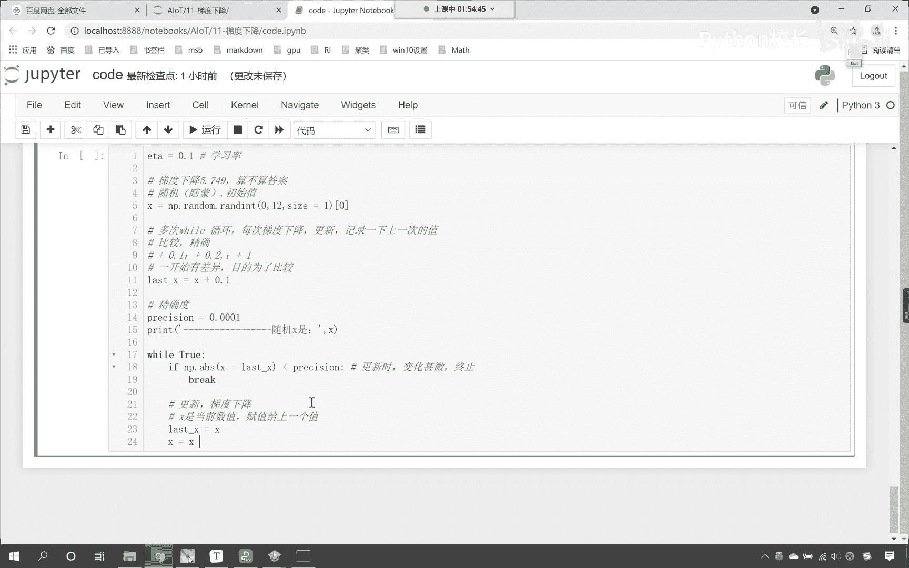

来我们看一下咱们梯度下降的公式。

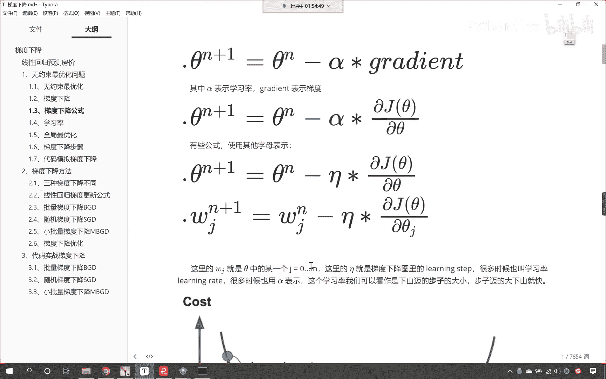

你看这里是不是就是梯度下降的公式，那梯度下降的公式是不是就是，一塔乘以咱们的导函数呀，对不对，你看是不是就是一塔乘以导函数，这个地方是不是一个减法，咱们就根据这个公式来写，好不好，在我们的代码当中。

咱们的一塔是谁。

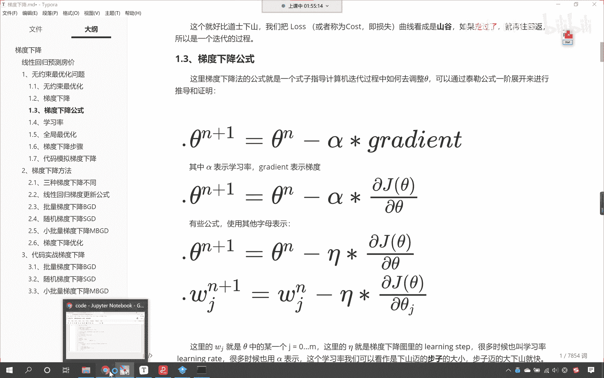

看在代码当中，咱们的一塔是谁，ea是不是就是学习率，我们上面是不是定义了来，那咱们这个时候呢就e t a e a乘以乘以多少，是不是乘以导函数呀，当前导函数所对应的值是多少。

导函数是不是就是g是不是把x放进去，你看上面我们是不是创建了，看这是导函数，对不对，那么导函数的值该怎么算，和咱们上面这个函数值的计算是不是一样的，你看我如果想要计算函数值，那就是fx对不对。

我如果想要计算导函数值是不是就是gx呀，这是兰姆达表达式啊，唉所以x就等于x减去一塔乘以gx，看到了吧，是不是来，那么咱们现在呢就打印输出一下啊，看啊我print一下嗯，这个是不是更新呀，那既然更新。

咱们这个就是加号是吧，在这儿呢咱们写一个字，那就是更新之后的x冒号是吧，它是多少呀，嗯逗号，咱们是不是将x放到这儿来。

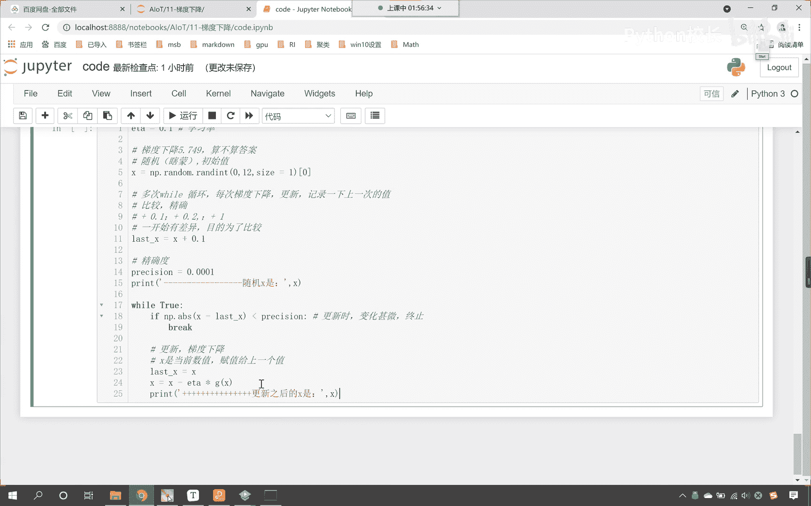

此时我执行一下这个代码啊，你看我一运行诶，大家看，各位各位看，经过多次运算。

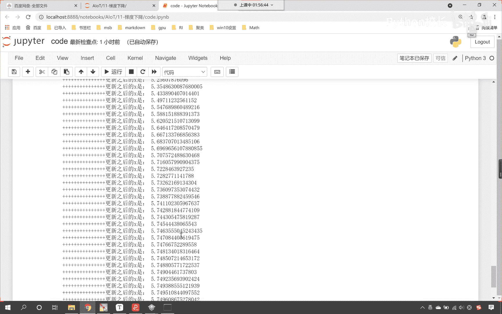

可经过多次运算，我们最后求解出来的值是多少，5。749。

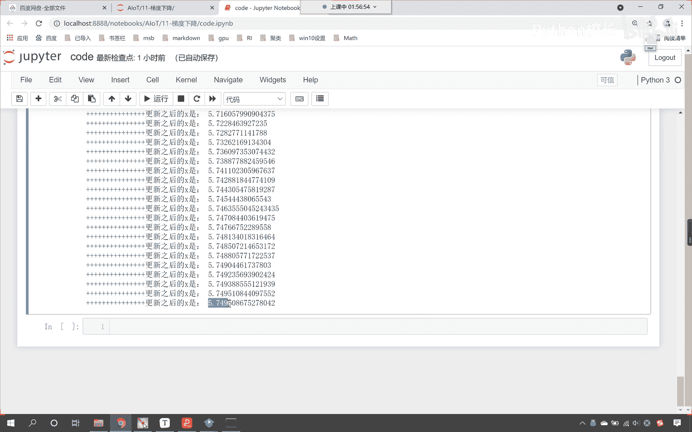

刚才咱们在没有执行这个代码之前，我们就说了，说这个5。749算不算答案，我们有小伙伴说了，算是吧，他算是一个答案，因为我们的标准答案是5。75，其实你在一定的精确度范围之内，5。749肯定算答案。

对不对，那还有比如说咱们给一个这样的答案，你看我们来一个5。7501，这个算不算答案，也就是说我们是不是比5。5，5。75稍微大一点点呀，它也算答案，看啊，我现在给的值是零，结果出来了，对不对。

那假如说我再执行一次，因为这是瞎蒙的。

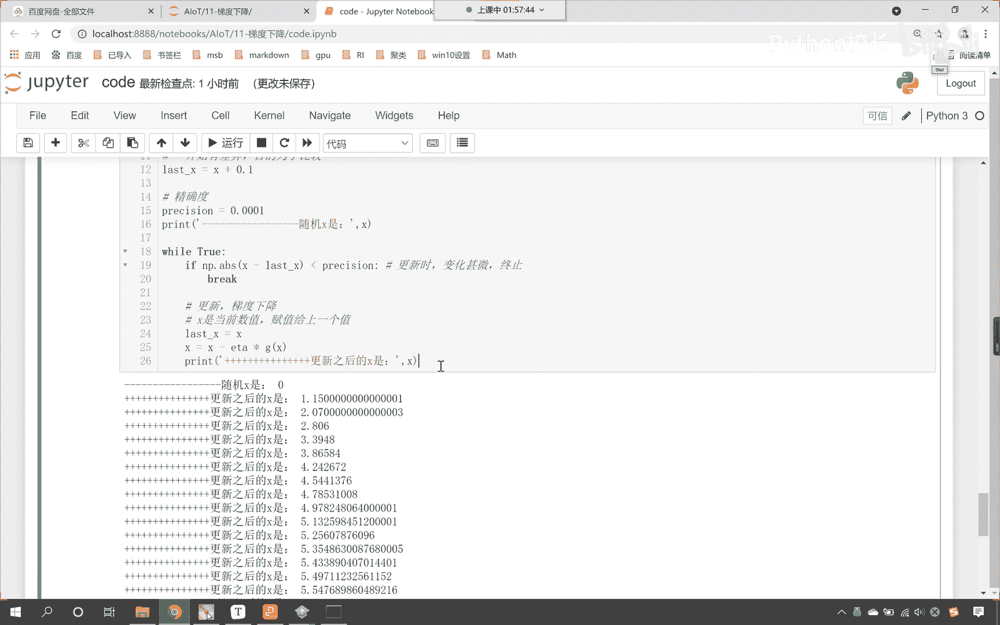

随机给的是吧，你看我再执行一次，看这回给的是四，看到了吗。

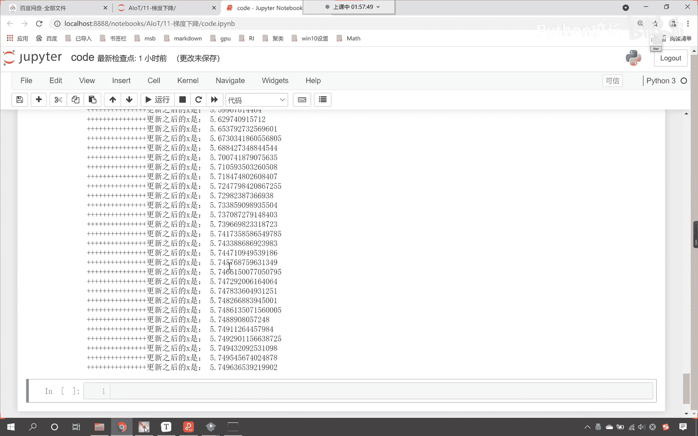

是不是也能出来看咱们再来看，在执行，看这回给的是九，看到了吧，看这回咱们给的是，看这回咱们给的是九，你看给的九，咱们梯度下降，梯度下降，你看最后求解出来的5。7503，是不是也是看到了吧。

是不是也是接近标准答案了呀，注意啊，桥北小伙伴上面不是没有方程式吗，导函数用上面可以吗，因为我们为了讲清楚梯度下降，这个是怎么样一回事，它是如何进行的，所以我们就给了一个具体的方程，那这个方。

那这个方程呢就是你看到的这条抛物线，看就是你看到的这条抛物线，那我们在后面机器学习的时候，咱们有一堆数据，这一堆数据的方程是没有的，但是它的损失函数是有的，知道吗，但是这个方程的损失函数是有的嗯。

所以那我们可以根据它的损失函数来进行计算，损失函数有，那么我们就可以怎么样呀，嗯咱们就就可以根据损失函数的导函数，来进行计算，桥北桥北小伙伴，你可以想一下，如果说只有数据，没有任何方程，你看只有数据。

没有任何方程，其实你是没有办法进行任何计算的，对不对，咱们上面再进行说明和介绍的时候，你看啊，梯度下降，我们这个地方说的没有方程，其实是不太准确的啊，其实是不太准确的，我们应该这样说。

那这个时候呢这样说就比较合适了，咱们怎么样呢，叫不能求嗯，方程不能这个呃不能求啊，不能令方程的啊，不能令方程的导函数为零来进行求解，这样讲应该更加的更加的合理一些，你看有的时候你的数据呢就是杂乱无章的。

这个有的时候呢，他不能令方程的导函数为零来进行求解，或者说呢这个方程特别复杂，比如说这个方程当中它有500个未知数，甚至有1000个未知数，这个时候是不是就不能求了呀，你想咱们上面这个方程很简单。

只有一个未知数，那么对于它求导数就很简单，如果这个方程复杂，那咱们再去求导数的时候就非常的不容易。

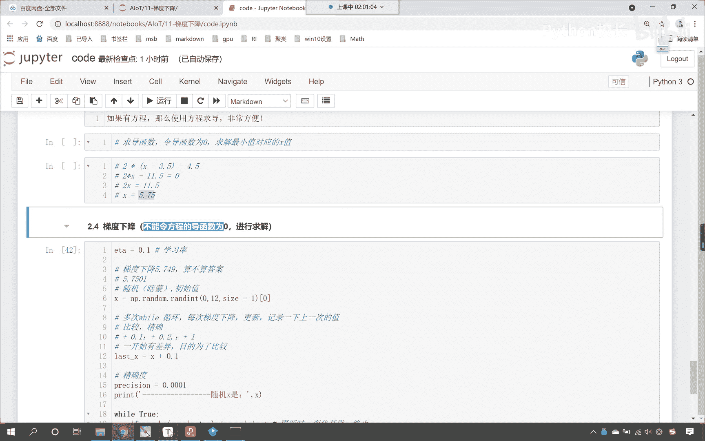

同时呢咱们也说了，你看咱们这个呃咱们这个呃呃正规方程。

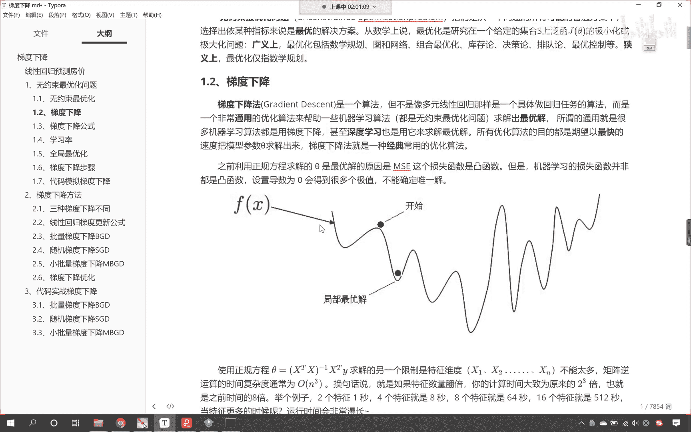

我们在进行这个操作的时候是吧。

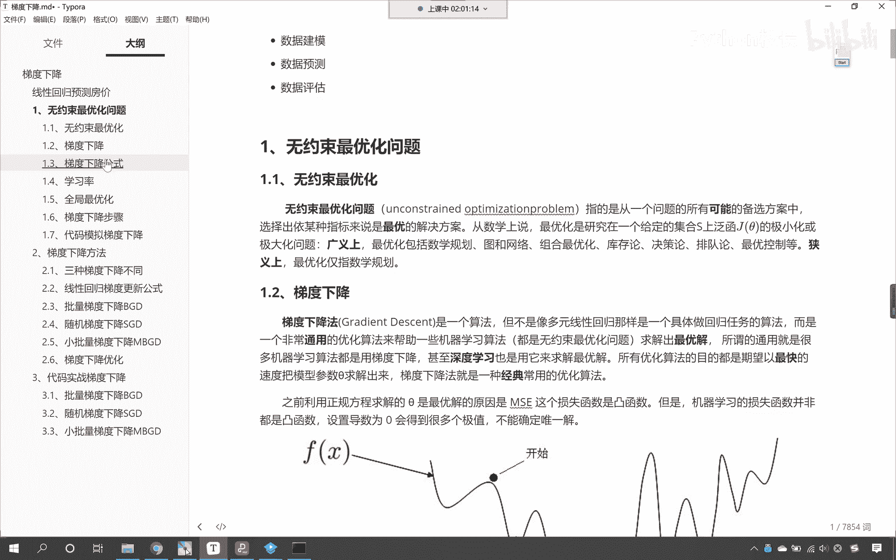

他是不是也有自己的这个缺点呀。

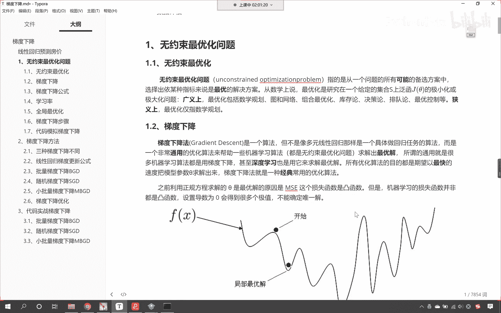

啊我们说了，使用正规方程，它有自己的受时间复杂度这个指标的限制是吧，你的特征非常多的时候，那么这个计算呢就非常非常的漫长，嗯所以说呢这个我们使用什么，使用梯度下降这种近似求解方式。

那咱们就可以去求解任何方程，其实呢这个正规方程它求解出来的，往往是非常好的一个解，但是呢很多时候它不适用，知道吧，很多时候他这个不适用，就像是吧，你在找老婆的时候，或者说你在找老公的时候。

你想要找完美的，这个世界上存在完美的嘛，如果你要想根据这个完美指标来找老婆，或来找老公，那这辈子你就得打光棍儿，是这么一个理解哈，当数据要小，咱们使用正规方程完全可以，就好比我们有了这个正规方程是吧。

咱们可以解初中高中的问题，没问题，因为初中高中的问题哎，他都是这个几元一次方程，三元一次方程，四元一次方程，这就很了不起了，是不是再多元，初中就没有，那用这个解非常好，但是如果要到了大学。

甚至要到了工作当中是吧，那我们再用这种方程去求解。

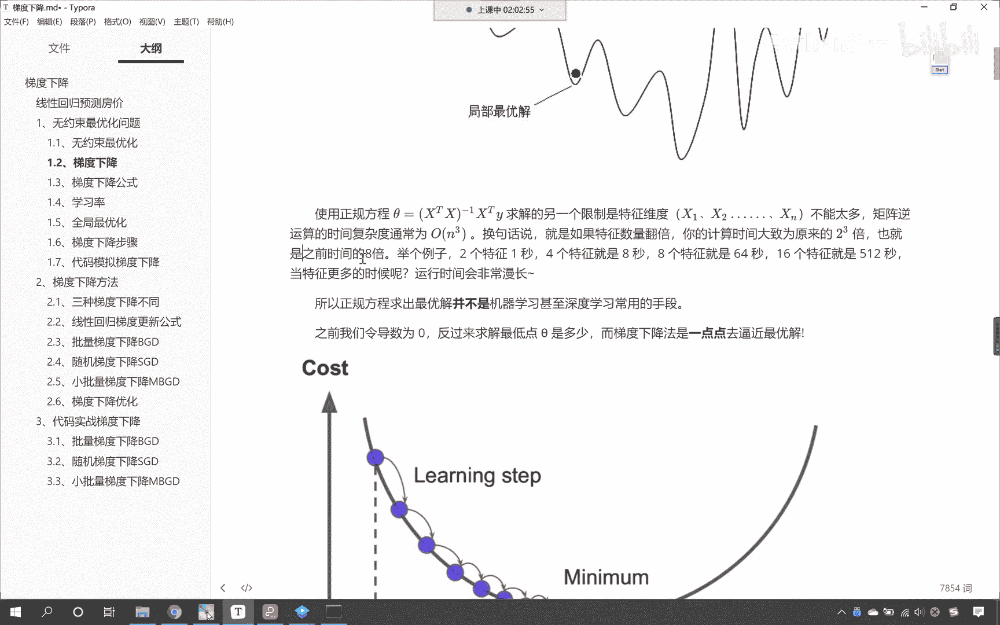

那这个时候呢它就不合适了，好大家看现在你看我们是不是就可以求解了。

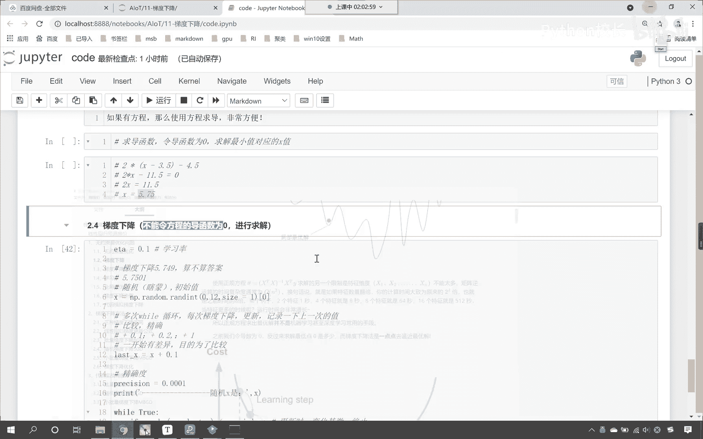

对不对。

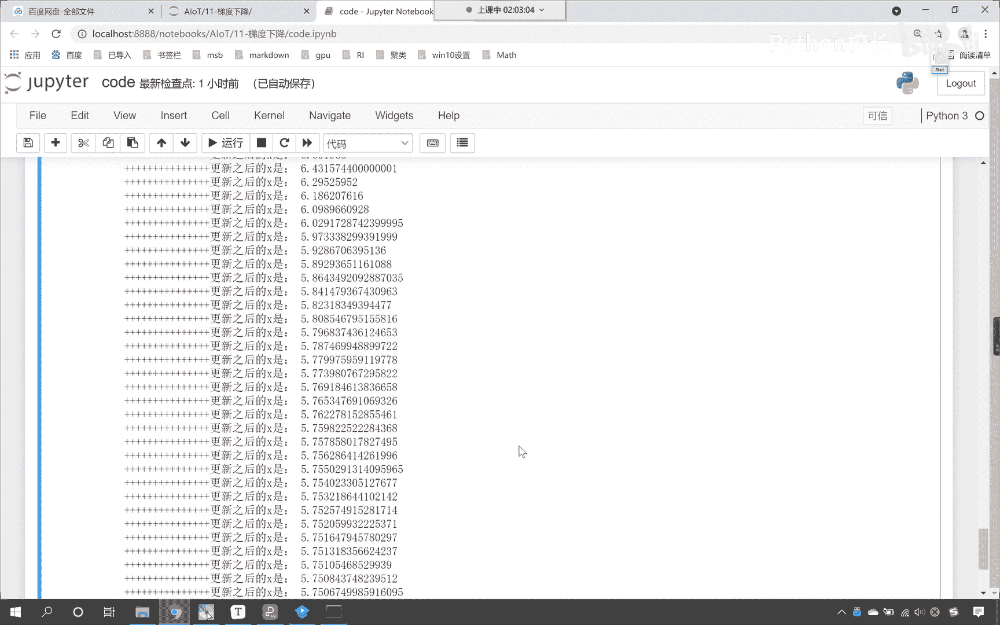

可以求解了，咱们将这个嗯咱们将这个呃咱们将这个步幅看，我们这个不学习率是不是0。1呀，咱们调整成0。2，步子是不是迈得大了，你看这时候一执行。

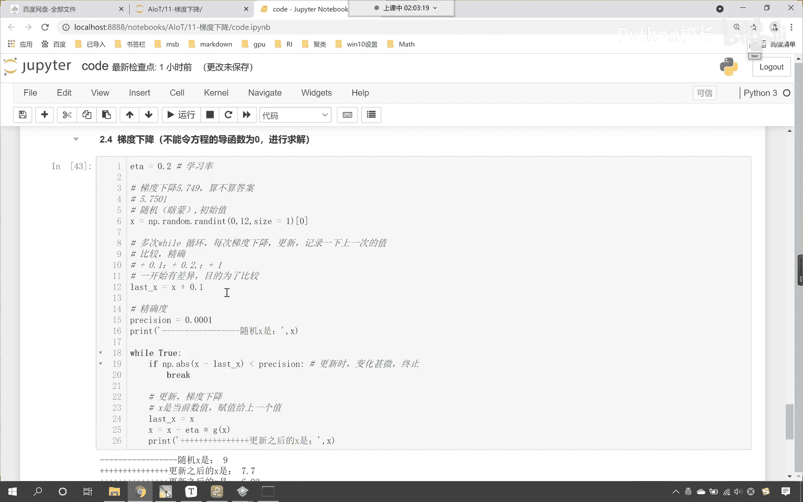

你看是不是就快多了呀，看到了吧，是不是就快了。

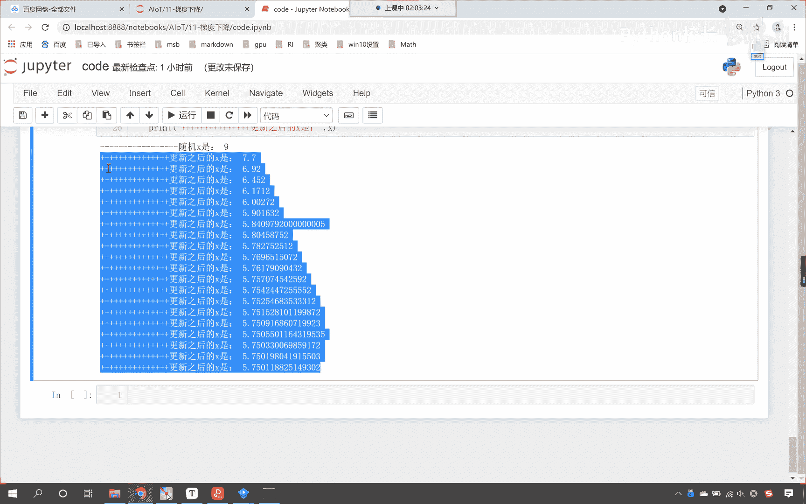

他执行的次数是不是就少了，看我再执行啊，你看一运行，你看这是一，你看咱们刚才在打印输出的时候是吧。

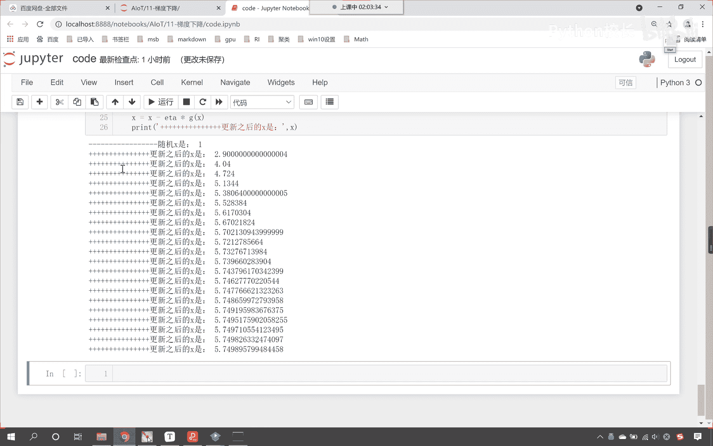

这个加号加号更新的就非常多啊，那假如说我要把学习率调整成0。5呢，这个时候你看快不快，是不是就更快了，这回你看5。7，5。75是不是来再来执行一下，看你给一个二是吧，再来执行啊，再来执行，再来执行好。

你看是不是就快多了，但假如说我这个时候要给个50呢，看啊，学习率给50来。

咱们看一下啊，各位小伙伴，你看一下哎，大家看看看看看，停不下来了，看到了吗，你能够看到我光标所在的位置，这就说明什么，这个代码一直在执行，步子迈的太大，你看到了，你看这个数据看到了多大。

e的308次幂是吧，更新之后，你看最后出现了个什么nine nine nine是吧，哎这个时候呢就是梯度爆炸是吧，他来回左右的游荡就爆炸了，所以说这个是不是不能特别大，来，那咱们怎么把它停掉呀。

哎这就飞了，这有一个kernel啊，咱们restart and clear out，重启一下就好了啊，看重启一下，这个时候是吧，嗯这个学习率呢。

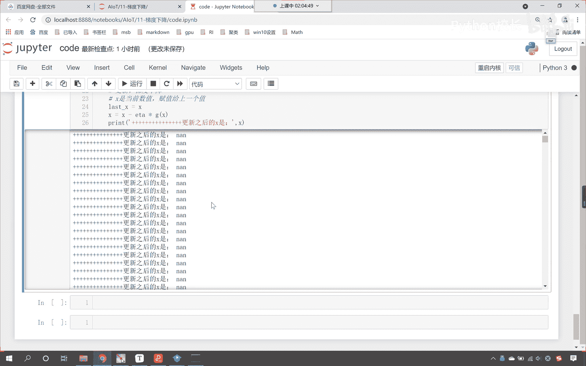

咱们一般呢这个嗯不建议取随机取样，你看我给50是不是就特别大，你刚才也看到了，你看现在我给一个0。01，你看啊给的小了会怎么样，看我一执行嗯，好np is not define是吧，你看这个时候。

因为咱们刚才是不是把它给擦掉了呀，那现在怎么办，这有一个sale，咱们可以run 2运行所有啊，看这有一个sale，咱们选run 2，看到了吧。

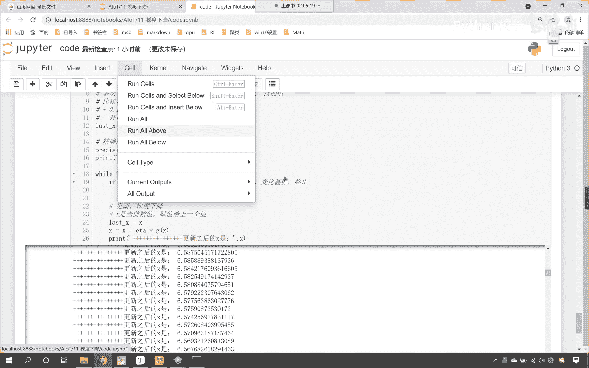

哎你看我们给小没关系，它一定能算出来，但就是怎么样呀。

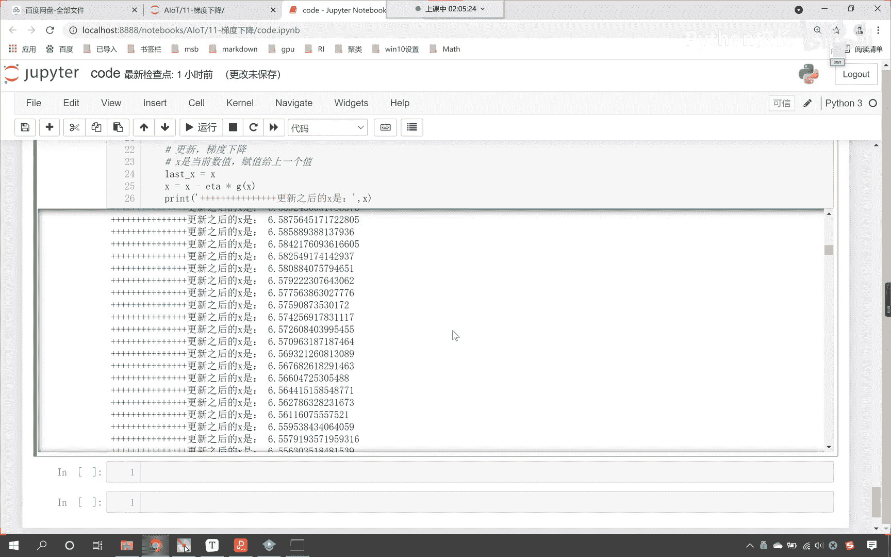

步数有点多，看到了吧，是不是步数很多呀，看到了吧，这就100多部，200多部了啊，你看比较墨迹，是不是啊，哎也能算出来，所以大家现在知道这个给大给小，有什么样的影响了吧，是不是你看不能给大，也不能给小。

咱们给多少比较合适，看到了吗，哎咱们给零点，咱们给0。3或0。4是吧，哎咱们给0。4啊，这个时候你看一执行次数是不是就比较小呀。

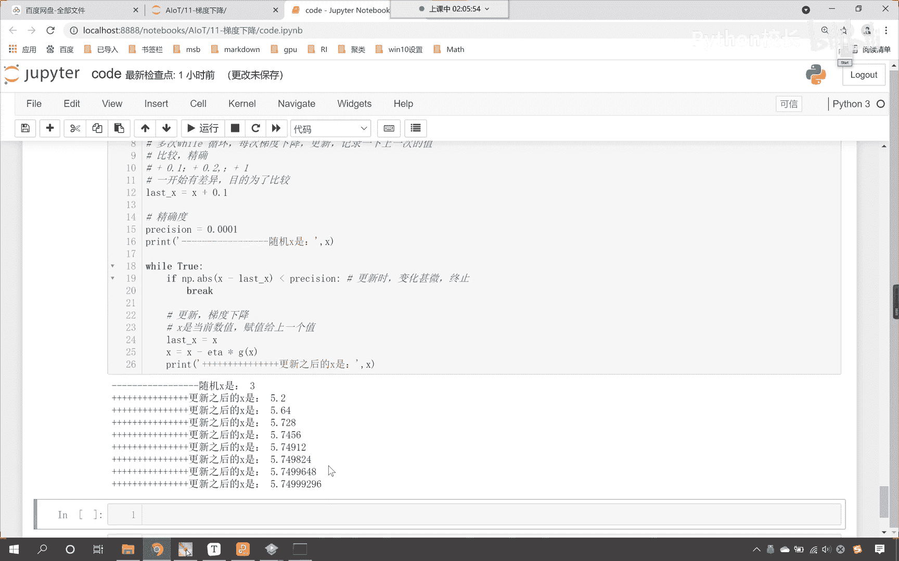