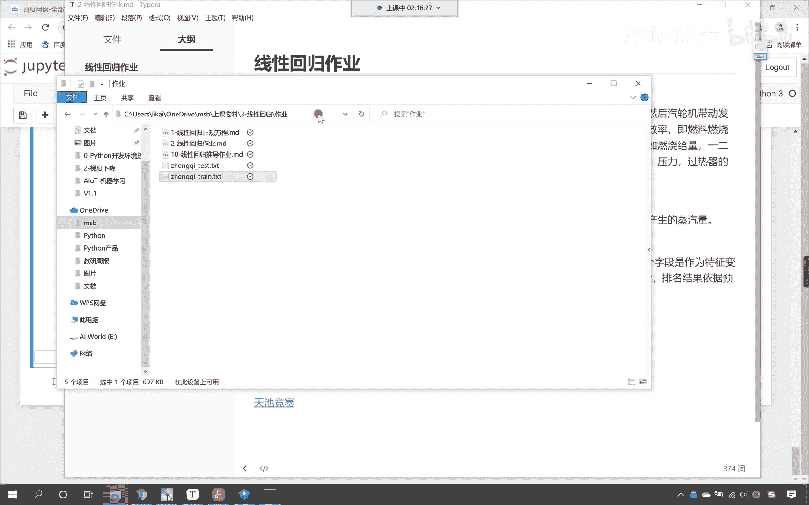
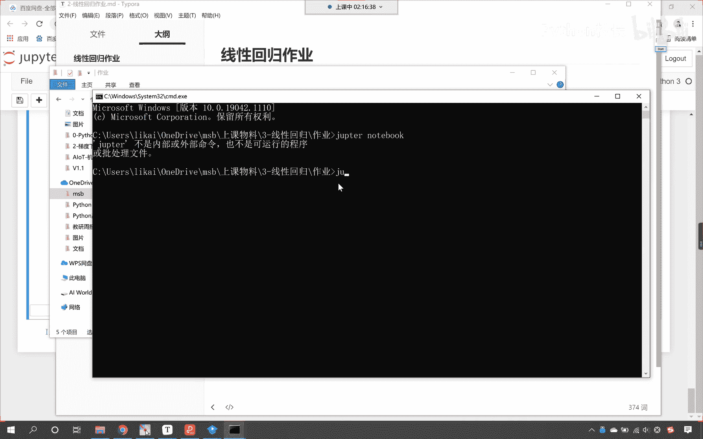
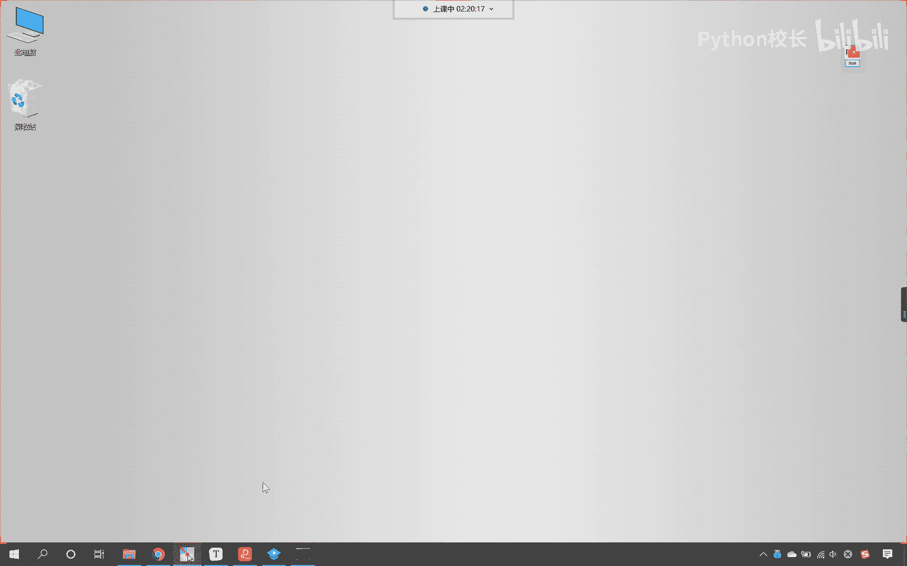

# P66：9-作业介绍 - 程序大本营 - BV1KL411z7WA

好那么我们火力发电呢就有一些数据啊，打开这些数据给各位看一下啊，双击打开看到了吧，这就是这些数据，我们这个数据呢，咱们可以使用pandas把这个数据加载进来，看到吗，可以使用pandas把数据加载进来。

那我们pandas在加载数据的时候呢，我给你演示一下啊，比如说咱们在这儿啊。

c md看，在这启动一下嗯，就是我想在哪个目录下启动主per，我在那输入cmd就可以了啊。

写错了啊，主per notebook，嗯然后呢我在这写一个代码，咱们导一下包，import pandas as pd，然后咱们pd。read，这个时候呢咱们读取csv。

当前路径下是不是就有一个train csv啊，执行一下，你看这个时候数据是不是加载不进来，我们只要给一个参数就行了，叫sap等于什么反斜杠t，这个时候你看我一只脚，是不是数据就加载进来了呀。

因为咱们的数据的分割它是反斜杠t，也就是说咱们键盘上的tab键，知道吧，就是键盘上的tab键，就是说你在读读这个数据的时候，给一个sap反斜杠t这个数据就加载进来了，看到了吧，这就是咱们的训练数据。

那这个训练数据呢，他的最后一列看训练数据的最后一列是目标值，看到了吗，训练数据的最后一列是目标值，我们把它擦掉啊，刚才不小心画出来这个来，我们现在的话看最后一列是不是叫target。

这个是不是就是y前面这些是什么，是不是咱们的x呀，对不对，看这些数据是x对吧，然后这个target呢是不是就是y，你使用pandas的切片把数据给它分开，分开了之后呢，我们是不是就可以。

你看咱们是不是就可以使用咱们线性回归，对这个数据进行建模了呀，建模之后咱们还有一个数据呢，这个数据叫做蒸汽test，看到了吧，哎这就是咱们的测试数据，在这个测试数据当中，它只有数据，没有目标值。

那这个目标值是多少呢，需要你去使用算法，大家看咱们的test啊，看这是测试数据，你看我一致行，他是不是少最后一列，对不对，是不是少最后一列，这少的最后一列，需要你用咱们今天的算法怎么样把它呃，预测出来。

知道吧，使用咱们的predict预测出来，你预测出来之后，你想要知道你的结果怎么样，你看我们这儿有一个天池竞赛，你注册一下，知道吗，注册一下你可以在这儿提交，知道吗，你可以在这这就是它的这个说明。

看到了吧，这就是看赛题和数据，你只要注册了，你就可以提交，知道吧，就是你看这不是有一个立即注册登录嘛，对吧嗯，你提交一下，然后呢你就有一个相应的分数是吧，这现在有9214个队伍啊。

嗯好这个呢就是咱们今天的作业啊，那这个奖金是零啊，我们学习是吧，也不是为了得这个奖金是吧，当然呢天池呢有很多呃，天池上的比赛有很多，这个是有奖金的啊，好啊。

